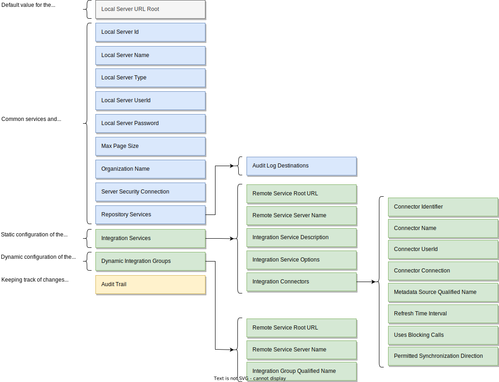

<!-- SPDX-License-Identifier: CC-BY-4.0 -->
<!-- Copyright Contributors to the Egeria project. -->

# Configuring an [integration daemon](/egeria/concepts/integration-daemon)

Each [type of OMAG Server](/egeria/concepts/omag-server/#types-of-omag-server) is configured by creating
a [configuration document](/egeria/concepts/configuration-document).

--8<-- "snippets/tasks/configuring-omag-server-basic-properties.md"

--8<-- "snippets/tasks/configuring-the-audit-log.md"

--8<-- "snippets/tasks/configuring-the-server-security-connector.md"

--8<-- "snippets/tasks/configuring-the-integration-services.md"

## Further information

- For help in fixing any error you find using the integration daemon, visit the
  [integration daemon diagnostic guide](/egeria-docs/guides/diagnostic-guide/integration-daemon-diagnostic-guide.md).
- Link to the [Egeria solutions](../../../../open-metadata-publication/website/solutions) to see the integration
  daemon in action.
- Link to the [integration daemon services](../../../governance-servers/integration-daemon-services) to
  understand how the integration daemon is implemented.

--8<-- "snippets/abbr.md"
