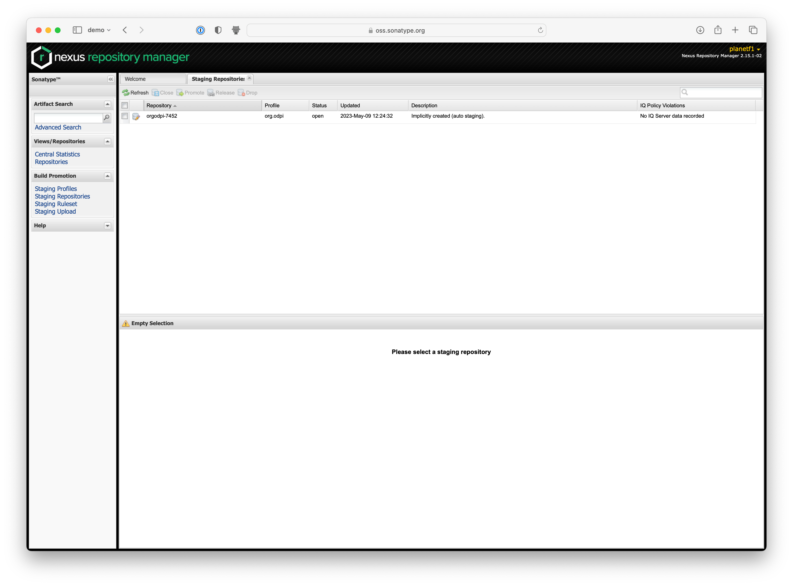
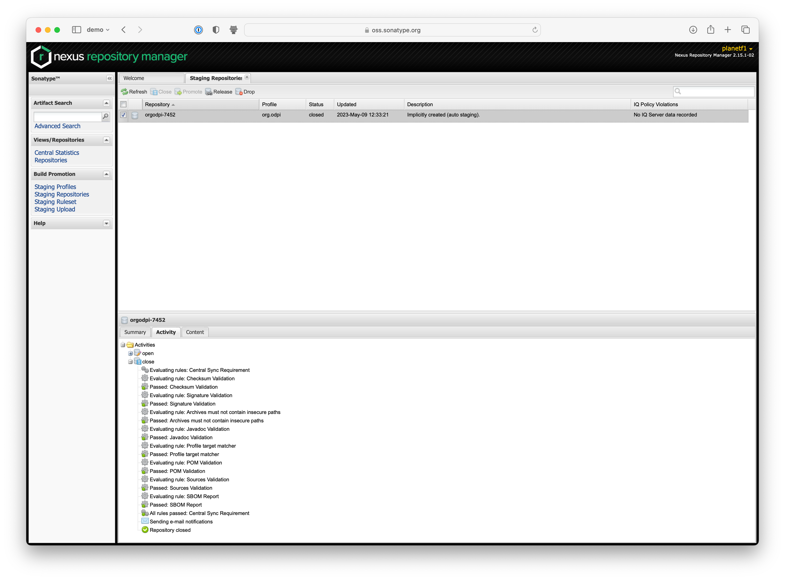

<!-- SPDX-License-Identifier: CC-BY-4.0 -->
<!-- Copyright Contributors to the Egeria project 2020. -->

# Maven Publishing

Many of Egeria's artifacts are Java-based, and are published to a centralized repository from where they can be consumed by developers integrating with Egeria client APIs, or developing connectors.

## Concepts
### Maven artifacts

Maven artifacts are referred to by 'coordinates'. 

At a minimum, These coordinates are a combination of a group ID, artifact ID, and version. For example, the `open-metadata-implementation/server-chassis/server-chassis-spring` artifact has the following coordinates: `org.odpi.egeria:open-metadata-implementation/server-chassis-spring:4.0`. By default the artifact name is the same as the final directory component.

This can be extended to also refer to the extension (filename) of the artifact, and a classifier (a way of naming extra artifacts, perhaps variants.)

Taking the server chassis as an example, we have:

| Content                                                                                      | Group Id        | Artifact Id           | Version | Extension             | Classifier |
|----------------------------------------------------------------------------------------------|-----------------|-----------------------| ------- |-----------------------|------------|
| Jar file containing just source code in server chassis itself (none/minimal in this example) | org.odpi.egeria | server-chassis-spring | 4.0 | jar                   |            |
| Uber jar file containing all jars/depencies as one. Useful for running directly              | org.odpi.egeria | server-chassis-spring | 4.0 | jar-with-dependencies |            |
| Javadoc for server chassis code (only)                                                       | org.odpi.egeria | server-chassis-spring | 4.0 | jar                   | javadoc    |
| Source code for server chassis code (only)                                                      | org.odpi.egeria | server-chassis-spring       | 4.0 | jar                     | sources    |

So if we wanted the source code, the coordinates would be `org.odpi.egeria:server-chassis-spring:4.0:jar:sources`.

Maven, Gradle & other tools can refer to these coordinates in different ways, but with the same goal
### Signing

Maven artifacts can be signed with a PGP key. This is a way of verifying that the artifact has not been tampered with, and that it was published by the person who claims to have published it.

The central repository that Egeria publishes *releases* to requires that artifacts are signed.
### Publishing

Publishing is the process of uploading artifacts to a repository. 
#### Snapshots

These represent 'best so far' builds. In the egeria project we typically publish these automatically on each merge from the 'main' branch. These get published to https://oss.sonatype.org/content/repositories/snapshots

#### Releases

These represent 'final' builds. In the egeria project we typically publish these manually, and only when we are happy with the state of the code. These get published to https://oss.sonatype.org/service/local/staging/deploy/maven2 and will appear in the default maven central index at https://search.maven.org

See release tasks below.

## Implementation in pipelines
### Example action snippets

A repository will typically contain file called something like `.github/workflows/merge.yml` for example in [egeria](https://github.com/odpi/egeria/blob/main/.github/workflows/merge-v4.yml) and within, the gradle file specifically contains `publish` as a target, for example
```yaml
      - name: build and publish to maven central
        uses: gradle/gradle-build-action@v2
        with:
          cache-read-only: false
          arguments: build publish
        # Import secrets needed for code signing and distribution
        env:
          OSSRH_GPG_KEYID: ${{ secrets.OSSRH_GPG_KEYID }}
          OSSRH_GPG_PASSPHRASE: ${{ secrets.OSSRH_GPG_PASSPHRASE }}
          OSSRH_GPG_PRIVATE_KEY: ${{ secrets.OSSRH_GPG_PRIVATE_KEY }}
          ORG_GRADLE_PROJECT_mavenRepoPass: ${{ secrets.OSSRH_TOKEN }}
          ORG_GRADLE_PROJECT_mavenRepoUser: ${{ secrets.OSSRH_USERNAME }}

```
In the above snippet we can also see the use of secrets, which are used for the GPG signing, and authentication to the repositories
### Secrets

See [secrets](secrets.md) for more information on how to set these up and what they are for.

## Release tasks
### Reviewing & releasing artifacts

* Execute release process as documented for the relevant repository
* Login to https://oss.sonatype.org & click on 'Staging Repositories' as below:



* Select the staging repository to work with (there probably is only one) by clicking on the name
* In the lower tab click on 'content' and check everything you think should be there is. You can navigate into the actual artifacts using the panels on the lower right
* If you are happy, click 'close', if not then 'drop' & repeat the release process
* Wait for validation to complete (reload 'activity' if needed). The repository should move to 'closed'. If any errors occur, fixes may be required to the gradle files or github actions
* Once closed, click 'release' to release the artifacts to the central repository
* The artifacts should be available very quickly for direct download. Searches may take a few hours before they show the new versions.


## End-user tasks
### UI searching

Navigate to https://central.sonatype.com to search for maven artifacts.

Useful search strings:
  * `g:org.odpi.egeria` - search for all artifacts in the org.odpi.egeria group
  * `a:server-chassis-spring` - search for all artifacts with the artifact id `server-chassis-spring`
  * `c:sources` - search for all artifacts with the classifier `sources`
  * `v:4.0` - search for all artifacts with the version `4.0`
  * `l:java` - search for all artifacts with the extension `java`
  * `fc:org.odpi.egeria.connectors.juxt.xtdb.mapping.EntityDetailMapping` - search for all artifacts containing this fully qualified class name

### Search & retrieval of an artifact

In addition to maven & gradle, artifacts can be downloaded with URLs such as:
* https://oss.sonatype.org/service/local/repositories/snapshots/content/org/odpi/egeria/egeria-connector-xtdb/4.0-SNAPSHOT/egeria-connector-xtdb-4.0-20230316.072650-4-jar-with-dependencies.jar
* http://repository.sonatype.org/service/local/artifact/maven/redirect?r=central-proxy&g=org.odpi.egeria&a=egeria-connector-xtdb&v=LATEST&c=jar-with-dependencies

## Administration
### Getting access to the repository

* Register
* Open up an issue in [Sonatype's community support Jira](https://issues.sonatype.org/projects/MVNCENTRAL/issues/MVNCENTRAL-8056?filter=allissues) ( example [here](https://issues.sonatype.org/browse/OSSRH-85860))
* Ask an existing egeria user with access to add an approval note to the issue (alternative: get them to open the issue, but provide your sonatype userid)
* Request access to the org.odpi.egeria group

### Problems

* Raise issue at [Sonatype's community support Jira](https://issues.sonatype.org/projects/MVNCENTRAL/issues/MVNCENTRAL-8056?filter=allissues)
* Or Discuss in [community forum](https://community.sonatype.com)

--8<-- "snippets/abbr.md"
