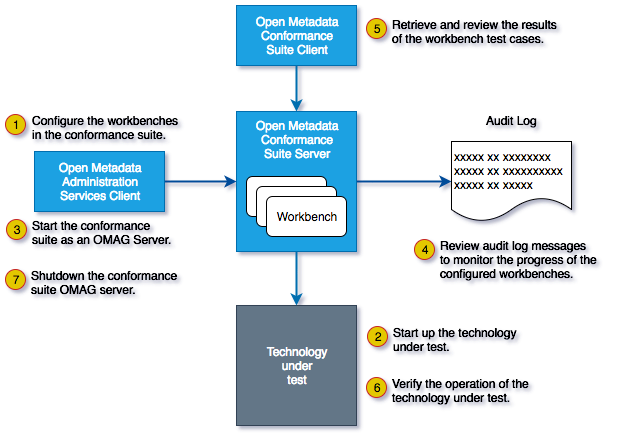

<!-- SPDX-License-Identifier: CC-BY-4.0 -->
<!-- Copyright Contributors to the Egeria project. -->

# Conformance Test Suite Overview

The open metadata conformance suite provides a testing framework to help the developers integrate a specific technology into the open metadata ecosystem.

The actual tests are run by an *open metadata conformance workbench* within the open metadata conformance suite server. Each workbench focuses on testing a specific type of technology, and typically define the set of functionality being tested in a *profile*.

!!! tip "Test cases within profiles"
    The profiles are supported by one or more test cases (described in detail within each profile).

    Each test case typically focuses on a specific requirement within a profile. However, it may verify other requirements from either the same of different profiles if it is efficient to do so.

    When a test case encounters errors, it will log them and if possible it will continue testing. However, some failures are blocking and the test case will end when one of these is encountered.

## Platform workbench

The open metadata conformance platform workbench is responsible for testing the various APIs supported by an [Open Metadata and Governance (OMAG) Server Platform](/concepts/omag-server-platform).

This workbench supports the following profiles:

| Profile                                                                    | Description |
|----------------------------------------------------------------------------|---|
| [Platform origin](/guides/cts/platform-workbench/profiles/platform-origin) | Does the platform support the `server-platform-origin` API. |

## Repository workbench

The open metadata conformance repository workbench is responsible for testing the ability of an open metadata repository to connect and interact with other open metadata repositories in a conformant way.

It tests both the repository's repository services API and its ability to exchange events with the [OMRS cohort event topic](/services/omrs/metadata-events/#omrs-event-topic).

The workbench uses the registration information that is passed when the technology under test registers with the same [open metadata repository cohort](/services/omrs/cohort) as the conformance suite. It will confirm that the information received in the events matches the information returned by the technology under test's repository services.

This workbench works as a pipeline processor, accumulating information from one test and using it to seed subsequent tests. A failure early on in the pipeline may prevent other tests from running.

In addition, this workbench dynamically generates tests based on the types returned by the repository. So for example, the *Repository TypeDef test case* runs for each TypeDef returned by the repository. A failure in the early set up test cases will prevent the repository workbench from generating the full suite of test cases for the repository under test.

The functions expected of an open metadata repository are numerous. These functions are broken down into the profiles listed below. An open metadata repository needs to support at least one profile to be conformant: in practice, metadata sharing is required in order to support any of the other profiles, so it is mandatory.

| Profile                                                                             | Description |
|-------------------------------------------------------------------------------------|---|
| [Metadata sharing](/guides/cts/repository-workbench/profiles/metadata-sharing)               | The technology under test is able to share metadata with other members of the cohort. |
| [Reference copies](/guides/cts/repository-workbench/profiles/reference-copies)                         | The technology under test is able to store reference copies of metadata from other members of the cohort. |
| [Metadata maintenance](/guides/cts/repository-workbench/profiles/metadata-maintenance)                 | The technology under test supports requests to create, update and purge metadata instances. |
| [Effectivity dating](/guides/cts/repository-workbench/profiles/effectivity-dating)                     | The technology under test supports effectivity dating properties. |
| [Dynamic types](/guides/cts/repository-workbench/profiles/dynamic-types)                               | The technology under test supports changes to the list of its supported types while it is running. |
| [Historical search](/guides/cts/repository-workbench/profiles/historical-search)                       | The technology under test supports search for the state of the metadata instances at a specific time in the past. |
| [Entity proxies](/guides/cts/repository-workbench/profiles/entity-proxies)                             | The technology under test is able to store stubs for entities to use on relationships when the full entity is not available. |
| [Soft-delete and restore](/guides/cts/repository-workbench/profiles/soft-delete-restore)               | The technology under test allows an instance to be soft-deleted and restored. |
| [Undo an update](/guides/cts/repository-workbench/profiles/undo-update)                                | The technology under test is able to restore an instance to its previous version (although the version number is updated). |
| [Reidentify instance](/guides/cts/repository-workbench/profiles/reidentify-instance)                   | The technology under test supports the command to change the unique identifier (guid) of a metadata instance. |
| [Retype instance](/guides/cts/repository-workbench/profiles/retype-instance)                           | The technology under test supports the command to change the type of a metadata instance to either its super type or a subtype. |
| [Rehome instance](/guides/cts/repository-workbench/profiles/rehome-instance)                           | The technology under test supports the command to update the metadata collection id for a metadata instance. |
| [Entity search](/guides/cts/repository-workbench/profiles/entity-search)                               | The technology under test supports the ability to search for entity instances. |
| [Relationship search](/guides/cts/repository-workbench/profiles/relationship-search)                   | The technology under test supports the ability to search for relationnship instances. |
| [Entity advanced search](/guides/cts/repository-workbench/profiles/entity-advanced-search)             | The technology under test supports the use of regular expressions to search for metadata instances. |
| [Relationship advanced search](/guides/cts/repository-workbench/profiles/relationship-advanced-search) | The technology under test supports the use of regular expressions to search for relationship instances. |

--8<-- "snippets/abbr.md"
