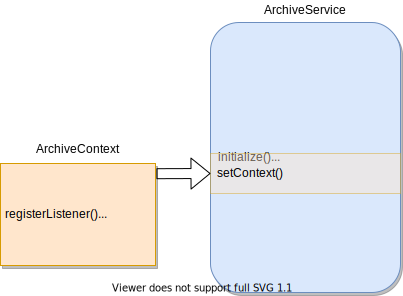

<!-- SPDX-License-Identifier: CC-BY-4.0 -->
<!-- Copyright Contributors to the Egeria project 2020. -->

# Writing Archive Services

---8<-- "docs/connectors/archive/archive-service-intro.md"

## Interface

The interface that all archive services must implement is defined by [`ArchiveService` :material-github:](https://github.com/odpi/egeria/blob/master/open-metadata-implementation/engine-services/archive-manager/archive-manager-api/src/main/java/org/odpi/openmetadata/engineservices/archivemanager/connector/ArchiveService.java){ target=gh }:

> **Figure 1:** Methods implemented by an archive service

- `initialize` is a standard method for all connectors that is called by the [connector broker](/egeria-docs/concepts/connector-broker) when the connector is created. The [connector](/egeria-docs/frameworks/ocf/#connector) is passed the [connection](/egeria-docs/frameworks/ocf/#connection) object from the configuration and a unique identifier for this instance of the connector.
- `setAuditLog` provides a logging destination (see [Audit Log Framework (ALF)](/egeria-docs/frameworks/alf/overview)).
- `setContext` sets up the archive context. This provides an interface to the repository services (OMRS) that provide access to the open metadata.
    - The ability to register a listener to receive events from the [Enterprise OMRS Topic](/egeria-docs/concepts/cohort-events/#enterprise-event-topic).
    - The ability to retrieve metadata instances from any connected open metadata repository.
- `start` indicates that the archive service is completely configured and can begin processing.  This call can be used to register a listener with the Enterprise OMRS Topic through the context and to update the archive store with the current state of the metadata in the repositories. 
- `disconnect` is called when the server is shutting down. The archive service should free up any resources that it holds since it is not needed any more.

??? education "Further information"

    - [Metadata Archiving](/egeria-docs/features/metadata-archiving/overview) to understand the different mechanisms that use open metadata archives.
    - [Open Metadata Archives](/egeria-docs/concepts/open-metadata-archive) to understand structure of an open metadata archive.
    - [Configuring an engine host](/egeria-docs/guides/admin/servers/configuring-an-engine-host) to understand how to set up an archive service.
    - [Defining a governance engine in a content pack](/egeria-docs/guides/developer/open-metadata-archives/creating-governance-engine-content-packs) to add 
    - [Writing a Open Metadata Archive Store Connector](/egeria-docs/guides/developer/runtime-connectors/open-metadata-archive-store-connector).
    - [Loading an Open Metadata Archive at server statup](/egeria-docs/guides/admin/servers/configuring-a-metadata-access-store/#configure-metadata-to-load-on-startup)
    - [Loading an Open Metadata Archive in a running server](/egeria-docs/guides/operations/adding-archive-to-running-server)

--8<-- "snippets/abbr.md"
