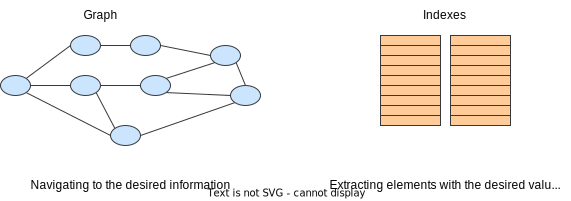
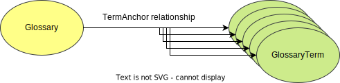
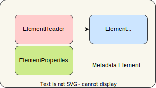
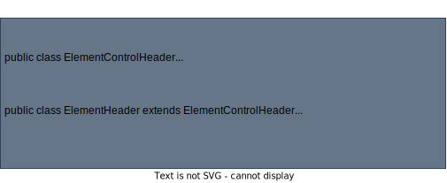
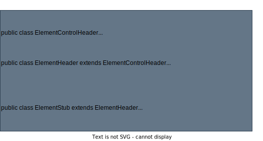
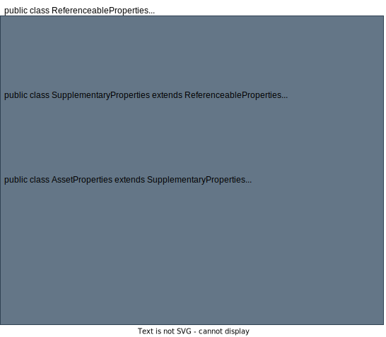
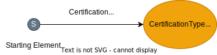

<!-- SPDX-License-Identifier: CC-BY-4.0 -->
<!-- Copyright Contributors to the Egeria project. -->

# Finding and retrieving metadata

This section describes how to retrieve metadata from Egeria.

## Mechanisms to retrieve metadata

Search methods can be through of as having 2 phases:

* Retrieve a set of candidate elements from the repositories.
* Apply additional filtering to further limit the values returned to the caller.

### Repository mechanisms

Egeria's [native metadata repositories](/connectors/#repository-and-event-mapper-connectors) have 2 mechanisms to retrieve metadata illustrated in the diagram below.  There is a graph store and an index store.

> An Egeria native repository has a graph store and an index store.

The **graph store** supports requests to retrieve metadata that involves navigating from a starting point to related instances.  For example, a request to retrieve all the glossary terms for a glossary involves locating the glossary entity and navigating via the [TermAnchor relationship](/types/3/0330-Terms) to the glossary terms.

The **index store** contains lists of values with links to the instance they came from.  It is used to locate instances that have particular values.  For example, a request to retrieve all glossary terms with a particular name would use the index store.  The terms returned could come from any glossary.

### Filtering

Filtering takes the list of instances returned by the repositories and removes the instances that do not match the filtering criteria.

The more work that can be pushed to the repositories, the faster the retrieval is probably going to be.
However, filtering can not always be avoided when the request combines both navigation and matching on values.

For example, consider a search request that asks for all glossary terms of a certain name, but only from a particular glossary.  This request is both a value search and a navigational search.

The choice of whether the navigational search or the value search is pushed down to the repositories, leaving the other to be managed with filtering is down to performance.  It is expensive to retrieve elements from the repositories.  We therefore want the repository search to return the minimum number of results, leaving the filtering to discard a small number of instances.

For example, in the case of locating particularly named glossary terms within a specific glossary, we could either:

1. Retrieve all the glossary terms for the glossary from the repositories using a navigational query and then inspect each one returned to filter out the ones with the wrong name.
2. Retrieve all the glossary terms from the repositories that have a matching name using a value search and then filter out the ones from the wrong glossaries.

In most systems, the number of glossary terms in a glossary are likely to be much greater than the number of glossary terms with the matching name.  Therefore, in this example, Egeria will use option 2.

Egeria's ordering choice is not going to be optimal for all situations.  The aim is to pick the best order for most situations.  This is also an area with opportunities to improve Egeria's performance.

### Types of filtering

The example above combined a value search with a navigational one.  There are other types of options on search requests that are always filters because they describe situations that are not directly supported by the repositories.

* The *effectiveTime* option requests that results only include elements that have their effectivity dates set up so that they are effective at that time.  You may notice this option on create, update and delete requests too.  This is because they involve at least one query to locate, say the instance that the new instance is to be connected to.
* The *forLineage* option requests that the results include instances that have been archived using the *Memento* classification.  Normally these instances are not returned.  They are only used in lineage to show resources involved in a lineage flow that no longer exist.
* The *forDuplicateProcessing* option turns off Egeria's deduplication processing to allow the caller to modify how the duplicates are linked together.  Normally, duplicates are selected and merged by Egeria during its filtering stage.

### Paging

It is possible that the caller wants to retrieve a lot of metadata, too much in fact to be retrieved in one request.  Therefore, Egeria's retrieval requests include paging.  This is expressed using 2 parameters:

* A starting point in the list of results (called elementStart, startingFrom, startFrom depending on the API) to return.
* The maximum number of results to return (called maxElements or pageSize depending on the API).

Every server limits the maximum number of elements that can be returned, so if the caller requests too much, or a page size of 0, the server's maximum is used.

The caller then codes a loop that retrieves the results, incrementing the starting point by the page size each time until a null result is returned.  

It is possible that the caller may be returned an empty list on some iterations.  This means all the values returned by the repository have been filtered out and the caller should increment the starting point and continue to retrieve new results.

In order for this loop to work, the caller needs to know the real paging size used.  Therefore, the page size value used by caller's should be established as a value lower than that set by the servers.   The purpose of the server's maximum page size is to prevent rogue request from impacting the server.

## Choosing the API to use

Egeria APIs each have their own data models which affects the structure of information returned on a retrieval call.

For example, the repository services (OMRS) return entity and relationship instances.  The access services (OMASs) return assets, glossary terms, connections, ... elements.

Often the results returned by an OMAS includes information from multiple OMRS instances.  These are filled in via additional navigational retrieval requests once the initial retrieval from the repository services has returned a selection of OMRS instances.

The most perfect, rich result set from an OMAS for your needs, may involve many requests to the repositories. If an OMAS query seems to be taking a lot of time, it might just be that it is doing a lot of work. However, if too much information is being returned, it may be that the API call is not the best choice for your needs.

## Metadata elements

Most OMASs return *metadata elements* on their APIs.  In its simplest form, a metadata element maps to a single OMRS instance (typically an entity) and includes an *element header* and its *properties*.

* The element header comes from the header of the OMRS instance. This information is managed by the OMRS. 
* The properties are managed by the caller.  They are used when creating/updating the OMRS instance and are different for each type of instance.  The types of the properties for a particular type of instance are defined in the [Open Metadata Types](/types).

The illustration below shows the typical structure of a metadata element that is populated from an OMRS entity instance.

Notice the element header includes the entity's classifications.

As an example, these are the properties for an [Endpoint](/types/0/0026-Endpoints) metadata element from [Asset Owner OMAS](/services/omas/asset-owner/overview)'s java interface.

### Element header

The structure of the element header is defined by the Open Connector Framework (OCF).  It includes:

* Element status - the status of the element is its lifecycle state.  Most elements are in either ACTIVE or DELETED status.  Some types of entities have an extended lifecycle.
* Element type - the type defines what the entity represents, and (from its type definition) which properties can be stored in the entity.
* Element origin - the origin defines the elements provenance.
* Element versions - the versions identify which version and who is responsible for making the changes to bring it to its current version.
* If the OMRS instance is an entity, a list of its classifications.

### Element classification

Classifications are structured as follows.  Notice they include the same header control information as the OMRS instances.

### Composite metadata elements

Metadata elements can include information from multiple OMRS instances.  For example, this is the connection element from Asset Owner OMAS.  Besides it own properties, a valid [connection](/concepts/connection) is always linked to a connector type.  It may have a link to an endpoint and may be linked to other embedded connections.  The connection element therefore includes information about these important linked objects.

#### Element stub

The element stub is created from the part of a relationship that describes the entity at one of the ends of the relationship.  In OMRS, this is called an *entity proxy*.

Often an element stub is included in the metadata element because the relationship needed to be retrieved to satisfy another part of the request, and the caller may wish to retrieve the linked entity in a subsequent call. This is more efficient using the unique identifier (guid) of the entity.  So since the information has already been retrieved, and may be useful later, it is included.

### Composite properties

Some metadata elements may look like they are returning a single OMRS instance, but in fact represent a collection of instances that are maintained through a composite properties object.

For example, this is asset element from the Asset Owner OMAS.

Its properties object is as follows:

The contents of the asset properties are stored using an asset and a glossary term.

### Relationship metadata elements

Some metadata elements represent a relationship.  For example, a certification for an element, such as an asset, is stored in a [Certification](/types/4/0482-Certifications) relationship linked to the type of certification.

In the corresponding metadata element, both the certification relationship and the certification type entity are represented.

#### Related element

Some retrieval methods that navigate relationships may link to entities of multiple types - for example when the members of a [Collection](/types/0/0021-Collections) are returned, they may be any type of referenceable entity.

These related instances could be returned as an element stub as used in the [connection element](#composite-metadata-elements).  However, this does not return the properties from the relationship.

If the relationship properties are needed then a *related element* is used.

--8<-- "snippets/abbr.md"