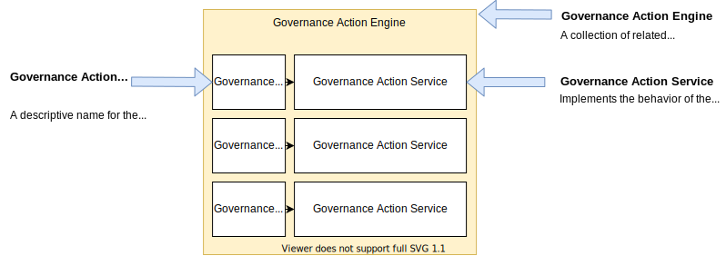

<!-- SPDX-License-Identifier: CC-BY-4.0 -->
<!-- Copyright Contributors to the ODPi Egeria project 2020. -->

# Writing a Governance Action Service

--8<-- "snippets/connectors/governance-action-service-intro.md"

## Governance action context

A governance action service is passed a context as it is started. This provides access to the [request type and associated request parameters (name-value pairs)](/concepts/governance-request-type) used to invoke the governance action service, along with its [action targets](/concepts/action-target).  There is also a client to access open metadata through the Governance Server OMAS.


The methods of the context are colour-coded.  The methods shown in white are available for all types of governance action services.  These are divided into three groups:

* Understanding the request

    * getRequestType - returns the [governance request type](/concepts/governance-request-type) used to invoke the governance action service.
    * getRequestParameters - returns the name-value pairs of properties passed with the request type.
    * getRequestSourceElements - returns details of the process that invoked the governance action.
    * getActionTargetElements - returns the list of [action target](/concepts/action-target) elements that this governance action service is to work on.
  
* Performing the action

    * getOpenMetadataStore - returns a client to the Governance Server OMAS that supports the retrieval of metadata elements, their classifications and relationships.
    * createIncidentReport - creates an [incident report](/concepts/incident-report) that can provide a focal point for collaboration to resolve a particular issue.  Incident reports are often managed by an [incident management tool](/features/incident-reporting/overview).
  
* Recording the outcome of the processing

    * updateActionTargetStatus - records that the governance action service has completed processing a specific [action target](/concepts/action-target).  This is optional, but useful to show progress when a governance action process is performing action on a long list of action targets.
    * recordCompletionStatus - declares that the governance action service has completed processing.  It has three parameters:

        * completionStatus - with values:
    
            * Actioned - the governance action service has successfully completed processing.
            * Invalid - the governance action service has not performed the requested action because it is not appropriate (for example, a false positive).
            * Failed - The governance action service failed to execute the requested action.
            * Other - Undefined or unknown completion status.

        * outputGuards - the list of [guards](/concepts/guards) that are used to determine which governance action to run next.
        * newActionTargets - the list of [action targets](/concepts/action-target) that the follow-on governance services should process.
    
    * getCompletionStatus - returns the status passed on recordCompletionStatus or null if no status has been posted.  It is used to coordinate the shutdown of multiple threads operated by the governance action service.

The methods in blue are addition services offered to governance action services implementing a *watchdog* capability:

* registerListener - requests that it is called whenever certain open metadata events occur.  It is able to specify a range of conditions from receiving all event, events for particular actions (such as creation of a new metadata element), events for particular metadata types or events on particular instances.
* initiateGovernanceAction - requests that a new [engine action](/concepts/engine-action) is run.
* initiateGovernanceActionProcess - requests that a new [governance action process](/concepts/governance-action-process) is run.

The methods in purple are additional services offered to governance action services implementing a *provisioning* capability to record lineage:

* createAsset - create an asset - typically the destination of the provisioning.
* createProcess - create a representation of the provisioning process.
* createPort - create a port for the process
* createLineageMapping - create a lineage relationship.

There are no additional services for governance action services implementing a *verification* capability which is why the green box is empty.

The methods in yellow are additional services offered to governance action services implementing a *triage* capability to initiate a stewardship action:

* createToDo - create a [ToDo](/concepts/to-do) that is assigned to an individual.

The methods in red are additional services offered to governance action services implementing a *remediation* capability to make updates to open metadata.  They are divided into four groups:

* Working with metadata elements

    * createMetadataElement
    * updateMetadataElement
    * updateMetadataElementStatus
    * deleteMetadataElement

* Working with classification on a metadata element

    * classifyMetadataElement
    * reclassifyMetadataElement
    * updateClassificationStatus
    * declassifyMetadataElement

* Working with relationships (links) between metadata elements

    * createRelatedElements
    * updateRelatedElements
    * updateRelatedElementsStatus
    * deleteRelatedElements

* Performing specialist governance actions

    * linkElementsAsPeerDuplicates
    * LinkConsolidatedDuplicate

A governance action service has a choice of base classes to extend that controls the methods provided in the governance action context:

* *GeneralGovernanceActionService* - for the complete context
* *WatchdogGovernanceActionService* - for the white and blue methods
* *ProvisioningGovernanceActionService* - for the white and purple methods
* *VerificationGovernanceActionService* - for the white and green methods
* *TriageGovernanceActionService* - for the white and yellow methods
* *RemediationGovernanceActionService* - for the white and red methods

The [Writing the governance action service connector](#writing-the-governance-action-service-connector) section provides more information on how to use the methods.

## Writing the connector provider

The connector provider for your governance action service provides the factory method to create an instance of the governance action service.  It also supports methods to describe the options that the governance action service provides, such as its supported governance request types, request parameters, action target types, configuration properties and output guards.

Below is the implementation of the connector provider for the [Move Copy File Provisioning Governance Action Service](/connectors/governance-action/move-copy-file-provisioning-governance-action-service).  This is a highly configurable governance action service that can be instructed to move, copy or delete a file, and has different styles of lineage it can create.  The action it performs is supplied in the governance request type.  The source file and destination folder can be supplied either through the request parameters or as action targets.  There are two guards: "provisioning-complete" for success and "provisioning-failed" if something went wrong.

The methods of the connector provider enables a tool that is configuring [engine actions](/concepts/engine-action) or [governance action processes](/concepts/governance-action-process) to query the capabilities of the corresponding governance action service.

```java
public class MoveCopyFileGovernanceActionProvider extends GovernanceActionServiceProviderBase
{
    private static final String  connectorTypeGUID = "e2a14ca8-57b1-48d7-9cc4-d0b44983ca79";
    private static final String  connectorTypeQualifiedName = "Egeria:GovernanceActionService:Provisioning:MoveCopyFile";
    private static final String  connectorTypeDisplayName = "Move or Copy File Governance Action Service";
    private static final String  connectorTypeDescription = "Provisioning Governance Action Service that moves or copies files on request.";

    static final String TARGET_FILE_NAME_PATTERN_PROPERTY           = "targetFileNamePattern";

    static final String NO_LINEAGE_PROPERTY                         = "noLineage";
    static final String TOP_LEVEL_PROCESS_NAME_PROPERTY             = "topLevelProcessQualifiedName";
    static final String TOP_LEVEL_PROCESS_TEMPLATE_NAME_PROPERTY    = "topLevelProcessTemplateQualifiedName";
    static final String DESTINATION_TEMPLATE_NAME_PROPERTY          = "destinationFileTemplateQualifiedName";
    static final String TOP_LEVEL_PROCESS_ONLY_LINEAGE_PROPERTY     = "topLevelProcessLineageOnly";
    static final String LINEAGE_TO_DESTINATION_FOLDER_ONLY_PROPERTY = "lineageToDestinationFolderOnly";
    static final String LINEAGE_FROM_SOURCE_FOLDER_ONLY_PROPERTY    = "lineageFromSourceFolderOnly";

    static final String COPY_REQUEST_TYPE   = "copy-file";
    static final String MOVE_REQUEST_TYPE   = "move-file";
    static final String DELETE_REQUEST_TYPE = "delete-file";

    static final String SOURCE_FILE_PROPERTY        = "sourceFile";
    static final String DESTINATION_FOLDER_PROPERTY = "destinationFolder";

    static final String PROVISIONING_COMPLETE_GUARD = "provisioning-complete";
    static final String PROVISIONING_FAILED_GUARD   = "provisioning-failed";

    private static final String connectorClassName = MoveCopyFileGovernanceActionConnector.class.getName();


    /**
     * Constructor used to initialize the ConnectorProviderBase with the Java class name of the specific
     * store implementation.
     */
    public MoveCopyFileGovernanceActionProvider()
    {
        super();
        super.setConnectorClassName(connectorClassName);

        supportedRequestTypes = new ArrayList<>();
        supportedRequestTypes.add(COPY_REQUEST_TYPE);
        supportedRequestTypes.add(MOVE_REQUEST_TYPE);
        supportedRequestTypes.add(DELETE_REQUEST_TYPE);

        supportedRequestParameters = new ArrayList<>();
        supportedRequestParameters.add(SOURCE_FILE_PROPERTY);
        supportedRequestParameters.add(DESTINATION_FOLDER_PROPERTY);

        supportedTargetActionNames = new ArrayList<>();
        supportedTargetActionNames.add(SOURCE_FILE_PROPERTY);
        supportedTargetActionNames.add(DESTINATION_FOLDER_PROPERTY);

        supportedGuards = new ArrayList<>();
        supportedGuards.add(PROVISIONING_COMPLETE_GUARD);
        supportedGuards.add(PROVISIONING_FAILED_GUARD);

        super.setConnectorClassName(connectorClassName);

        ConnectorType connectorType = new ConnectorType();
        connectorType.setType(ConnectorType.getConnectorTypeType());
        connectorType.setGUID(connectorTypeGUID);
        connectorType.setQualifiedName(connectorTypeQualifiedName);
        connectorType.setDisplayName(connectorTypeDisplayName);
        connectorType.setDescription(connectorTypeDescription);
        connectorType.setConnectorProviderClassName(this.getClass().getName());

        List<String> recognizedConfigurationProperties = new ArrayList<>();
        recognizedConfigurationProperties.add(TARGET_FILE_NAME_PATTERN_PROPERTY);
        recognizedConfigurationProperties.add(NO_LINEAGE_PROPERTY);
        recognizedConfigurationProperties.add(TOP_LEVEL_PROCESS_NAME_PROPERTY);
        recognizedConfigurationProperties.add(TOP_LEVEL_PROCESS_TEMPLATE_NAME_PROPERTY);
        recognizedConfigurationProperties.add(DESTINATION_TEMPLATE_NAME_PROPERTY);
        recognizedConfigurationProperties.add(DESTINATION_FOLDER_PROPERTY);
        recognizedConfigurationProperties.add(TOP_LEVEL_PROCESS_ONLY_LINEAGE_PROPERTY);
        recognizedConfigurationProperties.add(LINEAGE_FROM_SOURCE_FOLDER_ONLY_PROPERTY);
        recognizedConfigurationProperties.add(LINEAGE_TO_DESTINATION_FOLDER_ONLY_PROPERTY);
        connectorType.setRecognizedConfigurationProperties(recognizedConfigurationProperties);

        super.connectorTypeBean = connectorType;
    }
}
```

## Writing the governance action service connector

A governance action service must extend one of the governance action service base classes.  Your choice determine the methods available to your governance action service through the governance action context.

* *GovernanceActionService* - for the complete context
* *WatchdogGovernanceActionService* - for the shared (white) and watchdog (blue) methods
* *ProvisioningGovernanceActionService* - for the shared (white) and provisioning (purple) methods
* *VerificationGovernanceActionService* - for the shared (white) and verification (green) methods
* *TriageGovernanceActionService* - for the shared (white) and triage (yellow) methods
* *RemediationGovernanceActionService* - for the shared (white) and remediation (red) methods

In addition, it needs to implement the standard [Open Connector Framework (OCF)](/frameworks/ocf/overview) methods:

* *initialize* - an optional method where the connection object can be processed to, say, extract the configuration properties.
* *start* - this is where the processing logic of your governance action service belongs.
* *disconnect* - an optional method to free up any runtime resources that the governance action service is using.  It is called after the governance action process records a completion status, or if it throws an exception from the *start* method.


### Watchdog context methods

--8<-- "snippets/connectors/watchdog-governance-action-service-intro.md"

### Verification context methods

--8<-- "snippets/connectors/verification-governance-action-service-intro.md"

### Triage context methods

--8<-- "snippets/connectors/triage-governance-action-service-intro.md"

### Remediation context methods

--8<-- "snippets/connectors/remediation-governance-action-service-intro.md"

### Provisioning context methods

--8<-- "snippets/connectors/provisioning-governance-action-service-intro.md"


!!! education "Next steps"

    * Configuring your governance action service - A collection of related governance action services are grouped into governance action engines for deployment. The governance action engine maps *governance action request types* to the governance action service that should be invoked along with.

      

      These definitions are created as part of a [governance engine pack](/guides/developer/open-metdata-archives/creating-governance-engine-packs) or through the [Governance Server OMAS](/services/omas/governance-server/overview) and are stored in the open metadata repositories.

    * Running your governance action service - Governance action engines are hosted by the [Governance Action OMES](/services/omes/governance-action/overview) running on one or more [engine hosts](/concepts/engine-host).  The engine services run in dedicated OMAG Server called the [*engine host*](/concepts/engine-host). You can find [instructions for configuring the engine services in the engine host](/guides/admin/servers/by-section/engine-host-services-section) in the administration guide.


--8<-- "snippets/abbr.md"