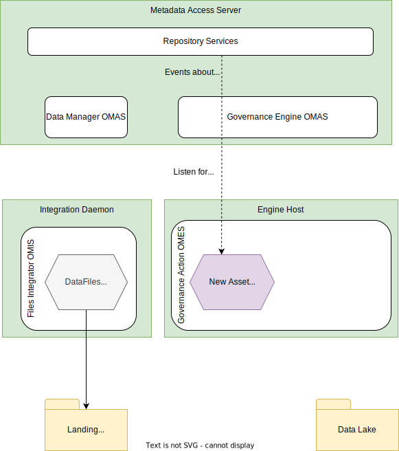

<!-- SPDX-License-Identifier: CC-BY-4.0 -->
<!-- Copyright Contributors to the ODPi Egeria project 2020. -->

# Governance Action Service

---8<-- "docs/connectors/governance-action/governance-action-service-intro.md"

## Governance action context

A governance action service is passed a context as it is started. This provides access to the request type and associated request parameters (name-value pairs) used to invoke the governance action service, along with a client to access open metadata through the Governance Engine OMAS.

* Governance Action Request Type - The governance action request type defines the descriptive name of a specific governance action that the organization wishes to run. They are used by the [Governance Action Engines](/concepts/governance-action-engine)
to determine which governance action service to run.
* Governance Action Request Parameters - The governance action request parameters are a collection of name-value properties that are passed to a [governance action service](/guides/developer/governance-action-services/governance-action-service) in the [governance context](/guides/developer/governance-action-services/governance-context) when it starts.

!!! info "Open Metadata Types"
    The Open Metadata Type model *[0461 Governance Action Engines](/types/4/0461-Governance-Engines)* shows how the request type links the governance action engine to the governance action service via the **SupportedGovernanceActionService** relationship.

### Watchdog governance action service

--8<-- "docs/frameworks/gaf/watchdog-governance-action-service-intro.md"

### Verification governance action service

--8<-- "docs/frameworks/gaf/verification-governance-action-service-intro.md"

### Triage governance action service

--8<-- "docs/frameworks/gaf/triage-governance-action-service-intro.md"

### Remediation governance action service

--8<-- "docs/frameworks/gaf/remediation-governance-action-service-intro.md"

### Provisioning governance action service

--8<-- "docs/frameworks/gaf/provisioning-governance-action-service-intro.md"

## Data onboarding example

??? education "Operation of the data onboarding process"
    ??? education "Initialization"
    
    ??? education "New files arrive"
    
    ??? education "Provisioning to the data lake"
    
    ??? education "Archive the asset for the landing area"
    

1. New file detected by Integration Connector
2. File asset created in metadata server
3. New Asset event passed to Watchdog Governance Service
4. New Governance Action created that results in notification to Engine Host
5. Engine Host claims Governance Action and activates Provisioning Governance Service
6. Provisioning Governance Service moves file and writes lineage
7. Deleted file is detected
8. File's Asset archived

!!! education "Next steps"

    * Configuring your governance action service - A collection of related governance action services are grouped into governance action engines for deployment. The governance action engine maps *governance action request types* to the governance action service that should be invoked along with.

      

      These definitions are created as part of a [governance engine pack](/guides/developer/open-metdata-archives/creating-governance-engine-packs) or through the [Governance Engine OMAS](/services/omas/governance-engine/overview) and are stored in the open metadata repositories.

    * Running your governance action service - Governance action engines are hosted by the [Governance Action OMES](/services/omes/governance-action/overview) running on one or more [engine hosts](/concepts/engine-host).  The engine services run in dedicated OMAG Server called the [*engine host*](/concepts/engine-host). You can find [instructions for configuring the engine services in the engine host](/guides/admin/servers/configuring-an-engine-host/#configure-the-engine-host-services) in the administration guide.

--8<-- "snippets/abbr.md"