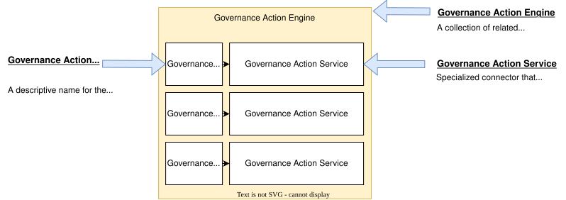

<!-- SPDX-License-Identifier: CC-BY-4.0 -->
<!-- Copyright Contributors to the ODPi Egeria project 2020. -->

# Writing a Governance Action Service

A [governance action service](/concepts/governance-action-service) is a specialized [Open Connector Framework (OCF)](/frameworks/ocf/overview) connector that performs a short, atomic piece of governance work: it starts, does its job, records what happened, and completes.  Like all connectors it has two parts - a *connector provider* that describes and creates it, and the *connector implementation* that does the work.

It is passed a *governance action context* as it is started. This provides access to the [request type and associated request parameters (name-value pairs)](/concepts/governance-request-type) used to invoke the governance action service, along with its [action targets](/concepts/action-target).  The context also gives access to open metadata through the same clients used by every other Egeria connector.

!!! attention "One base class, not six"
    Earlier releases asked you to choose one of six base classes - `GeneralGovernanceActionService`, `WatchdogGovernanceActionService`, `ProvisioningGovernanceActionService`, `VerificationGovernanceActionService`, `TriageGovernanceActionService` or `RemediationGovernanceActionService` - and each gave you a different subset of the context methods.

    The five specialized base classes have been removed.  Every governance action service now extends [`GeneralGovernanceActionService`](#writing-the-governance-action-service-connector) and gets the complete context.  Verification, triage, remediation and provisioning are still useful names for *what a service does* - and are still used to describe Egeria's own services - but they are no longer a decision you make in code.

    Watching for a situation to occur has moved out of OGF altogether.  It is now a [watchdog action service](/guides/developer/watchdog-action-services/overview) with its own framework and its own engine service, because it is long-running rather than atomic.

## The four kinds of governance action service

These describe the shape of the work, and are worth knowing because they determine which [guards](/concepts/guard) and [action targets](/concepts/action-target) other people will expect your service to produce.

### Verification

--8<-- "snippets/connectors/verification-governance-action-service-intro.md"

### Triage

--8<-- "snippets/connectors/triage-governance-action-service-intro.md"

### Remediation

--8<-- "snippets/connectors/remediation-governance-action-service-intro.md"

### Provisioning

--8<-- "snippets/connectors/provisioning-governance-action-service-intro.md"

## Dependencies

* [Open Connector Framework (OCF)](/frameworks/ocf/overview) - basic connector interfaces.
* [Open Governance Framework (OGF)](/frameworks/ogf/overview) - the governance action service base class, the governance action context, guards and action targets.
* [Open Metadata Framework (OMF)](/frameworks/omf/overview) - the open metadata clients, properties, types and completion status.
* [Audit Log Framework (ALF)](/frameworks/alf/overview) - for audit logging and exceptions.
* Any [digital resource connectors](/concepts/digital-resource-connector) the service needs to call the technology it is governing.

=== "Gradle dependencies"
    ```groovy
    dependencies {
        compileOnly 'org.odpi.egeria:audit-log-framework'
        compileOnly 'org.odpi.egeria:open-connector-framework'
        compileOnly 'org.odpi.egeria:open-metadata-framework'
        compileOnly 'org.odpi.egeria:open-governance-framework'
    }
    ```
=== "Maven dependencies"
    ```xml
        <dependencies>

            <dependency>
                <groupId>org.odpi.egeria</groupId>
                <artifactId>audit-log-framework</artifactId>
                <scope>provided</scope>
            </dependency>

            <dependency>
                <groupId>org.odpi.egeria</groupId>
                <artifactId>open-connector-framework</artifactId>
                <scope>provided</scope>
            </dependency>

            <dependency>
                <groupId>org.odpi.egeria</groupId>
                <artifactId>open-metadata-framework</artifactId>
                <scope>provided</scope>
            </dependency>

            <dependency>
                <groupId>org.odpi.egeria</groupId>
                <artifactId>open-governance-framework</artifactId>
                <scope>provided</scope>
            </dependency>

        </dependencies>
    ```

!!! tip "Use provided scope"
    The `<scope>provided</scope>` setting (`compileOnly` in Gradle) keeps the Egeria libraries out of your connector's jar file so it can run with any level of Egeria that supports this type of connector.

## Writing the connector provider

The connector provider for your governance action service is the factory method that creates an instance of it.  It also describes the service's *specification*: the [governance request types](/concepts/governance-request-type) and request parameters it understands, the [action targets](/concepts/action-target) it expects and produces, the [guards](/concepts/guard) it returns, and the configuration properties that adapt it.  This is what lets a tool configuring [engine actions](/concepts/engine-action) or [governance action processes](/concepts/governance-action-process) offer your service correctly and validate how it is being called.

Each connector provider extends [`GovernanceActionServiceProviderBase` :material-github:](https://github.com/odpi/egeria/blob/main/open-metadata-implementation/frameworks/open-governance-framework/src/main/java/org/odpi/openmetadata/frameworks/opengovernance/GovernanceActionServiceProviderBase.java){ target=gh }.

| Field | Description |
|---|---|
| `supportedRequestTypes` | The request types that change the service's behaviour, each with a description.  Other request types may be used to call it, but produce default behaviour. |
| `supportedRequestParameters` | The request parameters it reads, with their data types and examples. |
| `supportedActionTargetTypes` | The elements it expects to be given, each with a name, description, open metadata type and [deployed implementation type](/concepts/deployed-implementation-type). |
| `producedRequestParameters` | Request parameters it passes on to whatever runs next. |
| `producedActionTargetTypes` | Action targets it passes on - for example, an asset it has just created. |
| `producedGuards` | The [guards](/concepts/guard) it can return, which is how a [governance action process](/concepts/governance-action-process) decides what runs next. |
| `supportedTechnologyTypes` | The technologies it knows how to work with. |
| `supportedConfigurationProperties` | Full descriptions of any configuration properties on its connection. |

!!! attention "These lists are typed, not plain strings"
    These fields used to be `List<String>`.  They are now lists of `RequestTypeType`, `RequestParameterType`, `ActionTargetType` and `GuardType`, each of which carries a description (and, for action targets, an open metadata type) alongside the name.  That description is what a person configuring your service sees, so it is worth writing properly.

The descriptive information - connector type GUID, qualified name, display name, description, wiki page, audit log component identifier and development status - is supplied through an implementation of the [`OpenConnectorDefinition` :material-github:](https://github.com/odpi/egeria/blob/main/open-metadata-implementation/frameworks/open-connector-framework/src/main/java/org/odpi/openmetadata/frameworks/connectors/OpenConnectorDefinition.java){ target=gh } interface.  Defining these as an enum keeps the descriptions of all the connectors in your library together; Egeria's own connectors use the `EgeriaOpenConnectorDefinition` enum.

```java
public class ProvisionUnityCatalogGovernanceActionProvider extends GovernanceActionServiceProviderBase
{
    private static final String connectorClassName = ProvisionUnityCatalogGovernanceActionConnector.class.getName();

    public ProvisionUnityCatalogGovernanceActionProvider()
    {
        super(EgeriaOpenConnectorDefinition.PROVISION_UNITY_CATALOG_GOVERNANCE_ACTION_SERVICE,
              connectorClassName,
              null);

        super.supportedRequestParameters  = ProvisionUnityCatalogRequestParameter.getRequestParameterTypes();
        super.producedGuards              = ProvisionUnityCatalogGuard.getGuardTypes();
        super.producedActionTargetTypes   = Collections.singletonList(ActionTarget.NEW_ASSET.getActionTargetType());
        super.supportedTechnologyTypes    = SupportedTechnologyType.getSupportedTechnologyTypes(
                new DeployedImplementationTypeDefinition[]{
                        UnityCatalogDeployedImplementationType.OSS_UC_CATALOG,
                        UnityCatalogDeployedImplementationType.OSS_UC_SCHEMA,
                        UnityCatalogDeployedImplementationType.OSS_UC_VOLUME,
                        UnityCatalogDeployedImplementationType.OSS_UC_TABLE,
                        UnityCatalogDeployedImplementationType.OSS_UC_FUNCTION});
    }
}
```

### Defining request parameters, action targets and guards

Define the names your service uses as enums, next to the connector, and have them return the typed specification objects.  This keeps the name, its description and its data type in one place, and means the connector and its provider cannot disagree about them.

The OGF supplies enums of common definitions so that services that do similar things use the same names - [`RequestType`, `RequestParameter`, `ActionTarget` and `Guard` :material-github:](https://github.com/odpi/egeria/tree/main/open-metadata-implementation/frameworks/open-governance-framework/src/main/java/org/odpi/openmetadata/frameworks/opengovernance/controls){ target=gh }.  Reuse them where they fit; a process that expects `newAsset` as an action target works with any service that produces it.

Each `Guard` value carries the [completion status](#recording-the-outcome) that normally accompanies it, so the two cannot drift apart:

```java
    SERVICE_COMPLETED("service-completed", CompletionStatus.ACTIONED,  "The service completed successfully."),
    SERVICE_FAILED("service-failed", CompletionStatus.FAILED, "An unexpected error occurred while the governance service was running."),
    NO_TARGETS_DETECTED("no-targets-detected", CompletionStatus.INVALID, "There is no supplied action target and so the governance service does not know which asset to work on."),
```

## Writing the governance action service connector

A governance action service extends [`GeneralGovernanceActionService` :material-github:](https://github.com/odpi/egeria/blob/main/open-metadata-implementation/frameworks/open-governance-framework/src/main/java/org/odpi/openmetadata/frameworks/opengovernance/GeneralGovernanceActionService.java){ target=gh }.  The base class sets up:

* `governanceContext` - the [governance action context](#the-governance-action-context).
* `governanceServiceName` - the qualified name of the service, for audit log messages and exceptions.
* `auditLog` - the audit logging destination.
* `connectionBean` - the connection used to create the service, including its configuration properties.
* `propertyHelper` - utility for reading values out of open metadata elements.

It also needs to implement the standard [Open Connector Framework (OCF)](/frameworks/ocf/overview) methods:

* *initialize* - an optional method where the connection object can be processed to, say, extract the configuration properties.
* *start* - this is where the processing logic of your governance action service belongs.  Call `super.start()` first; it validates that the context has been set up.
* *disconnect* - an optional method to free up any runtime resources that the governance action service is using.  It is called after the governance action service records a completion status, or if it throws an exception from the *start* method.

!!! attention "Record a completion status before disconnect returns"
    If `disconnect()` completes before the service has recorded its completion status, the engine action is treated as unfinished and the service is restarted - either at the administrator's request, or the next time the server starts.  If you do not want your service restarted, be sure it has recorded a completion status.

Here is the complete implementation of the [Create Asset Governance Action Service :material-github:](https://github.com/odpi/egeria/blob/main/open-metadata-implementation/adapters/open-connectors/governance-action-connectors/src/main/java/org/odpi/openmetadata/adapters/connectors/governanceactions/stewardship/CreateAssetGovernanceActionConnector.java){ target=gh }, which creates an asset from a template and passes its GUID on as an action target:

```java
public class CreateAssetGovernanceActionConnector extends GeneralGovernanceActionService
{
    @Override
    public void start() throws ConnectorCheckedException, UserNotAuthorizedException
    {
        final String methodName = "start";

        super.start();

        try
        {
            List<String>              outputGuards        = new ArrayList<>();
            List<NewActionTarget>     outputActionTargets = new ArrayList<>();
            CompletionStatus          completionStatus;
            AuditLogMessageDefinition messageDefinition;

            String templateGUID = getProperty(ManageAssetRequestParameter.TEMPLATE_GUID.getName(), null);

            if (templateGUID == null)
            {
                messageDefinition = GovernanceActionConnectorsAuditCode.NO_TEMPLATE_GUID.getMessageDefinition(governanceServiceName);
                outputGuards.add(ManageAssetGuard.MISSING_TEMPLATE.getName());
                completionStatus = ManageAssetGuard.MISSING_TEMPLATE.getCompletionStatus();
            }
            else
            {
                String assetGUID = governanceContext.getOpenMetadataStore().getMetadataElementFromTemplate(...);

                NewActionTarget newActionTarget = new NewActionTarget();

                newActionTarget.setActionTargetGUID(assetGUID);
                newActionTarget.setActionTargetName(ActionTarget.NEW_ASSET.name);

                outputActionTargets.add(newActionTarget);

                messageDefinition = GovernanceActionConnectorsAuditCode.NEW_ASSET_CREATED.getMessageDefinition(...);
                completionStatus  = ManageAssetGuard.SET_UP_COMPLETE.getCompletionStatus();
                outputGuards.add(ManageAssetGuard.SET_UP_COMPLETE.getName());
            }

            auditLog.logMessage(methodName, messageDefinition);

            governanceContext.recordCompletionStatus(completionStatus, outputGuards, null, outputActionTargets, messageDefinition);
        }
        catch (Exception error)
        {
            throw new ConnectorCheckedException(GovernanceActionConnectorsErrorCode.UNEXPECTED_EXCEPTION.getMessageDefinition(governanceServiceName,
                                                                                                                             error.getClass().getName(),
                                                                                                                             error.getMessage()),
                                                error.getClass().getName(),
                                                methodName,
                                                error);
        }
    }
}
```

Notice the shape: work out what to do, do it, choose a guard and its matching completion status, log a message, and record the outcome.  Both the success and failure paths end at the same `recordCompletionStatus()` call.

### Helper methods on the base class

* `getActionTarget(name)` and `getAllActionTargets(name)` pick the action target(s) with a given name out of the list, rather than iterating it yourself.
* `getProperty(name, defaultValue)` looks for a value first in the request parameters, then in the connection's configuration properties, then falls back to the default.  This is the standard precedence: what the caller asked for beats how the service was configured.
* `getStringRequestParameter()`, `getBooleanRequestParameter()`, `getIntRequestParameter()`, `getLongRequestParameter()` and `getArrayRequestParameter()` read typed values out of the request parameters.
* `handleUnexpectedException(methodName, error)` wraps an unexpected exception in a standard `ConnectorCheckedException`.

## The governance action context

`GovernanceActionContext` extends `ConnectorContextBase` - the same base class used by the [integration context](/guides/developer/integration-connectors/integration-context) and the [survey context](/guides/developer/survey-action-services/overview#survey-context).  A governance action service therefore has the full set of open metadata clients available to it, not a restricted subset chosen by its base class.

### Understanding the request

| Method | Purpose |
|---|---|
| `getRequestType()` | The [governance request type](/concepts/governance-request-type) used to invoke the service. |
| `getRequestParameters()` | The name-value properties passed with the request type. |
| `getRequestSourceElements()` | Details of the process that invoked the governance action. |
| `getActionTargetElements()` | The [action target](/concepts/action-target) elements this service is to work on. |
| `getRequesterUserId()` | Who asked for the action. |
| `getEngineActionGUID()` | The [engine action](/concepts/engine-action) that is running this service. |
| `getMaxPageSize()` | The largest number of results the server will return, for paging loops. |

### Performing the action

* `getOpenMetadataStore()` returns the generic store that retrieves, creates, updates, classifies, links and deletes metadata elements of any type.  The element, classification and relationship maintenance methods that used to be reached only through a *remediation* base class all live here.
* The typed clients - `getAssetClient()`, `getGovernanceDefinitionClient()`, `getSchemaTypeClient()`, `getGlossaryTermClient()` and the rest - work with a specific category of element and are usually easier to read.
* `getConnectorForAsset(assetGUID)` creates a [digital resource connector](/concepts/digital-resource-connector) from an asset's connection, so the service can call the technology it is governing without knowing its credentials.
* `createIncidentReport()` creates an [incident report](/concepts/incident-report) that can provide a focal point for collaboration to resolve a particular issue.  Incident reports are often managed by an [incident management tool](/features/incident-reporting/overview).
* `openToDo()` creates a [To Do](/concepts/to-do) assigned to a person or role - the *triage* pattern.
* `createNoteLogEntry()` and `registerContextEvent()` record what happened for the people who come along later.
* `getNotificationManagerClient()` manages notification subscriptions.

For provisioning services that need to record [lineage](/features/lineage-management/overview): `createAsset()`, `createAssetFromTemplate()`, `createProcess()`, `createProcessFromTemplate()`, `createChildProcess()`, `createPort()` and `createLineageRelationship()`.

### Initiating more governance

* `initiateEngineAction()` runs a new [engine action](/concepts/engine-action).
* `initiateGovernanceActionType()` runs a single [governance action type](/concepts/governance-action-type).
* `initiateGovernanceActionProcess()` runs a whole [governance action process](/concepts/governance-action-process).

The context also still carries `registerListener()`/`disconnectListener()` for watching open metadata events.  For anything that needs to keep watching, build a [watchdog action service](/guides/developer/watchdog-action-services/overview) instead - a governance action service is expected to complete, and an engine host will treat one that never finishes as stuck.

### Recording the outcome

* `updateActionTargetStatus()` records that the service has finished with a specific [action target](/concepts/action-target).  This is optional, but useful to show progress when a governance action process is working through a long list of action targets.
* `recordCompletionStatus(status, outputGuards, requestParameters, newActionTargets, completionMessage)` declares that the service has completed processing:

    * `status` - one of `ACTIONED` (successfully completed), `INVALID` (the requested action was not appropriate - for example, a false positive), `FAILED` (the service failed to execute the requested action) or `OTHER`.
    * `outputGuards` - the [guards](/concepts/guard) used to determine which governance action runs next.
    * `requestParameters` - properties to pass to whatever runs next.
    * `newActionTargets` - the elements the follow-on services should process.
    * `completionMessage` - a message describing the result, or the reason for the failure.

* `getCompletionStatus()` returns the status passed on `recordCompletionStatus()`, or null if none has been recorded.  It is used to coordinate the shutdown of a service that operates more than one thread.

## Deploying and running your governance action service

Package your connector provider and implementation in a jar file, and add it (with any third party client libraries it needs) to the [OMAG Server Platform](/concepts/omag-server-platform) class path - the easiest way is to copy the jar files into the `extra` directory of the platform's [assembly](/education/tutorials/building-egeria-tutorial/overview).

A collection of related governance action services are then grouped into [governance action engines](/concepts/governance-action-engine) for deployment. The governance action engine maps a [governance request type](/concepts/governance-request-type) to the governance action service that should be invoked, along with the request parameters to use.



These definitions are created as part of a [governance engine pack](/guides/developer/open-metadata-archives/creating-governance-engine-packs) or through the [Asset Maker](/services/omvs/asset-maker/overview) API and are stored in the open metadata repositories.

Governance action engines are hosted by the [Governance Action OMES](/services/omes/governance-action/overview) running in an [engine host](/concepts/engine-host).  You can find [instructions for configuring the engine services in the engine host](/guides/admin/servers/by-section/engine-host-services-section) in the administration guide.

## Example implementations

The [governance-action-connectors :material-github:](https://github.com/odpi/egeria/tree/main/open-metadata-implementation/adapters/open-connectors/governance-action-connectors){ target=gh } module holds Egeria's own governance action services, grouped by the kind of work they do:

* *verification* - [Verify Asset :material-github:](https://github.com/odpi/egeria/tree/main/open-metadata-implementation/adapters/open-connectors/governance-action-connectors/src/main/java/org/odpi/openmetadata/adapters/connectors/governanceactions/verification){ target=gh } checks that an asset is set up correctly.
* *remediation* - [Origin Seeker, Zone Publisher, Retention Classifier and the duplicate linkers :material-github:](https://github.com/odpi/egeria/tree/main/open-metadata-implementation/adapters/open-connectors/governance-action-connectors/src/main/java/org/odpi/openmetadata/adapters/connectors/governanceactions/remediation){ target=gh } update open metadata.
* *provisioning* - [Move, Copy or Delete File :material-github:](https://github.com/odpi/egeria/blob/main/open-metadata-implementation/adapters/open-connectors/governance-action-connectors/docs/move-copy-file-provisioning-governance-action-service.md){ target=gh } provisions a resource and records the lineage.
* *stewardship* - [Create Asset, Delete Asset, Catalog Target Asset, Wait for Steward and Days of Week :material-github:](https://github.com/odpi/egeria/tree/main/open-metadata-implementation/adapters/open-connectors/governance-action-connectors/src/main/java/org/odpi/openmetadata/adapters/connectors/governanceactions/stewardship){ target=gh } are small building blocks for governance action processes.

The [Coco Pharmaceuticals clinical trial samples :material-github:](https://github.com/odpi/egeria/tree/main/open-metadata-resources/open-metadata-samples/governance-action-samples/src/main/java/org/odpi/openmetadata/samples/governanceactions/clinicaltrials){ target=gh } show a set of governance action services working together in a realistic multi-step process.

??? education "Further information"
    - [Open Governance Framework (OGF)](/frameworks/ogf/overview) - what each kind of governance action service is for.
    - [Writing a survey action service](/guides/developer/survey-action-services/overview) - for analysing a resource and reporting on it.
    - [Writing a watchdog action service](/guides/developer/watchdog-action-services/overview) - for monitoring that keeps running.
    - [Governance action process](/concepts/governance-action-process) - how services are linked together by their guards.

--8<-- "snippets/abbr.md"
