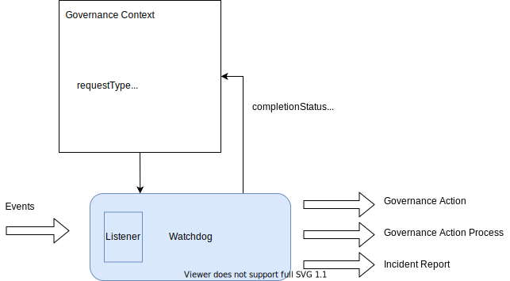

<!-- SPDX-License-Identifier: CC-BY-4.0 -->
<!-- Copyright Contributors to the ODPi Egeria project. -->

# Watchdog Governance Services

The watchdog governance service monitors changes in the metadata and initiates one of the
following as a result.

* [governance action](/concepts/governance-action)
* [governance action process](/concepts/governance-action-process) 
* [incident report](/concepts/incident-report)

One example of a watchdog governance service is to monitor for new assets. 
Another example is to monitor the addition of
open discovery reports and take action on their content.  

> **Figure 1:** Governance context for the watchdog governance service

--8<-- "snippets/abbr.md"