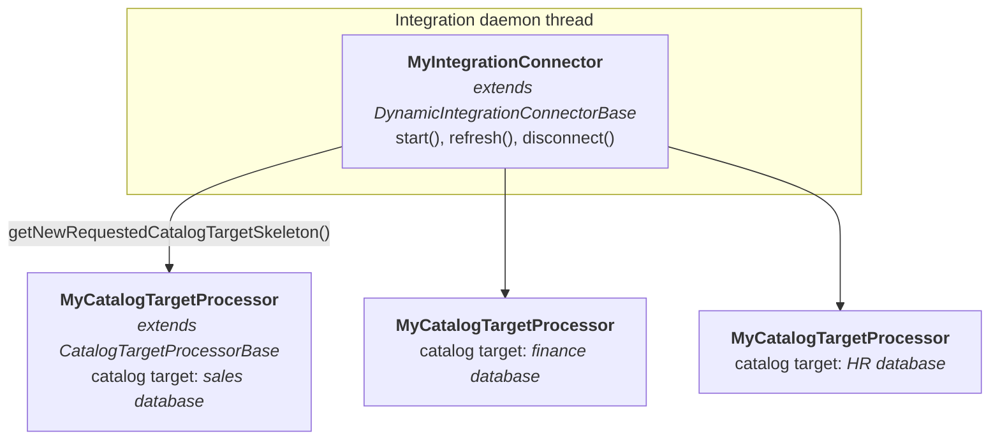

<!-- SPDX-License-Identifier: CC-BY-4.0 -->
<!-- Copyright Contributors to the Egeria project. -->

# Supporting catalog targets

A [catalog target](/concepts/catalog-target) describes a specific piece of third party technology that an [integration connector](/concepts/integration-connector) is exchanging metadata with.

## Why catalog targets change the way connectors are built

Originally, the technology that an integration connector worked with was identified by the [endpoint](/concepts/endpoint) in the connector's own [connection](/concepts/connection).  A connection describes one endpoint, so a connector instance could work with exactly one database, one file directory, or one Kafka broker.  If you had three databases to catalog, you configured and deployed three instances of the connector, each with its own connection, its own credentials and its own entry in the integration daemon's configuration.

With catalog targets, the connector's connection only needs to identify the connector implementation.  The technology to work with is attached to the connector's *IntegrationConnector* metadata element using a [*CatalogTarget*](/types/4/0464-Dynamic-Integration-Groups) relationship that points at the [asset](/concepts/asset) describing the technology.


> The integration connector is linked to the asset for the database it is to catalog.  The asset's own connection - including any embedded secrets store connector - is used to create the connector that calls the database.

This has a big effect on operations:

* The connector is deployed once - typically by loading a [content pack](/content-packs) into the metadata access store at start up - and it then runs in an [integration group](/concepts/integration-group).
* When someone wants a new database catalogued, they attach the database's asset to the connector with a *CatalogTarget* relationship.  No configuration change, no restart.
* Connection details, including credentials, are defined once on the asset and reused by every connector, [survey action service](/concepts/survey-action-service) and [governance action service](/concepts/governance-action-service) that works with that resource.
* Each catalog target can carry its own configuration properties, templates, metadata source name and permitted synchronization, so one running connector can treat each of its targets differently.

It also changes the way the connector is built.  The per-resource logic that used to live in the connector's `refresh()` method moves into a *catalog target processor*.

## The shape of a catalog target connector



There are two classes to write (plus the [connector provider](/guides/developer/integration-connectors/#writing-the-connector-provider)):

| Class | Extends | Responsibility |
|---|---|---|
| The integration connector | `DynamicIntegrationConnectorBase` | Extract any connector-wide configuration in `start()`, and act as a factory that creates a processor for each catalog target. |
| The catalog target processor | `CatalogTargetProcessorBase` | All the work for one piece of third party technology: validate the target, call the technology, and maintain the open metadata for it. |

The base class does the rest.  On each `refresh()` it:

1. Retrieves the current list of *CatalogTarget* relationships attached to the connector's element.
2. For each new one, creates a [digital resource connector](/concepts/digital-resource-connector) for the target asset (if the target is an asset with a connection), calls your `getNewRequestedCatalogTargetSkeleton()` method to create the processor, overlays the configuration properties, starts the resource connector and calls `start()` on the processor.
3. For each one whose relationship properties have changed, disconnects the old resource connector and repeats step 2 with the new values.
4. Calls `refresh()` on every processor, catching and logging exceptions so that one failing target does not stop the others.
5. Registers an open metadata event listener (once the first refresh is complete) if the connector implements `OpenMetadataEventListener`, and passes each event to any processor that implements `OpenMetadataEventListener`.

## Writing the integration connector

The connector extends [`DynamicIntegrationConnectorBase` :material-github:](https://github.com/odpi/egeria/blob/main/open-metadata-implementation/frameworks/open-integration-framework/src/main/java/org/odpi/openmetadata/frameworks/integration/connectors/DynamicIntegrationConnectorBase.java){ target=gh } and implements a single abstract method: `getNewRequestedCatalogTargetSkeleton()`.  Here is the complete implementation of the [Kafka Topic Integration Connector :material-github:](https://github.com/odpi/egeria/blob/main/open-metadata-implementation/adapters/open-connectors/system-connectors/apache-kafka-connectors/src/main/java/org/odpi/openmetadata/adapters/connectors/apachekafka/integration/KafkaTopicIntegrationConnector.java){ target=gh }:

```java
public class KafkaTopicIntegrationConnector extends DynamicIntegrationConnectorBase
{
    /**
     * Create a new catalog target processor (typically inherits from CatalogTargetProcessorBase).
     *
     * @param retrievedCatalogTarget details of the open metadata elements describing the catalog target
     * @param catalogTargetContext   specialized context for this catalog target
     * @param connectorToTarget      connector to access the target resource
     * @return new processor based on the catalog target information
     */
    @Override
    public RequestedCatalogTarget getNewRequestedCatalogTargetSkeleton(CatalogTarget        retrievedCatalogTarget,
                                                                       CatalogTargetContext catalogTargetContext,
                                                                       Connector            connectorToTarget)
    {
        return new KafkaTopicCatalogTargetProcessor(retrievedCatalogTarget,
                                                    catalogTargetContext,
                                                    connectorToTarget,
                                                    connectorName,
                                                    auditLog);
    }
}
```

Notice that there is no `start()`, `refresh()` or `disconnect()` method.  They are only needed if the connector has work of its own to do.  For example, the [PostgreSQL Server Integration Connector :material-github:](https://github.com/odpi/egeria/blob/main/open-metadata-implementation/adapters/open-connectors/data-manager-connectors/postgres-server-connectors/src/main/java/org/odpi/openmetadata/adapters/connectors/postgres/catalog/PostgresServerIntegrationConnector.java){ target=gh } overrides `start()` to read the default database include/exclude lists from its own connection:

```java
    @Override
    public void start() throws ConnectorCheckedException, UserNotAuthorizedException
    {
        super.start();

        defaultExcludeDatabases = super.getArrayConfigurationProperty(PostgresConfigurationProperty.EXCLUDE_DATABASE_LIST.getName(),
                                                                      connectionBean.getConfigurationProperties(),
                                                                      Collections.singletonList("postgres"));
        :
    }
```

!!! attention "Always call the superclass method"
    `super.start()` creates the catalog targets manager, `super.refresh()` drives the catalog target processors, and `super.disconnect()` releases their resource connectors.  If you override any of these methods without calling the superclass version, your catalog targets are never processed.

## Writing the catalog target processor

The processor extends [`CatalogTargetProcessorBase` :material-github:](https://github.com/odpi/egeria/blob/main/open-metadata-implementation/frameworks/open-integration-framework/src/main/java/org/odpi/openmetadata/frameworks/integration/connectors/CatalogTargetProcessorBase.java){ target=gh }, which in turn extends `RequestedCatalogTarget` and `CatalogTarget`.  This means the properties of the catalog target are available directly on `this`:

| Method | Description |
|---|---|
| `getCatalogTargetName()` | The name given to this target by the person who attached it.  Use it in audit log messages so operators can tell the targets apart. |
| `getCatalogTargetElement()` | The `OpenMetadataRootElement` for the element at the other end of the *CatalogTarget* relationship, including its classifications, its attached software capabilities and its related elements. |
| `getConnectorToTarget()` | The [digital resource connector](/concepts/digital-resource-connector) created from the target asset's connection, already started.  It is null if the target is not an asset, or has no connection. |
| `getConfigurationProperties()` | The connector's own configuration properties, overlaid with the configuration properties from the *CatalogTarget* relationship.  The relationship's values win. |
| `getTemplates()` | Map of template name to template GUID for [templated cataloguing](/features/templated-cataloguing/overview). |
| `getPermittedSynchronization()` | The direction metadata is allowed to flow for this target.  Defaults to the connector's setting. |
| `getMetadataSourceQualifiedName()` | The qualified name of the [software capability](/concepts/software-capability) that owns the metadata created for this target. |
| `getDeleteMethod()` | Whether deletes for this target should be soft-deletes, archives or purges. |
| `getRelationshipGUID()` | Unique identifier of the *CatalogTarget* relationship itself - useful if the connector needs to update it. |
| `integrationContext` | The [`CatalogTargetContext`](/guides/developer/integration-connectors/integration-context) for this target.  It is already set up with the correct metadata source and permitted synchronization. |

### The start method

`start()` is called once, when the catalog target is first seen (and again if the relationship is updated).  This is where to validate the target and extract the values that do not change between refreshes.  From the [Kafka Topic Catalog Target Processor :material-github:](https://github.com/odpi/egeria/blob/main/open-metadata-implementation/adapters/open-connectors/system-connectors/apache-kafka-connectors/src/main/java/org/odpi/openmetadata/adapters/connectors/apachekafka/integration/KafkaTopicCatalogTargetProcessor.java){ target=gh }:

```java
    @Override
    public void start() throws UserNotAuthorizedException, ConnectorCheckedException
    {
        super.start();

        final String methodName = "start";

        integrationContext.validateIsActive(methodName);

        if ((super.connectorToTarget != null) &&
            (super.connectorToTarget.getConnection() != null) &&
            (super.connectorToTarget.getConnection().getEndpoint() != null) &&
            (super.connectorToTarget.getConnection().getEndpoint().getNetworkAddress() != null))
        {
            hostIdentifier = super.getHostIdentifier(super.connectorToTarget.getConnection().getEndpoint().getNetworkAddress());
            portNumber     = super.getPortNumber(super.connectorToTarget.getConnection().getEndpoint().getNetworkAddress());
            templateGUID   = this.getTemplateGUID();
        }
        else
        {
            super.throwMissingConnectionInfo(OpenMetadataProperty.NETWORK_ADDRESS.name, methodName);
        }

        if (propertyHelper.isTypeOf(this.getCatalogTargetElement().getElementHeader(), OpenMetadataType.SOFTWARE_SERVER.typeName))
        {
            eventBrokerGUID = this.getEventBrokerGUID(this.getCatalogTargetElement());
        }
        else if (propertyHelper.isTypeOf(this.getCatalogTargetElement().getElementHeader(), OpenMetadataType.EVENT_BROKER.typeName))
        {
            eventBrokerGUID = this.getCatalogTargetElement().getElementHeader().getGUID();
        }
        else
        {
            super.throwWrongTypeOfCatalogTarget(Arrays.asList(OpenMetadataType.SOFTWARE_SERVER.typeName,
                                                              OpenMetadataType.EVENT_BROKER.typeName).toString(),
                                                methodName);
        }
    }
```

`CatalogTargetProcessorBase` supplies a family of helper methods for this validation work, so that all connectors report the same problems in the same way:

* `throwWrongTypeOfCatalogTarget()` - the element on the end of the relationship is not a type this connector can process.
* `throwWrongTypeOfResourceConnector()` - the asset's connection created a connector of an unexpected class.
* `throwMissingConnectionInfo()` - the connection is missing a value the connector needs, such as the network address.
* `throwMissingPropertyValue()` and `throwBadBeanClass()` - the target element does not have the properties the connector expects.

It also supplies methods to extract typed values from the combined configuration properties - `getStringConfigurationProperty()`, `getBooleanConfigurationProperty()`, `getIntConfigurationProperty()`, `getLongConfigurationProperty()`, `getDateConfigurationProperty()`, `getArrayConfigurationProperty()` and `getSuppliedPlaceholderProperties()` - along with `getHostIdentifier()` and `getPortNumber()` for splitting a network address.

### The refresh method

`refresh()` does the metadata exchange for this one target.  Because the base class calls it inside a try/catch, an exception thrown here takes only this target out of action for this pass, not the whole connector.

```java
    @Override
    public void refresh() throws ConnectorCheckedException
    {
        final String methodName = "refresh";

        if (propertyHelper.isTypeOf(this.getCatalogTargetElement().getElementHeader(),
                                    PostgresDeployedImplementationType.POSTGRESQL_SERVER.getAssociatedTypeName()))
        {
            JDBCResourceConnector assetConnector = null;

            try
            {
                String                  databaseServerGUID = this.getCatalogTargetElement().getElementHeader().getGUID();
                OpenMetadataRootElement databaseManager    = this.getDatabaseManager(databaseServerGUID, this.getCatalogTargetElement());

                Connector connector = integrationContext.getConnectedAssetContext().getConnectorForAsset(databaseServerGUID, auditLog);

                assetConnector = (JDBCResourceConnector)connector;
                assetConnector.start();

                catalogDatabases(databaseServerGUID,
                                 databaseManager,
                                 this.getTemplates(),
                                 this.getConfigurationProperties(),
                                 assetConnector);
            }
            catch (Exception exception)
            {
                auditLog.logException(methodName,
                                      PostgresAuditCode.UNEXPECTED_EXCEPTION.getMessageDefinition(connectorName,
                                                                                                  exception.getClass().getName(),
                                                                                                  methodName,
                                                                                                  exception.getMessage()),
                                      exception);
            }
            finally
            {
                this.releaseAssetConnector(assetConnector, methodName);
            }
        }
        else
        {
            super.throwWrongTypeOfCatalogTarget(PostgresDeployedImplementationType.POSTGRESQL_SERVER.getAssociatedTypeName(),
                                                methodName);
        }
    }
```

!!! tip "Release any connector you create yourself"
    The resource connector returned by `getConnectorToTarget()` is managed by the base class - do not disconnect it.  However, if `refresh()` creates its own connector (as the PostgreSQL example does, to pick up a fresh database session each pass) it must release it on both the success and the failure path.  Otherwise each failed refresh leaks the connector and the connections it holds.

### The disconnect method

`disconnect()` is called when the *CatalogTarget* relationship is removed, or when the connector shuts down.  Free up any resources that this processor holds.  The resource connector supplied by the base class is disconnected for you.

### Processing events for a catalog target

If the catalog target processor implements [`OpenMetadataEventListener` :material-github:](https://github.com/odpi/egeria/blob/main/open-metadata-implementation/frameworks/open-metadata-framework/src/main/java/org/odpi/openmetadata/frameworks/openmetadata/events/OpenMetadataEventListener.java){ target=gh }, it is passed each event from the open metadata ecosystem.

For this to happen, the *integration connector* must also implement `OpenMetadataEventListener` - this is the signal that the connector is interested in open metadata events.  `DynamicIntegrationConnectorBase` provides the `processEvent()` implementation that fans the event out to the processors, and registers the listener at the end of the first `refresh()`.  The delay is deliberate: it avoids a flood of events caused by the connector's own initial synchronization.  The listener is only registered if the permitted synchronization allows metadata to flow to the third party technology.

```java
public class MyIntegrationConnector extends DynamicIntegrationConnectorBase implements OpenMetadataEventListener
{
    // processEvent() is inherited from DynamicIntegrationConnectorBase
}

public class MyCatalogTargetProcessor extends CatalogTargetProcessorBase implements OpenMetadataEventListener
{
    @Override
    public void processEvent(OpenMetadataOutTopicEvent event)
    {
        // called for each open metadata event, for this catalog target
    }
}
```

The base class only passes events on when a refresh is not running, so your `processEvent()` method does not have to test `integrationContext.noRefreshInProgress()` itself.

Events from the *third party* technology are handled differently: register the listener in the processor's constructor or `start()` method.  The [OpenLineage Event Receiver Catalog Target Processor :material-github:](https://github.com/odpi/egeria/blob/main/open-metadata-implementation/adapters/open-connectors/integration-connectors/openlineage-integration-connectors/src/main/java/org/odpi/openmetadata/adapters/connectors/integration/openlineage/OpenLineageEventReceiverCatalogTargetProcessor.java){ target=gh } has an [Open Metadata Topic Connector](/concepts/open-metadata-topic-connector) as its target resource connector, and registers a listener with it:

```java
    public OpenLineageEventReceiverCatalogTargetProcessor(CatalogTarget             template,
                                                          CatalogTargetContext      catalogTargetContext,
                                                          Connector                 connectorToTarget,
                                                          String                    connectorName,
                                                          AuditLog                  auditLog,
                                                          OpenMetadataTopicListener listener) throws ConnectorCheckedException,
                                                                                                     UserNotAuthorizedException
    {
        super(template, catalogTargetContext, connectorToTarget, connectorName, auditLog);

        if (super.getConnectorToTarget() instanceof OpenMetadataTopicConnector topicConnector)
        {
            topicConnector.registerListener(listener);

            if (! topicConnector.isActive())
            {
                topicConnector.start();
            }
        }
    }
```

Its `refresh()` method does nothing, because all of its work is event-driven.

### Being notified when the catalog targets change

An integration connector that needs to know when its catalog targets are added, changed or removed can implement [`CatalogTargetChangeListener` :material-github:](https://github.com/odpi/egeria/blob/main/open-metadata-implementation/frameworks/open-integration-framework/src/main/java/org/odpi/openmetadata/frameworks/integration/connectors/CatalogTargetChangeListener.java){ target=gh } and register it with the catalog targets manager:

```java
        catalogTargetsManager.registerCatalogTargetChangeListener(this);
```

The interface has `newCatalogTarget()`, `updatedCatalogTarget()` and `removedCatalogTarget()` methods.  Most connectors do not need this, since the processor's own `start()` and `disconnect()` methods cover the same events.

## Declaring the supported catalog target types

The [connector provider](/guides/developer/integration-connectors/#writing-the-connector-provider) declares which types of element this connector accepts as a catalog target.  This information is published in open metadata so that the tools people use to attach catalog targets can offer the right choices, and so that they can be validated.  See [defining the catalog target types](/guides/developer/integration-connectors/#catalog-target-types).

## Naming the metadata source

Each catalog target can name the [software capability](/concepts/software-capability) that acts as the [metadata collection](/concepts/metadata-collection) for the metadata created from it - the `metadataSourceQualifiedName` property on the *CatalogTarget* relationship.  This means metadata from the sales database and metadata from the finance database can be held in separate metadata collections, even though a single connector instance created both.

`CatalogTargetProcessorBase` provides `setUpMetadataSource()` and `setUpSoftwareCapability()` to locate (or create) these elements.  The [external source metadata provenance](/features/metadata-provenance/overview) that results prevents other tools from changing the metadata that this connector maintains.

## Migrating an existing connector

To convert a connector that predates catalog targets:

1. Change the superclass from `IntegrationConnectorBase` (or one of the old `XXXIntegratorConnector` classes) to `DynamicIntegrationConnectorBase`.
2. Create a new class extending `CatalogTargetProcessorBase` and move the body of `refresh()` into it, along with any instance variables it uses.
3. Move the parts of `start()` that relate to a specific resource into the processor's `start()` method.  Anything that reads the connector's own configuration stays behind.
4. Implement `getNewRequestedCatalogTargetSkeleton()` on the connector to return an instance of the new processor.
5. Replace `getContext()` with the `integrationContext` variable, and `connectionProperties` with `connectionBean`.
6. Replace direct use of the endpoint from the connector's connection with `getConnectorToTarget()`, or with the network address from the target asset's connection.
7. Declare the supported catalog target types in the connector provider.

???+ info "Code examples"
    * [Kafka Topic Integration Connector :material-github:](https://github.com/odpi/egeria/blob/main/open-metadata-implementation/adapters/open-connectors/system-connectors/apache-kafka-connectors/src/main/java/org/odpi/openmetadata/adapters/connectors/apachekafka/integration/KafkaTopicIntegrationConnector.java){ target=gh } - the smallest complete example.
    * [PostgreSQL Server Integration Connector :material-github:](https://github.com/odpi/egeria/blob/main/open-metadata-implementation/adapters/open-connectors/data-manager-connectors/postgres-server-connectors/src/main/java/org/odpi/openmetadata/adapters/connectors/postgres/catalog/PostgresServerIntegrationConnector.java){ target=gh } - configuration properties, templates and a resource connector.
    * [Unity Catalog Server Sync Connector :material-github:](https://github.com/odpi/egeria/blob/main/open-metadata-implementation/adapters/open-connectors/data-manager-connectors/unity-catalog-connectors/src/main/java/org/odpi/openmetadata/adapters/connectors/unitycatalog/sync/OSSUnityCatalogServerSyncConnector.java){ target=gh } - two-way synchronization using the [integration iterators](/guides/developer/integration-connectors/integration-context/#integration-iterators).
    * [OpenLineage Event Receiver Integration Connector :material-github:](https://github.com/odpi/egeria/blob/main/open-metadata-implementation/adapters/open-connectors/integration-connectors/openlineage-integration-connectors/src/main/java/org/odpi/openmetadata/adapters/connectors/integration/openlineage/OpenLineageEventReceiverIntegrationConnector.java){ target=gh } - event-driven catalog targets.

??? education "Further information"
    - [Catalog target](/concepts/catalog-target) concept page.
    - [Integration group](/concepts/integration-group) - how connectors and their catalog targets are described in open metadata.
    - [Self-registering integration connectors](/guides/developer/integration-connectors/self-registering-integration-connectors) - connectors that find and attach their own catalog targets.

--8<-- "snippets/abbr.md"
