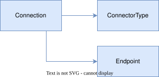
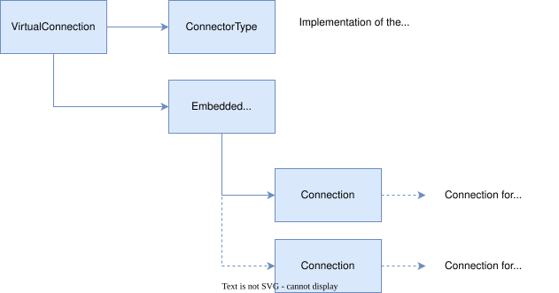
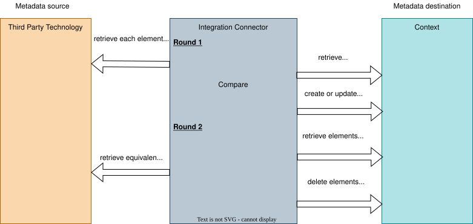
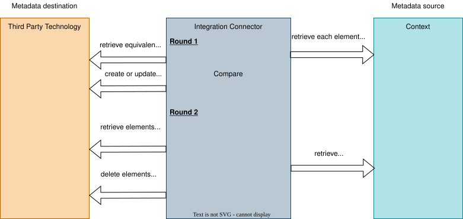
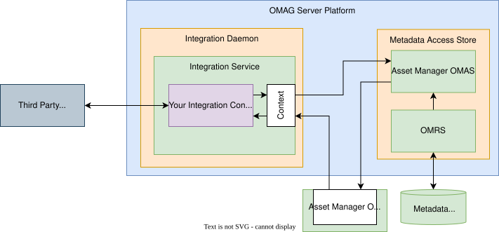

<!-- SPDX-License-Identifier: CC-BY-4.0 -->
<!-- Copyright Contributors to the Egeria project 2020. -->

# Building Integration Connectors

The [integration connectors](/concepts/integration-connector) support the exchange of metadata with third party technologies.  This exchange may be inbound and/or outbound; synchronous, polling or event-driven.


> An integration connector is shown deployed in an integration daemon.  The connector is linking to a third party technology and also calling the open metadata APIs of Egeria to manage the exchange of metadata.

The purpose of the [integration daemon](/concepts/integration-daemon) is to minimise the effort required to integrate a third party technology into the open metadata ecosystem.  They handle:

* Management of configuration - including user security information.
* Starting and stopping of your integration logic.
* Thread management and polling.
* Discovering which pieces of third party technology your connector should be working with, and keeping that list up to date.
* Access to the open metadata repositories for query and maintenance of open metadata.
* Ability to write to audit log and maintain measurements for performance metrics.
* Metadata provenance.

This means you can focus on interacting with the third party technology and mapping its metadata to open metadata in your integration connector.

Integration connectors are also useful for tasks that need to run regularly.  Egeria uses integration connectors to monitor the health of the open metadata ecosystem and to add its own insights.

## Integration connector interface

---8<-- "docs/guides/developer/integration-connectors/integration-connector-interface.md"


## Designing your integration connector

There are five main design decisions to make before you start coding:

* How does the connector find out which pieces of third party technology to work with?  In almost all cases the answer is [catalog targets](/guides/developer/integration-connectors/catalog-targets), which allow a single deployed connector to work with many resources, added and removed while it runs.
* How is the work of the connector triggered - by polling on the `refresh()` call, by listening for events from the third party technology, or by listening for events from open metadata?
* Which direction the metadata synchronization is going.  Is the third party technology the source of metadata, or is metadata from the open metadata ecosystem being pushed to the third party technology?
* How are elements from the third party technology mapped to and correlated with the elements in open metadata?
* If the third party technology is the source, should the metadata created in the open metadata ecosystem be read-only so that it can not be changed by other tools?  This is achieved using [External source metadata provenance](/features/metadata-provenance/overview).

### Identifying the technology to work with

Your integration connector is created and initialized with a connection object.  This connection object should contain the configuration needed by your integration connector.  For example, it may contain configuration properties that control the behavior of your connector.

There are three patterns for identifying the third party technology that the connector is to work with.

=== "Catalog targets (recommended)"

    The technology to work with is attached to the connector's *IntegrationConnector* element with a [*CatalogTarget*](/types/4/0464-Dynamic-Integration-Groups) relationship.

    
    > The connection for the integration connector just needs the connector type that describes its implementation.  The *CatalogTarget* relationship links to the asset that describes the technology the connector is to work with.  There can be many of them, and they can be added and removed while the connector is running.

    The connector is deployed once - typically by loading a [content pack](/content-packs) at start up - and people then attach the resources they want it to work with.  Connection details and credentials are defined once, on the asset, and reused by every connector, [survey action service](/concepts/survey-action-service) and [governance action service](/concepts/governance-action-service) that works with that resource.

    See [supporting catalog targets](/guides/developer/integration-connectors/catalog-targets).

=== "An explicit endpoint"

    
    > An explicit endpoint is added to the integration connector's connection in its configuration to provide information on the network location of the third party technology.  This is used to initialize the client libraries needed to call the third party technology.

    This is the original pattern.  It ties one running connector instance to one piece of technology: to monitor three databases you deploy three configured instances.  Use it only where the connector genuinely has a single fixed destination - for example, a connector that writes a log of open lineage events to a particular file system.

=== "A learned endpoint"

    
    > If no endpoint is configured in the integration connector's connection, the endpoint information can be retrieved from open metadata by calling the context object and/or listening for notifications from open metadata.

    A [self-registering integration connector](/guides/developer/integration-connectors/self-registering-integration-connectors) takes this further: it searches open metadata for the elements it is interested in and attaches them to itself as catalog targets.

### Calling the third party technology

An alternative to calling the third party technology directly from your integration connector is to use one or more appropriate [digital resource connectors](/concepts/digital-resource-connector).

When your connector works with catalog targets, this is done for you.  If the catalog target is an [asset](/concepts/asset) with a connection, the framework creates and starts the resource connector, and it is available from the catalog target processor's `getConnectorToTarget()` method.  This is the recommended approach: the credentials live on the asset, in one place, and are shared with every other governance service that works with that resource.

Where the connector needs a resource connector for an asset that is not its catalog target, `integrationContext.getConnectedAssetContext().getConnectorForAsset(assetGUID, auditLog)` creates one.

Connection objects for digital resource connectors can also be embedded in the connection object for the integration connector itself.


> A [Virtual Connection](/concepts/connection/#virtual-connections) is a special type of connection that allows connections for different connectors to be embedded.  Typically, there is only one embedded connection - a [secrets store connector](/concepts/secrets-store-connector) is the most common - but multiple embedded connections can be used.  Also, the embedded connections themselves may be virtual connections.

When the digital resource connectors are defined in a virtual connection (rather than being initialized in the integration connector logic), the integration daemon can manage the lifecycle of the embedded connectors with the lifecycle of the integration connectors, reducing the chances of memory leaks and held resources as the connectors/integration daemon are restarted over the lifetime of their hosting OMAG Server Platform.  The embedded connectors are available through the `embeddedConnectors` variable.

Sharing a resource connector is not always possible.  It works well when the same interface serves both the metadata and the data:

* Consumers of the digital resources in the third party technology need a digital resource connector to access the content of the digital resource.  It may be possible to use the same digital resource connector in the integration connector.
* Often, the integration connector is not the only connector that is accessing a particular third party technology.  There may be [survey action services](/concepts/survey-action-service) and [governance action services](/concepts/governance-action-service) that also need to access the third party technology once the integration connector has run to create the basic technical metadata.

For example, Egeria has a JDBC digital resource connector for accessing databases.   It can be used by consumers of databases as well as various governance connectors that are cataloguing and managing databases.


This pattern is not always possible if the integration connector needs to use a different interface to access the third party technology's metadata from its resources.  For example, the [Kafka Topic Integration Connector :material-github:](https://github.com/odpi/egeria/blob/main/open-metadata-implementation/adapters/open-connectors/system-connectors/apache-kafka-connectors/README.md){ target=gh }, which detects the creation of new Kafka Topics and catalogues them in open metadata, does not use the [Kafka Open Metadata Topic Connector :material-github:](https://github.com/odpi/egeria/blob/main/open-metadata-implementation/adapters/open-connectors/event-bus-connectors/open-metadata-topic-connectors/kafka-open-metadata-topic-connector/README.md){ target=gh } because it uses a different Apache Kafka interface to do its work.

### Metadata flow for your connector

The `refresh` method of your connector is called periodically to ensure the metadata in the third party technology is consistent with the metadata in the open metadata ecosystem.  When the connector supports catalog targets, `refresh()` is called on each catalog target processor in turn, and each pass operates in two phases:

1. Retrieving metadata from the source and ensuring the equivalent metadata is present in the metadata destination.

2. Retrieving metadata from the destination and deleting any elements that are not present in the source.


> When the third party technology is the metadata source (for example, it is a relational database or a file system) the refresh method ensures that the open metadata in Egeria is exactly the same as the metadata in the third party technology.


> When the open metadata ecosystem is the metadata source and the integration connector is responsible for distributing a subset of the open metadata to the third party technology, the refresh method ensures this subset (and no more) is present in the third party technology.

The direction of flow is controlled by the *permitted synchronization* setting.  It can be set on the connector as a whole and overridden for each catalog target, so a single connector instance can be pushing metadata to one resource while pulling it from another.  Test it with `getPermittedSynchronization()` before writing to either side.

The [integration iterators](/guides/developer/integration-connectors/integration-context/#integration-iterators) supplied by the [Open Integration Framework (OIF)](/frameworks/oif/overview) implement the second phase for you: given the creation and update times of an element in the third party technology, a `MemberElement` will tell you whether the open metadata copy needs to be created, updated, deleted or left alone.

### Mapping the third party technology to open metadata

Your integration connector needs to be able to map between the elements in the third party technology and in the open metadata ecosystem.  Each will use different unique identifiers that it is unlikely that you can control.  Design the `qualifiedName` of the open metadata elements to be constructable from the identifier of the equivalent metadata element in the third party technology.

??? tip "What if there is not a one-to-one correspondence between elements"
    The integration context supports [external identifiers](/features/external-identifiers/overview) which can help to correlate complex relationships between the third party technology and open metadata.  Retrieve the client with `integrationContext.getExternalIdClient()`.

Wherever the elements you create are standard - a database, a file, a topic - consider [templated cataloguing](/features/templated-cataloguing/overview) rather than building the elements property by property.  Templates are supplied on the connector's configuration properties and on each *CatalogTarget* relationship, and are retrieved with `getTemplates()`.

## Controlling external source metadata provenance

The configuration for an integration connector includes a *metadataSourceQualifiedName*.  The default value is null which means store the metadata in any [metadata collection](/concepts/metadata-collection) that is owned by the locally connected cohorts.  Alternatively, it specifies the [qualifiedName](/concepts/referenceable) of a [software capability](/concepts/software-capability) entity that represents the third party technology.   This is automatically catalogued by the integration daemon if it is not found in the open metadata ecosystem.  The guid and qualifiedName of this entity is used to identify the [external metadata collection](/concepts/metadata-collection) that any open metadata elements created by the integration connector will be stored in.  This prevents processes other than the integration connector from modifying the metadata elements.

Each *CatalogTarget* relationship can supply its own *metadataSourceQualifiedName*.  This means that the metadata gathered from each piece of third party technology is held in its own metadata collection, even though one connector instance created it all.

## Writing the connector provider

---8<-- "docs/guides/developer/connector-provider-intro.md"

---8<-- "docs/guides/developer/integration-connectors/implementing-an-integration-connector-provider.md"


!!! example "Example: connector provider for the PostgreSQL Server Integration Connector"
    The [`PostgresServerIntegrationProvider` :material-github:](https://github.com/odpi/egeria/blob/main/open-metadata-implementation/adapters/open-connectors/data-manager-connectors/postgres-server-connectors/src/main/java/org/odpi/openmetadata/adapters/connectors/postgres/catalog/PostgresServerIntegrationProvider.java){ target=gh } is used to instantiate connectors that catalog the databases in a PostgreSQL database server.  Its catalog target types show that it accepts either a PostgreSQL server or an individual PostgreSQL database, and the connectors it instantiates are of type [`PostgresServerIntegrationConnector` :material-github:](https://github.com/odpi/egeria/blob/main/open-metadata-implementation/adapters/open-connectors/data-manager-connectors/postgres-server-connectors/src/main/java/org/odpi/openmetadata/adapters/connectors/postgres/catalog/PostgresServerIntegrationConnector.java){ target=gh }.

## Writing the connector

The connector extends [`DynamicIntegrationConnectorBase`](#choosing-a-base-class) and has a default constructor:

```java
public class MyIntegrationConnector extends DynamicIntegrationConnectorBase
{
    /**
     * Default constructor used by the connector provider.
     */
    public MyIntegrationConnector()
    {
        super();
    }

    /**
     * Create a new catalog target processor for each catalog target attached to this connector.
     */
    @Override
    public RequestedCatalogTarget getNewRequestedCatalogTargetSkeleton(CatalogTarget        retrievedCatalogTarget,
                                                                       CatalogTargetContext catalogTargetContext,
                                                                       Connector            connectorToTarget)
    {
        return new MyCatalogTargetProcessor(retrievedCatalogTarget,
                                            catalogTargetContext,
                                            connectorToTarget,
                                            connectorName,
                                            auditLog);
    }
}
```

Most of the logic then lives in `MyCatalogTargetProcessor` - see [supporting catalog targets](/guides/developer/integration-connectors/catalog-targets).

### Accessing configuration properties and the endpoint

The connection object is stored in the `connectionBean` instance variable defined by the super class.  It is typically accessed in the `start()` method.  The base class supplies typed accessors for the configuration properties, so your code does not have to deal with casting and null checks:

```java
    /**
     * Indicates that the connector is completely configured and can begin processing.
     *
     * @throws ConnectorCheckedException there is a problem within the connector.
     * @throws UserNotAuthorizedException the connector was disconnected before/during start
     */
    @Override
    public void start() throws ConnectorCheckedException, UserNotAuthorizedException
    {
        super.start();

        final String methodName = "start";

        /*
         * Extract the configuration.  These values act as defaults for all of the catalog targets;
         * each catalog target can override them on its CatalogTarget relationship.
         */
        Map<String, Object> configurationProperties = connectionBean.getConfigurationProperties();

        excludeList = super.getArrayConfigurationProperty(MyConfigurationProperty.EXCLUDE_LIST.getName(),
                                                          configurationProperties);
        batchSize   = super.getIntConfigurationProperty(MyConfigurationProperty.BATCH_SIZE.getName(),
                                                        configurationProperties);

        /*
         * If this connector uses an explicit endpoint rather than catalog targets, it is on the connection.
         */
        Endpoint endpoint = connectionBean.getEndpoint();

        if (endpoint != null)
        {
            myNetworkAddress = endpoint.getNetworkAddress();
        }

        /*
         * Record the configuration
         */
        if (auditLog != null)
        {
            auditLog.logMessage(methodName,
                                MyConnectorsAuditCode.CONNECTOR_CONFIGURATION.getMessageDefinition(connectorName, myNetworkAddress));
        }
    }
```

### Accessing context

The [integration context](/guides/developer/integration-connectors/integration-context) is available through the `integrationContext` variable set up by the base class.  Each catalog target processor has its own `CatalogTargetContext` - also called `integrationContext` - that is already scoped to that target's metadata source and permitted synchronization.

### Registering a listener with open metadata

An integration connector that is listening for events from the open metadata ecosystem implements the listener interface [OpenMetadataEventListener](https://odpi.github.io/egeria/org/odpi/openmetadata/frameworks/openmetadata/events/OpenMetadataEventListener.html).  This interface has a `processEvent()` method that takes an [OpenMetadataOutTopicEvent](https://odpi.github.io/egeria/org/odpi/openmetadata/frameworks/openmetadata/events/OpenMetadataOutTopicEvent.html).

If your connector extends `DynamicIntegrationConnectorBase`, simply declaring that it implements `OpenMetadataEventListener` is enough.  The base class registers the listener at the end of the first `refresh()`, implements `processEvent()`, and passes each event on to any catalog target processor that also implements `OpenMetadataEventListener`.  Delaying the registration until the first refresh has completed reduces the flood of events caused by the connector's own initial synchronization.

If you are registering the listener yourself, do it in the `start()` method:

```java
    @Override
    public synchronized void start() throws ConnectorCheckedException, UserNotAuthorizedException
    {
        super.start();

        if (integrationContext.noListenerRegistered())
        {
            integrationContext.registerListener(this);
        }
    }

     /**
      * Process an event that was published by the open metadata ecosystem.
      *
      * @param event event object
      */
     @Override
     public void processEvent(OpenMetadataOutTopicEvent event)
     {
        /*
         * Only process events if refresh() is not running because the refresh() process creates lots of events and
         * proceeding with event processing at this time causes elements to be processed multiple times.
         */
        if (integrationContext.noRefreshInProgress())
        {
            :
        }
     }
```

The `noRefreshInProgress()` call is used to ensure this connector ignores events while its `refresh()` is being called.  For many connectors, many of the events created during this time are caused by the connector's own activity.  Therefore, ignoring events at this time can avoid processing elements multiple times.

### Listening for events from the third party technology

The [OpenLineage Event Receiver Integration Connector :material-github:](https://github.com/odpi/egeria/blob/main/open-metadata-implementation/adapters/open-connectors/integration-connectors/openlineage-integration-connectors/README.md#open-lineage-event-receiver-integration-connector){ target=gh } shows how to receive events from an event broker such as [Apache Kafka](https://kafka.apache.org/).  Each of its catalog targets is a topic, and the resource connector created for the target is an [Open Metadata Topic Connector](/concepts/open-metadata-topic-connector).  Its catalog target processor implements [OpenMetadataTopicListener](https://odpi.github.io/egeria/org/odpi/openmetadata/repositoryservices/connectors/openmetadatatopic/OpenMetadataTopicListener.html) and registers itself with the topic connector:

```java
        if (super.getConnectorToTarget() instanceof OpenMetadataTopicConnector topicConnector)
        {
            topicConnector.registerListener(listener);

            if (! topicConnector.isActive())
            {
                topicConnector.start();
            }
        }
```

Once `topicConnector.start()` is called, the connector will receive events from Apache Kafka.  Adding a new topic to listen on is then just a matter of attaching another catalog target.

!!! attention "Do not create threads in your integration connector"
    Each integration connector runs in its own thread. Integration connectors should not create additional threads because this makes it difficult for Egeria to properly shut down the integration daemon independently of the OMAG Server Platform.
    If the connector needs to make blocking calls to the third party technology, it should implement the `engage()` method and set the `usesBlockingCalls` property in its configuration to `true`. When the `engage()` method is called on the thread, it should issue one blocking call and return.  The integration daemon will check that it is not in shutdown and if it is still running, it calls `engage()` again.

### Exceptions and error handling

The methods of the integration connector are able to throw `ConnectorCheckedException` to indicate there is a problem.  If your integration connector throws such an exception, the integration daemon switches it to `FAILED` status, and it is not called again until either the connector is restarted by the operator or the integration daemon is restarted.  Therefore, when your integration connector discovers a problem, it can either just return from the method in the hope the problem is resolved by the next time it is called, or it can throw an exception.  In either case it should [log an audit log message](#audit-log-messages).  If the error needs an operator action to resolve it, throwing a `ConnectorCheckedException` exception means that the integration connector is not needlessly taking up resources when it can not operate.  This is important if multiple failures are occurring and the ecosystem is under stress.  However, throwing an exception for a temporary error that will resolve itself takes the integration connector offline unnecessarily and creates work for the operators.

Catalog targets change this balance.  The framework calls each catalog target processor inside its own try/catch and logs any exception, so a problem with one target only takes that target out of action for that pass - the other targets carry on.  This means a catalog target processor can afford to be stricter about reporting problems than a connector that has to keep the whole show on the road.

A `UserNotAuthorizedException` from the context means that the connector has been disconnected.  Let it propagate rather than catching it, so that processing stops promptly.

The integration connector should only catch exceptions that inherit from `java.lang.Exception` since runtime exceptions are something that need to be handled by the broader runtime environment.

### Audit log messages

Audit log messages help the people operating Egeria to be sure your integration connector is not being called too frequently and is able to access all the resources it needs.  It is recommended that your integration connector outputs audit log messages in the following places:

* At the end of the `start()` method to confirm the resources and options it has been configured with.
* At the start and end of the `refresh()` method to show when it ran.  It is helpful to summarise the number of updates made to open metadata or the third party technology, so it is possible to judge if it is being called at the right frequency.
* At the end of the `disconnect()` method to confirm it has shutdown.
* If the integration connector detects an error.  This message should include the error information from the third party technology to aid diagnosis of the problem.

Where the connector supports catalog targets, include the `getCatalogTargetName()` value in the message so that operators can tell which target a message relates to.  The framework already logs a message as each catalog target is refreshed, and a summary of how many were processed.

## Testing your connector

Your integration connector implementation should be built and packaged in a *jar* file.  This jar file contains your connector provider and connector implementation.  It may optionally contain any dependent client libraries to the third party connector that are called directly by your integration connector.  This is necessary if these client libraries are not available in their own jar file.

The connector jar file (and any jar files for the dependent third party client libraries not included in your connector's jar file) need to be added to the [OMAG Server Platform](/concepts/omag-server-platform) class path.  The easiest way to do this is to copy the JAR files into the `extra` directory of your OMAG Server Platform's [assembly](/education/tutorials/building-egeria-tutorial/overview).

Once you have installed the connector, configure it in the integration daemon, connected to a metadata access store.



Then catalog the technology you want it to work with, and attach the resulting asset to your connector as a catalog target.  Your connector is then able to start and exchange metadata.


Testing a connector that supports catalog targets is easier than the older style: you can add and remove targets while the connector runs, and use the integration daemon's refresh REST API call to trigger a pass on demand rather than waiting for the refresh interval.

## Documenting your connector

All connectors should be documented in some form of connector catalog to ensure they are easy for others to reuse.  If your connector is either part of Egeria, or available from a public download, you may advertise it in Egeria's [connector catalog](/connectors).

Describing your connector in an [open metadata archive](/concepts/open-metadata-archive) means it can be loaded into a metadata access store at start up, along with the templates and reference data it needs.  See [creating content packs](/guides/developer/open-metadata-archives/creating-content-packs).

??? education "Further information"
    - [Supporting catalog targets](/guides/developer/integration-connectors/catalog-targets) - the recommended structure for a new connector.
    - [The integration context](/guides/developer/integration-connectors/integration-context) - what the connector can do with open metadata.
    - [Self-registering integration connectors](/guides/developer/integration-connectors/self-registering-integration-connectors) - connectors that find their own catalog targets.
    - [Open Connector Framework (OCF)](/frameworks/ocf/overview) that defines the behavior of all connectors.
    - [Configuring an integration daemon](/guides/admin/servers/by-server-type/configuring-an-integration-daemon) to understand how to set up an integration connector.
    - [Developer guide](/guides/developer) for more information on writing connectors.

--8<-- "snippets/abbr.md"
