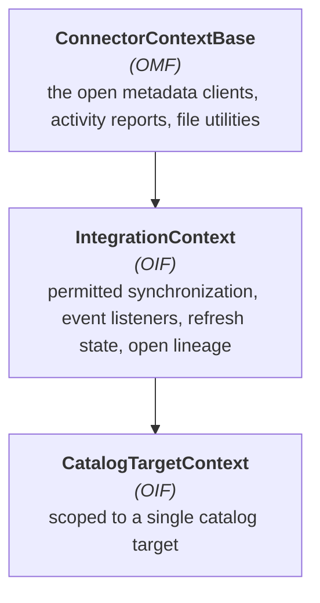

<!-- SPDX-License-Identifier: CC-BY-4.0 -->
<!-- Copyright Contributors to the Egeria project. -->

# The integration context

The *integration context* is the integration connector's gateway into the open metadata ecosystem.  It is created by the [integration daemon](/concepts/integration-daemon) and passed to the connector through the `setContext()` method before `start()` is called.  Your code accesses it through the `integrationContext` variable.

```java
    integrationContext.getAssetClient(OpenMetadataType.TOPIC.typeName);
```

!!! attention "The context replaces the integration services"
    Earlier releases supplied a different context for each *Open Metadata Integration Service (OMIS)*, and the connector developer had to choose the service - and therefore the context interface - that best matched the technology they were integrating.  A connector that catalogued both files and databases had a problem.
    
    There is now a single context, defined by the [Open Integration Framework (OIF)](/frameworks/oif/overview), and every function is available to every connector.  There is no `getContext()` method; use the `integrationContext` variable directly.

## The class hierarchy



`ConnectorContextBase` is shared with the [survey action services](/guides/developer/survey-action-services/overview) and [governance action services](/guides/developer/governance-action-services/overview), so the way you work with open metadata is the same wherever your code runs.

Each [catalog target](/concepts/catalog-target) processor is given its own `CatalogTargetContext`.  It behaves identically, but it is pre-configured with the metadata source (external metadata collection) and permitted synchronization of its particular target, so metadata created through it is automatically attributed to the right place.

## The open metadata clients

The context supplies a client for each category of open metadata element.  Each client is retrieved with a `getXXXClient()` method:

```java
        AssetClient              assetClient              = integrationContext.getAssetClient(OpenMetadataType.TOPIC.typeName);
        SoftwareCapabilityClient softwareCapabilityClient = integrationContext.getSoftwareCapabilityClient(OpenMetadataType.EVENT_BROKER.typeName);
        CollectionClient         collectionClient         = integrationContext.getCollectionClient(OpenMetadataType.DATA_HUB.typeName);
        GlossaryTermClient       glossaryTermClient       = integrationContext.getGlossaryTermClient();
```

Most `getXXXClient()` methods have an overload that takes an open metadata type name.  Passing the specific type - for example `Topic` rather than the default `Asset` - means that new elements are created with that type and queries are restricted to it.

There are clients for assets, software capabilities, collections, connections, connector types, endpoints, schema types, schema attributes, data fields, data structures, glossary terms, governance definitions, information supply chains, lineage, locations, projects, communities, actor profiles, actor roles, user identities, external references, external identifiers, valid values, annotations, note logs, comments, ratings, likes, informal tags, search keywords, context events, design patterns, perspectives, solution components, property facets and more.  The [`ConnectorContextBase` :material-github:](https://github.com/odpi/egeria/blob/main/open-metadata-implementation/frameworks/open-metadata-framework/src/main/java/org/odpi/openmetadata/frameworks/openmetadata/connectorcontext/ConnectorContextBase.java){ target=gh } javadoc lists them all.

Two general purpose clients complete the set:

* `getOpenMetadataStore()` returns the generic [`OpenMetadataStore`](/frameworks/omf/overview) for working with elements of any type through the generic properties interface.
* `getClassificationExplorerClient()` finds elements by their classifications - for example, all the elements in a given metadata collection.

### Options objects

Every client method takes an *options* object that carries the qualifiers for the request - paging, effective time, as-of time, governance zone filters, sequencing order, whether the request is for lineage or duplicate processing, and the metadata source to attribute the change to.  Each client can build a correctly defaulted options object for you:

| Method | Used for |
|---|---|
| `getGetOptions()` | retrieving a single element by GUID |
| `getQueryOptions(startFrom, pageSize)` | retrieving lists of elements |
| `getSearchOptions(startFrom, pageSize)` | `find...` methods that take a search string |
| `getMetadataSourceOptions()` | creating elements with the correct external provenance |
| `getMakeAnchorOptions(makeAnchor)` | attaching a new element to an anchor |
| `getUpdateOptions(mergeUpdate)` | updating an element |
| `getDeleteOptions(cascadedDelete)` | deleting an element |

Defaults that apply to every request from a client can be set once - `setForLineage()`, `setForDuplicateProcessing()`, `setEffectiveTimeDefault()`, `setAsOfTimeDefault()`, `setGovernanceZonesFilterDefault()`, `setSequencingOrderDefault()` and `setLimitResultsByStatusDefault()`.

### Controlling visibility

`publishElement()` and `withdrawElement()` change an asset's [governance zone](/features/governance-zoning/overview) membership so that it becomes visible, or is hidden from, the consumers of the catalog.  This lets a connector catalog an asset fully before making it visible.

## Working with the third party technology

`getConnectedAssetContext().getConnectorForAsset(assetGUID, auditLog)` creates a [digital resource connector](/concepts/digital-resource-connector) from the connection attached to an asset in open metadata.  This is how a connector calls the technology it is cataloguing without having to know its credentials - they are held in the asset's connection, often through an embedded secrets store connector.

For a connector that supports [catalog targets](/guides/developer/integration-connectors/catalog-targets), the framework has already done this: the resource connector for the target asset is available from `getConnectorToTarget()` on the catalog target processor.

## Controlling what is exchanged

* `getPermittedSynchronization()` returns the direction that metadata is allowed to flow for this connector or catalog target - `FROM_THIRD_PARTY`, `TO_THIRD_PARTY`, `BOTH_DIRECTIONS` or `OTHER`.  Check it before writing to either side.
* `elementShouldBeCatalogued(elementName, excludedNames, includedNames)` applies the standard include/exclude list semantics used by Egeria's connectors, so that operators get consistent behaviour.  The include list takes precedence over the exclude list.
* `getMetadataSourceQualifiedName()` and `getMetadataSourceGUID()` identify the [software capability](/concepts/software-capability) that owns the [metadata collection](/concepts/metadata-collection) the connector is maintaining.  When these are set, new elements are created with [external metadata provenance](/features/metadata-provenance/overview), which stops other tools from changing them.
* `getIntegrationConnectorGUID()` returns the unique identifier of the *IntegrationConnector* element that describes this running connector - needed if the connector wants to manage its own [catalog targets](/guides/developer/integration-connectors/self-registering-integration-connectors).
* `getMaxPageSize()` returns the largest number of results the server will return, for paging loops.

## Listening for open metadata events

```java
        if (integrationContext.noListenerRegistered())
        {
            integrationContext.registerListener(this);
        }
```

The listener implements [`OpenMetadataEventListener`](https://odpi.github.io/egeria/org/odpi/openmetadata/frameworks/openmetadata/events/OpenMetadataEventListener.html) and receives [`OpenMetadataOutTopicEvent`](https://odpi.github.io/egeria/org/odpi/openmetadata/frameworks/openmetadata/events/OpenMetadataOutTopicEvent.html) objects.

`noRefreshInProgress()` tells the listener whether the connector is part-way through a `refresh()`.  Many of the events arriving during a refresh are caused by the connector's own updates, so ignoring events at this time avoids processing the same element twice:

```java
    @Override
    public void processEvent(OpenMetadataOutTopicEvent event)
    {
        if (integrationContext.noRefreshInProgress())
        {
            :
        }
    }
```

Connectors that extend `DynamicIntegrationConnectorBase` get all of this for free - see [processing events for a catalog target](/guides/developer/integration-connectors/catalog-targets/#processing-events-for-a-catalog-target).

## Refresh scheduling

* `getRefreshStartTime()` - when the current refresh began.
* `getNextScheduledRefreshTime()` - the earliest time the next refresh will run (null if refresh is only driven by explicit requests).
* `getMinMinutesBetweenRefresh()` - the configured interval.

These are useful for deciding how much work to attempt in one pass, and for writing meaningful audit log messages.

## Integration iterators

Comparing a large third party inventory with open metadata, page by page, is fiddly and easy to get wrong.  The OIF provides *integration iterators* to do it:

* [`MetadataCollectionIterator` :material-github:](https://github.com/odpi/egeria/blob/main/open-metadata-implementation/frameworks/open-integration-framework/src/main/java/org/odpi/openmetadata/frameworks/integration/iterator/MetadataCollectionIterator.java){ target=gh } walks every element of a particular type within a metadata collection.
* [`RelatedElementsIterator` :material-github:](https://github.com/odpi/egeria/blob/main/open-metadata-implementation/frameworks/open-integration-framework/src/main/java/org/odpi/openmetadata/frameworks/integration/iterator/RelatedElementsIterator.java){ target=gh } walks the elements related to a particular element.

Each call to `getNextMember()` returns a `MemberElement`.  Ask it what to do with `getMemberAction()`, passing the creation and update times of the equivalent element in the third party technology.  It returns a `MemberAction` value - `CREATE_INSTANCE_IN_OPEN_METADATA`, `UPDATE_INSTANCE_IN_OPEN_METADATA`, `DELETE_INSTANCE_IN_OPEN_METADATA`, the three equivalents for the third party technology, or `NO_ACTION` - taking the permitted synchronization and the relative ages of the two copies into account.  `getMemberByQualifiedName()` looks up a specific element, and `moreToReceive()` controls the loop.

## External identifiers

Where the third party technology's identifiers cannot be folded into the `qualifiedName`, use `getExternalIdClient()` to attach [external identifiers](/features/external-identifiers/overview) to the open metadata elements.  As well as creating and linking them, `confirmSynchronization()` records that a particular element was checked against the third party technology on this pass, which supports the reporting of stale metadata.

## Reporting activity

The context assembles a [connector activity report](/concepts/integration-report) describing the elements that the connector created, updated and deleted.  The clients call `reportElementCreation()`, `reportElementUpdate()` and `reportElementDelete()` for you as changes are made; the integration daemon calls `startRecording()` before each refresh and publishes the report afterwards.

* `setActiveReportPublishing(flag)` turns report writing off and on - useful during a bulk load.
* `publishReport()` writes a report at a point of your choosing.

## Raising issues for people

An integration connector often finds things that need a person's attention.  Rather than only writing an audit log message, it can create open metadata that appears in the user interfaces:

* `createIncidentReport()` raises an [incident report](/features/incident-reporting/overview).
* `openToDo()` creates a *To Do* assigned to a person or role.
* `createNoteLogEntry()` adds an entry to a note log.
* `registerContextEvent()` records a significant event - a release, an outage, an unexpected change - against the elements it affects.
* `getNotificationManager()` returns the client for managing notification subscriptions.

## Initiating governance

* `getStewardshipAction()` returns a client that can `initiateEngineAction()`, `initiateGovernanceActionType()` and `initiateGovernanceActionProcess()`, so a connector can hand work over to a [governance action service](/concepts/governance-action-service) - for example, to survey a newly discovered database.
* `createProcessFromGovernanceActionType()` and `createGovernanceActionProcess()` build new governance processes.
* `getOpenGovernanceClient()` provides the full [Open Governance Framework](/frameworks/ogf/overview) interface.

## Open lineage

Connectors that handle [open lineage](/features/lineage-management/overview) events use `registerOpenLineageListener()` to receive them and `publishOpenLineageRunEvent()` to distribute them to the registered listeners.  This is how the OpenLineage receiver and the OpenLineage log store connectors work together inside one integration daemon.

## Utilities

* `getFileClassifier(fileSystemName, canonicalMountPoint, localMountPoint)` returns a `FileClassifier` that uses Egeria's reference data to work out the type, encoding and deployed implementation type of a file.
* `registerDirectoryListener()` and `registerDirectoryTreeListener()` (with matching `unregister...` methods) call your listener whenever a file is created, changed or deleted under a directory.  This avoids the connector having to poll the file system, and avoids it creating its own threads.
* `isTypeOf()` tests whether an element header is of - or inherits from - a named open metadata type.
* `getAnchorGUID()` returns the anchor element for an element, from its *Anchors* classification.
* The name case converters translate between the canonical format used by open metadata (`My Table Name`) and the conventions used by third party technologies: `fromCanonicalToSnakeCase()`, `fromSnakeToCanonicalCase()`, `fromCanonicalToCamelCase()`, `fromCamelToCanonicalCase()`, `fromCanonicalToKebabCase()` and `fromKebabToCanonicalCase()`.

## Shutdown

Once the connector has been disconnected, the context is no longer valid, and calls to it throw `UserNotAuthorizedException`.  Long-running loops should call `integrationContext.validateIsActive(methodName)` periodically so that they stop promptly when the integration daemon is shutting down.

??? education "Further information"
    - [Open Integration Framework (OIF)](/frameworks/oif/overview)
    - [Open Metadata Framework (OMF)](/frameworks/omf/overview)
    - [Supporting catalog targets](/guides/developer/integration-connectors/catalog-targets)

--8<-- "snippets/abbr.md"
