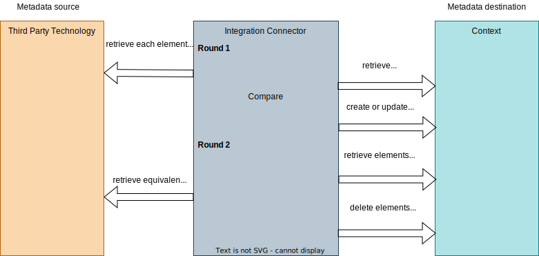
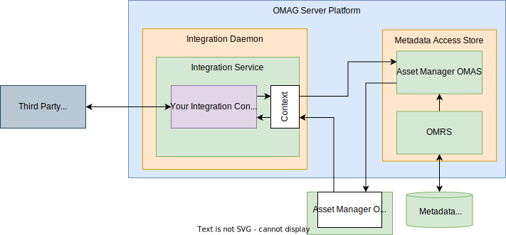

<!-- SPDX-License-Identifier: CC-BY-4.0 -->
<!-- Copyright Contributors to the Egeria project 2020. -->

# Building Integration Connectors

---8<-- "snippets/connectors/integration-connector-intro.md"

The purpose of the integration daemon and its integration services is to minimise the effort required to integrate a third party technology into the open metadata ecosystem.  They handle:

* Management of configuration - including user security information.
* Starting and stopping of your integration logic.
* Thread management and polling.
* Access to the open metadata repositories for query and maintenance of open metadata.
* Ability to write to audit log and maintain measurements for performance metrics.
* Metadata provenance.

This means you can focus on interacting with the third party technology and mapping its metadata to open metadata in your integration connector.


## Integration connector interface

---8<-- "docs/guides/developer/integration-connectors/integration-connector-interface.md"


## Designing your integration connector

There are five main design decisions to make before you start coding:

* How is the work of the connector triggered - explicitly through the connection object contents or by listening for events from either the third party technology or open metadata?
* Which direction the metadata synchronization is going.  Is the third party technology the source of metadata or is metadata the open metadata ecosystem being pushed to the third party technology?  
* How are elements from the third party technology mapped to and correlated with the elements in open metadata.
* If the third party technology is the source, should the metadata created in the open metadata ecosystem be read-only so that it can not be changed by other tools.  This is achieved using [External source metadata provenance](/features/metadata-provenance/overview).
* How is the third party technology to be called?  Ideally, your 

### Three patterns for connections

Your integration connector is created and initialized with a connection object.  This connection object should contain all the configuration needed by your integration connector.  For example, it may contain configuration properties that can control the behavior of your connector.  When connecting to the third party technology, optional userId and password for the third party technology may be stored in the connection along with endpoint information that defines the network address of its deployment.


> An explicit endpoint is added to the integration connector's connection in its configuration to provide information on the network location of the third party technology.  This is used to initialize the client libraries needed to call the third party technology.


> If no endpoint is configured in the integration connector's connection, the endpoint information can be retrieved from open metadata by calling the context object and/or listening for notifications from the partner OMAS.

An alternative approach to calling the third party technology directly in your integration connector is to use one or more appropriate [digital resource connectors](/concepts/digital-resource-connectors) to call the third party technology.  The connection objects for these digital resource connectors are embedded in the connection object for the integration connector.  


> A [Virtual Connection](/concepts/connection/#virtual-connections) is a special type of connection that allows connections for different connectors to be embedded.  This style of connection can be used by an integration connector that is making use of digital resource connectors to call its third party technology.  Typically, there is only one embedded connection, but multiple embedded connections can be used.  Also, the embedded connections themselves may be virtual connections.

Embedding a digital resource connector in an integration connector is an ideal approach for working with any third party technology that is being catalogued as assets:

* Consumers of the digital resources in the third party technology need a digital resource connector to access the content of the digital resource.  It may be possible to use the same digital resource connector in the integration connector.
* Often, the integration connector is not the only connector that is accessing a particular third party technology.  There may be [open discovery services](/concepts/open-discovery-service) and [governance action services](/concepts/governance-action-service) that also need to access the third party technology once the integration connector has run to create the basic technical metadata.

For example, Egeria has a JDBC digital resource connector for accessing databases.   It can be used by consumers of databases as well as various governance connectors that are cataloguing and managing databases.


When the digital resource connectors are defined in a virtual connection (rather than being initialized in the integration connector logic), the integration daemon can manage the lifecycle of the embedded connectors with the lifecycle of the integration connectors, reducing the chances of memory leaks and held resources as the connectors/integration services/integration daemon are restarted over the lifetime of their hosting OMAG Server Platform.

This pattern is not always possible if the integration connector needs to use a different interface to access the third party technology's metadata from its resources.  For example, the [Kafka Monitor Integration Connector](/connectors/integration/kafka-monitor-integration-connector), which detects the creation of new Kafka Topics and catalogues them in open metadata, does not use the [Kafka Open Metadata Topic Connector](/connectors/resource/kafka-open-metadata-topic-connector) because it uses a different Apache Kafka interface to do its work.

### Metadata flow for your connector

The `refresh` method of your connector is called periodically to ensure the metadata in the third party technology is consistent with the metadata in the open metadata ecosystem.  It operates in two phases:

1. Retrieving metadata from the source and ensuring the equivalent metadata is present in the metadata destination.

2. Retrieving metadata from the destination and deleting any elements that are not present in the source.


> When the third party technology is the metadata source (for example, it is a relational database or a file system) the refresh method ensures that the open metadata in Egeria is exactly the same as the metadata in the third party technology.


> When the open metadata ecosystem is the metadata source and the integration connector is responsible for distributing a subset of the open metadata to the third party technology, the refresh method ensures this subset (and no more) is present in the third party technology.

### Mapping the third party technology to open metadata

Your integration connector needs to be able to map between the elements in the third party technology and in the open metadata ecosystem.  Each will use different unique identifiers that it is unlikely that you can control.  Design the `qualifiedName` of the open metadata elements to be constructable from the identifier of the equivalent metadata element in the third party technology.

??? tip "What if there is not a one-to-one correspondence between elements"
    The [Catalog Integrator OMIS](/services/omis/catalog-integrator/overview) supports [external identifiers](/features/external-identifiers/overview) which can help to correlate complex relationships between the third party technology and open metadata.
    
## Controlling external source metadata provenance

The [configuration for an integration connector](/guides/admin/servers/by-server-type/configuring-an-integration-daemon) in the Integration Daemon includes a *metadataSourceQualifiedName*.  The default value is null which means store the metadata in any [metadata collection](/concepts/metadata-collection) that is owned by the locally connected cohorts.  Alternatively, it specifies the [qualifiedName](/concepts/referenceable) of a [software capability](/concepts/software-capability) entity that represents the third party technology.   This is automatically catalogued by the integration daemon if it is not found in the open metadata ecosystem.  The guid and qualifiedName of this entity is used to identify the [external metadata collection](/concepts/metadata-collection) that any open metadata elements created by the integration connector will be stored in.  This prevents processes other than the integration connector from modifying the metadata elements.

Some integration services allow the integration connector code to control which metadata collection to use if the *metadataSourceQualifiedName* is configured.  If it is set to true, the external metadata collection is used, otherwise it is one of the local cohort's collection.

| Integration Service | Method to control external source metadata provenance                                                                                         |
|---|-----------------------------------------------------------------------------------------------------------------------------------------------|
| [API Integrator OMIS](/services/omis/api-integrator/overview) | Call `setAPIManagerIsHome()` method to set toggle. Default is `true`, which means external provenance is used if it is configured.            |
| [Catalog Integrator OMIS](/services/omis/catalog-integrator/overview) | Use `assetManagerIsHome` property on method calls.                                                                                            |
| [Database Integrator OMIS](/services/omis/database-integrator/overview) | External source metadata provenance is controlled by the configuration only.                                                                  |
| [Display Integrator OMIS](/services/omis/display-integrator/overview) | Call `setApplicationIsHome()` to set toggle.  Default is `true`, which means external provenance is used if it is configured.                 |
| [Files Integrator OMIS](/services/omis/files-integrator/overview) | External source metadata provenance is controlled by the configuration.                                                                       |
| [Infrastructure Integrator OMIS](/services/omis/infrastructure-integrator/overview) | Call `setInfrastructureManagerIsHome()` method to set toggle. Default is `true`, which means external provenance is used if it is configured. |
| [Lineage Integrator OMIS](/services/omis/lineage-integrator/overview) | Use `assetManagerIsHome` property on method calls.                                                                                            |
| [Organization Integrator OMIS](/services/omis/organization-integrator/overview) | External source metadata provenance is controlled by the configuration only.                                                                  |
| [Security Integrator OMIS](/services/omis/security-integrator/overview)  | External source metadata provenance is controlled by the configuration only.                                                                  |
| [Topic Integrator OMIS](/services/omis/topic-integrator/overview) | Call `setEventBrokerIsHome()` method to set toggle. Default is `true`, which means external provenance is used if it is configured.                                                                        |


## Writing the connector provider

---8<-- "docs/guides/developer/connector-provider-intro.md"

---8<-- "docs/guides/developer/integration-connectors/implementing-an-integration-connector-provider.md"


!!! example "Example: connector provider for the Kafka Monitor Integration Connector"
    For example, the [`KafkaMonitorIntegrationProvider` :material-github:](https://github.com/odpi/egeria/blob/main/open-metadata-implementation/adapters/open-connectors/integration-connectors/kafka-integration-connector/src/main/java/org/odpi/openmetadata/adapters/connectors/integration/kafka/KafkaMonitorIntegrationProvider.java){ target=gh } is used to instantiate connectors that are monitoring an Apache Kafka broker. Therefore, its name and description refer to Kafka, and the connectors it instantiates are of type [`KafkaMonitorIntegrationConnector :material-github:](https://github.com/odpi/egeria/blob/main/open-metadata-implementation/adapters/open-connectors/integration-connectors/kafka-integration-connector/src/main/java/org/odpi/openmetadata/adapters/connectors/integration/kafka/KafkaMonitorIntegrationConnector.java){ target=gh }.

## Writing the connector

The connector extends the [appropriate integration connector interface](#integration-connector-interface) and has a default constructor:

```java
public class MyIntegrationConnector extends FilesIntegratorConnector
{

    /**
     * Default constructor used by the connector provider.
     */
    public MyIntegrationConnector()
    {
        super();
    }

}


```

### Accessing configuration properties and the endpoint

The connection object is stored in the `connectionProperties` instance variable defined by the super class.  It is typically accessed in the `start()` method. The code snippet below accesses the endpoint and configuration properties from the connection.  It also uses the audit log to record a start-up message

```java
    /**
     * Indicates that the connector is completely configured and can begin processing.
     * This call can be used to register with non-blocking services.
     *
     * @throws ConnectorCheckedException there is a problem within the connector.
     */
    @Override
    public void start() throws ConnectorCheckedException
    {
        super.start();

        final String methodName = "start";

        /*
         * Extract the configuration
         */
        EndpointProperties  endpoint = connectionProperties.getEndpoint();

        if (endpoint != null)
        {
            myEndpoint = endpoint.getAddress();
        }

        Map<String, Object> configurationProperties = connectionProperties.getConfigurationProperties();

        if (configurationProperties != null)
        {
            :
        }

        /*
         * Record the configuration
         */
        if (auditLog != null)
        {
            auditLog.logMessage(methodName,
                                MyConnectorsAuditCode.CONNECTOR_CONFIGURATION.getMessageDefinition(connectorName,myEndpoint));
        }

        :
    }


```

### Accessing context

The context is retrieved using the `getContext()` method.   This is a synchronized method that can be called from multiple threads, that occurs when the connector is using listeners.

### Registering a listener with open metadata

An integration connector that is listening for events from the open metadata ecosystem should implement the listener interface for the associated access service.  This interface has a `processEvent()` method that your connector implements.  


| Integration Service                                                                 | Partner OMAS                                                        | Listener Interface                                                                                                                                          |
|-------------------------------------------------------------------------------------|---------------------------------------------------------------------|-------------------------------------------------------------------------------------------------------------------------------------------------------------|
| [API Integrator OMIS](/services/omis/api-integrator/overview)                       | [Data Manager OMAS](/services/omas/data-manager/overview)           | [DataManagerEventListener](https://odpi.github.io/egeria/org/odpi/openmetadata/accessservices/datamanager/api/DataManagerEventListener.html)                |
| [Catalog Integrator OMIS](/services/omis/catalog-integrator/overview)               | [Asset Manager OMAS](/services/omas/asset-manager/overview)         | [AssetManagerEventListener](https://odpi.github.io/egeria/org/odpi/openmetadata/accessservices/assetmanager/api/AssetManagerEventListener.html)             |
| [Database Integrator OMIS](/services/omis/database-integrator/overview)             | [Data Manager OMAS](/services/omas/data-manager/overview)           | [DataManagerEventListener](https://odpi.github.io/egeria/org/odpi/openmetadata/accessservices/datamanager/api/DataManagerEventListener.html)                |
| [Display Integrator OMIS](/services/omis/display-integrator/overview)               | [Data Manager OMAS](/services/omas/data-manager/overview)           | [DataManagerEventListener](https://odpi.github.io/egeria/org/odpi/openmetadata/accessservices/datamanager/api/DataManagerEventListener.html)                |
| [Files Integrator OMIS](/services/omis/files-integrator/overview)                   | [Data Manager OMAS](/services/omas/data-manager/overview)           | [DataManagerEventListener](https://odpi.github.io/egeria/org/odpi/openmetadata/accessservices/datamanager/api/DataManagerEventListener.html)                |
| [Infrastructure Integrator OMIS](/services/omis/infrastructure-integrator/overview) | [IT infrastructure OMAS](/services/omas/it-infrastructure/overview) | [ITInfrastructureEventListener](https://odpi.github.io/egeria/org/odpi/openmetadata/accessservices/itinfrastructure/api/ITInfrastructureEventListener.html) |
| [Lineage Integrator OMIS](/services/omis/lineage-integrator/overview)               | [Asset Manager OMAS](/services/omas/asset-manager/overview)         | [AssetManagerEventListener](https://odpi.github.io/egeria/org/odpi/openmetadata/accessservices/assetmanager/api/AssetManagerEventListener.html)             |
| [Organization Integrator OMIS](/services/omis/organization-integrator/overview)     | [Community Profile OMAS](/services/omas/community-profile/overview) | [CommunityProfileEventListener](https://odpi.github.io/egeria/org/odpi/openmetadata/accessservices/communityprofile/api/CommunityProfileEventListener.html) |
| [Security Integrator OMIS](/services/omis/security-integrator/overview)             | [Security Manager OMAS](/services/omas/security-manager/overview)   | [SecurityManagerEventListener](https://odpi.github.io/egeria/org/odpi/openmetadata/accessservices/securitymanager/api/SecurityManagerEventListener.html)    |
| [Topic Integrator OMIS](/services/omis/topic-integrator/overview)                   | [Data Manager OMAS](/services/omas/data-manager/overview)           | [DataManagerEventListener](https://odpi.github.io/egeria/org/odpi/openmetadata/accessservices/datamanager/api/DataManagerEventListener.html)                |

Your integration connector registers itself as a listener in the `start()` method, and the `processEvent()` method is called each time an event occurs.   The event type passed on `processEvent()` depends on the OMIS that the connector is using.  In the example, the event type comes from [Asset Manager OMAS](/services/omas/asset-manager/overview) so the connector is either using the [Catalog Integrator OMAS](/servifes/omis/catalog-integrator/overview) or [Lineage Integrator OMIS](/services/omis/lineage-integrator/overview).

```java
    /**
     * Indicates that the connector is completely configured and can begin processing.
     *
     * @throws ConnectorCheckedException there is a problem within the connector.
     */
    @Override
    public synchronized void start() throws ConnectorCheckedException
    {
        super.start();

        :
        :
                                
        myContext = super.getContext();

        if (myContext != null)
        {
                myContext.registerListener(this);
        }
    }

     /**
      * Process an event that was published by the Asset Manager OMAS.  This connector is only interested in
      * glossaries, glossary categories and glossary terms.   The listener is only registered if metadata is flowing
      * from the open metadata ecosystem to Apache Atlas.
      *
      * @param event event object
      */
     @Override
     public void processEvent(AssetManagerOutTopicEvent event)
     {
        /*
         * Only process events if refresh() is not running because the refresh() process creates lots of events and
         * proceeding with event processing at this time causes elements to be processed multiple times.
         */
        if (! myContext.isRefreshInProgress())
        {
        ...
        }
     }

```
The `isRefreshInProgress()` call is used to ensure this connector ignores events while its `refresh()` is being called.  For many connectors, many of the events created during this time are caused by the connector's own activity.  Therefore, ignoring events at this time can avoid processing elements multiple times.

### Working with the third party technology

Ideally your integration connector should use an embedded [digital resource connector](/concepts/digital-resource-connector).  This is configured as an *embedded connection* in the VirtualConnection used to configure the integration connector.  When the integration connector is initialized, the embedded connections are used to create the embedded connectors.  They can be accessed via the *embeddedConnectors* variable.  As an example, here is the `start()` method from the [OpenLineage Event Receiver Integration Connector](/connectors/integration/open-lineage-event-receiver-integration-connector) which uses an embedded [Open Metadata Topic Connector](/concepts/open-metadata-topic-connector) to access an event source:

```java

    private final Map<String, OpenMetadataTopicConnector> topicConnectors = new HashMap<>();

    /**
     * Indicates that the connector is completely configured and can begin processing.
     * This call can be used to register with non-blocking services.
     *
     * @throws ConnectorCheckedException there is a problem within the connector.
     */
    @Override
    public void start() throws ConnectorCheckedException
    {
        super.start();

        final String methodName = "start";

        myContext = super.getContext();

        if (myContext != null)
        {
            if (embeddedConnectors != null)
            {
                for (Connector embeddedConnector : embeddedConnectors)
                {
                    if (embeddedConnector instanceof OpenMetadataTopicConnector)
                    {
                        /*
                         * Register this connector as a listener of the event bus connector.
                         */
                        OpenMetadataTopicConnector topicConnector = (OpenMetadataTopicConnector)embeddedConnector;
                        topicConnector.registerListener(this);

                        ConnectionProperties connectionProperties = topicConnector.getConnection();

                        if (connectionProperties != null)
                        {
                            EndpointProperties endpoint = connectionProperties.getEndpoint();

                            if (endpoint != null)
                            {
                                topicConnectors.put(endpoint.getAddress(), topicConnector);
                            }
                        }
                    }
                }
            }

            for (String topicName : topicConnectors.keySet())
            {
                OpenMetadataTopicConnector topicConnector = topicConnectors.get(topicName);
                ConnectionProperties       topicConnection = topicConnector.getConnection();

                /*
                 * Record the configuration
                 */
                if (auditLog != null)
                {
                    auditLog.logMessage(methodName,
                                        OpenLineageIntegrationConnectorAuditCode.KAFKA_RECEIVER_CONFIGURATION.getMessageDefinition(connectorName,
                                                                                                                                   topicName,
                                                                                                                                   topicConnection.getConnectionName()));
                }

                topicConnector.start();
            }
        }
    }


```
Notice that *embeddedConnectors* is a list, since multiple connectors can be embedded.  The integration connector ignores any embedded connectors that are not *OpenMetadataTopicConnectors*.

The [OpenLineage Event Receiver Integration Connector](/connectors/integration/open-lineage-event-receiver-integration-connector) also demonstrates how the register a listener with an [Open Metadata Topic Connector](/concepts/open metadata-topic-connector) to receive events from an event broker such as [Apache Kafka](https://kafka.apache.org/).

The integration connector implements [OpenMetadataTopicListener](https://odpi.github.io/egeria/org/odpi/openmetadata/repositoryservices/connectors/openmetadatatopic/OpenMetadataTopicListener.html).

```java
public class OpenLineageEventReceiverIntegrationConnector extends LineageIntegratorConnector implements OpenMetadataTopicListener
{
    :

    /**
     * Method to pass an event received on topic.
     *
     * @param event inbound event
     */
    public void processEvent(String event)
    {
        :
    }
}
```
It then retrieves the embedded Open Metadata Topic Connector from the `embeddedConnectors` and calls `registerListener(this)` followed by  in its `start()` method.

```java
     topicConnector.registerListener(this);
     :
     topicConnector.start();
```
Once `topicConnector.start()` is called, the integration connector will receive events from Apache Kafka.

!!! attention "Do not create threads in your integration connector"
    Each integration connector runs in its own thread. Integration connectors should not create additional threads because this makes it difficult for Egeria to properly shut down the integration daemon independently of the OMAG Server Platform.
    If the connector needs to make blocking calls to the third party technology, it should implement the `engage()` method and set the `usesBlockingCalls` property in the integration daemon configuration to `true`. When the `engage()` method is called on the thread, it should issue one blocking call and return.  The integration daemon will check that it is not in shutdown and if it is still running, it calls `engage()` again.

### Exceptions and error handling

The methods of the integration connector are able to throw `ConnectorCheckedException` to indicate there is a problem.  If your integration connector throws such an exception, the integration daemon switches it to `FAILED` status, and it is not called again until either the connector is restarted by the operator or the integration daemon is restarted.  Therefore, when your integration connector discovers a problem, it can either just return from the method in the hope the problem is resolved by the next time it is called, or it can throw an exception.  In either case it should [log an audit log message](#audit-log-messages).  If the error needs an operator action to resolve it, throwing a `ConnectorCheckedException` exception means that the integration connector is not needlessly taking up resources when it can not operate.  This is important if multiple failures are occurring and the ecosystem is under stress.  However, throwing an exception for a temporary error that will resolve itself takes the integration connector offline unnecessarily and creates work for the operators.

The integration connector should only catch exceptions that inherit from `java.lang.Exception` since runtime exceptions are something that need to be handled by the broader runtime environment.

### Audit log messages

Audit log messages help the people operating Egeria to be sure your integration connector is not being called too frequently and is able to access all the resources it needs.  It is recommended that your integration connector outputs audit log messages in the following places:

* At the end of the `start()` method to confirm the resources and options it has been configured with.
* At the start and end of the `refresh()` method to show when it ran.  It is helpful to summarise the number of updates made to open metadata or the third party technology, so it is possible to judge if it is being called at the right frequency.
* At the end of the `disconnect()` method to confirm it has shutdown.
* If the integration connector detects an error.  This message should include the error information from the third party technology to aid diagnosis of the problem.

## Testing your connector

Your integration connector implementation should be built and packaged in a *jar* file.  This jar file contains your connector provider and connector implementation.  It may optionally contain any dependent client libraries to the third party connector that are called directly by your integration connector.  This is necessary if these client libraries are not available in their own jar file.

The connector jar file (and any jar files for the dependent third party client libraries not included in your connector's jar file) need to be added to the [OMAG Server Platform](/concepts/omag-server-platform) class path.  The easiest way to do this is to copy the JAR files into the `extra` directory of your OMAG Server Platform's [assembly](/education/tutorials/building-egeria-tutorial/overview).

Once you have installed the connector, configure it in the integration daemon, connected to a metadata access store.



Your connector is then able to start and exchange metadata.


## Documenting your connector

All connectors should be documented in some form of connector catalog to ensure they are easy for others to reuse.  If your connector is either part of Egeria, or available from a public download, you may advertise it in Egeria's [connector catalog](/connectors).

??? education "Further information"
    - [Open Connector Framework (OCF)](/frameworks/ocf/overview) that defines the behavior of all connectors.
    - [Configuring an integration daemon](/guides/admin/servers/by-server-type/configuring-an-integration-daemon) to understand how to set up an integration connector.
    - [Developer guide](/guides/developer) for more information on writing connectors.

--8<-- "snippets/abbr.md"
