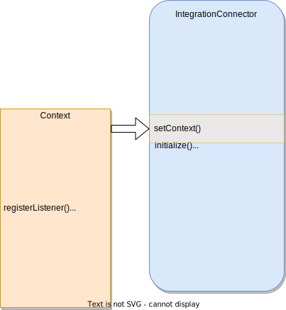
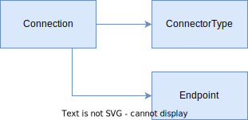

---
hide:
- toc
---

<!-- SPDX-License-Identifier: CC-BY-4.0 -->
<!-- Copyright Contributors to the Egeria project 2020. -->

# Building Integration Connectors

---8<-- "docs/connectors/integration/integration-connector-intro.md"

## Writing the connector provider

--8<-- "docs/guides/developer/connector-provider-into.md"

--8<-- "docs/guides/developer/implementing-a-connector-provider.md"

!!! example "Example: connector provider for the Kafka Monitor Integration Connector"
    For example, the [`KafkaMonitorIntegrationProvider` :material-github:](https://github.com/odpi/egeria/blob/master/open-metadata-implementation/adapters/open-connectors/integration-connectors/kafka-integration-connector/src/main/java/org/odpi/openmetadata/adapters/connectors/integration/kafka/KafkaMonitorIntegrationProvider.java){ target=gh } is used to instantiate connectors that are monitoring an Apache Kafka broker. Therefore, its name and description refer to Kafka, and the connectors it instantiates are of type [`KafkaMonitorIntegrationConnector :material-github:](https://github.com/odpi/egeria/blob/master/open-metadata-implementation/adapters/open-connectors/integration-connectors/kafka-integration-connector/src/main/java/org/odpi/openmetadata/adapters/connectors/integration/kafka/KafkaMonitorIntegrationConnector.java){ target=gh }.

## Integration connector interface

An integration connector can:

- Listen on a blocking call, waiting for the third party technology to send a notification.
- Register with an external notification service that sends notifications on its own thread.
- Register a listener with its context to act on notifications from the partner OMAS's [Out Topic](/egeria-docs/concepts/out-topic).
- Poll the third party technology each time that the `refresh()` method is called.

The [Open Metadata Integration Services (OMISs)](/egeria-docs/services/omis) each define the interface that an integration connector must implements if they are to run under that service.  The interfaces for each integration service is listed in the table below.

| Integration Service | Type of technology supported | Link to integration connector base class |
|---|---|---|
| Analytics Integrator OMIS | Data Assets and Glossary Terms | [`AnalyticsIntegratorConnector` :material-github:](https://github.com/odpi/egeria/tree/master/open-metadata-implementation/integration-services/analytics-integrator/analytics-integrator-api/src/main/java/org/odpi/openmetadata/integrationservices/analytics/connector){ target=gh } class. |
| API Integrator OMIS | API Schemas | [`APIIntegratorConnector` :material-github:](https://github.com/odpi/egeria/tree/master/open-metadata-implementation/integration-services/api-integrator/api-integrator-api/src/main/java/org/odpi/openmetadata/integrationservices/api/connector){ target=gh } class. |
| Catalog Integrator OMIS | Assets and related metadata found in an Asset Catalog | [`CatalogIntegratorConnector` :material-github:](https://github.com/odpi/egeria/tree/master/open-metadata-implementation/integration-services/catalog-integrator/catalog-integrator-api/src/main/java/org/odpi/openmetadata/integrationservices/catalog/connector){ target=gh } class. |
| Database Integrator OMIS | Databases and their schema | [`DatabaseIntegratorConnector` :material-github:](https://github.com/odpi/egeria/tree/master/open-metadata-implementation/integration-services/database-integrator/database-integrator-api/src/main/java/org/odpi/openmetadata/integrationservices/database/connector){ target=gh } class. |
| Display Integrator OMIS | Forms, reports and the queries they depend on | [`DisplayIntegratorConnector` :material-github:](https://github.com/odpi/egeria/tree/master/open-metadata-implementation/integration-services/display-integrator/display-integrator-api/src/main/java/org/odpi/openmetadata/integrationservices/display/connector){ target=gh } class. |
| Files Integrator OMIS | Files and their internal structure | [`FilesIntegratorConnector` :material-github:](https://github.com/odpi/egeria/tree/master/open-metadata-implementation/integration-services/files-integrator/files-integrator-api/src/main/java/org/odpi/openmetadata/integrationservices/files/connector){ target=gh } class. |
| Infrastructure Integrator OMIS | IT infrastructure landscape such as hosts, platforms and servers | [`InfrastructureIntegratorConnector` :material-github:](https://github.com/odpi/egeria/tree/master/open-metadata-implementation/integration-services/infrastructure-integrator/infrastructure-integrator-api/src/main/java/org/odpi/openmetadata/integrationservices/infrastructure/connector){ target=gh } class. |
| Lineage Integrator OMIS | Processes and their execution flow | [`LineageIntegratorConnector` :material-github:](https://github.com/odpi/egeria/tree/master/open-metadata-implementation/integration-services/lineage-integrator/lineage-integrator-api/src/main/java/org/odpi/openmetadata/integrationservices/lineage/connector){ target=gh } class. |
| Organization Integrator OMIS | People, teams, roles  and user identities | [`OrganizationIntegratorConnector` :material-github:](https://github.com/odpi/egeria/tree/master/open-metadata-implementation/integration-services/organization-integrator/organization-integrator-api/src/main/java/org/odpi/openmetadata/integrationservices/organization/connector){ target=gh } class. |
| Search Integrator OMIS | Content for search indexes relating to assets. | [`SearchIntegratorConnector` :material-github:](https://github.com/odpi/egeria/tree/master/open-metadata-implementation/integration-services/search-integrator/search-integrator-api/src/main/java/org/odpi/openmetadata/integrationservices/search/connector){ target=gh } class. |
| Security Integrator OMIS | Publishing information about users and resources. | [`SecurityIntegratorConnector` :material-github:](https://github.com/odpi/egeria/tree/master/open-metadata-implementation/integration-services/security-integrator/security-integrator-api/src/main/java/org/odpi/openmetadata/integrationservices/security/connector){ target=gh } class. |
| Topic Integrator OMIS | Event topics and the structure of the events they share. | [`TopicIntegratorConnector` :material-github:](https://github.com/odpi/egeria/tree/master/open-metadata-implementation/integration-services/topic-integrator/topic-integrator-api/src/main/java/org/odpi/openmetadata/integrationservices/topic/connector){ target=gh } class. |

All of these base classes define the shape of the context object that the integration connector uses to query and maintain open metadata. They also all inherit from (extend) the [`IntegrationConnectorBase` :material-github:](https://github.com/odpi/egeria/blob/master/open-metadata-implementation/governance-servers/integration-daemon-services/integration-daemon-services-api/src/main/java/org/odpi/openmetadata/governanceservers/integrationdaemonservices/connectors/IntegrationConnectorBase.java){ target=gh }.  This interface defines the lifecycle methods of the integration connector that are summarized in figure 1.

> **Figure 1:** Methods implemented by an integration connector

- `initialize` is a standard method for all connectors that is called by the [connector broker](/egeria-docs/concepts/connector-broker) when a request is made to create an instance of the connector. The connector broker uses the initialize method to pass the [connection](/egeria-docs/concepts/connection) object used to create the connector instance and a unique identifier for this instance of the connector.

- `setAuditLog` provides a [Audit Log Framework (ALF)](/egeria-docs/frameworks/alf/overview) compatible logging destination.

- `setConnectorName` provides the name of the connector from the configuration so it can be used for logging.

- `setContext` sets up the integration service specific context object. This provides an interface to the services of the OMAS that the integration service is paired with. Although the interfaces vary from integration service to integration service, they typically offer the following types of method call for each type of metadata it supports:

    - The ability to register a listener to receive events from the OMAS's [Out Topic](/egeria-docs/concepts/out-topic), or send events to the OMAS's [In Topic](/egeria-docs/concepts/in-topic).
    - The ability to create and update metadata instances.
    - For assets, the ability to change an asset's visibility by changing its zone membership using the `publish` and `withdraw` methods.
    - The ability to delete metadata.
    - Various retrieval methods to help when comparing the metadata in the open metadata repositories with the metadata in the third party technology.
    
- `start` indicates that the connector is completely configured and can begin processing. This call can be used to register with non-blocking services. For example, it can register a listener for events from the OMAS [Out Topic](/egeria-docs/concepts/out-topic) through the context.

- `engage` is used when the connector is configured to need to issue blocking calls to wait for new metadata. It is called from its own thread. It is recommended that the `engage()` method returns when each blocking call completes. The integration daemon will pause a second and then call `engage()` again. This pattern enables the calling thread to detect the shutdown of its hosting integration daemon server.

- `refresh` requests that the connector does a comparison of the metadata in the third party technology and open metadata repositories. Refresh is called:

    1. when the integration connector first starts and then
    1. at intervals defined in the connector's configuration as well as
    1. any external REST API calls to explicitly refresh the connector.
    
- `disconnect` is called when the server is shutting down. The connector should free up any resources that it holds since it is not needed any more.  Once disconnect has been called the context is no longer valid.

## Two approaches to designing the connections for an integration connector 

Figure 3 shows the approach used for a dedicated connector to a specific third party technology deployment.

> **Figure 3:** An explicit endpoint is added to the integration connector's connection in its configuration

Figure 4 shows the approach used to catalog all instances of a particular type of technology.

> **Figure 4:** No endpoint is configured in the integration connector's connection.

Location is determined from the endpoints that are stored in open metadata.  The connector registers a listener with the context and it listens for events relating to endpoint of the appropriate values.

An integration connector can choose to support one of these patterns or switch dynamically depending on the presence of the endpoint in the connector's configuration. 

??? education "Further information"
    - [Open Connector Framework (OCF)](/egeria-docs/frameworks/ocf/overview) that defines the behavior of all connectors.
    - [Configuring an integration daemon](/egeria-docs/guides/admin/servers/configuring-an-integration-daemon) to understand how to set up an integration connector.
    - [Developer guide](/egeria-docs/guides/developer) for more information on writing connectors.

--8<-- "snippets/abbr.md"
