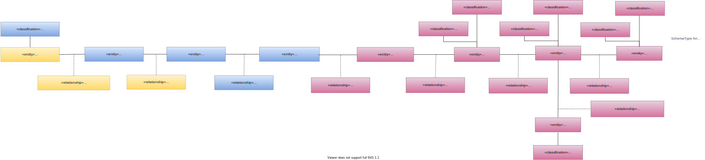

---
hide:
- toc
---

<!-- SPDX-License-Identifier: CC-BY-4.0 -->
<!-- Copyright Contributors to the Egeria project. -->

# Modelling Databases

Figure 1 shows the types of metadata that describe databases.

> **Figure 1:** Database metadata

The structure of a database schema consist of a number of database tables and database views.
The difference is that the database table has its values stored in the database whereas the
database view is a set of values that are derived from accessing other
database tables using a query.

The structure of both the database tables and database views are describes by database columns.

Database columns have a types that represent a single value.  This can be stored, or derived using a query.
If the column presents the unique for a row within the table, it can be decorated with the
[PrimaryKey](/types/5/0534-Relational-Schemas) classification.
If a column contains values that are the primary key of another table then the two columns can be linked using the
[ForeignKey](/types/5/0534-Relational-Schemas) relationship.

Figure 2 shows the open metadata types used to represent the metadata created through this service.

> **Figure 2:** Database open metadata types for databases

A database schema is represented using the
[DeployedDatabaseSchema](/types/2/0224-Databases) entity,
the database table is represented using the 
[RelationalTable](/types/5/0534-Relational-Schemas) entity
and the database column is represented using the 
[RelationalColumn](/types/5/0534-Relational-Schemas) entity.
A database view is a 
[RelationalTable](/types/5/0534-Relational-Schemas) entity
with the [Calculated Value](/types/5/0512-Derived-Schema-Elements)
classification attached.

If a DatabaseManager is defined, any Database created is automatically linked to it using the
[ServerAssetUse](/types/0/0045-Servers-and-Assets)
relationship.
When a DeployedDatabaseSchema is created for the Database,
the service automatically inserts the
[DataSetContent](/types/2/0210-Data-Stores) relationship.
(The database schema is a DataSet over the database which is a type of DataStore).

When a RelationalTable is created for the DeployedDatabaseSchema,
the service automatically inserts the
[Schema](/types/5/0503-Asset-Schema) relationship,
[RelationalDBSchemaType](/types/5/0534-Relational-Schemas) entity and
[AttributeForSchema](/types/5/0505-Schema-Attributes) relationship
in between the DeployedAPI entity and the RelationalTable entity.

The SchemaType for a RelationalTable is [RelationalTableType](/types/5/0534-Relational-Schemas).
The schema attributes for RelationalTable and RelationalColumn also use
the [TypeEmbeddedAttribute](/types/5/0505-Schema-Attributes)
classification [method for defining the schema type](/concepts/schema).

---8<-- "snippets/abbr.md"