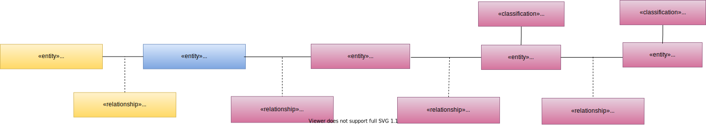
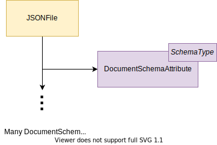

---
hide:
- toc
---

<!-- SPDX-License-Identifier: CC-BY-4.0 -->
<!-- Copyright Contributors to the Egeria project. -->

# Files Metadata

Files are modeled using subtypes of the [DataFile](/types/2/0220-Files-and-Folders)
and [FileFolder](/types/2/0220-Files-and-Folders) assets
along with descriptions of the structures of the data that they store.

Optionally, this metadata can be tied to an [FileSystem](/types/2/0220-Files-and-Folders)
or a [FileSystem](/types/2/0220-Files-and-Folders).

## CSV Files

Figure 1 shows the types of metadata for CSV files that integrators connectors can create with this integration service.

> **Figure 1:** CSV File metadata

The structure of a CSV file is made up of [TabularColumn](/types/5/0530-Tabular-Schemas)s.

Figure 2 shows the open metadata types used to represent the CSV File metadata created through this service.

> **Figure 2:** CSV file open metadata types

If a FileSystem or FileManager is defined, any CSVFile asset created is automatically linked to it using the
[ServerAssetUse](/types/0/0045-Servers-and-Assets)
relationship.
When a TabularColumn is created for the file,
the service automatically inserts the
[Schema](/types/5/0503-Asset-Schema) relationship,
[TabularSchemaType](/types/5/0530-Tabular-Schemas) entity and
[AttributeForSchema](/types/5/0505-Schema-Attributes) relationship
in between the file and the TabularColumn.

The tabular columns use
the [TypeEmbeddedAttribute](/types/5/0505-Schema-Attributes)
classification [method for defining the schema type](/concepts/schema).

## Avro Files

Figure 1 shows the types of metadata for Avro files that integrators connectors can create with this integration service.

> **Figure 1:** Avro File metadata

The structure of an Avro file is made up of nested [ObjectAttribute](/types/5/0532-Object-Schemas)s.

Figure 2 shows the open metadata types used to represent the Avro File metadata created through this service.

> **Figure 2:** Avro file open metadata types

If a FileSystem or FileManager is defined, any AvroFile asset created is automatically linked to it using the
[ServerAssetUse](/types/0/0045-Servers-and-Assets)
relationship.
When an ObjectAttribute is created for the file,
the service automatically inserts the
[Schema](/types/5/0503-Asset-Schema) relationship,
[ObjectSchemaType](/types/5/0532-Object-Schemas) entity and
[AttributeForSchema](/types/5/0505-Schema-Attributes) relationship
in between the file and the ObjectAttribute.

Any object attributes created through this interface will use the
[ObjectAttribute](/types/5/0532-Object-Schemas) subtype
to allow for find requests that only return schema information for object type schemas.  The schema attributes also use
the [TypeEmbeddedAttribute](/types/5/0505-Schema-Attributes)
classification [method for defining the schema type](/concepts/schema).

## JSON Files

Figure 1 shows the types of metadata for JSON files that integrators connectors can create with this integration service.

> **Figure 1:** JSON File metadata supported by the Files Integrator OMIS 

The structure of an JSON file is made up of nested [DocumentSchemaAttribute](/types/5/0531-Document-Schemas)s.

Figure 2 shows the open metadata types used to represent the JSON File metadata created through this service.

> **Figure 2:** JSON file open metadata types supported by the Files Integrator OMIS 

If a FileSystem or FileManager is defined, any JSONFile asset created is automatically linked to it using the
[ServerAssetUse](/types/0/0045-Servers-and-Assets)
relationship.
When a DocumentSchemaAttribute is created for the file,
the service automatically inserts the
[Schema](/types/5/0503-Asset-Schema) relationship,
[DocumentSchemaType](/types/5/0531-Document-Schemas) entity and
[AttributeForSchema](/types/5/0505-Schema-Attributes) relationship
in between the file and the ObjectAttribute.

Any object attributes created through this interface will use the
[DocumentSchemaAttribute](/types/5/0532-Object-Schemas) subtype
to allow for find requests that only return schema information for object type schemas.  The schema attributes also use
the [TypeEmbeddedAttribute](/types/5/0505-Schema-Attributes)
classification [method for defining the schema type](/concepts/schema).

--8<-- "snippets/abbr.md"