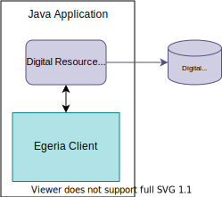

<!-- SPDX-License-Identifier: CC-BY-4.0 -->
<!-- Copyright Contributors to the ODPi Egeria project. -->

# Creating digital resource connectors

To write a resource connector you need to complete four steps:

1. Identify the properties for the [connection](/concepts/connection).
2. Write the [connector provider](/concepts/connector-provider).
3. Understand the interface that the connector needs to implement and the support provided by its base class.
4. Write the [connector](/concepts/connector) itself.

All the code you write to implement these should exist in its own module, and as illustrated by the examples could even be in its own independent code repository. Their implementation will have dependencies on Egeria's:

- [Open Connector Framework (OCF)](/frameworks/ocf/overview)
- [Audit Log Framework (ALF)](/frameworks/alf/overview)
- Specific interfaces used by the type of connector

!!! tip "No dependency on Egeria's OMAG Server Platform"
    Note that there is no dependency on Egeria's [OMAG Server Platform](/concepts/omag-server-platform) for these specific connector implementations: they could run in another runtime that supported the connector APIs.  In fact, even the Egeria interface modules should not be embedded in your jar file to allow your connector to run on any version of the OMAG Server Platform that supports your connector.

## Identify connection properties

Begin by identifying and designing the properties needed to connect to your tool or system. These will commonly include a network address, protocol, and user credentials, but could also include other information that can be stored in the configuration properties of the connection.

## Code the connector provider

--8<-- "docs/guides/developer/connector-provider-into.md"
--8<-- "docs/guides/developer/implemented-a-connector-provider.md"

!!! tip "Connectors implement Egeria interfaces, not vice versa"
    Note that the code of all of these connector implementations exists outside Egeria itself (in separate code repositories), and there are no direct dependencies within Egeria on these external repositories or connectors.

All connectors can be configured with the network address and credential information needed to access the underlying tool or system. Therefore, you do not need to explicitly list properties for such basic details. However, the names of any additional configuration properties that may be useful to a specific type of connector can be described through the `recognizedConfigurationProperties` of the connector type.

### Implementation pattern

- Extend a *connector provider* base class specific to your connector's interface.
- Define `static final` class members for the GUID, name, description and the names of any additional configuration properties.
- Write a single public constructor, with no parameters, that:
    - Calls `super.setConnectorClassName()` with the name of your connector class.
    - Creates a new `ConnectorType` object, sets it characteristics to the `static final` class members, and uses `.setConnectorProviderClassName()` to set the name of the connector provider class itself.
    - (Optional) Creates a list of additional configuration properties from the `static final` class members, and uses `.setRecognizedConfigurationProperties()` to add these to the connector type.
    - Sets `super.connectorTypeBean = connectorType`.

## Understand the connector interface

Now that you have the *connector provider* to instantiate your *connector*, you need to understand what your connector actually needs to do. For a service to use your connector, the connector must omplement the Open Connector Framework methods plus the specific API used to access the resource.

How would you know to extend these base classes? The *connector provider* implementations in the previous step each extended a base class specific to the type of connector they provide ([`DataEngineConnectorProviderBase` :material-github:](https://github.com/odpi/egeria/blob/main/open-metadata-implementation/governance-servers/data-engine-proxy-services/data-engine-proxy-connector/src/main/java/org/odpi/openmetadata/governanceservers/dataengineproxy/connectors/DataEngineConnectorProviderBase.java){ target=gh } and [`OMRSRepositoryConnectorProviderBase` :material-github:](https://github.com/odpi/egeria/blob/main/open-metadata-implementation/repository-services/repository-services-apis/src/main/java/org/odpi/openmetadata/repositoryservices/connectors/stores/metadatacollectionstore/repositoryconnector/OMRSRepositoryConnectorProviderBase.java){ target=gh }). These *connector* base classes ([`DataEngineConnectorBase` :material-github:](https://github.com/odpi/egeria/blob/main/open-metadata-implementation/governance-servers/data-engine-proxy-services/data-engine-proxy-connector/src/main/java/org/odpi/openmetadata/governanceservers/dataengineproxy/connectors/DataEngineConnectorBase.java){ target=gh } and [`OMRSRepositoryConnector` :material-github:](https://github.com/odpi/egeria/blob/main/open-metadata-implementation/repository-services/repository-services-apis/src/main/java/org/odpi/openmetadata/repositoryservices/connectors/stores/metadatacollectionstore/repositoryconnector/OMRSRepositoryConnector.java){ target=gh }) are in the same package structure as those *connector provider* base classes.

## Code the connector itself

Which brings you to writing the *connector* itself. Now that you understand the interface your connector must provide, you need to implement the methods defined by that interface.

Implement the connector by:

1. Retrieving *connection* information provided by the configuration. The default method for `initialize()` saves the connection object used to create the connector. If your connector needs to override the `initialize()` method, it should call `super.initialize()` to capture the connection properties for the base classes.
2. Implementing the `start()` method, where the main logic for your connector runs. Use the configuration details from the connection object to connect to your underlying technology. If the connector is long-running, this may be the time to start up a separate thread. However, this has to conform the rules laid down for the category of connector you are implementing.
3. Using pre-existing, technology-specific clients and APIs to talk to your underlying technology.
4. Translating the underlying technology's representation of information into the open metadata representation used by the connector interface itself.

For the first point, you can retrieve general connection information like:

- the server address and protocol, by first retrieving the embedded [`EndpointProperties` :material-github:](https://github.com/odpi/egeria/blob/main/open-metadata-implementation/frameworks/open-connector-framework/src/main/java/org/odpi/openmetadata/frameworks/connectors/properties/EndpointProperties.java){ target=gh } with `getEndpoint()`:
    - retrieving the protocol by calling `getProtocol()` on the `EndpointProperties`
    - retrieving the address by calling `getAddress()` on the `EndpointProperties`
- the user Id, by calling `getUserId()` on the [`ConnectionProperties` :material-github:](https://github.com/odpi/egeria/blob/main/open-metadata-implementation/frameworks/open-connector-framework/src/main/java/org/odpi/openmetadata/frameworks/connectors/properties/ConnectionProperties.java){ target=gh }
- the password, by calling either `getClearPassword()` or `getEncryptedPassword()` on the `ConnectionProperties`, depending on what your underlying technology can handle

Use these details to connect to and authenticate against your underlying technology, even when it is running on a different system from the connector itself. Of course, check for `null` objects (like the `EndpointProperties`) as well before blindly operating on them.

Retrieve additional properties by:

- calling `getConfigurationProperties()` on the `ConnectionProperties`, which returns a `Map<String, Object>`
- calling `get(name)` against that `Map<>` with the name of each additional property of interest

Implementation of the remaining points (2-3) will vary widely depending on the specific technology being used. See the examples previously linked to delve deeper.

--8<-- "snippets/abbr.md"
