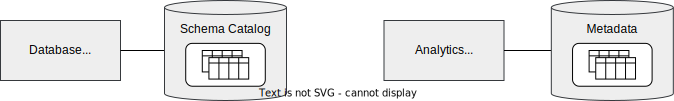

<!-- SPDX-License-Identifier: CC-BY-4.0 -->
<!-- Copyright Contributors to the Egeria project 2020. -->

# Integration Guide

Many tools and platforms today maintain a store of metadata.  This metadata drives the behaviour of the technology.  For example:

* A database server maintains the structure of its databases in a schema catalog.  This schema is used to structure queries and optimize the extraction of data.
* Many tools that enable their users to work with data keep metadata about the known data sources.  This helps their users find the data they need and to work with it. The example below shows an analytics workbench that data scientists may use to build analytics models. 

Egeria's integration guide helps you to integrate third party technologies into the open metadata ecosystem.  The technology may be an open source technology, a home-grown technology or a software product.  This does not matter.  The integration may be to import metadata into the open metadata ecosystem, or to export it to the third party technology, or both. Egeria's integration capabilities are extremely flexible. The only limitations to metadata exchange between a third party technology and the open metadata ecosystem derive from the capabilities of the external APIs and events provided by the third party technology.

--8<-- "docs/guides/integration/metadata-supply-chains.md"

--8<-- "docs/guides/integration/introducing-integration-daemon.md"

--8<-- "docs/guides/integration/configuring-integration-daemon.md"

--8<-- "docs/guides/integration/validating-your-integration.md"

--8<-- "snippets/abbr.md"
