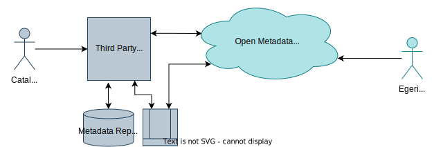
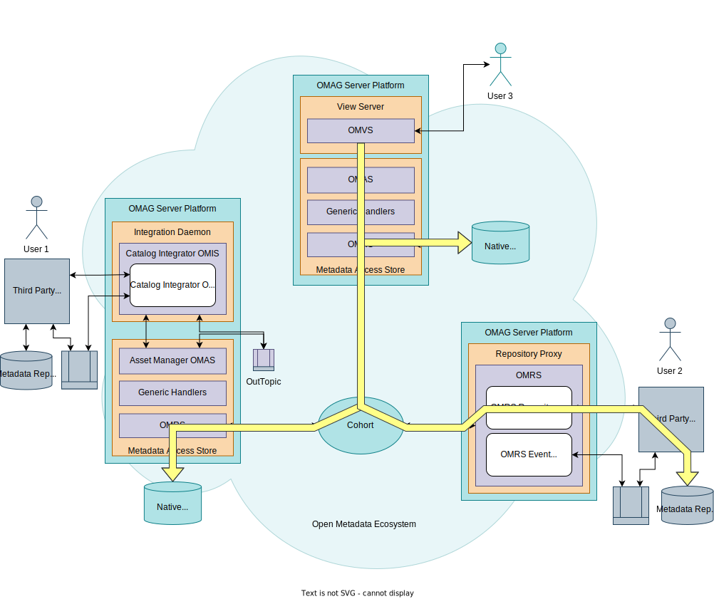
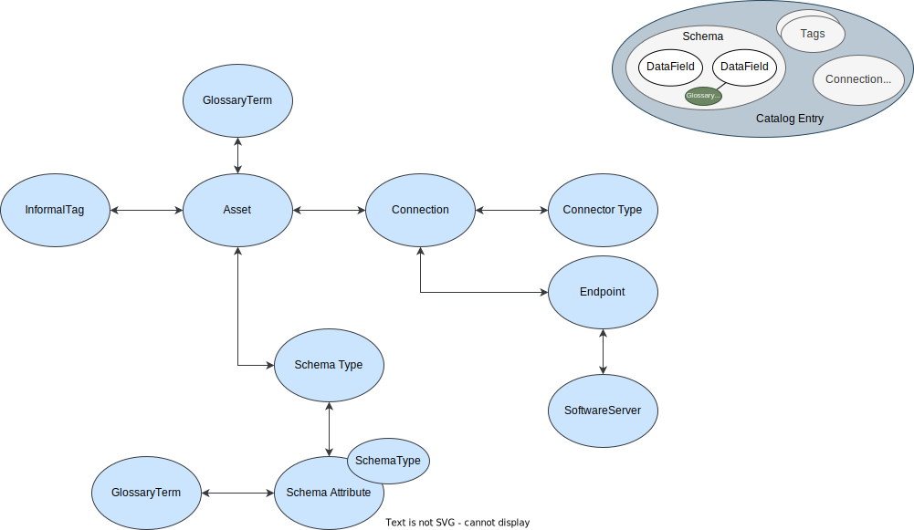

<!-- SPDX-License-Identifier: CC-BY-4.0 -->
<!-- Copyright Contributors to the ODPi Egeria project 2020. -->

# Integrating metadata catalogs into the open metadata ecosystem

Integrating metadata catalogs into the open metadata ecosystem provides access to a broader collection of metadata from your existing deployed tools.

## Types of metadata repository

Not all metadata catalogs are the same.

Many metadata repositories are *data catalogs*.  They focus on gathering and organizing information about data sources for a team of data professionals.  Each data source is catalogued under the guidance of its users.  There is some automation for maintaining the catalogued data sources.  The aim is to provide the metadata needed by the local team.

There are also metadata repositories that focus on providing metadata to the whole enterprise, or support a diverse set of tools that are part of a suite. These repositories often have a focus on common definitions and automation of metadata maintenance and stewardship.  They are deployed and controlled as a centralized service.  Some of these repositories are specialized for different types of use cases and often includes support for governance - for example, it may have a focus on Data Governance, IT Infrastructure Governance or Security Governance.

## How do you integrate catalogs?

How should you connect a third party data catalog into the open metadata ecosystem?

Egeria offers two choices on how to integrate such catalogs:

* Integrate via a [repository connector](/concepts/repository-connector) running in a [Repository Proxy](/concepts/repository-proxy).
* Integrate via an [integration connector](/concepts/integration-connector) using the [Catalog Integrator OMIS](/services/omis/catalog/overview) running in an [integration connector](/concepts/integration-connector).

Broadly speaking, the repository connector integration is for the metadata repository, and the integration connector is for the data catalog.  However, to understand why, and to be sure that you are making the right decision, this page goes into more detail on the mechanisms that surround these connectors.

## Comparison of the infrastructure

User 1 works with metadata stored in Metadata Repository 1
User 2 works with metadata in Metadata Repository 2

> Integration connectors run in an integration daemon connected to a metadata access store.  Repository connectors run in a repository proxy directly connected to one or more cohorts.

### Adding metadata via the integration connector

Native metadata repository 3 maintains a copy of metadata repository 1.
The integration connector chooses which of these repositories is the home directory.
Metadata copied into metadata repository 2 is a reference-copy.

### Adding metadata via the repository connector

### Accessing metadata from the broader cohort

## API comparison

### Repository Connector API

API is a fine-grained repository API.  OMRS handles metadata integrity and coordination of exchange.

### Integration Connector API

Connector API much simpler.

Effort still required to map between the Catalog Integrator OMIS context and the third party catalog interface.

Link to [external identifiers](/features/external-identifiers/overview).

## Conclusion

Choosing the appropriate type of connector for your data catalog depends on the capability of the catalog and its intended usage.

| Simple choices in favour of an integration connector              | Simple choices in favor of the repository connectors                                        |
|-------------------------------------------------------------------|---------------------------------------------------------------------------------------------|
| Will not/can not support federated queries due to API or capacity | Volume and rate of change of metadata makes a copy impractical                              |
| Wildly different granularity of API from the OMRS                 | Sensitivity of metadata makes owners unwilling to share with no-one but a few trusted users |

Other considerations:

 * Control of which metadata is shared
 * Control of update rights
 * Storing reference copies

--8<-- "snippets/abbr.md"
