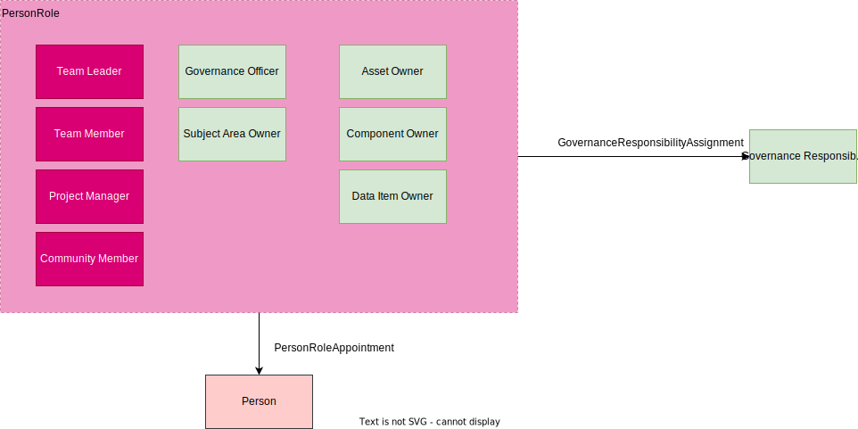

<!-- SPDX-License-Identifier: CC-BY-4.0 -->
<!-- Copyright Contributors to the Egeria project. -->

# Setting up your Governance Program

An organization's governance program described the cross-cutting initiatives that ensure the organization is operating efficiently and ethically with the most optimal use of resources.  Egeria supports open metadata definitions that aid the management and exchange of information with different tools and systems that drive the governance program.

The governance program is divided into governance domains.

## Governance domains

Governance domains are the areas of an organization's operation that need a specific governance focus.  For example, a governance domain may be driving a transformation strategy, planning support for a regulation, driving an efficiency campaign or developing an assurance program for your organization.

A governance domain typically involves the ongoing cooperation of multiple teams from different business areas.  There is often a [business strategy](#governance-definitions) and a [set of targets](#measures-and-metrics) associated with the domain since its purpose is to provide some level of improvement or benefit to the organization.

Each domain is typically the responsibility of a different executive in the organization.  Different domains may use slightly different terminology and often run different tools but in fact they are very similar in the way that they operate.  Egeria allows the teams from the different governance domains to collaborate and benefit from each other's efforts.

??? info "Examples of governance domains"
    The governance domains can vary in scope and importance to the business.  In the example below, *Corporate Governance* ensures that the business operates legally. It is the key focus of the board or directors and includes financial reporting.  

    At the heart of the organization's operation are three governance domains that are often run separately, but in fact are highly dependent on one another:

    * *Data (or Information) Governance* focuses on the appropriate use and management of data.
    * *Information Security (InfoSec)* focuses on the security of the IT Systems (and sometimes the physical security of buildings and plant).
    * *IT Infrastructure* ensures systems are correctly set up and managed.so they deliver the level of service required by the business.  This governance domain often uses a taylored version of IT Infrastructure Library (ITIL).

    Software development needs governance to ensure it is properly designed, built and tested - and fit of purpose.  This governance is typically guided by a software development method, such as *Agile Development* and covers all aspects of the software development lifecycle.

    There are other domains that are more specialized.  For example:

    * *Privacy* focusses on compliance with data subject privacy.  It interacts with the data governance, software development lifecycle and IT Infrastrcuture domains.
    * *Human Capital Management* combines Human Resources (HR) and the management team of the organization to ensure the people they employ receive the training and support to build the right skills to support the business.
    * *Risk Management* assesses and, where necessary mittigates against the risks that may impact the organization.  It is often lead by the finance team because the level of risk can affect their credit rating.  However in some industries, such as banking, where the reporting and management of risk is covered by specific regulations, there is a separate organization that interfaces with the regulators.
    * *Physical Asset Management* manages the physical buildings, furnature, machinery, computers etc that the organization owns.  It is responsible for maintenance and replacement of these items.
    * *Product Assurance* ensures the products that the organization sells meet regulatory requirements and match the ethos of the organization.
    * *Procurement* focussed on the policies and rules assicuated with the products and services bought by people across the organization.  There may be a seprate procurement team that interacts with suppliers to ensure bulk discounts and quality.  They would work with other leaders in the organization to ensure the approach matches the needs of the business.
    * *Sustainability* is a relatively new governance domain that focuses on the effective use of resources to improve long-term sustainability of the organization's operations.

    
    > Examples of different governance domains within an organization.

Governance domains are represented by [*Governance Domain Descriptions*](/types/4/0401-Governance-Definitions/#governancedomaindescription) entities in open metadata.  They are organized into a *GovernanceDomainSet* collection.

> The governance domain descriptions organized in a governance domain set

The governance domain descriptions include the *domainIdentifier* property, a *displayName* and a *description*.  The *domainIdentifier* property is an integer and by convention "0" means "applies to all domains".  For example:

| Domain Identifier | Display Name                   | Description                                                                                               |
|:------------------|:-------------------------------|:----------------------------------------------------------------------------------------------------------|
| 0                 | All                            | Governance program leadership and shared definitions.                                                     |
| 1                 | Data                           | The governance of data and its use.                                                                       |
| 2                 | Privacy                        | The support for data privacy.                                                                             |
| 3                 | Information Security (InfoSec) | The governance that ensures IT systems and the data they hold are secure.                                 |
| 4                 | IT Infrastructure              | The governance of the configuration and management of IT infrastructure and the software that runs on it. |
| 5                 | Software Development Lifecycle | The governance of the software development lifecycle.                                                     |
| 6                 | Corporate Governance           | The governance of the organization as a legal entity.                                                     |
| 7                 | Physical Asset Management      | The governance of physical assets.                                                                        | 

??? education "Defining governance domains"
    Governance domain descriptions can be defined in an [Open Metadata Archive](/concepts/open-metadata-archive) or through the [Governance Program OMAS](/services/omas/governance-program/overview).
    
    The [egeria-samples.git repository](https://github.com/odpi/egeria-samples) includes a sample called [Sample metadata archives for Coco Pharmaceuticals](https://github.com/odpi/egeria-samples/tree/main/sample-metadata-archives/coco-metadata-archives) that creates open metadata archives with basic definitions for Coco Pharmaceuticals.  This includes the definition of this organization's governance domains with their communities and governance officers.

## Governance Leadership

A governance domain needs a leader to drive the change and focus that it demands.  When an organization decides to create a new governance domain, the appointment of the leader of the domain is the first decision.  This person then organizes the people and resources that will drive the definition and rollout of changes needed to make the governance domain successful.

The leadership of the governance domain is a type of governance role.

## Governance Roles

Governance roles define the additional responsibilities and tasks that people need to do in order to make the governance domain successful. These roles lead initiatives or take ownership of resources.  Some governance roles are full-time jobs, but most will be a few hours from time to time.  The governance roles are identified and defined as the operation of the domain is worked out.  This includes specifying the responsibilities so that an assessment of the cost/benefits can be made.  People are appointed to the roles later, as the governance domain is put into operation.

Egeria defines a set of [governance role types](/types/4/0445-Governance-Roles) to provide a framework for your governance roles.  Governance roles have a *domainIdentifier* property to identify that the role is defined for a particular domain. You create instances of these types to define the roles for the domain.  For example, there is a governance role type called *AssetOwner*.  You may want a role that is responsible for granting access to a data asset.  So you may create a role of type *AssetOwner* called *Asset access manager* with responsibilities for approving requests to access the data.

Multiple people may be assigned to a role.  So you can choose to define generic roles and appoint multiple people to them.  Alternatively, if you want to define precisely which resources they are responsible for, then you need more fine-grained roles.

For example, you may have 100 data assets and each needs at least one person to grant access to it.  Here are some different choices on how you could set this up.

* You may choose to have one *Asset access manager* role and appoint a small group of people to the role.  These people can grant access to any of the 100 data sets.

* You may want to organize the data assets into different [groups](#governance-classification-tagging-and-linking) and appoint different people to grant access to the assets in each group.  In this case, you would have a governance role instance for each group.  They would be linked to the element that represents the group via the [*AssignmentScope*](/types/1/0120-Assignment-Scopes) relationship.

  

* You may want to have specific roles for each data asset.  This could be a lot of overhead to defined roles explicitly.  You could choose to have a generic role where the appointment and scope is handled via the [*Ownership*](/types/4/0445-Governance-Roles) classification.

  

These different approaches allow you to have enough detail in your open metadata definitions to configure tools and report on governance activity, whilst minimising effort to keep the definitions up to date.

??? education "Representing governance roles in open metadata"
    Governance roles are types of [PersonRole](/types/1/0112-People).  They link to a governance responsibility (a type of [governance definition](#governance-definitions) using the [GovernanceResponsibilityAssignment](/types/4/0445-Governance-Roles) relationship).  The [profile of a person](/types/1/0112-People) is linked to the governance role using the [PersonRoleAppointment](/types/1/0112-People).

    

    The [Governance Program OMAS](/services/omas/governance-program/overview) supports the setting up of governance roles. The [Community Profile OMAS](/services/omas/community-profile/overview) supports the appointment of people to roles.

## Governance Leadership Communities

The governance domain covers activity occurring in different parts of the business.  The people working for the domain will not be reporting directly to the governance domain leader - they continue to report through their line of business.  Therefore, the governance domain leader needs a mechanism to bring people together, share progress and the latest information.  This can be done through a [community](/concepts/community).

### Governance Domain Communities

Each governance domain would typically have a community, led by the governance domain leader and with a membership consisting of the people appointed to the governance roles supporting the governance domain.

As the governance roles are defined, they are added to the governance domain community using the [CommunityMembership](/types/1/0140-Communities) relationship.  As people are appointed to the roles, they automatically become a member of the community.

### Governance Leaders Community

Often the leaders of the governance domains need a forum to share ideas and collaborate.  This can be achieved by setting up a community for the governance leaders.  This means the governance domain leader is the head of their governance domain community and is a member of the governance leadership community. 

Defining the governance communities' membership in Egeria means that as people are appointed or removed from roles, Egeria can automatically maintain access control lists and email list for the membership.

## Governance domain management process

Most activity within each governance domain is iteratively developed and reviewed. Managing the governance domain includes:

* Designing how the governance domain will operation:

    * Understanding the [business drivers and regulations](#governance-definitions) that provide the motivation and direction to the governance program.

    * Laying down the [governance policies](#governance-definitions) (principles, obligations and approaches) that frame the governance program.

    * Planning and defining the [governance controls](#governance-definitions) that detail how these governance policies will be implemented in the organization, and enumerating the implications of these decisions and the expected outcomes.

    * Defining the organization's [roles](#governance-roles) and [responsibilities](#governance-definitions) that will support the governance program.

    * Defining the [classifications and governance zones](#governance-classification-tagging-and-linking) that will organize the assets being governed.

    * Defining the [subject areas](#subject-areas) that will organize the data-oriented definitions such as glossary terms, valid values and quality rules.

    * Defining the [governance metrics](#measures-and-metrics) that will measure the success of the governance domain.

    * Defining the [execution points](#execution-points) that identify how the governance domain's decisions and actions taken are to be implemented.
    
    * Planning the [rollout of changes](#governance-rollout) to both the organization, processes and technology that will drive the governance domain.
  
* Reviewing the impact of the governance activity against the goals of the governance domain.

    * adjusting governance implementation as necessary.

* Reviewing the strategy, business and regulatory landscape.

  * adjusting the governance definitions and metrics as necessary.

  
## Governance Definitions

A *Governance Definition* is a metadata element that describes the context or purpose for an activity that supports the organization's operation. The picture shows the main types of governance definition and how they link together to create a coherent response to a business strategy or regulation.

> Using governance definitions to provide traceability from business drivers and regulations to actions.

## Subject areas

[Subject areas](/concepts/subject-area) are topics or domains of knowledge that are important to the organization.  Typically, they cover types of assets (such as data) that are widely shared across the organization and there is business value in maintaining consistency in the data values in each copy.

The role of a [subject area definition](/types/4/0425-Subject-Areas) is to act as a collection point for all the subject area materials.  This includes:

* A [glossary of terms](/types/3/0310-Glossary) that describe the key concepts in the subject area.
* Lists and hierarchies of [reference data](/types/5/0545-Reference-Data) that relate to particular data values in the subject area.
* [Quality rules](/types/4/0430-Technical-Controls) for specific data values in the subject area.
* Preferred [data structures and schemas](/types/5/0501-Schema-Elements).

The materials that are part of the subject area are classified as such using the [SubjectArea](/types/4/0425-Subject-Areas) classification.

> Defining a subject area

Each subject area has an owner (see [SubjectAreaOwner](/types/4/0445-Governance-Roles)) who is responsible for the materials relating to the subject area.  Often the subject area owner is a senior person in the organization with expertise in the subject area.  He/she coordinates other subject-matter experts to author and maintain the materials and their use.  It is helpful to set up a [community](/concepts/community) of people working on the subject area's materials, to coordinates email distribution lists, news and events.

> People working on a subject area come together in a community

The subject area definition can be linked to [governance definitions](#governance-definitions) via the [*GovernanceBy*](/types/4/0401-Governance-Definitions) relationship.

The organization of the subject areas is orthogonal to the governance domains. Some subject areas are common to multiple governance domains; others are specialized within a governance domain. Similarly, an organization can create governance definitions that are applicable to all subject areas, or are specific to the subject area they are linked to.  Typically, they will have a mixture of these.

!!! education "Further information"

    * [Common Data Definitions](/practices/common-data-definitions/overview) describes the management and use of subject areas.
    
    * The [Defining Subject Areas](/practices/coco-pharmaceuticals/scenarios/defining-subject-areas/overview/) scenario for Coco Pharmaceuticals walks through the process of setting up the subject areas for Coco Pharmaceuticals.
    
    * There are two code samples associated with this set of subject areas:
    
        * [Setting up the subject area definitions :material-github:](https://github.com/odpi/egeria/tree/main/open-metadata-resources/open-metadata-samples/access-services-samples/governance-program-client-samples/governance-subject-area-sample){ target=gh }
        * [Setting up glossary categories for each subject area :material-github:](https://github.com/odpi/egeria/tree/main/open-metadata-resources/open-metadata-samples/access-services-samples/subject-area-client-samples/subject-area-definition-sample){ target=gh } ready for subject area owners to start defining glossary terms associated with their subject area.
    
    * The [Governance Program OMAS](/services/omas/governance-program/overview) supports the setting up of subject area definitions.
    * [Subject Area OMAS](/services/omas/subject-area/overview) supports the definition of glossary terms for subject areas.
    * [Digital Architecture OMAS](/services/omas/digital-architecture/overview) supports the definition of reference data and quality rules for the subject area.
    * [Asset Manager OMAS](/services/omas/asset-manager/overview) supports the exchange of subject area information with other catalogs and quality tools.

## Governance classification, tagging and linking

One of the ways to reduce the cost of governance is to define groups of similar assets/resources along with the governance definitions that apply to members of the group.  This avoids having to make decisions on how to manage each asset/resource.  The cataloguing process just needs to work out which group(s) to place the asset in.  Labels such as classifications, and tags of different types are used to identify these group assignments.  When a governance process is operating on the asset/resource, it looks up the labels and follows the governance definitions for the group.

> **Figure 4:** Different types of tags used to group assets for governance

The different types of labels used to group assets/resources are used for different purposes and may indicate how official they are:

* [Governance Zones](/concepts/governance-zone) group assets according to their use.  They are typically is used for [controlling visibility to the resource's asset definition](/features/governance-zoning/overview).

* [Governance Classifications](#setting-up-the-levels-for-your-governance-classifications) define the groups used for specific types of governance.

    * Confidence Governance Classification defines the level of confidence that should be placed in the accuracy of related data items.  This limits the scope that the data can be used in.
    * Confidentiality Governance Classification defines the level of confidentiality or secrecy needed with particular data.
    * Criticality Governance Classification defines how critical the related resources are to the continued operation of the organization.
    * Impact Governance Classification defines how much of an impact a particular situation is to the operation of the organization.
    * Retention Governance Classification defines how long a resource (typically data) must be retained by the organization.

* License Types define the contract aka (terms and conditions) that define how the asset/resource can be used.

* Certification Types define specific characteristics of an asset/resource that has been verified for a particular span of time.

* [SecurityTags](/concepts/security-tags) identify labels and properties that are used in determining which data protection rules should be executed when particular data is requests. They can be attached to assets or schema elements depending on the scope of data that the security tags apply to. The synchronized access control feature describes how security tags are set up and used.

The labels may be assigned directly to the asset, or to elements, such as schemas and glossary terms that are linked to the asset.

## Setting up the levels for your governance classifications

The values used in governance classifications show the specific group that the classified asset belongs to.  Often an organization has their own levels defined, and they can be set up in [`GovernanceClassificationLevel`](/types/4/0421-Governance-Classification-Levels/) definitions.

> **Figure 5:** Governance classifications that use governance level definitions

Egeria has a set of default values that can be set up using the [`createStandardGovernanceClassificationLevels`](https://odpi.github.io/egeria/org/odpi/openmetadata/accessservices/governanceprogram/api/GovernanceClassificationLevelInterface.html) method.

## Measures and metrics

As important aspect of the governance program is the ability to measure its effectiveness and identify the assets that are delivering the highest value, or operating with the greatest efficiency etc.

A value that should be captured to demonstrate the effectiveness of the governance program is documented using the [*GovernanceMetric*](/types/4/0450-Governance-Rollout) entity. It is linked to the appropriate governance definition and can be linked to a data set where the specific measurements are being gathered.

The calculation of governance metrics is often a summary of many other measurements associated with specific resources (such as data sources and processes) operating under the scope of the governance program. These resources are catalogued as [`Assets`](/concepts/asset). 

> **Figure 6:** Measuring governance through an external data set

The definition of their expected behavior or content can be captured using the `GovernanceExpectations` classification attached to the `Asset`. The measurements that support the assessment of a particular resource can be gathered and stored in a `GovernanceMeasurements` classification attached to its `Asset`.

> **Figure 7:** Setting expectations and gathering results in classifications

The measurement classification may be attached to a related element that describes an aspect for its operation.  For example, in figure 8 the measurement is attached to a process instance that captures a specific run of a process.  The expected values are attached to its parent process.

> **Figure 8:** Attaching the measurements to related elements

## Execution points

A governance execution point defines specific activity that is supporting governance.

There are three types:

* A Control Point is a place in the processing where a decision needs to be made. It may be a choice on whether to tolerate a reported situation or to resolve it - or it may be a decision on how to solve it.

* A Verification Point describes processing that is testing if a desired condition is true. Quality rules are examples of verification points. The result of a verification point is the output of the test. It may, for example, be a boolean, classification or a set of invalid values.

* An Enforcement Point describes processing that enforces a specific condition. For example, data may need to be encrypted at a certain point in the processing. The encryption processing is an enforcement point.

The ExecutionPointDefinition elements are created during the design of the governance program. They characterize the types of execution points that are needed to support the governance requirements. They are linked to the Governance Definition that they support using the ExecutionPointUse relationship. Typically, the governance definitions linked to the governance execution point definitions are:

* Governance Processes
* Governance Procedures

Often execution points need to be integrated with the normal activity of the business, but they may also represent additional standalone activity.

The classifications ControlPoint, VerificationPoint and EnforcementPoint are used to label governance implementation elements with the type of execution point and the qualified name of the corresponding definition if any. They are often found on element such as:

* Governance Action Types
* Governance Actions

These classifications help in the review of the implementation of the governance program and can be used to drive additional audit logging. 

> Implementing the actions defined in your governance definitions.

## Governance Rollout

## Open metadata implementation

??? education "How the Open Metadata Access Services (OMASs) support the governance program"

    * The [Governance Program OMAS](/services/omas/governance-program/overview) supports the setting up of governance domain and its associated definition elements.

    * The [Community Profile OMAS](/services/omas/community-profile/overview) supports the definition of the profiles for people and teams that will support the governance program.  These are linked to the governance roles defined by the governance program.

    * The [Project Management OMAS](/services/omas/project-management/overview) supports the rollout of the governance program by commissioning campaigns and projects to implement the governance controls and the collection of measurements to assess the success of the program.

    * The [Digital Architecture OMAS](/services/omas/digital-architecture/overview) provides the setup of the digital landscape that supports the governance program.  This includes the definitions of the information supply chains and solution components that support the organization's activities.

    * The [Digital Service OMAS](/services/omas/digital-service/overview) documents the business capabilities along with their digital services that are supported by the governance program.

    * The [Governance Engine OMAS](/services/omas/governance-engine/overview) supports the implementation of technical controls and the choreography of their execution.

    * The [Stewardship Action OMAS](/services/omas/stewardship-action/overview) supports the stewards as they manage the exceptions detected to the governance program.
  
    * The [Data Privacy OMAS](/services/omas/data-privacy/overview) supports the operational aspects of managing privacy as part of the organization's activities.

    * The [Subject Area OMAS](/services/omas/subject-area/overview) supports the definitions of the vocabularies associated with a subject area.

    * The [Data Manager OMAS](/services/omas/data-manager/overview) support the automated cataloging of assets and configuration of technology that is managing them.

    * The [Security Manager OMAS](/services/omas/security-manager/overview) support the configuration of technology that is managing the security of assets.

    * The [Security Officer OMAS](/services/omas/security-officer/overview) support the definitions of users and groups and related definitions that make up the user directory.

    * The [Asset Manager OMAS](/services/omas/asset-manager/overview) supports the automated exchange of governance definitions between catalogs and asset managers to create a consistent rollout of governance requirements.
  
    * The [Asset Owner OMAS](/services/omas/asset-owner/overview) supports the linking of governance definitions and classifications to assets to define how they should be governed.

    * The [Asset Consumer OMAS](/services/omas/asset-consumer/overview) supports the visibility of the governance definitions and classification by consumers of the assets.

The [egeria-samples.git repository](https://github.com/odpi/egeria-samples) includes a sample called [Sample metadata archives for Coco Pharmaceuticals](https://github.com/odpi/egeria-samples/tree/main/sample-metadata-archives/coco-metadata-archives) that creates open metadata archives with basic definitions for Coco Pharmaceuticals.  This includes the definition of this organization's governance domains with their communities and governance officers.

--8<-- "snippets/abbr.md"
