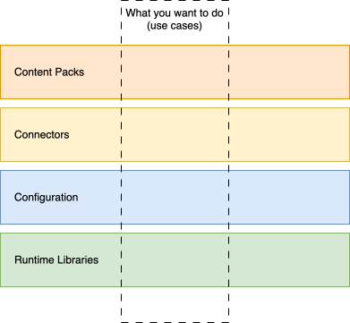

<!-- SPDX-License-Identifier: CC-BY-4.0 -->
<!-- Copyright Contributors to the Egeria project 2019-present. -->

# Planning Guide

Egeria is highly modular, allowing you to choose which components to use "as supplied", and which to remove, extend, or replace with something customized for your organization.
Typically, Egeria's function is broader than you need, at least initially, so often the challenge is to know which pieces you need to do the things you want to do, and what you can safely ignore.

There are four types of "component" from Egeria that you need to consider: Content Packs, Connectors, Configuration and the Runtime Libraries.

* The *content packs* contain open metadata types and instances.  Open metadata is used to define the people, processes, data and technology that make up your organization.  These are all linked together and stored in a knowledge graph to show how they work together.  Egeria's content packs provide sets of open metadata that provide basic definitions that help to bootstrap your knowledge graph.
* The *connectors* provide plugins into Egeria's runtime libraries that either connect to a specific technology to exchange metadata, or implement a specific governance action.  Connectors are configured using open metadata and only run when they are explicitly activated.  One of Egeria's content packs called *CoreContentPack.omarchive* includes the configuration for the [standard connectors included in Egeria](/connectors).
* The *configuration* controls the activation of Egeria's services in the runtime.  Related services are grouped together into what are called [OMAG Servers](/concepts/omag-server) so they can be activated and deactivated together.  Egeria's services are used to build out your knowledge graph.  They can be called from the connectors, or other tools and technologies using Egeria's clients, or directly via the REST APIs.  Managing configuration is described in the [Administration Guide](/guides/admin).
* The *runtime libraries* provide the services to manage the connectors and the knowledge graph.  They are packaged into a choice of two runtimes.  The [OMAG Server Platform](/concepts/omag-server-platform) is the typical runtime to use, particularly initially, since it can run all functions using multiple OMAG Servers and its configuration can be dynamically changed making it easy to experiment with different settings.  The [OMAG Server Runtime](/concepts/omag-server-runtime) is a specialist runtime for a cloud-native deployment that only runs a single OMAG Server using a fixed configuration.  The specific software services included in either runtime can be both removed or added at build time to allow you to fully customize Egeria's runtimes. 

The *Planning Guide* provides information to help you plan the deployment of Egeria in your organization. 

## Egeria's distribution

As a general rule of thumb, we suggest using Egeria's components as supplied and only customize them as you get more confident.  To this end, when you [build the main egeria repository](/education/tutorials/building-egeria-tutorial/overview) (called [egeria.git](https://github.com/odpi/egeria)), it creates a distribution folder containing content packs, connectors, sample configuration and the runtime libraries along with `README.md` files describing how to use this content.  

--8<-- "snippets/inside-egerias-distribution.md"

The Egeria project also includes additional content, such as connectors, in other repositories that can be built and added to this distribution.  The distribution also includes a Docker script file so that, once you have all of the content you need assembled, it can be turned into a docker container for deployment.  Alternatively it can be run directly on a local machine running Linux or MacOS (bare metal).

## Designing your own deployment

The rest of this *Planning Guide* assumes you are familiar with the basic concepts of Egeria and have some knowledge of the contents of the Egeria's distribution.  It aims to guide you through the process if customizing your Egeria deployment.  It is divided into two parts as follows: 

* *Planning Deployment* focuses on the setting up of the Egeria software and its supporting technology
              
    * [Planning Runtime Deployment](/guides/planning/runtime/overview) describes how to design your Egeria runtime deployment.
    * [Designing your security model](/guides/planning/security/overview) describes how to build a threat model for Egeria.
    * [Planning User Interfaces](/guides/planning/user-interfaces) describes how to plan for the two user interfaces that Egeria supplies.
      
* *Preparing Metadata Ecosystem* describes the types of metadata that should be populated in your open metadata ecosystem to allow it to operate effectively.  This metadata can be added directly into your metadata repository, or added to your own content packs to load across multiple Egeria deployments.

    * [Metadata Valid Values](/guides/planning/valid-values/overview) to control the values used in open metadata elements.
    * [Multiple Language Translations](/guides/planning/translations/overview) to support multiple languages in the metadata elements.
    * [Onboarding Organization](/guides/planning/organization/overview) to define the people, their roles and userIds and how they are organized into teams.  This is used to control access to metadata and associated resources, route stewardship actions to the appropriate individuals/teams and synchronize organizational information between systems. 
    * [Governance Program](/guides/planning/governance-program/overview) to coordinate the various governance activities in the organization.

The connectors supplied by Egeria are found in the [Connector Catalog](/connectors).

--8<-- "snippets/abbr.md"
