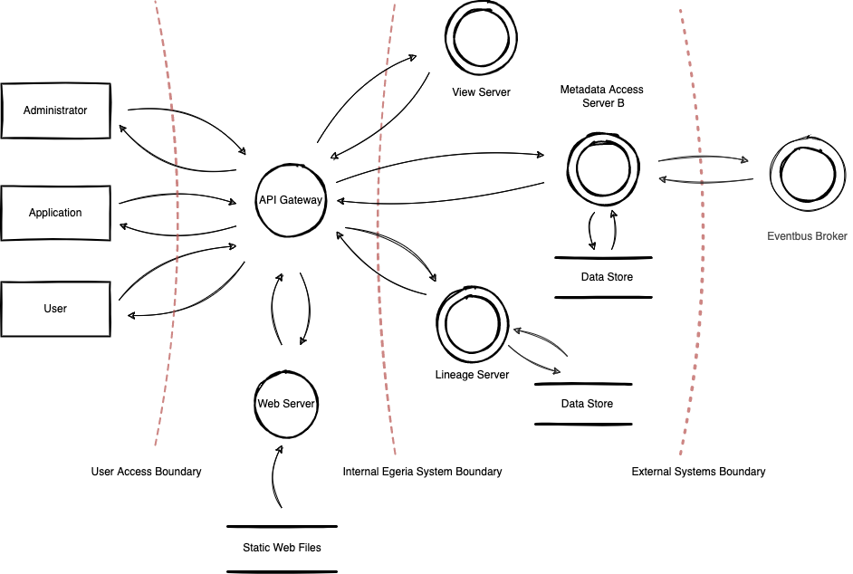

<!-- SPDX-License-Identifier: CC-BY-4.0 -->
<!-- Copyright Contributors to the Egeria project 2020. -->

# Planning for security

The Egeria runtimes have been designed so that they can be deployed securely.  However, the security of your solution depends on a combination of the deployment environment as well as Egeria itself.

## Understanding the threats to your solution

The first phase in securing your solution is to understand the threats that need to be guarded against.  This understanding is developed through [Threat Modelling](https://owasp.org/www-community/Threat_Modeling){target=_blank}.  **OWASP** has an excellent guidance pave called the [Threat Modelling Process](https://owasp.org/www-community/Threat_Modeling_Process){target=_blank} that explains how to identify the threats that could compromise your system.

## Threat model baseline for egeria ecosystem

### Step 1: Decompose the Application

Egeria ecosystem applications are the building blocks for creating automated and integrated open metadata management solution.

To decompose Egeria applications, it is very important to understand the [OMAG Server Platform](/concepts/omag-server-platform){target=_blank}. This is a java based server application that is designed to run one or more logical application instances called OMAG Servers. Different application components can be configured and combined to provide runtime services that define the function of a single OMAG Server instance. 

??? education "Functional levels"
    | Level | Description |
    | ---------- | ---------- |    
    | Platform      | Runtime process. Provide inbound entry points, controls transoprt and enables admin services |
    | Server | Application instances. Provides function by managing lifecycle for a logical group of services, hosts connectors and maintains connections to access various technologies |
    | Service | Service units. Provide operations to validate and process server requests, process and distribute events or access storage |

Different server capabilites can be enabled by combining services in new server instances.
In practice, an organization will deploy different server types to implement solution for a specific use-case. 

Users, tools or other technology platforms access the Egeria ecosystem by interacting with OMAG Server applications.

#### Application users

Users can access Egeria applications for different purposes and by different means. Some common user types:

| ID | Name | Description|
| --- | --- | --- |
| 1 | Egeria User | Personal user accounts. In many scenarios logon and access the application using one of the User Interfaces available. In most cases these users have asociated corporate role or profile that determines the ability to access specific views or APIs that allow contorlled access to data provided by Egeria application. |
| 2 | Egeria Administrator | Personal user accounts. Can logon and access egeria ecosystem and applications via Administrative APIs or User Interfaces to configure or operate instances of Egeria OMAG Server applications. |
| 3 | External Application | Users that are in most cases identified by non peronal accounts representing other external applications or systems accessing data. Usually those users interact with Open Matadata Access Services. |
| 4 | Internal System | Users that are used to identify internal applications or components such as other OMAG servers interacting. |

The user access is always specific to the usage scenario of an organization. In reallity funcional roles or profiles are assigned to users with different responsibilites in the organization implementing governance program.
Egeria ecosystem is designed to keep track of user access and enable access control with high level of granularity.

??? education "Metadata security levels"
    
    
    More details on [Metadata security](/features/metadata-security/overview){target=_blank}
    

#### External dependencies 

In an organization, Egeria applications such as OMAG Servers will always interact with external systems that are out of control of the development team therefore it is very important that the operators are aware of such extenral depdendencies in production.

Common external dependencies for Egeria ecosystem:

| ID | Description | Recommendation |
| ------ | ------ | ------ |
| 1 | Operating system security patch level | OMAG servers should always run in a secure linux environment. This includes the installation of the latest operating system and application security patches. |
| 2 | Java Virtual Machine software | Use latest stable Java runtime. Recomendation is to run OMAG server using well supported OpenJDK distribution. |
| 3 | Network access segmentation and Firewalls | Network design is important. Egeria applications should be properly deployed in private network segments behind firewalls. Depending on the use-case only specific services and endpoints should be exposed to user access networks (i.e. Web Server or API Gateway) |   
| 4 | Backend storage technology | OMAG servers can be configured with technology connectors that access database systems. Example is JanusGraph database on Apache Cassandra. Such database system should also run with up-to date version |
| 5 | Event processing technology | OMAG servers can rely on technology connectors to Apache Kafka for event streaming. Where possible, supported up-to data Kafka distributions with highly-available configuration should be used |
| 6 | Web Server and API Gateway | There are various technology options here (i.e. NGINX). Organization should rely on secure distributions runnign up to date sofware packages supporting TLS communication |

#### Entry and Exit points

Example entry and exit points for a common deployment configuration with User Interface application:

| ID | Name | Description | Trust Levels |
| ------ | ------ | ------ | ------ |
| 1 | HTTPS Web Access Port | UIs should be only acessible via TLS. All pages should be accessed via this entry point. Based on determined trust level and configured permissions page details are visible or not | (1) (2) |
| 2 | HTTPS REST Service API Port | API endpoints should be only accessible via trusted TLS ebabled channel. Based on credetianls provided trust level is determined and access control logic applied | (3) (4) (5) |
| 3 | Kafka Topic | Service access via topic addresses on trusted secure kafka broker via SSL. Application access control logic can be further applied based on the credetials | (4) (5) |

#### Assets 

| ID | Name | Description | Trust Level |
| --- | --- | --- | --- |
| 1 | **System** | Assets related to Egeria Ecosystem | |
| 1.1 | OMAG Server Configuration  | OMAG Server configuration store contains service definition, connector configurations including endpoints and credentials for connecting to external systems. The default connector implmenetation manages the configuration document store as local json files. | (5) |
| 1.2 | OMAG Server Registry |  OMAG Server registry contains information about servers registered in a cohort. The default connector implementtion manages the registy information as local json files. | (5) |
| 1.3 | Ability to change OMAG Server configuration | Manage OMAG Server configuration | (3) |
| 1.4 | Ability to control OMAG Server instances | OMAG Server instance enables OMRS, OMAS undelying services that facilitate access or enable active sharing of metadata instances | (3) |
| 1.5 | Ability to access metatada database | Ability for to access configured database system and execute queries that manage metadata instances in the store. | (5) |
| 1.6 | Ability to access eventbus system | Ability to access eventbus broker servers and send/receive OMRS and OMAS event messages | (5) |
| 2 | **Web UI** | Assets important for the web application providing user inteface | |
| 2.1 | Web Access Token | Access token that is generated as a result of logon process. The token can be used to access Egeria Web APIs, supporting UI functions and accessing UI components. | (2) |
| 2.1 | Search Metadata Catalog | Ability to access asset catalog search and details pages | (2) |
| 2.2 | Acccess Linaeage Information | Ability to access lineage graph page | (2) |
| 3 | **Services** | Assets related to accessing functional OMAG services | |
| 3.1 | Ability to access OMAS  | Ability to access specific OMAS API endpoints or event interfaces | (2) (4) (5) |
| 3.2 | Ability to access OLS  | Ability for the web application to access OMAG server and its OMAS APIs. | (2) (4) (5) |
| 3.3 | Ability to access OMRS  | Ability for the web application to access Lineage server and its APIs. | (5) |

#### Trust levels

| ID | Name | Description |
| ------ | ------ | ------ |
| 1 | Anonymous | User/application connected to the secure web or api port without providing credentials |
| 2 | Egeria User | User connected to the secure web/api port sending valid credentials |
| 3 | Egeria Administrator | User connected to the secure web/api port with valid administratove credentials |
| 4 | External application process | External system/application connected using valid credentials |
| 5 | Internal application process | Internal Egeria application component, process or remote invocation using valid credentials |

#### Data Flow Diagram

Servers with similar function are grouped together in [Types of OMAG Server](/concepts/omag-server/#types-of-omag-server){target=_blank}. Egeria solutions are created by combining different server types. 

The diagram shows data flow patterns indentified in one common deployment scenario:

*Work in progress...*

### Step 2: Determine and rank threads
### Step 3: Determine Countermeasures and mitigations
### Complementing Code Review

!!! education "Further information on Egeria's security features"
    * [Configuring TLS and certificates](/guides/admin/omag-server-platform-transport-level-security)
    * [Metadata security plugins](/features/metadata-security/overview)
    * [Synchronizing security authorization information](/features/synchronized-access-control/overview)

--8<-- "snippets/abbr.md"
