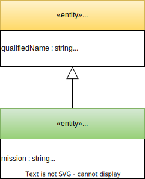
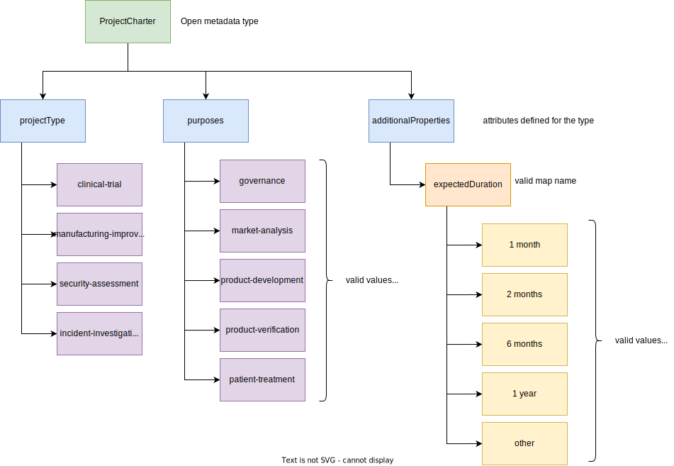

<!-- SPDX-License-Identifier: CC-BY-4.0 -->
<!-- Copyright Contributors to the Egeria project 2020. -->

# Defining valid values for your open metadata

The [open metadata types](/types) include properties that are string values.  These string values give you freedom and flexibility to add the values you want.  However, arbitrary strings can make automation hard, and you may want to set up some more formal definitions of the values that should be used.

Consider the [*ProjectCharter*](/types/4/0442-Project-Charter) entity type shown below.  




In addition to the *qualifiedName* and *additionalProperties* attributes inherited from [*Referenceable*](/types/0/0010-Base-Model), this type adds in three new attribute to the properties of a ProjectCharter instance:

* *mission*
* *projectType*
* *purposes*

The *mission* property is likely to be free-form text laying out the reasons and aspirations behind the project.  However, the *projectType* and the *purposes* may be used by automated processes - or may trigger people to perform certain tasks.  Having free-form text may lead to errors and misunderstandings if the values are filled out incorrectly.  Therefore, Egeria supports the ability to set up lists of valid values for particular properties in open metadata.

Part of the planning process is to consider which metadata properties should have restricted values and which can be free-form text. Setting these values up early avoids reworking the metadata values later.

## Specialized valid metadata values

Some properties have special types for maintaining valid value lists.

* The governance *domainIdentifier* property can be set up in the [Governance Domain Descriptions](/guides/planning/governance-program/overview/#governance-domains).
* The [governance zones](/concepts/governance-zone) are set up using the [Governance Zone](/services/omas/governance-program/overview/#governance-classification,-tagging-and-linking) entity.
* The *statusIdentifiers* used in many governance-related entities, relationships and classifications can be defined using the [GovernanceStatusLevel](/services/omas/governance-program/overview/#governance-status-identifers) entity.

These specialist valid value lists provide context and a place to attach governance definitions that indicate how elements using these values should be governed.

## Creating your own valid value sets for open metadata

For other metadata properties it is possible to set up *valid metadata value sets*.  These list the values that are expected in a particular property and provide validation checks.

There are three types of valid metadata values:

* Values for string attributes.
* Values for arrays of string attributes.
* Values for maps of string attributes.

In the *ProjectCharter* type shown above:

For example, consider these valid values for the *ProjectCharter* type:



This is how they would appear in an instance of a project charter


Valid metadata values can either be set up in an [open metadata archive](/concepts/open-metadata-archive), or through the [OpenMetadataClient](https://odpi.github.io/egeria/org/odpi/openmetadata/accessservices/governanceprogram/client/OpenMetadataStoreClient.html) available on most [Open Metadata Access Services (OMASs)](/services/omas).


The code snippet below shows how to set up the strings "incident-investigation" and "clinical-trial" as a specific valid values for the *projectType* property of *ProjectCharter*.

```java
OpenMetadataStoreClient client     = new OpenMetadataStoreClient(serverName, serverPlatformRootURL);

ValidMetadataValue validMetadataValue = new ValidMetadataValue();

validMetadataValue.setDisplayName("Incident Investigation");
validMetadataValue.setPreferredValue("incident-investigation");
validMetadataValue.setDescription("An investigation into the causes, effects and remedies for a detected incident.");

client.setUpValidMetadataValue(userId, "ProjectCharter", "projectType", validMetadataValue);

validMetadataValue.setDisplayName("Clinical Trial");
validMetadataValue.setPreferredValue("clinical-trial");
validMetadataValue.setDescription("A controlled validation of the efficacy of a particular treatment with selected patients.");

client.setUpValidMetadataValue(userId, "ProjectCharter", "projectType", validMetadataValue);

```
The next code snippet shows how to retrieve information about a single valid value.

```java
validMetadataValue = client.getValidMetadataValue(userId, "ProjectCharter", "projectType", "clinical-trial");
```
This next code snippet shows how to retrieve all the valid values for `projectType`:
```java
List<ValidMetadataValue> validMetadataValues = client.getValidMetadataValues(userId, "ProjectCharter", "projectType", 0, 0);

System.out.println("Valid values for property projectType in entity ProjectCharter");
for (ValidMetadataValue retrievedValue : validMetadataValues)
{
    System.out.println(" ==> " + retrievedValue.getPreferredValue() + " means " + retrievedValue.getDisplayName() + ": " + retrievedValue.getDescription());
}
```
This final snippet shows how to validate a valid value:
```java
if (! client.validateMetadataValue(userId, "ProjectCharter", "projectType", "incident-investigation"))
{
    /*
     * Add error handling here ...
     */
}
```

--8<-- "snippets/abbr.md"
