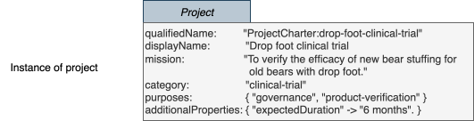

<!-- SPDX-License-Identifier: CC-BY-4.0 -->
<!-- Copyright Contributors to the Egeria project 2020. -->

# Defining valid values for your open metadata

The [open metadata types](/types) include attributes that are string values.  These string values give you freedom and flexibility to add the values you want.  However, arbitrary strings can make automation hard, and you may want to set up some more formal definitions of the values that should be used.

Consider the [*Project*](/types/1/0130-Projects) entity type shown below.  


In addition to attributes such as *qualifiedName*, *category* and *additionalProperties* inherited from [*Referenceable*](/types/0/0010-Base-Model), this type adds multiple attributes to the properties of a ProjectCharter instance such as:

* *mission*
* *purposes*
* *projectPhase*
* *projectStatus*
* *projectHealth*


The *mission* attribute is likely to be free-form text laying out the reasons and aspirations behind the project.  However, the *category* and the *purposes* may be used by automated processes - or may trigger people to perform certain tasks.  

Having free-form text in such attributes may lead to errors and misunderstandings if the values are filled out incorrectly.  Therefore, Egeria supports the ability to set up lists of valid values for particular properties in open metadata.

Part of the planning process is to consider which metadata attributes should have restricted values and which can be free-form text. Setting these values up early avoids reworking the metadata values later.

## Valid value sets for open metadata

Egeria uses [ValidValueDefinition](/types/5/0545-Reference-Data) entities to manage valid values for Open Metadata.  
There are three types of valid metadata values:

* Lists of values for string attributes and for array of strings (array<string>) attributes.
* Values for the map names found in attributes that map from name to string value (map<string, string>).
* Values for the map values found in attributes tha map from name to string value (map<string, string>).

These valid values can be set up for all types that support this property; or it can be restricted to a specific type.

For example, in the *Project* type shown above:

* *category* is a string.  Valid values for this are typically used with any type.
* *purposes* is an array of strings.
* *additionalProperties* is a map from a string name to a string value.  Although it is supported by the many types that inherit from *Referenceable*, it is possible to define map names and values just for *Project* instances.

The diagram below shows possible valid values for these attributes:


> Valid values for Project attributes

The *category* attribute can only take a single string, so it could be set to either "clinical-trial" or "manufacturing-improvement" or "security-assessment" or "incident-investigation".

The *purposes* attribute takes a list of strings which can include any or all of the following values: "governance", "market-analysis", "product-development", "product-verification", "patient-treatment".

The *additionalProperties* can have an entry in its map of "expectedDuration" that can be mapped to one of the following: "1 month", "2 months", "6 months", "1 year", or "other".  The "expectedDuration" is called a *mapName* and the values "1 month", "2 months", "6 months", "1 year", and "other" are called the *mapValues*.

This is how these values could appear in an instance of a project charter:



Valid metadata values can either be set up in an [open metadata archive](/concepts/open-metadata-archive), or through the [Valid Metadata OMVS](/services/omvs/valid-metadata/overview) API, or through the [Valid Metadata Values Client](https://odpi.github.io/egeria/org/odpi/openmetadata/frameworks/openmetadata/connectorcontext/ValidMetadataValuesClient.html) accessed through a connector's context.

### Code samples

The code snippets below shows how to set up the strings "incident-investigation" and "clinical-trial" as a specific valid values for the *category* property.  The first parameter is set to null to indicate that these values are valid for category in any type.

```java
ValidMetadataValueClient client     = context.getValidMetadataValueClient();

ValidMetadataValue validMetadataValue = new ValidMetadataValue();

validMetadataValue.setDisplayName("Incident Investigation");
validMetadataValue.setPreferredValue("incident-investigation");
validMetadataValue.setDescription("An investigation into the causes, effects and remedies for a detected incident.");

client.setUpValidMetadataValue(null, "category", validMetadataValue);

validMetadataValue.setDisplayName("Clinical Trial");
validMetadataValue.setPreferredValue("clinical-trial");
validMetadataValue.setDescription("A controlled validation of the efficacy of a particular treatment with selected patients.");

client.setUpValidMetadataValue(userId, null, "category", validMetadataValue);

```
The next code snippet shows how to retrieve information about a single valid value.

```java
validMetadataValue = client.getValidMetadataValue(userId, 
                                                  "Project", 
                                                  "category", 
                                                  "clinical-trial");
```
This next code snippet shows how to retrieve all the valid values for `category`:
```java
List<ValidMetadataValue> validMetadataValues = client.getValidMetadataValues(userId, 
                                                                             "ProjectCharter", 
                                                                             "category", 
                                                                             0, 
                                                                             0);

System.out.println("Valid values for property category in entity Project");
for (ValidMetadataValue retrievedValue : validMetadataValues)
{
    System.out.println(" ==> " + retrievedValue.getPreferredValue() + " means " + retrievedValue.getDisplayName() + ": " + retrievedValue.getDescription());
}
```
This final snippet shows how to validate that an actual value from an instance (*actualValue*) is a valid value:
```java
if (! client.validateMetadataValue(userId, "Project", "category", actualValue))
{
    /*
     * Add error handling here ...
     */
}
```

### Predefined valid metadata values

The `CoreontentPack.omarchive` includes valid value definitions for the [*deployedImplementationType*](/concepts/deployed-implementation-type), [*fileType*](/concepts/file-type), [*fileName*](/types/2/0220-Files-and-Folders) and [*fileExtension*](/types/2/0220-Files-and-Folders) properties.  These values can be used to control the values stored in these properties.  They are also linked with each other and other metadata elements:

* The *deployedImplementationType* valid values are used to provide an index of connectors, templates and other resources that support specific types of technology.  The [Automated Curation OMVS](/services/omvs/automated-curation/overview) provides an API to query these valid values and the linked resources.

* The *fileType*, *fileName* and *fileExtension* valid values are used by the [file connectors](connectors/#files) that survey and catalog files in the file system.  They allow the known files to classified in various way to increase the insight into the files available to the organization.

These values can be updated and augmented to match the needs of your organization.

## Connector specifications

Valid metadata values can also be used to define the properties that control the behaviour of [connectors](/concepts/connector).  They are defined in the connector's [connector provider](/concepts/connector-provider).

The first two values can be specified by any type of connector:

* *supportedTemplate* - Description of a template that should be used by the connector when creating new elements of a certain type.
* *supportedConfigurationProperty* - Description of a configuration property that is used to affect the behaviour of a connector.

The next set of values may be specified by any type of [governance service](/concepts/governance-service):

* *supportedRequestType* - Description of a request type used to describe a request to a governance engine/service.
* *supportedRequestParameter* - Description of a request parameter that is used to affect the behaviour of a governance service.
* *supportedActionTarget* - Description of an element that is linked to a governance action request.  The resulting call to the governance engine/service will work with this element.
* *producedRequestParameter* - Description of a request parameter that is produced by a governance service and is used to affect the behaviour of the next governance service(s) called in the same governance action process.
* *producedActionTarget* - Description of an element that is produced by a governance service and is passed to the next governance service(s) called in the same governance action process as an action target.
* *producedGuard* - Description of a guard that is returned by a governance service when it completes.

A [survey action service](/concepts/survey-action-service) may also specify:

* *supportedAnalysisStep* - Description of an analysis step supported by a survey action service.
* *producedAnnotationType* - Description of a type of annotation produced by a survey action service.

## Template requirements

[Templates](/features/templated-cataloguing/overview) also use value values to guide users of the template.  They define which values need to be supplied in order to use the template successfully.

There are two types of values:

* *replacementAttribute* - Name of attribute that should be provided when using the attached template.  Replacement attributes map to the root entity of the template, or, the first occurrence of the attribute in attached relationships, classifications or entities.
* *placeholderProperty* - Placeholder names are located through the attribute values found in a template.  They are identified with double braces, for example {{variableName}}.  The value supplied is substituted for the placeholder variable.


--8<-- "snippets/abbr.md"
