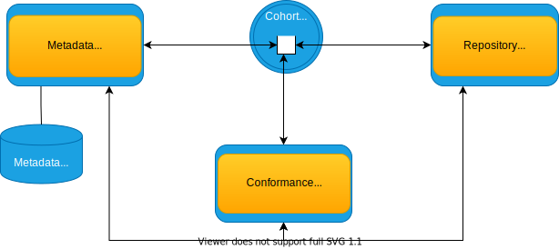

<!-- SPDX-License-Identifier: CC-BY-4.0 -->
<!-- Copyright Contributors to the Egeria project. -->

# Key concepts

To further explain some key concepts of Egeria, let us delve deeper into the technology.

> **Figure 1:** This picture shows the different types of Egeria's OMAG servers and how they are connected together in a solution.  They are not all required. You choose which ones you need, and how many of them to run, to match the needs of your organization.  The servers are organized into three rings.  In the inner-ring (labeled *Integrated Metadata*), a Metadata Access Server, Repository Proxy and Conformance Test Server are members of an *Open Metadata Repository Cohort*, or "cohort" for short, communicating via Egeria's peer-to-peer protocols. In the next ring out, called *Integrated Governance*, are the Governance Servers connected to the Metadata Access Server in order to access metadata in the open metadata ecosystem. In the outer ring, called *Governance Solution*, are the View Server and Presentation Server also connected to the Metadata Access Server.

--8<-- "snippets/getting-started.md"

## Cohorts

In figure 1, the inner ring, titled *Integrated Metadata*, illustrates the exchange of metadata between metadata servers. The servers are connected together through an *[Open Metadata Repository Cohort](/concepts/cohort-member)* or just *cohort* for short.

A cohort[^1] can support information exchange among many metadata servers: both internal to Egeria and third party. A cohort is a group of servers that are exchanging metadata using a peer-to-peer replication protocol and federated queries.

The cohort is self-configuring. At the core it is between one and four shared topics. Each server publishes a registration request on the appropriate topic when they want to join. This is picked up by the existing members who add this new server to their [registry of members](/concepts/cohort-registry) and re-send their registration through the same topic to allow the new member to build up its own registry of cohort members.

!!! tip "There is no central cohort controller"
    Note that there is no central cohort control or coordination logic: the registration and so on are all handled in a peer-to-peer manner with each participant communicating with all other participants.  The [cohort operations](/features/cohort-operation/overview) feature describes the protocol in more detail.

When a server permanently leaves the cohort, it sends an unregistration request. This enables the other members to remove the parting member from their registries.

### Federation

The purpose of the registry in each member is to configure its federated query capability. The registration information includes the URL root and server name of the member. The federation capability in each OMAG Server allows it to issue metadata create, update, delete and search requests to each and every member of the cohort. This is the primary mechanism for accessing metadata from the open metadata ecosystem.

### Replication

In addition, any change to metadata made by a member is replicated to the other members of the cohort through the relevant cohort topic. This gives the other members an opportunity to maintain cached copies of the metadata for performance / availability reasons.

!!! tip "Refresh requests"
    A member may also request that metadata is "refreshed" across the cohort. The originator of the requested metadata then sends the latest version of this metadata to the rest of the cohort through the cohort topic. This mechanism is useful to seed the cache in a new member of the cohort and is invoked as a result of a federated query issued from the new member. (For example, a federated query occurs automatically whenever an [Open Metadata Access Service (OMAS)](/services/omas) makes a request for metadata.)

### Exchange protocol

The exchange of metadata uses the [cohort events](/concepts/cohort-events) to give fine-grained metadata notifications and updates[^2]. The server's [metadata security connector](/features/metadata-security) provides fine-grained control on which metadata is sent, received and/or stored by the server. This level of control is necessary for metadata repositories that are managing specific collections of valuable objects such as [assets](/concepts/asset).

### Members

A third party metadata server can embed the Egeria libraries in its own runtime or, more commonly, use a special OMAG Server called the [Repository Proxy](/concepts/repository-proxy) to host connectors that map between the events and APIs of the third party metadata server and the Open Metadata events and APIs. The Repository Proxy manages all the interaction with the other members of the cohort.

The cohort protocols are peer-to-peer and the membership is dynamic. When a third party metadata server connects to the cohort, either directly or through its Repository Proxy, it automatically begins receiving metadata from all the other members. When it shares metadata, it is shared with all the other members. Each member is free to choose what to share and what to process from the other members of the cohort.

Other types of OMAG Servers that can be members of the cohort:

- The [Metadata Access Server](/concepts/metadata-access-server) supports Egeria's [Open Metadata Access Services (OMAS)](/services/omas), or access services, for short. These access services provide specialized APIs and events for different types of technologies.  The Metadata Access Server optionally provides a *native metadata repository* that supports any type of open metadata. It is a valuable member of the cohort because it is a metadata gap-filler.  By that we mean that is can store relationships between metadata from different third party repositories along with additional types of metadata not supported by any of the third party metadata repositories. It may optionally have the access services enabled so it can also act as a metadata access point.
- The [Conformance Test Server](/concepts/conformance-test-server) is used to verify that a member of the cohort is operating correctly. It is typically only used in test environments because it sends out a lot of test metadata on the cohort and validates the responses from the cohort member it is testing.

## Integrating metadata into solutions

The Metadata Access Server is the bridge to the Governance Servers (the middle ring in Figure 1).   The Governance Servers provide active metadata exchange and governance of any type of third party technology, not just metadata servers. We call this *integrated governance*.

For the most part, Egeria is a background technology. However, once metadata is being exchanged and linked, new *governance solutions* may emerge that bring value directly to individuals working in an organization. Therefore, we have added servers to support browser-based user interfaces:

- The [View Server](/concepts/view-server) provides REST APIs specifically for user interfaces. They are consumed by the Egeria UIs but can also be used by other UIs and tools.
- The [Presentation Server](/concepts/presentation-server) hosts the JavaScript applications that provide an interactive browser-based user interface for Egeria.

## Metadata objects

Metadata inside the open metadata ecosystem is broken down into small metadata objects.  For Egeria, the level of granularity of the metadata objects broadly splits between:

- The granular [Open Metadata Repository Service (OMRS)](/services/omrs) level, used for the cohort's underlying metadata federation, replication and exchange.
- The more coarse-grained [Open Metadata Access Services (OMASs)](/services/omas) level, where most tool-oriented and user-oriented consumption would occur.

### Metadata elements

At the more coarse-grained level of the access services' metadata objects are simply referred to as *metadata elements*. Each access service describes its own model for the metadata elements it handles, and the access service itself determines how these coarse-grained representations are transformed to and from the more granular representations described below.

### Metadata instances

--8<-- "docs/introduction/metadata-instances.md"

### Metadata types

Every metadata *instance* is linked to an [open metadata type definition](/guides/developer/repository-connectors/metamodel/overview#type-definitions) (sometimes referred to as a *TypeDef*) that describes what it represents and the properties that further describe and differentiate it from other instances of that same type.

!!! tip "TypeDef inheritance"
    TypeDefs can inherit from other TypeDefs from the same category: open metadata supports single inheritance.

??? example "An example: GlossaryTerm, RelationalColumn and SemanticAssignment"
    For example, `GlossaryTerm` is a type of entity that can be used to describe a specific term of business vocabulary. As a type of entity, `GlossaryTerm` is defined using an `EntityDef` (a subtype of `TypeDef` specific to entities). It has a number of properties like a `displayName`, itself defined as a `PrimitiveDef` of type string. And `GlossaryTerm` as a type extends a base entity type called `Referenceable` which defines common characteristics that many entities possess such as a `qualifiedName` (another `PrimitiveDef` of type string).

    `RelationalColumn` is another example of an entity, in this case one that can be used to describe relational database columns. Once again it is defined using an `EntityDef`, has a number of properties, and also extends the base type called `Referenceable` and therefore also gains common properties like the `qualifiedName`.

    Finally, let's consider a different type: `SemanticAssignment` is a type of relationship that can be used to describe the meaning of something. Because it is a type of relationship, it is defined using a `RelationshipDef` (another subtype of `TypeDef`, this time specific to relationships). As a relationship, the RelationshipDef defines the entities that it can inter-relate: in this example a `GlossaryTerm` and any other `Referenceable` (for example, a `RelationalColumn`).

??? question "Where are the types modeled?"
    The type definitions are described in detail in the [Open Metadata Types](/types) reference area, and the canonical definitions ultimately [live in the code itself :material-github:](https://github.com/odpi/egeria/tree/main/open-metadata-resources/open-metadata-archives/open-metadata-types/src/main/java/org/odpi/openmetadata/opentypes){ target=gh }.

### Homed metadata

The metadata repository where a metadata instance is created is called its *home repository*. Metadata in its home repository is **mutable**: it can be updated and deleted.

!!! tip "Each instance of metadata can be independently homed"
    Note that each instance of metadata -- whether an entity, relationship or classification -- can be homed independently of any other instance of metadata. For example: if we have a business vocabulary term `Address` that is related to a relational database column `ADDR` and given a `Confidentiality` classification, each of these could be homed in a different repository. That is, `Address` (entity) could be homed in repository A, `ADDR` (another entity) in repository B, the relationship between them in repository C, and the `Confidentiality` classification in repository D.

    As such, not only can a query for metadata be federated, but indeed even the holistic representation of a given piece of metadata (its instance and directly-related instances) is federated across the cohort.

The [Open Metadata Repository Services (OMRS)](/services/omrs) is responsible for sharing this metadata with other metadata repositories who are members of the same cohort.

### Reference copies

The shared copies are called *reference copies* and are read-only (**immutable**). Update requests to a reference copy are automatically redirected to the home repository by the OMRS, without the caller being aware.

!!! tip "Distinguishing homed metadata from reference copies"
    Every metadata repository in a cohort has a unique identifier called the [*local metadata collection id*](/concepts/metadata-collection-id). This identifier is set up in the server configuration and shared when this server connects to a cohort.

    When metadata is shared by OMRS, each instance is tagged with the metadata collection id of its home repository. OMRS is able to route update requests to the right server by comparing the metadata collection id in the metadata instance with the cohort registration information passed between members of the cohort when they connect.

### Unique identifiers (GUIDs)

Every open metadata instance has a unique identifier called the GUID.

!!! attention "GUIDs must be unique"
    This identifier needs to be globally unique -- so even if two metadata repositories simultaneously created a metadata instance about the same thing, the GUIDs of these two instances should be different.

    For example, in Egeria new GUIDs are created using the `UUID.randomUUID().toString()` method to produce something like: `87b06ffe-9db2-4ef5-ba6e-8127480cf30d`

    Egeria does not mandate the use this or any other particular algorithm for generating GUIDs, only that the principle of uniqueness is adhered to.

There should be, at most, a *tiny* chance[^3] that two servers will generate the same GUID. Egeria expects this to be exceedingly rare, but not impossible, and therefore if it does happen it is detected by the [repository services](/services/omrs) and at a minimum messages are output on the detecting server's audit log. The repository services also have APIs for re-identifying (changing the GUID) for a metadata instance to automate the resolution of such conflicts. We can expect that such an operation could be resource-intensive; however, this is balanced against the exceeding rareness with which it should need to be used.

## Conformance

Adhering to these concepts and the principles by which they behave is the subject of *conformance*. Egeria provides an [automated testing suite to validate that a given repository or third party integration behaves according to these expectations](/guides/cts/overview), the successful completion of which is a necessary input to a tool being granted the use of an Egeria conformance mark.

--8<-- "snippets/getting-started.md"

[^1]: You may want to see the [cohort interactions walk through](/features/cohort-operation/overview) for more details on how cohort participants interact.
[^2]: You may want to see the [OMRS metamodel](/guides/developer/repository-connectors/metamodel/overview) for more details on the granularity of metadata exchange.
[^3]: The rarity will depend on the specific algorithm used, but as an example the algorithm used within Egeria generates type 4 UUIDs, for which the [probability of a collision is so small that it can almost be ignored :material-dock-window:](https://en.wikipedia.org/wiki/Universally_unique_identifier#Collisions){ target=wiki }. But as it is not *impossible*, Egeria does still provide the mechanisms to detect and resolve such conflicts.

--8<-- "snippets/abbr.md"
