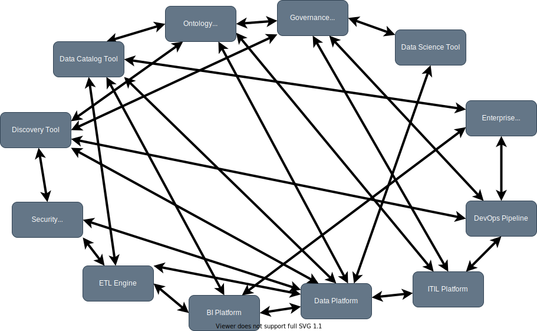
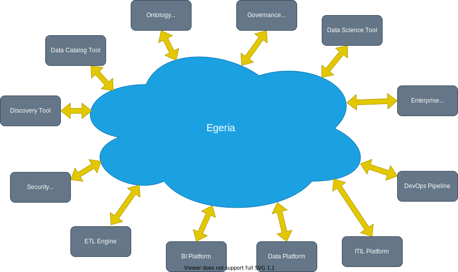
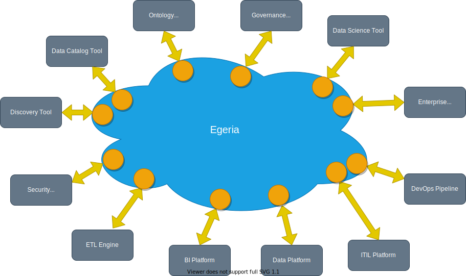

<!-- SPDX-License-Identifier: CC-BY-4.0 -->
<!-- Copyright Contributors to the Egeria project. -->

# Our solution (overview)

Although it is desirable to synchronize metadata between the tools and platforms used by an organization, there are so many technologies, each using a different format, naming conventions and interfaces, that it would be a complex and expensive project to build point-to-point metadata exchange integrations between them.

Using Egeria, you only need to link each tool to Egeria, and it is Egeria that manages the complexity of the metadata exchange.

Each tool is linked via an Egeria service (orange circles), tailored for that specific type of tool.  The tool may call the service directly, or Egeria will host a connector that converts from the specific formats, naming conventions and interface of the specific tool and the open standards and interfaces of Egeria.

Behind the scenes, Egeria manages the exchange of metadata using a variety of techniques to ensure this occurs in the most efficient and timely manner possible.

Although Egeria is shown above as a centralized solution, it is implemented as a distributed solution.
 
Today's organizations have their tools and technologies distributed across multiple data centres and cloud providers (green clouds). Each of these locations may be managed by different groups and use different technologies.  This makes a centralized metadata solution impractical from both a funding and operational perspective.

Using Egeria, each location runs a [platform (blue boxes)](/concepts/omag_server_platform) that hosts [servers](/concepts/omag_server) (orange circles) that provide the synchronization services tailored to specific types of tools (grey boxes).

--8<-- "snippets/getting-started.md"

## What is included in Egeria

### Open Metadata Types

Egeria defines a set of open [metadata types](/types) that provide the common language that is used to represent metadata in the Egeria ecosystem.  This type system is deliberately comprehensive to maximize the opportunity of seamless metadata exchange.  However, the type system is extensible, so it is able to support any special needs of your organization.

### Frameworks

Egeria's [frameworks](/frameworks) define the interfaces and protocols for pluggable components that enable Egeria to run in many environments and connect to many types of technologies. These pluggable components are called [connectors](/concepts/connector).  Egeria has a [catalog of pre-built connectors](/connectors) to help speed up your adoption of open metadata and governance.

### Services

Egeria's [services](/services) provide specialized APIs and event exchange protocols to support the major types of tools and platforms.

### Metadata governance

Finally, as metadata is exchanged, the duplication, gaps and inconsistencies of the metadata in an organization's tools and platforms is exposed.  Egeria provides [metadata governance features](/features) to dynamically improve the quality of your metadata in an ongoing and systematic manner.

### OMAG Server Platform

Egeria's platform (the blue boxes) is called the [*Open Metadata and Governance (OMAG) Server Platform*](/concepts/omag-server-platform).

The OMAG Server Platform is a multi-tenant platform that supports horizontal scale-out in Kubernetes and yet is light enough to run as an edge server on a Raspberry Pi. This platform is used to host the actual metadata integration and automation capabilities.

### OMAG Servers

Within an instance of the *OMAG Server Platform*, one or more [*OMAG Servers*](/concepts/omag-server) can be configured (the orange circles). These servers are collections of activated integration services that host connectors to the different technologies with which Egeria exchanges metadata.

!!! summary "Summary"
    The OMAG Server Platforms and their variety of OMAG Servers provide an enterprise metadata service of data and IT resources that are transparently assessed, governed and consumed through many types of tools and technologies. The metadata is not physically-centralized, but instead it is composed of metadata repositories from many tools and technologies that are operating together via Egeria.

!!! question "Why open source?"
    Delivering this capability as open source is a critical part of the project, since multiple vendors must buy into this ecosystem. They are not going to do this if one organization dominates the technology base. Thus, the open metadata and governance technology must be freely available with an open source governance model that allows a community of organizations and practitioners to develop and evolve the base, and then use it in their offerings and deployments.

--8<-- "snippets/getting-started.md"

--8<-- "snippets/abbr.md"
