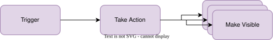
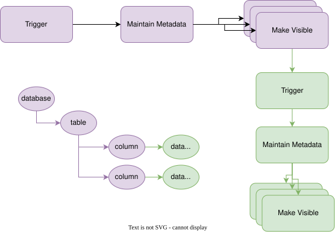
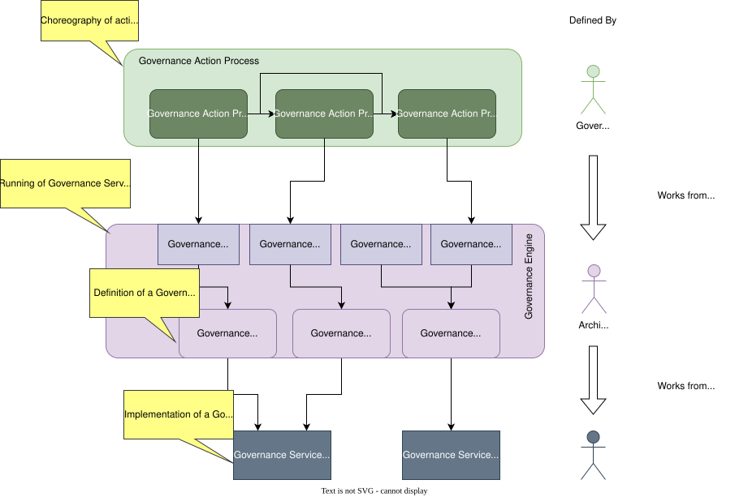
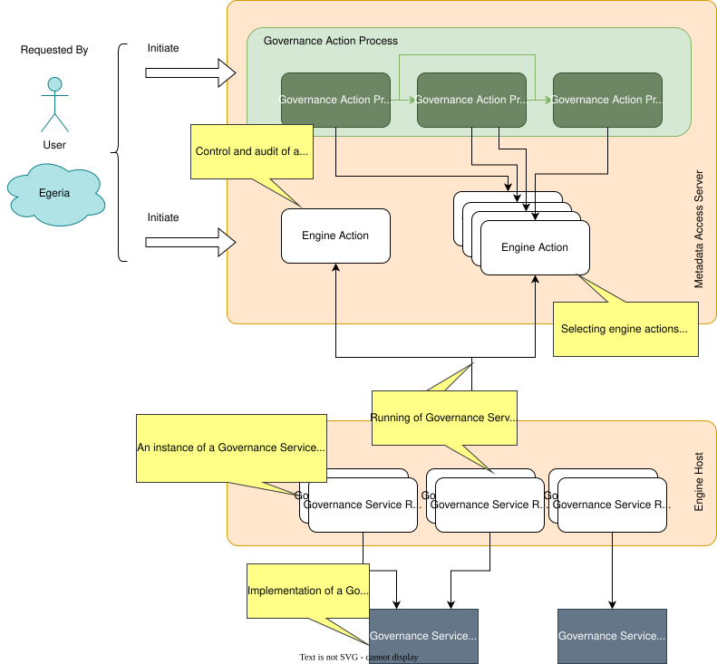
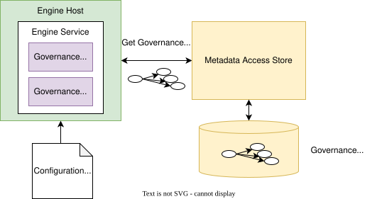
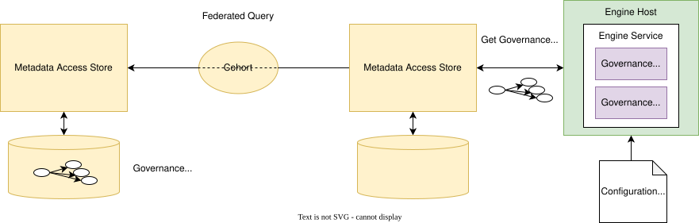
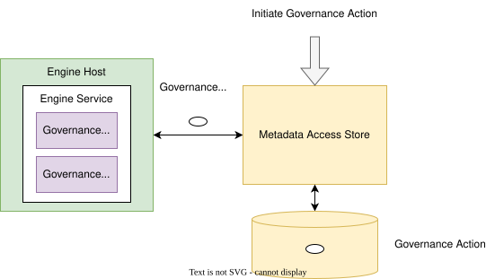
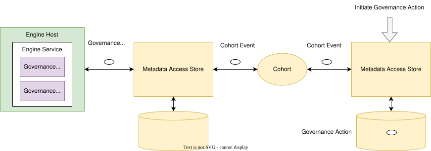

<!-- SPDX-License-Identifier: CC-BY-4.0 -->
<!-- Copyright Contributors to the ODPi Egeria project 2020. -->

# Egeria for Metadata Governance

## The importance of metadata governance

Data, and the metadata that describes it, enables individuals and automated processes to make decisions.  As the trust grows in the availability, accuracy, timeliness, usefulness and completeness of the data/metadata, its use increases and your organization sees greater value.

## Building trust

Trust is hard to build and easy to destroy.  Maintaining trust begins with authoritative sources of data/metadata that are actively managed and distributed along well known information supply chains.  This flow needs to be transparent and reliable - that is, explicitly defined and verifiable through monitoring, inspection, testing and remediation.  It needs to be tailored to meet the specific needs of its consumers.

Consider this story ...

!!! example "A tale about trust"
    Sam bought a new house in a little village that was 10 miles from where he worked.  He is keen to live sustainably and was delighted to hear from his new neighbours that there was a good bus service that many of them used to get to work.

    Sam stopped by the bus stop to look up the bus times for the next day.

    Next morning he left in plenty of time.  He was surprised there was no-one there waiting for the bus.  No bus came for nearly an hour, making him late for work.  He asked the driver what happened to the earlier bus.  He said he was not aware there was any problem.

    Once at work he called the bus company.  The clerk who answered the phone laughed and said that the timetable at the bus stop was out of date.  The local council required them to display a timetable so the one that was there was from last year.  It was ok because everyone knew the timetable.

    Annoyed, Sam asked where he could get an up-to-date timetable for the bus.  The clerk did not know but suggested he call head office and was nice enough to give him with the telephone number.  It took a number of calls to find the right person, who then willingly dictated the times to him.  Sam asked how often the bus times changed and how he could keep up-to-date.  He was told that changes occurred infrequently and when they did, the bus driver would announce it.   Sam could also ring back to check for changes from time to time.

Is there any problem with the way that the bus company is operating?  How confident do you think Sam is that the bus company will provide a reliable service to get him to work every day?  What is the impact if Sam buys a car or uses a bike because he decides the bus company is not to be trusted?

!!! info "Some thoughts on the case ..."
    Sam is likely to conclude that the bus company does not care about its customers - and is not focused on attracting new business by encouraging people to try new routes.  This suggests it is doomed in the long run. If he misses the bus again because the bus times change then he is motivated to look for alternative solutions.

    **His perception of the quality of the bus service is as much affected by the quality of information about the buses as the actual frequency and reliability of the service itself.**

If we translate this story to the digital world, organizations often provide shared services and/or data sets that other parts of the business rely on.  It is not sufficient that these services/data sets are useful with high availability/quality.  If potential consumers can not find out about them, or existing consumers are disrupted by unexpected change, then the number of consumers will dwindle as they seek their own solutions, and the shared service looses relevance to the business.

The team providing the shared service should consider the documentation about it to be a key part of their deliverables.  Capturing this documentation as metadata and publishing it to the open metadata ecosystem increases its findability and comprehensibility.

!!! example "Meanwhile, back at the bus company ..."
    The managing director hears of Sam's experience and wants to understand how widespread a problem it is.  She discovers that no-one is specifically responsible for keeping the timetables up-to-date at the bus stops, or ensuring up-to-date timetables are available for download/pick up.  She discovered a few conscientious souls that update the bus timetable at the bus stops they personally use.  However, across their network, the information supplied at the bus stops was misleading because it was out-of-date.

It is often the case that if something is not being done, either:

* no-one is responsible for it, or
* it is very low on the priorities of the person who is responsible for it, or
* the person responsible for it does not have the resources to do the work.

Therefore, step one in solving such a problem is to appoint someone who is responsible for it, and ensure they have the motivation and resources to do the work.

In metadata governance, we refer to the person responsible for ensuring that metadata about a service or dataset is complete, accurate and up-to-date as the *owner*.  The owner may not personally maintain the metadata since this may be automated, or be handled by others.  However, if there are problems with the metadata, the owner is the person responsible for sorting it out.

!!! example "Fixing the bus timetables"
    The managing director considered the inaccurate bus timetable information as a serious problem that urgently needed fixing.  She discovered that the manager responsible for scheduling the bus drivers' shifts was the one who made changes to the timetable.  These changes typically occurred whenever there was a persistent difficulty in assigning a bus driver to a route.  Whenever this happened, he briefed the affected driver with the change and asked that they disseminate the information to their passengers.

    The bus drivers' manager was given ownership for ensuring the bus timetables were accurate at each bus stop since he was responsible for the action that triggered a need to update the timetables.  He also understood the scope of any change.

    The bus drivers' manager was given a new assistant.  Part of the assistant's role was to make changes to the master timetables when necessary, arrange for the downloadable timetables to deliver the new version, get printed copies to the bus station and tourist information office and add an article to the local paper describing the change.  They would also drive around to the affected bus stops and update the timetable as well as ensure the affected buses had new copies of the bus timetable onboard for their regular customers.

In the example above, the managing director identified where the action was occurring that should trigger the change.  She assigned an owner and ensured they had the resources (ie the new assistant) to ensure the updates were done.

When a change to the timetable occurred, the bus drivers' manager triggered the assistant to update the master bus timetable.  The updated timetable was then transformed into multiple formats and disseminated to all the places where their customers are likely to notice the change.  Their challenge is to both create awareness that the change has happened and provide the updated information.

## Metadata governance three-step process

We can generalise this process as follows, creating a reusable specification pattern for all forms of governance:

> A three-step specification pattern of *Trigger*, *Take Action* and *Make Visible*.

For metadata governance, the *Take Action* is typically an update to metadata.   For example, if a new deployment of a database occurs in the digital world, it could trigger a metadata update to capture any schema changes and then information about these changes is disseminated to the tools and consumers that need the information.

The dissemination of specific changes to metadata can also act as a trigger for other metadata updates.  For example, the publishing of changes to a database schema could trigger a data profiling process against the database contents.  The data profiling process adds new metadata elements to the existing metadata, and hence the knowledge graph of metadata grows.

The specification pattern above applies whether the governance is manual or automated.  All that changes is the mechanism.

Triggers may be time-based, or an unsolicited update to metadata by an individual.  For example, data profiling may be triggered once a week as well as whenever the schema changes.  A comment attached to a database description that reports errors in the data may trigger a data correction initiative.

Consider metadata as a collection of linked facts making up a knowledge graph that describes the resources and their use by the organization.  The role of the tools, people and open metadata technology is to build, maintain and consume this knowledge graph to improve the operation of the organization.

!!! example "Enriching customer service"
    The managing director of the bus company picks up a changing perspective in the head office employees since the implementation of the bus timetable management process.  Rather than a focus on running the buses, there is a growing understanding that they are providing a service to their customers.

    Eager to build on this change, the managing director encourages her employees to bring forward ideas that increase their customer service.  These ideas include disseminating information about local events (along with information about to get to the event by bus, of course :)).

    As a result, the bus timetables began to include a calendar of local events.  Event organizers were able to register their events with the bus company and negotiate for additional buses where necessary.  New bus routes are identified and begin to operate.  The effect is that the bus company became an active member of the community, with increasing bus use and associated profits.

When metadata governance is done well, a rich conversation develops between service providers and their consumers that can lead to both improvements in the quality of the services and the expansion in the variety and amount of consumption; the real value of the service is measured by consumption.

New uses for the services will then emerge ... growing the vitality and value to the organization.

## Automating metadata governance

Although some decision will need to be taken by authorized people, the more that can be automated, the more cost-effective the governance will be.

The building industry has the principle of *shearing layers* in the design of a building.  This principle is as follows:

*... Things that need to change frequently should be easy to change.  Those aspects that change infrequently can take more effort and time.*

In Egeria, the shearing layer principle is evident in the design of automated governance.  An organization that is maturing their governance capability needs to be able to move fast.  These automations need to be quick to create and quick to change.  There is no time to wait for a software developer to code each one.

Egeria defines flexible components called [governance services](/concepts/governance-service) that can be re-configured and reused in many situations.  Collectively the governance services form a pallet of configurable governance functions.  The governance team link them together into a new process every time they need a new governance automation.

The advantage of this approach is the ability to rapidly scale out your governance capability.  The downside is that there are more moving parts and concepts to understand.

The diagram below summarizes how Egeria's governance automation works.  Descriptions of each layer follows the diagram.

??? info "At the base are the governance service components"
    Governance services are [coded in java](/guides/developer/#extending-egeria-using-connectors) and packaged in Java Archives (Jar files).  They need to be passed information about the function to perform and the metadata elements on which to operate since this will different each time they are called.

    Part of the implementation is a [connector provider](/concepts/connector-provider) that is able to return a description of its governance service in the form of a [connector type](/concepts/connector-type).  The connector type provides information about how to configure and run the governance service.   This includes:

    * A description of the connector's function
    * Names of *configuration properties* that can modify the behaviour of the governance service.
    * A list of *request types* that select which function it is to perform.
    * Names of *request parameters*  that can be supplied (typically by the caller) that can override the configuration properties and/or provide the identifier(s) of any metadata element(s) to work on.
  
    * Names of supported action targets that provide links to the metadata element(s) to work on.  The [action target](/concepts/action-target) mechanism is typically used when governance services are being called in a sequence from a governance action process.  The action targets are used to pass details of the metadata elements to work on from service to service.

??? info "The governance service definitions"
    The JAR file is added to the CLASSPATH of Egeria's [platform](/concepts/omag-server-platform) where is can be loaded and inspected.  The architect extracts the connector type of the governance service implementation and creates at least one governance service definition for it.  The governance service definition is metadata that includes a [GovernanceService](/types/4/0461-Governance-Engines) entity, a [Connection](/types/2/0201-Connectors-and-Connections) entity and a [ConnectorType](/types/2/0201-Connectors-and-Connections) entity (based on the connector type extracted from the implementation) linked together.  The connection entity will include the settings for the various configuration properties described in the connector type.  If different combinations of configuration properties are desired, they are configured in different [governance service definitions](/concepts/governance-service-definition).

??? info "The governance engine definitions"
    The architect then builds a [governance engine definition](/concepts/governance-engine-definition).  This is metadata that defines a list of [governance request types](/concepts/governance-request-type).  These are the names of the functions needed by the governance team.

    Each governance request type is mapped to a governance service definition (defined above).  The governance engine definition can include a mapping from the governance request type to a request type understood by the governance service implementation (called the serviceRequestType).  Without this mapping, the governance request type is passed directly to the governance service implementation when it is called.

    Typically, the governance engine definition is packaged in a [open metadata archive](/concepts/open-metadata-archive) called a [governance engine pack](/concepts/governance-engine-pack).  This can be loaded into any platform that is going to run the governance engine/services.

    

??? info "Engine actions"
    The governance engine is configured in an [Engine Host](/concepts/engine-host) server running on the platform.  The governance engine can be called by creating an [engine action](/concepts/engine-action).  This is a metadata entity that describes the governance request type and request parameters to run on a specific governance engine.  The engine action content is broadcast to all the running engine hosts via the Governance engine OMAS Out Topic.  On receiving this event, each engine host consults their active governance engines to see if the governance request type is supported.  The first engine host to detect the new engine action will claim the engine action, which changes it status from WAITING to ACTIVATING in the open metadata ecosystem.  The successful Engine Host then passes the request to its governance engine to execute and the engine action's status moves to IN_PROGRESS.  The results of the execution are also stored in the engine action including the final status (ACTIONED, INVALID or FAILED).

    Governance services produce one or more [guards](/concepts/guard) when they complete.  Guards describe the outcome of running the governance service. They are stored in the governance action entity that kicked off the governance service.  The governance action entities provide an audit trail of the automated governance actions that were requested, and their outcome.

    

??? info "Governance action processes"
    Governance action processes are defined in metadata using a set of linked [governance action process steps](/concepts/governance-action-process-step).  They are choreographed in a [Metadata Access Server](/concepts/metadata-access-server). When the process is called to run, the metadata access server navigates to the first governance action process step in the governance action process flow.  It creates a matching engine action entity.  This is picked up by the engine host and executed in the governance engine just as if it was called independently.  The guards are returned by the engine action as it completes.  This change is detected by the [Metadata Access Store](/concepts/metadata-access-store) which uses the guards to navigate to the next engine action process step(s) found in the governance action process flow.  A engine action is created for each of the next governance action process steps and the cycle is repeated until there are no more governance action process steps in the governance action process flow to execute.

    A governance action process can be run many times with different parameters.  It can be changed, simply by updating the governance action process step metadata entities in the governance action process definition.  New processes can be created by creating the appropriate governance process definition.

    If a desired request type cannot be supported by the existing governance services, a developer is asked to extend a governance service implementation or create a new one that can be configured into a governance engine to support the desired governance request type.

??? example "Governance services supplied with Egeria"
    * [Governance Action Services](/concepts/governance-action-service)
    * [Survey Action Services](/concepts/survey-action-service)
    * [Watchdog Action Services](/concepts/watchdog-action-service)
    * [Repository Governance Services](/concepts/repository-governance-service)

## Setting up the governance engine

**Recap:** A [governance engine](/concepts/governance-engine) runs in an [Engine Host](/concepts/engine-host) on an [OMAG Server Platform](/concepts/omag-server-platform).

Like all types of [OMAG Servers](/concepts/omag-server), the Engine Host is configured through Egeria's [Administration Service](/services/admin-services/overview) and the result is a [configuration document](/concepts/configuration-document) for the server.

The configuration document is loaded when the Engine Host is started.  It contains a list of the governance engines that are to run in the Engine Host.  The configuration document also identifies the [metadata access server](/concepts/metadata-access-server) that Engine Host is paired with, and where the named [Governance Engine Definitions](/concepts/governance-engine-definition) will be retrieved from.

For each governance engine name listed in the *configuration document*, the Engine Host calls its metadata access server to retrieve its Governance Engine Definition.  Based on the contents of the Governance Engine Definition, the Engine Host starts up the appropriate [Open Metadata Engine Services (OMESs)](/services/omes) that hold the logic to run the different types of [Governance Services](/concepts/governance-service) defined in the Governance Engine Definition.

The *Governance Engine Definition* does not need to be loaded directly into the metadata access server paired with the Engine Host.  It just needs to be in one of the Metadata Access Stores connected to the same [cohort](/features/cohort-operation/overview).  A federated query is used to retrieve the Governance Engine Definition.  This searches in across all the connected Metadata Access Stores.  In fact, different parts of the Governance Engine Definition could be in different Metadata Access Stores.  The team that build the Governance Services may publish their Governance Service Definitions to their local metadata store. An architect team responsible for building the Governance Engine Definition may have their own Metadata Access Store that holds the GovernanceEngine entity and the relationships to the GovernanceService entities in the Governance Services team's Metadata Access Store.  As long as they are all connected by a cohort, they can all operate as if the whole Governance Engine Definition was in a single Metadata Access Store.

**Recap:** calls to a governance engine are made by initiating an [Engine Action](/concepts/engine-action).  This can be directly through an API call to the [Automated Curation](/services/omvs/automated-curation/overview), or via a [Governance Action](/concepts/governance-action).

A Engine Action is an entity in open metadata.  When it is created in the Metadata Access Store, it sends an event to all connected Engine Hosts.  If it is for a [governance request type](/concepts/governance-request-type) that one of its governance engine's supports, it claims the Engine Action and passes the request to its governance engine to run.

The nature of Egeria's open metadata ecosystem means that a Governance Action can be created in the paired Metadata Access Store ...

... or in a connected Metadata Access Store.  Therefore, the Governance Services are available to any member of the open metadata ecosystem.  They do not need to know where the Engine Hosts are deployed.

!!! education "Further information"
    [Configuring an Engine Host](/guides/admin/servers/by-server-type/configuring-an-engine-host)

--8<-- "snippets/abbr.md"