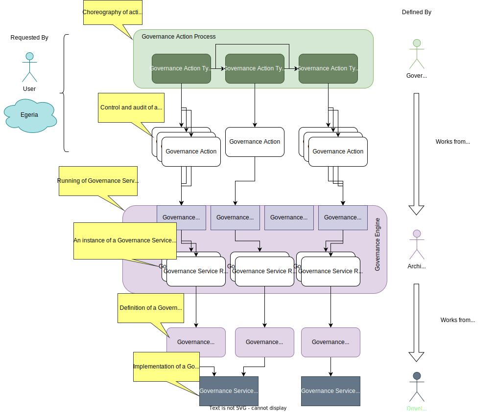

<!-- SPDX-License-Identifier: CC-BY-4.0 -->
<!-- Copyright Contributors to the ODPi Egeria project 2020. -->

The building industry has the principle of *shearing layers* in the design of a building.  This principle is as follows: 

*... Things that need to change frequently should be easy to change.  Those aspects that change infrequently can take more effort and time.*

In Egeria, the shearing layer principle is evident in the design of automated governance.  An organization that is maturing their governance capability, needs to be able to quickly design and deploy new governance automations to cover new situations.  These automations need to be quick to create and quick to change.  There is no time to wait for a software developer to code each one.  

Egeria defines flexible components called [governance services](/concepts/governance-services) that can be re-configured and reused in many situations.  Collectively the governance services form a pallet of configurable governance functions.  The governance team script them together every time they need a new governance automation.

The advantage is the ability to rapidly scale out your governance capability.  The downside is that there are more concepts to understand in order to design your automation process.

The diagram below summarizes this process.  

??? info "At the base are the governance service components"
    Governance services are [coded in java](/guides/developer/#extending-egeria-using-connectors) and packaged in Java Archives (Jar files).  They need to be passed information about the function to perform and the metadata elements on which to operate since this will different each time they are called.

    Part of the implementation is a [connector provider](/concepts/connector-provider) that is able to return a description of its governance service in the form of a [connector type](/concepts/connector-type).  The connector type provides information about how to configure and run the governance service.   This includes:

    * A description of the connector's function
    * Names of *configuration properties* that can modify the behaviour of the governance service.
    * A list of *request types* that select which function it is to perform.
    * Names of *request parameters*  that can be supplied (typically by the caller) that can:

      * override the configuration properties and/or,
      * provide the identifier(s) of any metadata element(s) to work on.
  
    * Names of supported action targets that provide links to the metadata element(s) to work on.  The [action target](/concepts/action-target) mechanism is typically used when governance services are being called in a sequence.  The action types are used to pass details of the metadata elements to work on from service to service.

??? info "The governance service definitions"
    The JAR file is added to the CLASSPATH of Egeria's [platform](/concepts/omag-server-platform) where is can be loaded and inspected.  The architect extracts the connector type of the governance service implementation and creates at least one governance service definition for it.  The governance service definition is metadata that includes a [GovernanceService](/types/4/0461-Governance-Engines) entity, a [Connection](/types/2/0201-Connectors-and-Connections) entity and a [ConnectorType](/types/2/0201-Connectors-and-Connections) entity (based on the connector type extracted from the implementation) linked together.  The connection object will include the settings for the various configuration properties described in the connector type.  If different combinations of configuration properties are desired, they are configured in different [governance service definitions](/concepts/governance-service-definition).

??? info "The governance engine definitions"
    The architect then builds a [governance engine definition](/concepts/governance-engine-definition).  This is metadata that defines a list of [governance request types](/concepts/governance-request-type) which are names representing the functions needed by the governance team.

    Each governance request type is mapped to a governance service definition.  The governance engine definition can include a mapping from the governance request type and a request type understood by the governance service implementation (called the serviceRequestType).  Without this mapping, the governance request type is passed to the governance service implementation when it is called.

    Typically the governance engined definition is packaged in a [open metadata archive](/concepts/open-metadata-archive) called a [governance engine pack](/concepts/governance-engine-pack).  This can be loaded into any platform that is going to run the governance engine/services.

??? info "Governance actions"
    The governance engine is configured in an [Engine Host](/concepts/engine-host) server running on the platform.  The governance engine can be called by creating a [governance action](/concepts/governance-action).  This is a metadata entity that describes the governance request type and request parameters to run.  The governance action is broadcast to the running engine hosts that each consult their governance engines to see if the governance request type is supported.  The first engine host to respond, claims the governance action and passes it to the governance engine to execute.

    Governance services produce one or more [guards](/concepts/guard) when they complete.  Guards describe the outcome of running the governance service. They are stored in the governance action entity that kicked off the governance service.  The governance action entities provide an audit trail of the automated governance actions that were requested, and their outcome.

??? info "Governance action processes"
    Governance action processes are defined in metadata using a set of linked [governance action types](/concepts/governance-action-type).  They are choreographed in a [Metadata Access Server](/concepts/metadata-access-server) running the [Governance Engine OMAS](/services/omas/governance-engine/overview). When the process is called to run, the Governance Engine OMAS navigates to the first governance action type in the governance process definition.  It creates a matching governance action entity.  This is picked up by the engine host and executed in the governance engine just as if it was called independently.  The guards are returned to the governance action entity as normal.  This change is detected by Governance Engine OMAS which uses the guards to navigate to the next governance action type(s) found in the governance action process definition.  A governance action is created for each of the next governance action types and the cycle is repeats until there are no more governance action types to navigate to in the governance action process definition.

A governance process can be run many times with different parameters.  It can be changed, simply by updating the governance action type metadata entities in the governance action process definition.  New processes can be created by creating the appropiate governane process definition.

If a desired request type can not be supported by the existing governance services, a developer is asked to extend a governance service implementation or create a new one that can be configured into a governance engine to support the desired governance request type.

??? example "Governance services supplied with Egeria"
    * [Governance Action Services](/connectors/#governance-action-services)
    * [Open Discovery Services](/connectors/#open-discovery-services)
    * [Repository Governance Services](/connectors/#repository-governance-services)

--8<-- "snippets/abbr.md"