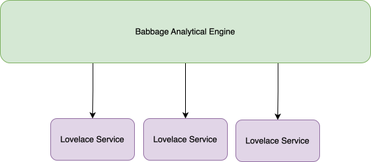

<!-- SPDX-License-Identifier: CC-BY-4.0 -->
<!-- Copyright Contributors to the Egeria project. -->

# Metadata Insight

The Metadata Insight pattern is a collection of services that provide insight into the metadata managed by the open metadata ecosystem.  It is designed to help users understand the metadata and the relationships between the elements in the metadata repository.

This pattern is implemented by:

* The [Babbage Analytical Engine Integration Connector](https://github.com/odpi/egeria/tree/main/open-metadata-implementation/adapters/open-connectors/nanny-connectors), which is set to refresh once a day.
* The [Lovelace Insight Services](https://github.com/odpi/egeria/tree/main/open-metadata-implementation/adapters/open-connectors/lovelace-insights) that are responsible for generating the insights.  A lovelace insight service is a [governance action type](/concepts/governance-action-type) that calls a [governance service](/concepts/governance-service).  It is registered with the Babbage Analytical Engine as a [catalog target](/concepts/catalog-target).

The *Babbage Analytical Engine* is initiated by loading the [Core Content Pack](/content-packs/core-content-pack/overview).  It is responsible for initiating any lovelace services that are attached as catalog targets.  Each time it refreshes (daily by default), it looks to see if each of the lovelace services is running.  If a lovelace service is running (for example, because it is a log running watchdog governance service, babbage moves on to checking the next registered lovelace service.  If the lovelace service is not running, Babbage will initiate it. This means, if the lovelace service is short-running - like a governance action service or survey service, then it is initiated each time Babbage is refreshed.
The following diagram shows the pattern.

The lovelace services can be written by anyone.  The lovelace services written by the Egeria community are loaded by the [Organization Insight Content Pack](/content-packs/organization-insight-content-pack/overview).

--8<-- "snippets/abbr.md"
