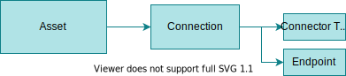
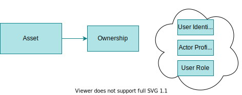
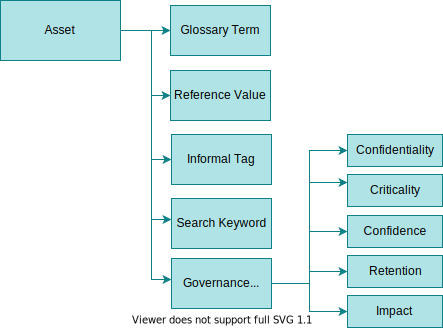
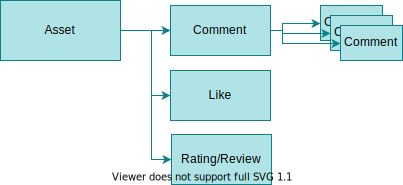
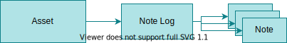
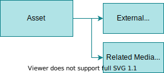
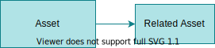

<!-- SPDX-License-Identifier: CC-BY-4.0 -->
<!-- Copyright Contributors to the ODPi Egeria project 2020. -->

# Egeria as a Metadata Manager

Metadata is collected together, organized and maintained within a catalog service to enable both individuals and automated services to search for, select and retrieve information about relevant resources necessary to perform a specific task.  These resources could be data, systems, applications, software components, processes, ...

Each of these resources are represented in open metadata as *[Assets](/concepts/asset)* and the catalog is often referred to as an asset catalog.

The diagram below shows the Egeria components that make up the catalog.

It includes:

* [Egeria' User Interfaces](/user-interfaces) that provides asset search and lineage.
* [View Server](/concepts/metadata-access-store) that provides the open metadata APIs to the user interfaces.
* [Metadata Access Store](/concepts/metadata-access-store) that provides the metadata management and repository.

Egeria's Metadata Access Store supports metadata defined by the [Open Metadata Types](/types).  These types cover a wide range of metadata, and are dynamically extensible.

--8<-- "snippets/getting-started.md"

## The contents of an asset catalog

Asset catalogs can start simple and evolve into a rich and valuable source of knowledge for your organization. They are assembled like a jigsaw puzzle from many sources and as the picture emerges and grows, new value is realized:

- Making it easier to locate the right asset for a task.
- Improving an individual's understanding about how an asset can be used and how it should be maintained.
- Identifying assets that are supporting specific situations and business contexts.
- Providing a perspective on how many assets of a certain type or situation are owned by the organization.
- Providing encoded information that enables automation to be used to maintain and protect the assets.

Egeria offers the services to build a catalog with the following types of information.

- [Basic asset properties](#basic-asset-properties)
- [Supplementary properties](#supplementary-properties)
- [Asset connections](#asset-connections)
- [Asset schemas](#asset-schemas)
- [Asset ownership](#asset-ownership)
- [Asset zone membership](#asset-zone-membership)
- [Asset location](#asset-location)
- [Asset external identifiers](#asset-external-identifiers)
- [Asset licenses and certifications](#asset-licenses-and-certifications)
- [Asset classifiers](#asset-classifiers)
- [Asset feedback](#asset-feedback)
- [Asset note logs](#asset-note-logs)
- [Asset external descriptions](#asset-external-descriptions)
- [Asset lineage](#asset-lineage)
- [Related assets](#related-assets)

This is built on an [extensible type system](/types) that allows further information to be catalogued.  [Automation](#scaling-the-asset-catalog-through-automation) is used to expand the contents of your asset catalog without creating a huge workload for your people.

???+ info "Basic asset properties"
    ### Basic asset properties
    
    
     
    Each instance of a [digital resource](/concepts/digital-resource), no matter what its physical type, is represented by a [type of asset](/concepts/asset) in the catalog.
     
    Every asset contains the following properties:
    
    | Property                               | Description                                                                                                                                                                                                         |
    |----------------------------------------|---------------------------------------------------------------------------------------------------------------------------------------------------------------------------------------------------------------------|
    | Open Metadata unique identifier (GUID) | A globally unique id across all metadata instances. It is a string of letters and numbers and typically looks something like this `40d9520b-dbc0-4cc4-9bad-03ab72d027f3` and is assigned by Egeria.                 |
    | Qualified name                         | A globally unique name of the asset - it is unique across all assets. It is assigned by the creator of the asset.                                                                                                   |
    | Resource Name                          | The name of the resource.                                                                                                                                                                                           |
    | Resource Description                   | Description of the resource extracted from its implementation.  This is typically null and many technical assets either have no place to store a description or where it is supported, the value is not filled out. |
    | Version Identifier                     | Which version of the resource does the asset represent.  (Rather than the version (ie number of updates) of the asset itself.)                                                                                      |
    | Additional properties                  | Names and values of additional properties that the organization wants to record about the resource.                                                                                                                 |
    
    !!! summary "Usage"
        With the basic asset properties defined, the asset catalog provides a searchable list of the resources of the organization. The content provided in the names, descriptions and additional properties will determine how easy it is to retrieve information about specific resources.
    
???+ info "Supplementary properties"
    ### Supplementary properties
    
    
    
    [Supplementary properties](/types/3/0395-Supplementary-Properties) can be added to provide a business description of the resource.
    
    | Property            | Description                                                                                                                                                                                                           |
    |---------------------|-----------------------------------------------------------------------------------------------------------------------------------------------------------------------------------------------------------------------|
    | Display Name        | Typically qualified names are long in order to make them unique and the resource name may not have much business relevance. The display name is a short name used in reports and other displays of asset information. |
    | Display Summary     | Short description of the resource in business terms.  Used for summary tables.                                                                                                                                        |
    | Display Description | Full description of the resource in business terms.                                                                                                                                                                   |
    | Abbreviation        | If the display name is long then it may have an acronym or abbreviation associated with it.                                                                                                                           |
    | Usage               | A description of how the resource is used by the business.                                                                                                                                                            |
    
    
???+ info "Asset connections"
    ### Asset connections
    
    
    
    A [connection](/concepts/connection) can be attached to the asset.  This provides the information necessary to create a [connector](/concepts/connector) to the resource.
    
    The connector is a client to both the data and the information about the resource stored in open metadata.  Some connectors use the metadata about the resource to [control which data can be retrieved](/features/synchronized-access-control/overview) from the resource.
    
    
    
    The connection object includes a [connector type](/concepts/connector-type) - containing information about the type of connector to create - and an [endpoint](/concepts/endpoint) detailing the network address and access protocol of the resource.
    
    There are API options to request that Egeria creates a default connection that matches the specific asset type.  In addition, there are options to explicitly set up the connection object, or leave the asset with no connection attached.
    
    !!! summary "Usage"
        The connector that is generated from the connection object enables both tools and applications to use the resource through a governed interface that provides metadata, data and, in some cases, metadata-driven access control. 
    
    
???+ info "Asset schemas"
    ### Asset schemas
    
    
    
    A schema describes the individual data fields and operations of the resource. It is organized to reflect the internal organization of the data and so acts as a guide to the types of content in the asset and how to navigate around it.
    
    !!! summary "Usage"
        With the schema in place, it is possible to search for resources based on the type of data, or type of operations that the resource supports.
    
    ??? education "More information"
        [Modelling Schema](/concepts/schema)

???+ info "Asset ownership"
    ### Asset ownership
    
    
    
    Asset ownership defines who is responsible for the resource, and is corresponding metadata description. This covers ensuring the catalog entry is correct, the contents of the resource are complete and correct and controlling access to the resource.
    
    The owner can be defined as a user identity, an actor profile or a person's role. These definitions are managed by the [Community Profile OMAS](/services/omas/community-profile/overview) and [Governance Program OMAS](/services/omas/governance-program/overview).
    
    !!! summary "Usage"
        With an owner established, it records who is responsible for the protection and quality of the resource. It is possible to route requests from the consumers of the resource to the owner. For example, the consumer of the resource may have queries about the content of the resource or may wish to request access to the resource.
    
???+ info "Asset zone membership"
    ### Asset zone membership
    
    
    
    [Governance zones](/concepts/governance-zone) group resource according to their usage. Governance Zones are defined by the [Governance Program OMAS](/services/omas/governance-program/overview). It is possible to assign `SupportedZones` to [OMASs](/services/omas) to limit the scope of the assets that are returned from searches. More information on the use of governance zones is described in the [governance zoning](/features/governance-zoning/overview) feature.
    
    !!! summary "Usage"
        Using governance zones allows the organization to scope the assets, and hence resources, that are returned to a community of users who are using the asset catalog.
    
        The governance zones can also be used to define the group of assets/resources that an automated process should process.
    
???+ info "Asset location"
    ### Asset location
    
    
    
    Egeria supports the definition of a location model that divides both physical and digital space into hierarchies with cross-links between the hierarchies.  This means it is possible to link the assets/resources to their location(s).
    
    !!! summary "Usage"
        Attaching assets to location definitions means it is possible to use details of the location as part of the search for assets/resources.
     
        Knowing the location of a resource, whether it is a physical or digital location can also help with demonstrating that data sovereignty is being respected and the level of risk that is allocated in a location.

???+ info "Asset external identifiers"
    ### Asset external identifiers
    
    
     
    A specific resource may be represented in different tools using different names.  It is possible to add details of these external identifiers to the asset.
    
    !!! summary "Usage"
        Knowing the different names of a resource means that the asset catalog can support searches for assets/resources using the name that specific communities of people know.
    
        It also helps automated process that are operating on the physical resource through a tool or API, since it can look up the identifier for the resources that is appropriate for that tool/API.

???+ info "Asset licenses and certifications"
    ### Asset licenses and certifications
    
    
     
    An asset can have the resource's license(s) and/or certification(s) attached to it.
    
    The license determines the terms and conditions of use for the resource.  This becomes important particularly when resources come from an external organization.
    
    Certifications typically relate to a regulation, standard or quality mark.  When the certification is tied to the asset it means that the resource has passed the requirements.
    
    !!! summary "Usage"
        Attaching licences and certifications to assets raises awareness of the any restrictions on the use of the resources and to what standards they are managed to. If the licenses and certifications are machine-readable, automated processes can use them to control the way that they manage the resources.

???+ info "Asset classifiers"
    ### Asset classifiers
    
    
    
    Classifiers add labels and properties to the asset that identifies them as part of a specific group, or having specific characteristics.
    
    The classifiers can be added to the whole asset or a field or operation in the schema.
    
    The types of classifiers are:
    
    - Glossary terms define the meaning of concepts and activities.  When a glossary term is attached to a data field in the asset's schema, it signifies that the data stored in that field has the meaning described in the glossary term.
    - Reference values identify sets of valid values of specific characteristics of the assets.  For example,  attaching a reference code for "personal data" to an asset indicates that it contains personal data.
    - Informal tags are labels that asset consumers create and attach to the asset and its data fields/operations.  This is effectively a way of crowd-sourcing knowledge about the asset.
    - Search keywords are typically attached to an asset by the asset owner to improve the findability of an asset - particularly if it has a name that is difficult to remember.
    - Governance classifications provide formal classifiers for confidentiality, retention, confidence and criticality for the asset. The impact classification is typically used with reports that link to the asst such as incident reports.
    
    !!! summary "Usage"
        Classifiers help to make resources more findable. They also identify which resources should be treated to certain types of processing. For example, data fields marked as sensitive could be masked when added to a data scientist's sandbox.

???+ info "Asset feedback"
    ### Asset feedback
    
    
    
    Feedback, such as comments, likes, star ratings and reviews can be added to an asset, typically by consumers of the resource to share experiences, expertise and concerns about the resource.
    
    The author of the feedback can choose whether it is public or private feedback.  Public feedback is visible by everyone.  Private feedback is visible to the author of the feedback and the owner of the asset.
    
    Feedback can only be changed by the author of the feedback. It can be added to an asset through [Asset Consumer OMAS](/services/omas/asset-consumer/overview), [Asset Owner OMAS](/services/omas/asset-owner/overview) and [Digital Architecture OMAS](/services/omas/digital-architecture/overview).
    
    !!! summary "Usage"
        Feedback helps to share expertise and use the experience of the resources' consumers to improve the quality of both the resource's contents and its description.

???+ info "Asset note logs"
    ### Asset note logs
    
    
    
    Note logs consist of a series of posts (called notes) that are added over time (like a blog). An asset's note log can be maintained through the [Asset Owner OMAS](/services/omas/asset-owner/overview), [Digital Architecture OMAS](/services/omas/digital-architecture/overview) and [IT Infrastructure OMAS](/services/omas/it-infrastructure/overview).
    
    !!! summary "Usage"
        Note logs can be used by the asset owner or operations team to post status or usage information about the resource to inform individuals who are using the resource of important information and events (such as a planned upgrade or schema change, or an outage).

???+ info "Asset external descriptions"
    ### Asset external descriptions
    
    
    
    Not everything that is known about a resource is stored in Egeria. There may be documents, web resources, images, videos and audio files that provide more detail. Through [Asset Owner OMAS](/services/omas/asset-owner/overview) it is possible to add links to external resources and media.
    
    !!! summary "Usage"
        Using the links to external resources, an individual is able to learn more about the resource they are considering to use to complete their task.

???+ info "Asset lineage"
    ### Asset lineage
    
    
     
    Lineage describes the origin of the data that is held by the resource.  There are different perspectives on what is meant by 'origin'.
    
    In general, a resource is being accessed by processes.  They are typically adding/updating/deleting data or reading it. So one perspective of lineage is to see the processes that are providing and using the resource.
    
    Data often flows from resource to resource via the processes, as they read data from one resource, do some processing and store the results in a different resource.  The end-to-end flow of data is called an information supply chain.  Information supply chains can be modeled and linked to the processes through the [Digital Architecture OMAS](/services/omas/digital-architecture/overview). This offers more of an enterprise view of where the data originated from.
    
    The resource itself is hosted by a software capability that is part of a server. Another perspective on the resource's data origin is the software capability that is hosting it.
    
    Software capabilities can be linked to a solution component by the  [Digital Architecture OMAS](/services/omas/digital-architecture/overview). Solution components are descriptions produced by architects to document the purpose and behavior of a component.  These descriptions add business context to the software capability definitions.  They are linked to the software capability when it is deployed into the IT landscape.
    
    Similarly, the software capability hosting a resource can be linked to the digital service it is a part of.  Digital Services are anchors for business context information about the digital offerings or products that the organization is operating. This is a business view of the service that the resource is a part of.
    
    Finally, the asset can include identifiers of other metadata elements from the catalog and related properties in the **AssetOrigin** Classification. This includes:
    
    - Unique identifier (GUID) of the business capability that owns the resource.  Examples of a business capabilities include "Finance", "Human Resources", "Manufacturing", "Sales", etc.
    - Unique identifier (GUID) of the organization that owns the resource.  This could be a unit within the organization or an external organization.
    
    Both organization and business capability information is maintained through the [Community Profile OMAS](/services/omas/community-profile/overview) and documented in the asset by the [Asset Owner OMAS](/services/omas/asset-owner/overview).
    
    !!! summary "Usage"
        Lineage information helps consumers (individuals and/or automated processes) make choices about which is the appropriate resource to use for a certain task.  It gives a sense of whether the resource contains data from an authoritative source/business capability/organization/process.
    
        Regulations that require specific types of reports often require lineage as well as the report to help the regulators validate that the report is correct.

???+ info "Related assets"
    ### Related assets
    
    
    
    *Related assets* refers other assets that are linked together or are part of the same collection.
    
    Collections allow individuals and automated processes to maintain groups of related assets/resources. For example, an individual may maintain a collection of their favorite assets.  A project team may maintain a collection of the assets in use by the project. An automated process may use the retention classification to build a collection of assets that need to be archived. These types of collections are maintained through the following Open Metadata Access Services (OMASs):
    
    - [Asset Consumer OMAS](/services/omas/asset-consumer/overview)
    - [Community Profile OMAS](/services/omas/community-profile/overview)
    - [Project Management OMAS](/services/omas/project-management/overview)
    
    In addition, there are natural relationships between assets that are created as the asset is cataloged.  For example, a file is related to the folder (also known as a directory) it is located in.  Both the file and the folder could be assets in the asset catalog, and they would be automatically linked together by the [Asset Owner OMAS](/services/omas/asset-owner/overview) when these assets were created.
    
    !!! summary "Usage"
        The related assets enables individuals or automated services to locate assets that are related. For example, a process may use the related assets to step through and process the cataloged files in a folder, or the assets in a specific collection.
    
## Manual cataloguing

Manual cataloging uses no automation beyond the management of the metadata once it is created. Individuals enter information about the assets into Egeria through tools that call Egeria's Open Metadata Access Services (OMASs).

The [Asset Owner OMAS](/services/omas/asset-owner/overview) is the principle interface for manual cataloging.  It is possible to catalog any type of asset through this interface, although it is biased towards cataloging data assets such as data stores, data feeds, files, data sets, APIs and events.

In addition, there are specific cataloging interfaces for particular types of subject-matter expert.

- [IT Infrastructure OMAS](/services/omas/it-infrastructure/overview) provides specialist interfaces for cataloging infrastructure such as servers, host systems and applications.
- [Digital Architecture OMAS](/services/omas/digital-architecture/overview) provides specialist interfaces for architects and integration engineers to manually catalog reference data sets and processes.  Reference data sets are assets in their own right, and their content can be used as classifiers to augment the description of other assets.  Processes are also assets that, when linked together, show the lineage of the assets they are partly responsible for maintaining.

## Asset catalog search services

Once the asset catalog is established, it can offer search interfaces through the following mechanisms.

- [Asset Consumer OMAS](/services/omas/asset-consumer/overview) provides simple string-based searches for assets and their related information along with support to create connectors to access the content of the actual physical asset and browse through all the information known about the asset.
- [Digital Architecture OMAS](/services/omas/digital-architecture/overview) provides specialist interfaces for querying reference data and processes.
- [IT Infrastructure OMAS](/services/omas/it-infrastructure/overview) provides specialist catalog search capabilities for infrastructure such as servers, host systems and applications.
- [Governance Program OMAS](/services/omas/governance-program/overview) provides the ability to browse assets in a [governance zone](/concepts/governance-zone) to assess the effectiveness of the governance program.
  
## Scaling the asset catalog through automation

Automation is critical when it comes to managing an asset catalog. It reduces the administrative work of subject-matter experts and asset owners, increases the reliability, reach and richness of the asset catalog whilst reducing the cost of its maintenance.

Some automation is easy and reliable, particularly for information that can be extracted directly from the digital technologies used to implement the assets. Other automation involves analytics to create a candidate result that may need to be confirmed and approved by a subject-matter expert.  However, even when this human validation is necessary, the effort required is significantly less that manual maintenance of the catalog.

Whenever subject-matter experts are involved, it typically requires a change to their role in order to accommodate the time spent on the catalog. Often these experts are from a different part of the organization to the people receiving the benefit of their expertise, and so the organization's appreciation and use of the asset catalog needs to have matured to allow this to happen.

Therefore, as we look at the different types of automation, each comes with its own organizational maturity required to make it successful.

## What automation is possible?

Egeria offers the following approaches to cataloging assets:

- [Templated cataloging](/features/templated-cataloguing/overview) - copying predefined assets.
- [Integrated cataloging](/features/integrated-cataloging/overview) - automated extraction of metadata from third party technologies.
- [Discovery and stewardship](/features/discovery-and-stewardship/overview) - analysis of asset contents to create metadata

The idea is that these approaches are selected for each type of asset and blended together to balance the investment in the automation, against the time commitment of subject-matter experts, against the business value of the resulting catalog.

!!! info "Related information"

    - The [Asset](/concepts/asset) page provides more information on the different types of assets supported by open metadata.  The asset types can be extended dynamically if needed.
    - The type definition for the *Asset* entity is found in model [0010 Basic Model](/types/0/0010-Base-Model).
    - Examples of representing different types of assets using the open metadata types are found in [Mapping Technology](/guides/developer/mapping-technology).
    - The [Open Metadata Labs](/education/open-metadata-labs/overview) provide practical examples showing all of the techniques to manage an asset catalog, allowing you to try each of the features to assess how they could work in your organization.

--8<-- "snippets/getting-started.md"

--8<-- "snippets/abbr.md"
