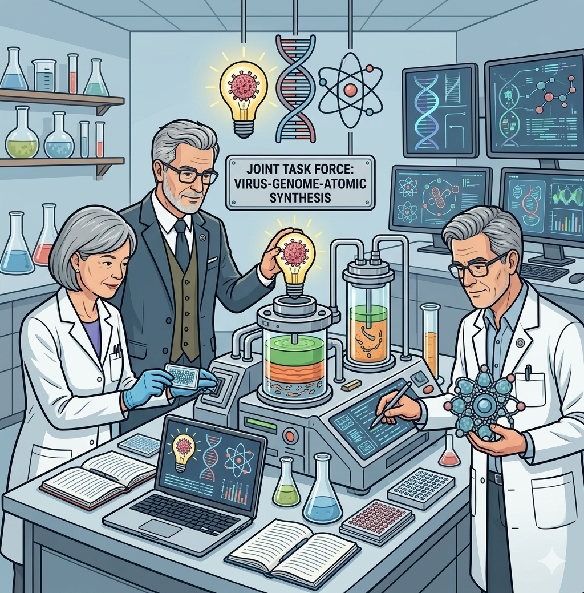
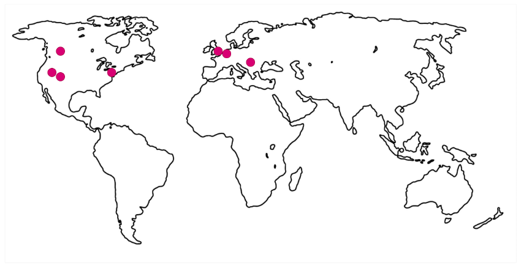

<!-- SPDX-License-Identifier: CC-BY-4.0 -->
<!-- Copyright Contributors to the ODPi Egeria project. -->

# Introducing Coco Pharmaceuticals

???+ note "Background"
    Coco Pharmaceuticals (CocoP) is a fictitious organization that is used by the Egeria team to illustrate different open metadata and governance scenarios.  The personas and scenarios have been developed from blending real-world people and scenarios from over 100 companies in various industries.  The images of the personas and their participation in the scenarios are generated using Google's Gemini AI.  Any resemblance to real-world persons, or organizations is purely coincidental.

Coco Pharmaceuticals is a medium-sized pharmaceuticals company. It is vertical integrated, with its own research, manufacturing, sales and distribution services. Its business approach focuses on supplying unique, targeted medication for cancer sufferers.  In recent years, they shifted from generic treatments to personalised medicine - where a patient's genome is used to determine the right course of treatment.  This has created a massive growth in the amount and the sensitivity of the data they hold.

Coco Pharmaceuticals has research partnerships with both universities and hospitals to collaborate on further research.

## History

The company has grown from a small group of researchers working together in a spirit of open communication, collaboration and trust, to a medium-sized pharmaceutical company that has a small range of very successful drugs in the market and many others in development - three of which look very promising.

> These are the three founders of Coco Pharmaceuticals from left to right: Terri Daring, Steve Starter, and Zach Now.

Their investment in IT had traditionally been focused on the automation of the manufacturing process due to the growth in demand for their most successful drugs.  However, a recent attempted fraud in their supplier network sparked a company-wide investigation into their operations.  They have also acquired two manufacturing facilities which came with additional warehouse and distribution centers.  Their existing leaders, [Stew Faster](/practices/coco-pharmaceuticals/personas/stew-faster), [Tessa Tube](/practices/coco-pharmaceuticals/personas/tessa-tube), [Reggie Mint](/practices/coco-pharmaceuticals/personas/reggie-mint), [Gary Geeke](/practices/coco-pharmaceuticals/personas/gary-geeke) and [Ivor Padlock](/practices/coco-pharmaceuticals/personas/ivor-padlock) in these areas are struggling to integrate these new facilities into their existing operations.

> The global operations of Coco Pharmaceuticals includes sites in London, New York, Amsterdam, Austin TX, Edmondton, Winchester and Bucharest.  It includes Research Labs, Data Centers, Factories, Warehouses, and Distribution Centers.

The result was the appointment of [Jules Keeper](/practices/coco-pharmaceuticals/personas/jules-keeper) as their Chief Data Officer (CDO).  Jules' mission is to improve the organization's protection, management and use of data to help with its integration and transformation.

Jules instigated a [company-wide data strategy](/practices/coco-pharmaceuticals/scenarios/defining-the-data-strategy/overview) focused on **"better data for everyone"**.  This was underpinned by a [data governance program](/practices/coco-pharmaceuticals/scenarios/creating-data-governance-program/overview) that ensured their regulatory compliance as well as providing for data management, protection and access.

Through Jules' influence:

* [Faith Broker](/practices/coco-pharmaceuticals/personas/faith-broker), their HR director, was also appointed as their Privacy Officer.
* [Ivor Padlock](/practices/coco-pharmaceuticals/personas/ivor-padlock), their security officer was teamed up with [Gary Geeke](/practices/coco-pharmaceuticals/personas/gary-geeke), their IT infrastructure expert to be responsible for cyber security.
* [Erin Overview](/practices/coco-pharmaceuticals/personas/erin-overview), their IT Architect, was given greater prominence in the organization since her deep expertise is in information architecture. She was able then to get some investment in master data management, a data lake for the researchers and metadata management tools.
* Individuals throughout the business were appointed as data owners. For example, [Tom Tally](/practices/coco-pharmaceuticals/personas/tom-tally) from Finance was appointed the data owner of the accounts data, and [Tessa Tube](/practices/coco-pharmaceuticals/personas/tessa-tube), the Lead Researcher, became the data owner for their clinical research data.
* Jules also appointed data stewards for critical data sets. [Tanya Tidie](/practices/coco-pharmaceuticals/personas/tanya-tidie), their clinical records clark, became a data steward for all patient records maintained during clinical trials.

## The scenarios

The [scenarios](/practices/coco-pharmaceuticals/scenarios) follow the Coco Pharmaceutical personas as they work to set up their new roles and meet the challenges their new responsibilities bring.  Examples include:

* [Defining the data strategy](/practices/coco-pharmaceuticals/scenarios/defining-the-data-strategy/overview) - this is the first step in Coco Pharmaceuticals' transformation journey.
* [Setting up the governance leadership](/practices/coco-pharmaceuticals/scenarios/building-the-governance-team/overview) - this shows the importance of aligning governance with the business needs and the need for the governance domains to collaborate.
* [Developing a new digital service using personal data](/practices/coco-pharmaceuticals/scenarios/new-clinical-trials-digital-service/overview) considers how context management and governance along a critical business capability can increase effectivness and compliance.
* [Creating a data sharing hub](/practices/coco-pharmaceuticals/scenarios/patient-data-sharing-hub/overview) - this shows how the data sharing hub can help to improve the use and availability of protected data whilst ensuring protection and governance.
* [Initiating a sustainability initiative](/practices/coco-pharmaceuticals/scenarios/sustainability-initiative/overview) - the shows the establishment of a company-wide sustainability reporting initiative.

## More information

* [Detailed descriptions of the personas](/practices/coco-pharmaceuticals/personas)
* [Roles verses Personas](/practices/coco-pharmaceuticals/roles-vs-personas/overview)
* [Access to the Coco Pharmaceuticals' Egeria environment](/egeria-workspaces/quick-start/overview)

--8<-- "snippets/abbr.md"

