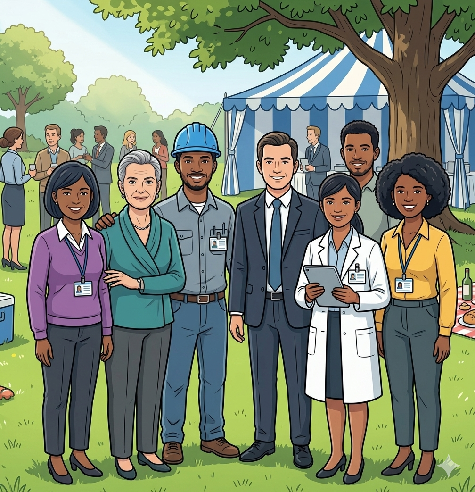
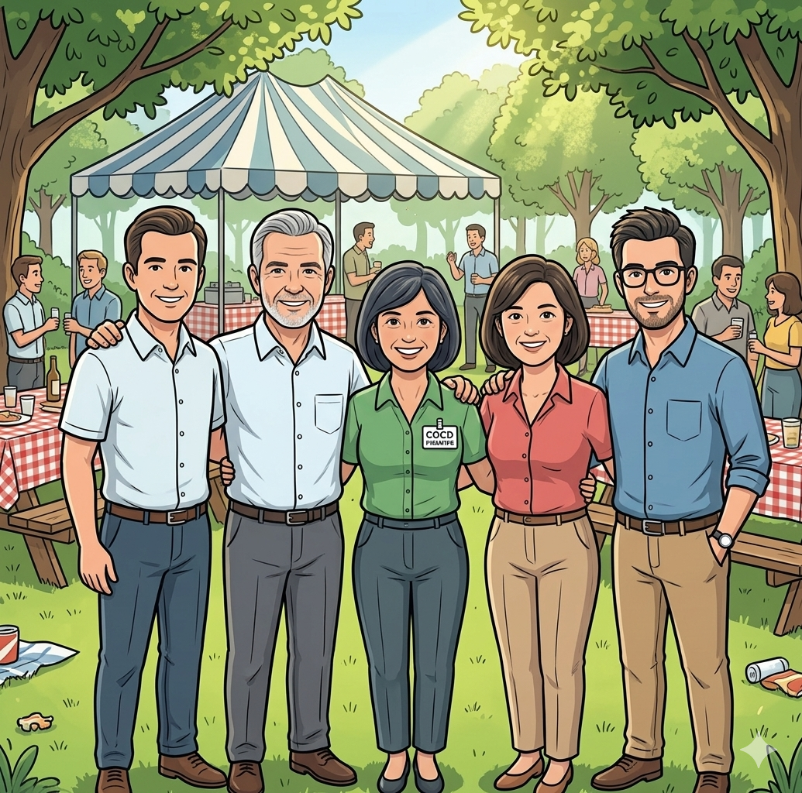

<!-- SPDX-License-Identifier: CC-BY-4.0 -->
<!-- Copyright Contributors to the ODPi Egeria project. -->

# Coco Pharmaceuticals' Persona

The personas from [Coco Pharmaceuticals](/practices/coco-pharmaceuticals) are fictitious, although they are blended from the experiences of real people working with data today.  They are used to illustrate the types of people that work with data in an organization and how they use Egeria to support their work.

## Sustainability team

These personas are responsible for leading [sustainability improvements](/practices/coco-pharmaceuticals/scenarios/sustainability-initiative/overview) within the company's operations.

* [Tom Tally](/practices/coco-pharmaceuticals/personas/tom-tally) - Accounts Manager
* [Erin Overview](/practices/coco-pharmaceuticals/personas/erin-overview) - Information Architect
* [Stew Faster](/practices/coco-pharmaceuticals/personas/stew-faster) - Manufacturing General Manager
* [Jules Keeper](/practices/coco-pharmaceuticals/personas/jules-keeper) - Chief Data Officer
* [Reggie Mint](/practices/coco-pharmaceuticals/personas/reggie-mint) - Chief Finance Officer

## Security team

These personas are responsible for defining the [security strategy](/practices/coco-pharmaceuticals/scenarios/) for Coco Pharmaceuticals and ensuring compliance.

* [Ivor Padlock](/practices/coco-pharmaceuticals/personas/ivor-padlock) - Security Officer
* [Gary Geeke](/practices/coco-pharmaceuticals/personas/gary-geeke) - IT Infrastructure Lead
* [Lemmie Stage](/practices/coco-pharmaceuticals/personas/lemmie-stage) - DevOps Specialist
* [Simon Burr](/practices/coco-pharmaceuticals/personas/simon-burr) - Cyber Security Specialist
* [Sidney Seeker](/practices/coco-pharmaceuticals/personas/sidney-seeker) - Fraud Investigator

## AI pilot team

These personas are involved in an AI project to model consumers of Coco Pharmaceuticals' products and understand their future needs.
It is very experimental at this time but has a lot of interest at board level.

* [Callie Quartile](/practices/coco-pharmaceuticals/personas/callie-quartile) - Data Scientist
* [Erin Overview](/practices/coco-pharmaceuticals/personas/erin-overview) - Information Architect
* [Bob Nitter](/practices/coco-pharmaceuticals/personas/bob-nitter) - Integration Architect/Developer 
* [Harry Hopeful](/practices/coco-pharmaceuticals/personas/harry-hopeful) - Sales
* [Tessa Tube](/practices/coco-pharmaceuticals/personas/tessa-tube) - Lead Researcher
* [Polly Tasker](/practices/coco-pharmaceuticals/personas/polly-tasker) - IT Project Leader

## Fraud investigation team

These personas are investigating a [potential incidence of fraud](/practices/coco-pharmaceuticals/scenarios/investigating-suspicious-activity/overview).

* [Reggie Mint](/practices/coco-pharmaceuticals/personas/reggie-mint) - Chief Finance Officer
* [Tom Tally](/practices/coco-pharmaceuticals/personas/tom-tally) - Accounts Manager
* [Sally Counter](/practices/coco-pharmaceuticals/personas/sally-counter) - Payments Clerk
* [Harry Hopeful](/practices/coco-pharmaceuticals/personas/harry-hopeful) - Sales
* [Sidney Seeker](/practices/coco-pharmaceuticals/personas/sidney-seeker) - Fraud Investigator

## Corporate governance

These personas are the executives whose full-time job is the governance and protection of the company.   They oversee the programs that set policies and monitor, measure and feedback on compliance to the policies.

* [Jules Keeper](/practices/coco-pharmaceuticals/personas/jules-keeper) - Chief Data Officer
* [Faith Broker](/practices/coco-pharmaceuticals/personas/faith-broker) - HR director and Privacy Officer
* [Ivor Padlock](/practices/coco-pharmaceuticals/personas/ivor-padlock) - Security Officer
* [Reggie Mint](/practices/coco-pharmaceuticals/personas/reggie-mint) - Chief Finance Officer

## IT project team

This is the IT Project Team enhancing the IT Systems to create a supplier/customer hub, to provide end-to-end monitoring of the manufacturing process, and to provide support for a data lake for the clinical research teams.

Bob Nitter supports the multitude of application systems that the company runs. Lemmie Stage does the integration backbone implementation that supports the information supply chains that shift data between the applications.  Bob and Lemmie work for Polly.  Polly has engaged external consultants [Nancy Noah](/practices/coco-pharmaceuticals/personas/nancy-noah) and [Des Signa](/practices/coco-pharmaceuticals/personas/des-signa) to help with their development of the new personalized medicine capabilities.

* [Polly Tasker](/practices/coco-pharmaceuticals/personas/polly-tasker) - IT Project Leader
* [Bob Nitter](/practices/coco-pharmaceuticals/personas/bob-nitter) - Integration Architect/Developer (API developer)
* [Lemmie Stage](/practices/coco-pharmaceuticals/personas/lemmie-stage) - DevOps Specialist
* [Nancy Noah](/practices/coco-pharmaceuticals/personas/nancy-noah) - Cloud Specialist
* [Des Signa](/practices/coco-pharmaceuticals/personas/des-signa) - Mobile Developer

## Manufacturing

Coco Pharmaceuticals has its own manufacturing plants.  Stew Faster is the general manager of the plants and is involved in the digitization program for manufacturing and distribution of the products.

* [Stew Faster](/practices/coco-pharmaceuticals/personas/stew-faster) - Manufacturing General Manager
* [Florence Paynter](/practices/coco-pharmaceuticals/personas/florence-paynter) - Cancer Patient
* [George Pie](/practices/coco-pharmaceuticals/personas/george-pie) - Cancer Patient

## Clinical trials team

These personas are involved in the clinical trial for a new cancer drug developed by the company.
They are collaborating on their findings as selected patients are given the new drug.
This is the first use of the company's data lake.

* [Callie Quartile](/practices/coco-pharmaceuticals/personas/callie-quartile) - Data Scientist
* [Tessa Tube](/practices/coco-pharmaceuticals/personas/tessa-tube) - Lead Researcher
* [Tanya Tidie](/practices/coco-pharmaceuticals/personas/tanya-tidie) - Clinical Records Clerk
* [Peter Profile](/practices/coco-pharmaceuticals/personas/peter-profile) - Information Analyst

## External consultants

Additional subject-matter experts supporting specific projects for Coco Pharmaceuticals.  They are providing specialist skills to help in the transformation of Coco Pharmaceuticals' business.

* [Nancy Noah](/practices/coco-pharmaceuticals/personas/nancy-noah) - Cloud Architect
* [Des Signa](/practices/coco-pharmaceuticals/personas/des-signa) - Mobile Developer
* [Sidney Seeker](/practices/coco-pharmaceuticals/personas/sidney-seeker) - Fraud Investigator

--8<-- "snippets/abbr.md"
