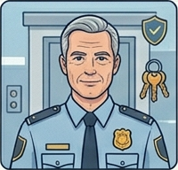
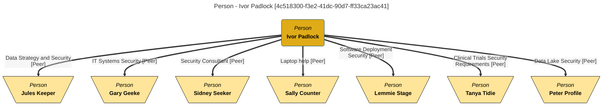

<!-- SPDX-License-Identifier: CC-BY-4.0 -->
<!-- Copyright Contributors to the ODPi Egeria project. -->

# Ivor Padlock - Chief Security Officer

## Persona Description

----

Age: 51

Skills: Security of company premises

Scope: Organization-wide

Job:

* Ivor is responsible for the company's security.
This includes the physical security of the research labs,
offices and manufacturing plant along with the security of information.
* He is not a deep IT expert, but works with the IT Operations
team to review and improve their procedures.

Thinks/Feels:

* Ivor believes that cyber-security is one of the most critical issues
threatening the business today.
* He worries at his lack of expertise in this area.
* He sees the threat from rogue employees as big an issue as attacks from outside.

Hears:

* Complacency about the security of information.

Says/Does:

* Ivor has instigated greater monitoring of employees activity,
coupled with education sessions on the proper protection of information.

Sees:

* Open access to large parts of the company's data, critical research
reports left on desks, sharing of passwords and machines.

Top challenges:

* To establish a sense of personal responsibility for the protection
of data at all levels in the company.
* To automate as much of the protection of information as possible
whilst still enabling flexibility in the use of information.

Desired Outcome:

* Data/information is properly protected so it is only used for
approved purposes.

-----

## Interactions

Ivor Padlock is responsible for security at Coco Pharmaceuticals.  This is both the physical security of the premises, equipment and people, as well as the IT system security.  He has a lot of experience on the physical security aspect of his role.  However, on the IT side he is not a deep expert and relies on help from colleagues in the IT Operations team to review and improve their procedures.  He is also responsible for the education of employees on the proper protection of information.  For this he needs help from [Faith Broker](faith-broker.md) who has taken on the role of [Privacy Officer](../../roles/overview.md).  The picture below shows the interactions between Ivor Padlock and the other people in the organization.

The mermaid diagram below shows the same information modelled in Egeria (See the [People Organizer API](/services/omvs/people-organizer/overview) for more details)

## Current Projects

Ivor Padlock is currently working on the following projects:

* [Understanding the new UK Terrorism (Protection of Premises) Act 2025 (aka Martyn's Law)](/practices/coco-pharmaceuticals/scenarios/preparing-for-martyns-law/overview) and how it impacts Coco Pharmaceutical's annual conference in London.
* [Building a data security strategy](/practices/coco-pharmaceuticals/scenarios/building-a-data-security-strategy/overview) for Coco Pharmaceuticals as they consolidate data into their new data lake, and consolidate and link context into Egeria.
* Ensure the [auditability of IT System users](/practices/coco-pharmaceuticals/scenarios/auditing-it-system-users/overview) and their access to data.
* Improving the [IT Systems Security](/practices/coco-pharmaceuticals/scenarios/assuring-it-systems-security/overview), working with [Gary Geeke](/practices/coco-pharmaceuticals/personas/gary-geeke) and [Lemmie Stage](/practices/coco-pharmaceuticals/personas/lemmie-stage).
* [Investigation into suspicious activity](/practices/coco-pharmaceuticals/scenarios/investigating-suspicious-activity/overview) relating to suppliers and deliveries to the various depots and warehouses.

--8<-- "snippets/abbr.md"