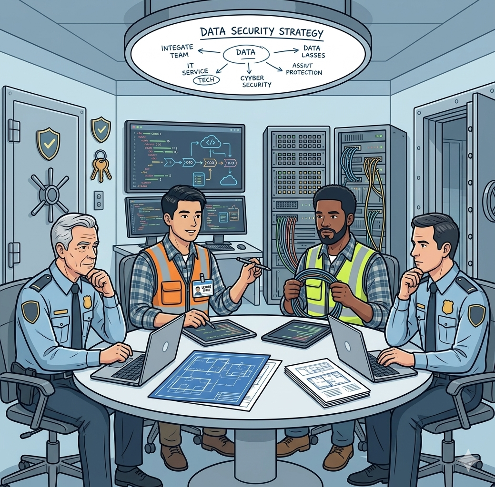

<!-- SPDX-License-Identifier: CC-BY-4.0 -->
<!-- Copyright Contributors to the Egeria project. -->

# Assuring IT System Security

This scenario illustrates how Egeria can be used to support the assurance of IT system security.

The security team's practice of working each threat through into the concrete risks it gives rise to, and rating each one for likelihood and impact, is the model for the company-wide [risk register](/practices/coco-pharmaceuticals/scenarios/building-the-governance-team/overview#the-risk-register) that the governance leaders go on to build together.  [Ivor Padlock](/practices/coco-pharmaceuticals/personas/ivor-padlock) owns the cyber security and event security entries in that register.

--8<-- "snippets/abbr.md"