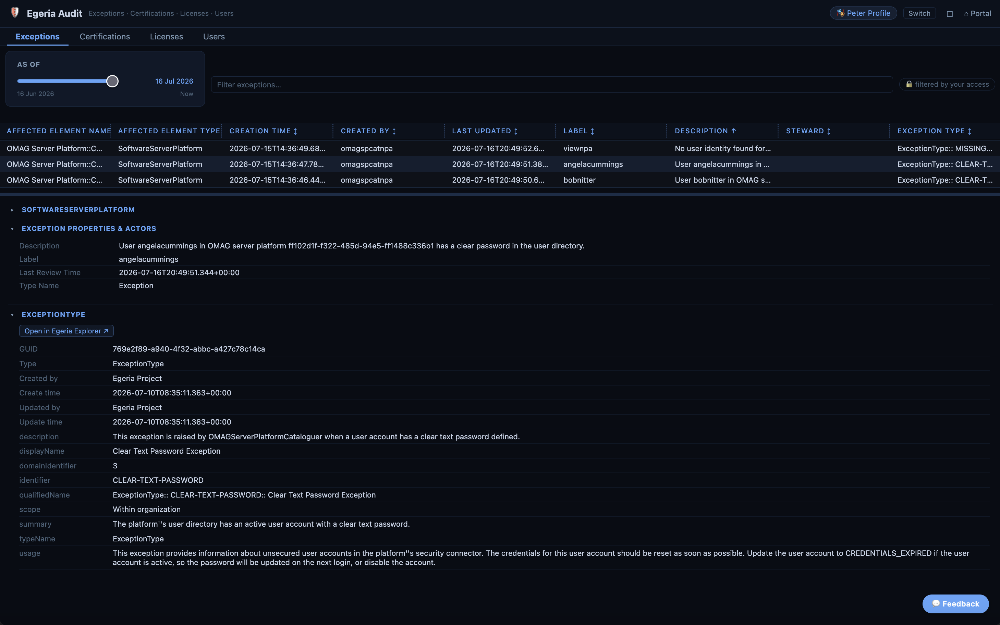
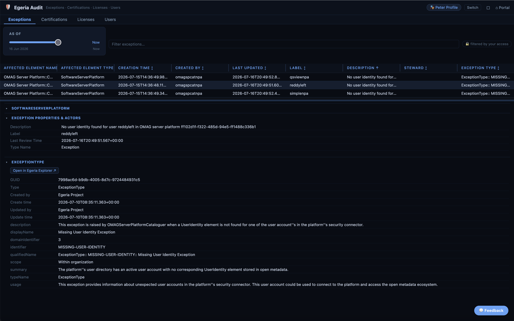
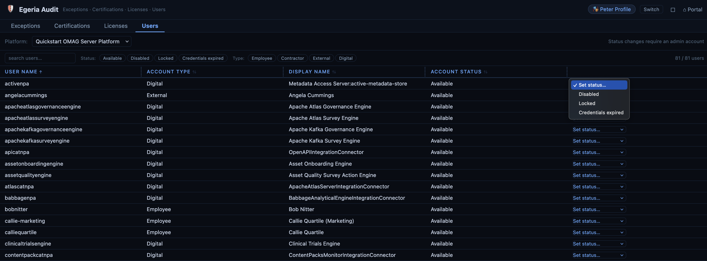

<!-- SPDX-License-Identifier: CC-BY-4.0 -->
<!-- Copyright Contributors to the Egeria project. -->

# Auditing IT System Users and their Access to Data

One of the major causes of security breaches is the misuse of IT system user accounts.  Often these are abandoned accounts, for example from previous employees, or accounts where the user has used a simple password that is easy to guess.

With access to these accounts, an attacker can use them to steal or alter data in the systems.  Not long ago, Coco Pharmaceuticals was the [victim of a fraud](/practices/coco-pharmaceuticals/scenarios/investigating-suspicious-activity/overview) around their supplier database.  Additional supplier records and invoices were added using that accounts of employees who left the company.  Since then there has been a systematic scrubbing of old user accounts and a routine review by each system owner to ensure that only the necessary accounts are in use.

For Egeria, this audit is performed using the [Egeria Audit](/user-interfaces/egeria-audit/overview) card on the Egeria portal.  Egeria routinely identifies users defined in its user directory that: 

* have clear text passwords (used for bootstrapping the system on first install which should be removed before the system is put into production) or 
* do not have a user profile in the Egeria repository (suggesting an unnecessary user account).

Egeria Audit shows these exceptions.  It also shows the user accounts defined in the user directory, with options to disable or remove any that are no longer needed. 

This allows the security team to quickly complete the review.

???+ note "Notes on Quickstart Environment"
    The screen shots that follow are from the Quickstart demo environment.  Because it is a demo environment, there are many users with clear text passwords and missing user profiles.  This is to show off the auditing feature of Egeria and to make the system accessible to people exploring Egeria's capabilities.  Feel free to experiment with with fixing/disabling invalid user accounts.

## Clear text passwords

This is a screenshot of an exception identifying a user that still has the setup clear text password.  It should be changed immediately causing it to be encrypted.  (This can be done during the user logon.). The auditors should set the credentials invalid to force the user to change their password on the next login.

## Missing user profiles

This next screenshot shows a user that is missing a user profile.  It is not necessarily an error.  Typically a person would create their profile when they log on for the first time (see [My Egeria](/user-interfaces/my-egeria/overview)).  User profiles for digital processes (ITProfiles) need to be added by a program.  It is a good idea to create a user profile for digital users to simplify the identification of who or what took specific actions in open metadata.

## Setting the status on a user account

This last screenshot shows how the user account status can be changed.

--8<-- "snippets/abbr.md"