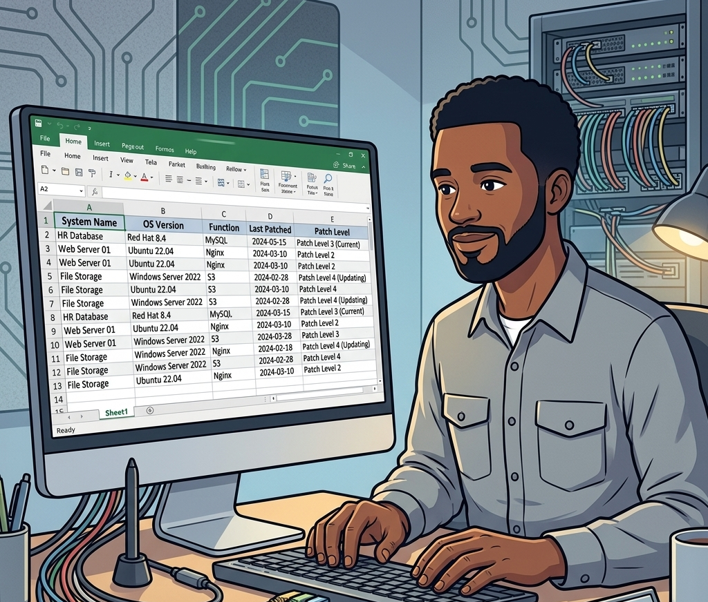
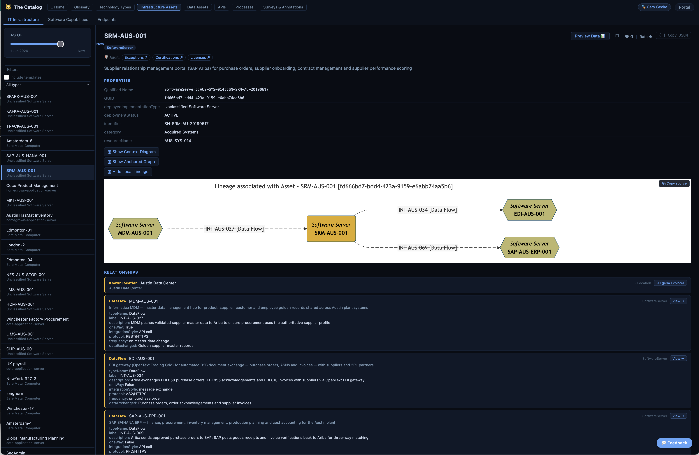
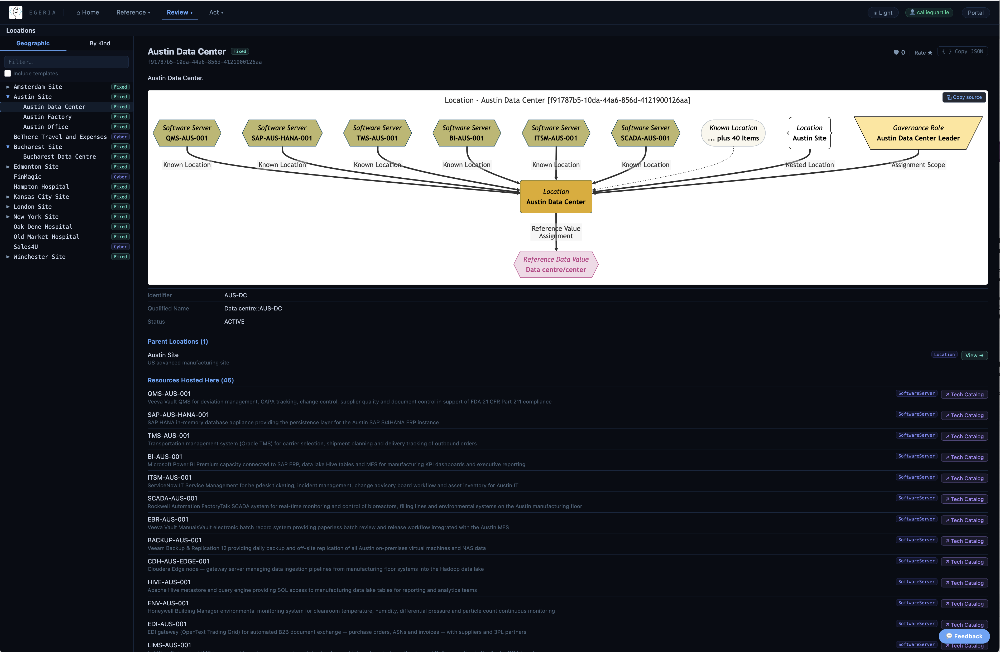
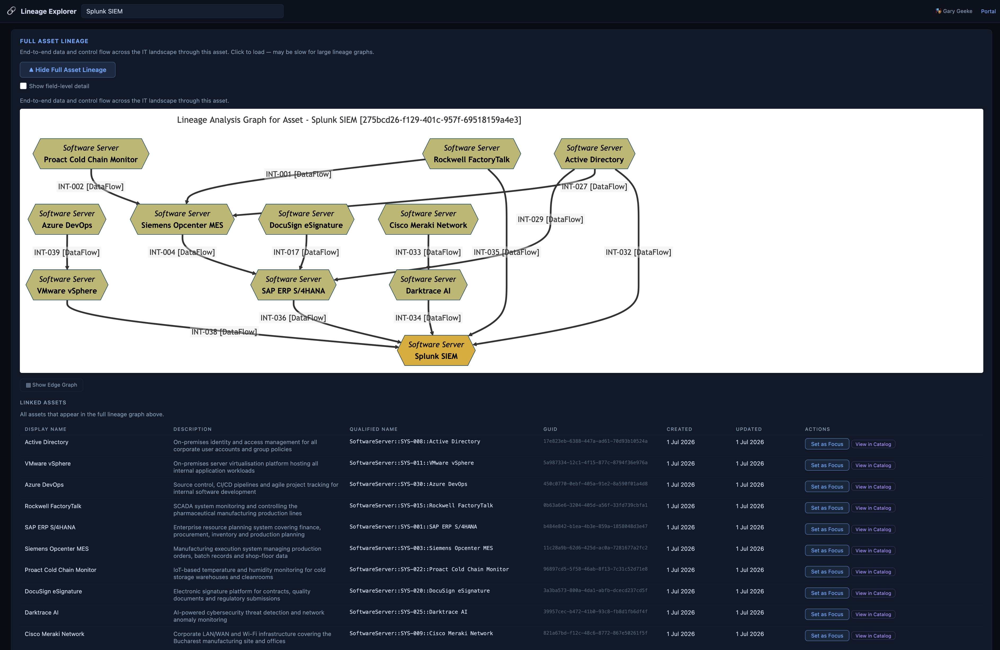

<!-- SPDX-License-Identifier: CC-BY-4.0 -->
<!-- Copyright Contributors to the ODPi Egeria project. -->

# Cataloguing Infrastructure

[Gary Geeke](/practices/coco-pharmaceuticals/personas/gary-geeke) has maintained a list of all the servers used at Coco Pharmaceuticals that are his responsibility in a spreadsheet.  Individual departments may have bought their own equipment (servers/laptops etc) but he is not responsible for them.

He has been pleased with this solution since it allows him to:

* List of all machines in his care at each location
* Plan capital for new machine purchases
* Keep track of software levels on all the machines
* Reorganize the workload when new projects start up

However:

* Maintaining the content - particularly for software levels - was tedious, and sometimes he got behind in cataloguing them.
* It was challenging to share the data with his team, since it resulted in multiple copies of the spreadsheet, and sometimes they got out of sync.
* No automation was possible based off of this information.
* It was not possible to collaborate with other teams – such as devOps, security and finance, ...

He decides to add the spreadsheet contents to Egeria to make it easy to manage.  He writes a simple script to load the contents through the [pyegeria](/concepts/pyegeria) API.
He also builds new scripts that populate different spreadsheet structures for his team's projects, and he is able to load any updates they make.

After experimenting with a number of queries, he discovers that his data was not as consistent as he had thought, and he starts to clean up the data through the Egeria APIs.

??? info "Viewing system metadata"
    Gary is able to view the metadata for the systems in his inventory through [The Catalog](/user-interfaces/the-catalog/overview) under the **IT Infrastructure** card.  Setting up a new system, or editing its details is through the [Asset Maker API](/services/omvs/asset-maker/overview).

    

He also has no systems data for the new acquisitions in Austin and Bucharest and contacts them to get the data.  These each have a slightly different format, but are easy to incorporate.

??? info "Loading systems into Egeria"
    There is a Jupyter Notebook that shows the loading of the Austin and Bucharest systems metadata into Egeria.  It is located in 'coco-workbooks/4. keeping-safe/creating-systems-inventory'.  [Link to the notebook](https://github.com/odpi/egeria-workspaces/tree/master/coco-workbooks/4. keeping-safe/creating-systems-inventory).

??? info "Viewing systems at a location"
    Gary is able to see the systems at a location through [Egeria Explorer](/user-interfaces/egeria-explorer/overview) under the **Location** card.  Setting up a new location is through the [Location Arena API](/services/omvs/location-arena/overview).

    

Looking at the system definitions from these acquired sites, he realizes ruefully that their operation is much more sophisticated that the original Coco Pharmaceuticals systems.  For example, they include the security monitoring software that was identified as lacking when they [did the IT Systems Security Strategy](/practices/coco-pharmaceuticals/scenarios/building-a-data-security-strategy/overview).

## Benefits of using Egeria

He gained the following benefits:

* He could see the systems from the newly acquired companies, and how they were operating.
* It was easier to collaborate with other teams that needed visibility to the system inventory:
    * The security team had a systems inventory to build their security policies around
    * The DevOps team could automate the creation of new systems through the [Egeria APIs](/services/omvs/overview)
* Validation of system status was automated, simple check on reports and alerts
* Team freed up from maintaining the spreadsheets for infrastructure projects
* Formalisation of software levels into standard operating platforms reduced variation in system stacks and enabled a systematic upgrade process

## Next Steps

Gary is ready to collaborate with [Lemmie Stage](/practices/coco-pharmaceuticals/personas/lemmie-stage) on automating metadata capture during the DevOps pipeline.

--8<-- "snippets/abbr.md"
