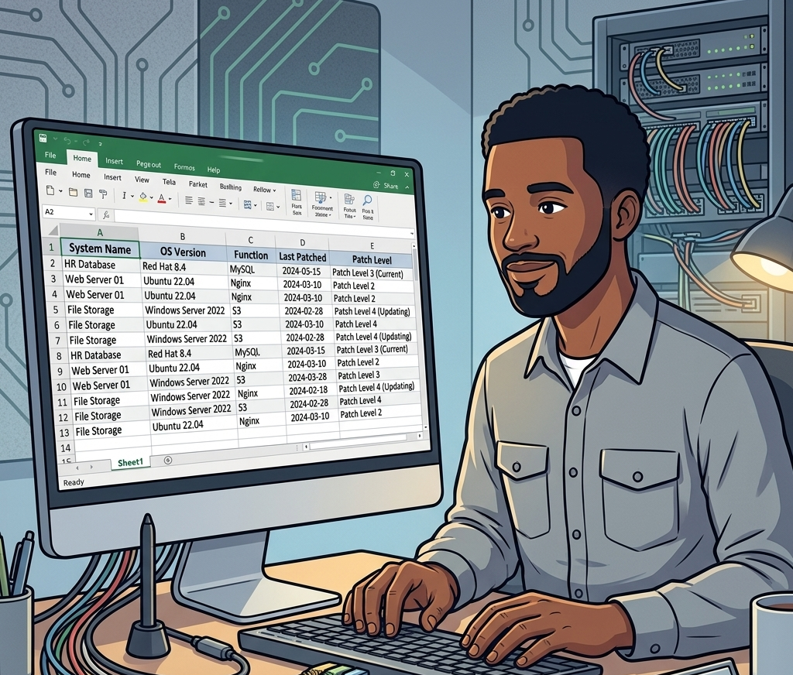
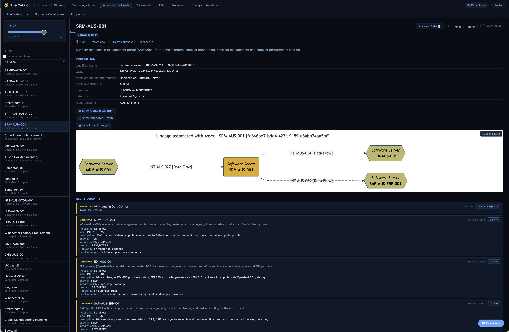
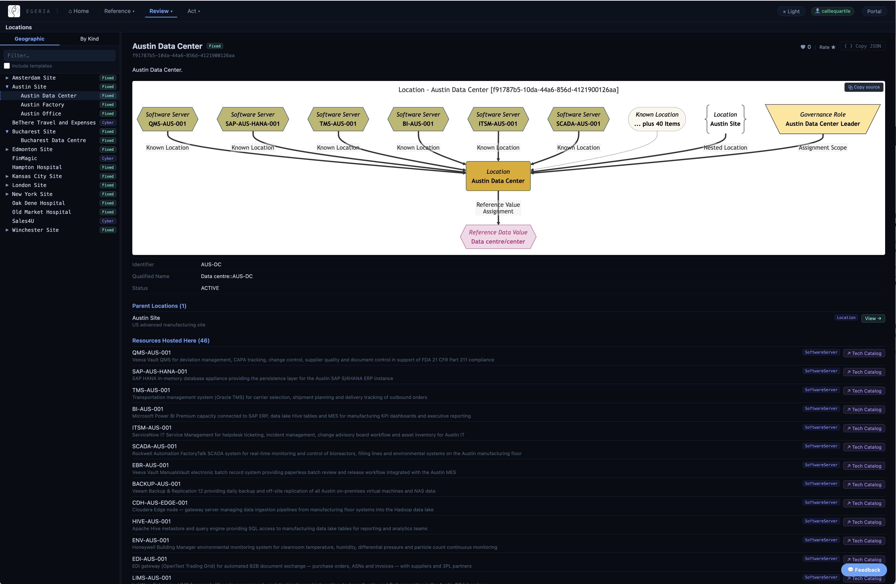
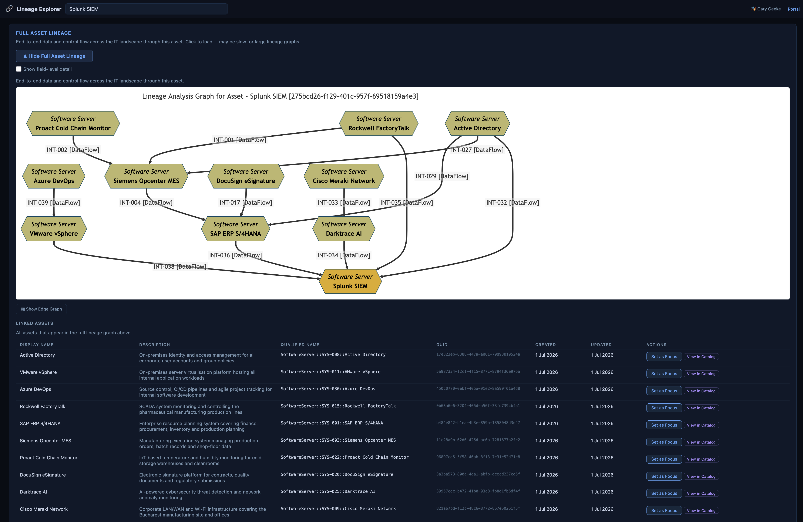

<!-- SPDX-License-Identifier: CC-BY-4.0 -->
<!-- Copyright Contributors to the ODPi Egeria project. -->

# Cataloguing Infrastructure

[Gary Geeke](/practices/coco-pharmaceuticals/personas/gary-geeke) has maintained a list of all the servers used at Coco Pharmaceuticals that are his responsibility in a spreadsheet.  Individual departments may have bought their own equipment (servers/laptops etc) but he is not responsible for them.

He has been pleased with this solution since it allows him to:

* List of all machines in his care at each location
* Plan capital for new machine purchases
* Keep track of software levels on all the machines
* Reorganize the workload when new projects start up

However:

* Maintaining the content - particularly for software levels - was tedious, and sometimes he got behind in cataloguing them.
* It was challenging to share the data with his team, since it resulted in multiple copies of the spreadsheet, and sometimes they got out of sync.
* No automation was possible based off of this information.
* It was not possible to collaborate with other teams - such as devOps, security and finance, ...

The spreadsheet had been good enough for years.  What changed was a question it could not answer.

[Erin Overview](/practices/coco-pharmaceuticals/personas/erin-overview) and [Peter Profile](/practices/coco-pharmaceuticals/personas/peter-profile) had laid out the [solution components for the strategic information supply chains](/practices/coco-pharmaceuticals/scenarios/defining-information-supply-chains/overview) and now needed to map each component to the system that actually runs it, so that the chains could be monitored rather than merely described.  Gary's spreadsheet was the only inventory of systems the company had.  It was not designed for that question - it lists what he runs, not what the business depends on - but it was the place to start, and answering from a spreadsheet would have meant days of copy-and-paste for a result nobody else could reuse.

He decides to load the spreadsheet contents into Egeria so that the mapping can be done against the catalog, and so that Erin and Peter can link the components to the systems directly.  He writes a simple script to load the contents through the [pyegeria](/concepts/pyegeria) API.
He also builds new scripts that populate different spreadsheet structures for his team's projects, and he is able to load any updates they make.

After experimenting with a number of queries, he discovers that his data was not as consistent as he had thought, and he starts to clean up the data through the Egeria APIs.

??? info "Viewing system metadata"
    Gary is able to view the metadata for the systems in his inventory through [The Catalog](/user-interfaces/the-catalog/overview) under the **IT Infrastructure** card.  Setting up a new system, or editing its details is through the [Asset Maker API](/services/omvs/asset-maker/overview).

    

The mapping goes as far as the spreadsheet allows, and then stops.  A good number of the components the supply chains depend on turn out to live in systems Gary was never responsible for: the ones departments bought to solve their own problems, the ones operated by third parties, and the ones nobody had missed because nothing had failed.  His inventory was answering *what do we run?* when the supply chains were asking *what do we depend on?*

Gary's next question is how widespread the problem is.  The company has just acquired two small-batch manufacturers, in Austin and in Bucharest, and neither appears in his spreadsheet at all.  He contacts both sites and asks for their systems data, expecting more of the same.  The data arrives as spreadsheets in slightly different formats, and it is easy to incorporate.

??? info "Loading systems into Egeria"
    There is a Jupyter Notebook that shows the loading of the Austin and Bucharest systems metadata into Egeria.  It is located in 'coco-workbooks/1. coco-data-hub/extending-the-systems-inventory'.  [Link to the notebook](https://github.com/odpi/egeria-workspaces/blob/main/coco-workbooks/1.%20coco-data-hub/extending-the-systems-inventory/extending-the-systems-inventory.ipynb).

??? info "Viewing systems at a location"
    Gary is able to see the systems at a location through [Egeria Explorer](/user-interfaces/egeria-explorer/overview) under the **Location** card.  Setting up a new location is through the [Location Arena API](/services/omvs/location-arena/overview).

    

It is a pleasant surprise.  Looking at the system definitions from the acquired sites, Gary realises that their operation is much more sophisticated than the original Coco Pharmaceuticals systems.  Both run a complete, modern stack for regulated manufacturing - laboratory information management, quality management, electronic batch records, equipment qualification - that the parent company has no equivalent of.  They also include the security monitoring software that was identified as lacking when they [did the IT Systems Security Strategy](/practices/coco-pharmaceuticals/scenarios/building-a-data-security-strategy/overview).  Most of the gaps the supply chain mapping had found are not gaps in the group; they are gaps in the parent, and the acquisitions have already closed them.

## Benefits of using Egeria

He gained the following benefits:

* The solution components of the strategic information supply chains could be linked to the systems that run them, so the chains can be monitored rather than merely described.
* He could see the systems from the newly acquired companies, and how they were operating.
* It was easier to collaborate with other teams that needed visibility to the system inventory:
    * The security team had a systems inventory to build their security policies around
    * The DevOps team could automate the creation of new systems through the [Egeria APIs](/services/omvs)
* Validation of system status was automated, simple check on reports and alerts
* Team freed up from maintaining the spreadsheets for infrastructure projects
* Formalisation of software levels into standard operating platforms reduced variation in system stacks and enabled a systematic upgrade process

## Next Steps

Gary is ready to collaborate with [Lemmie Stage](/practices/coco-pharmaceuticals/personas/lemmie-stage) on automating metadata capture during the DevOps pipeline.

--8<-- "snippets/abbr.md"
