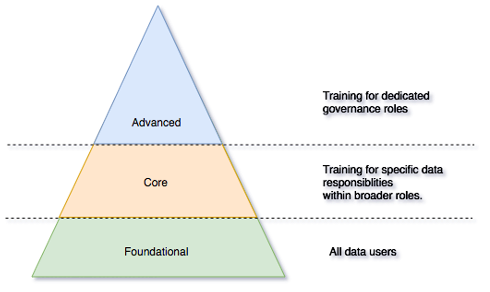
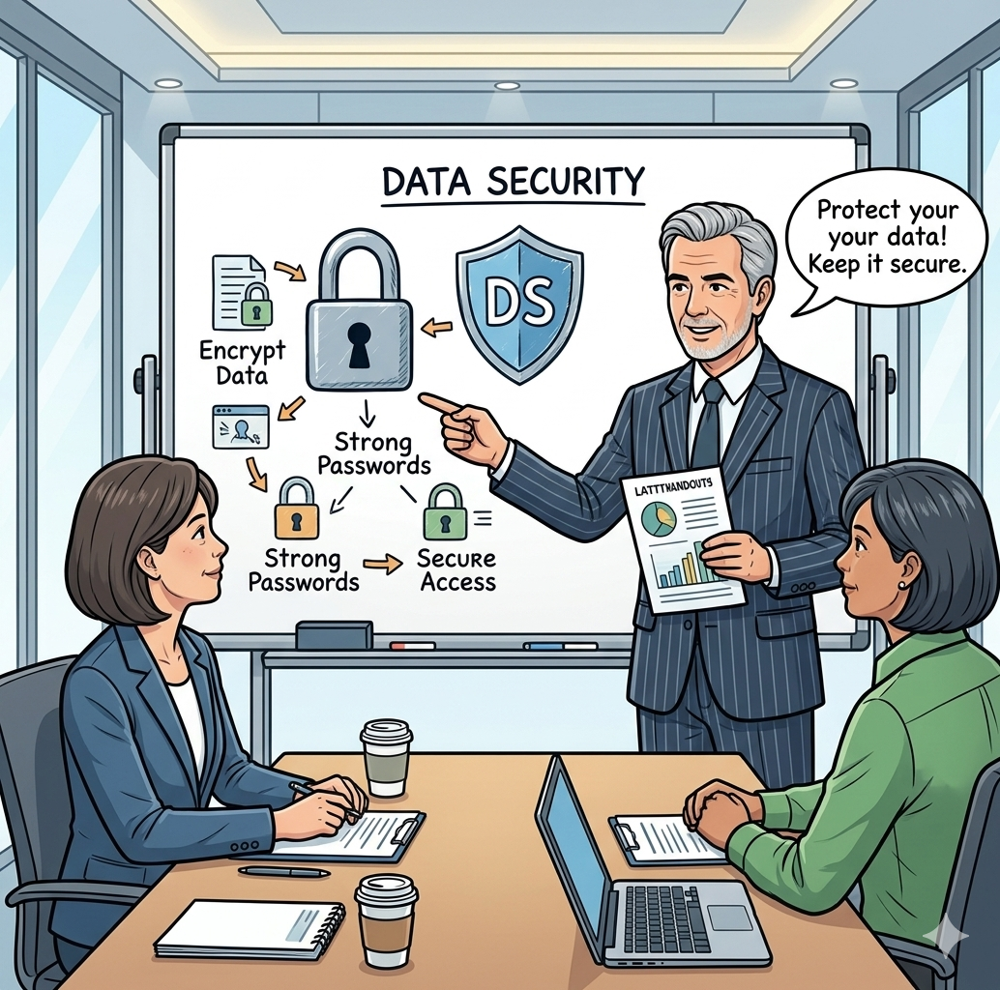
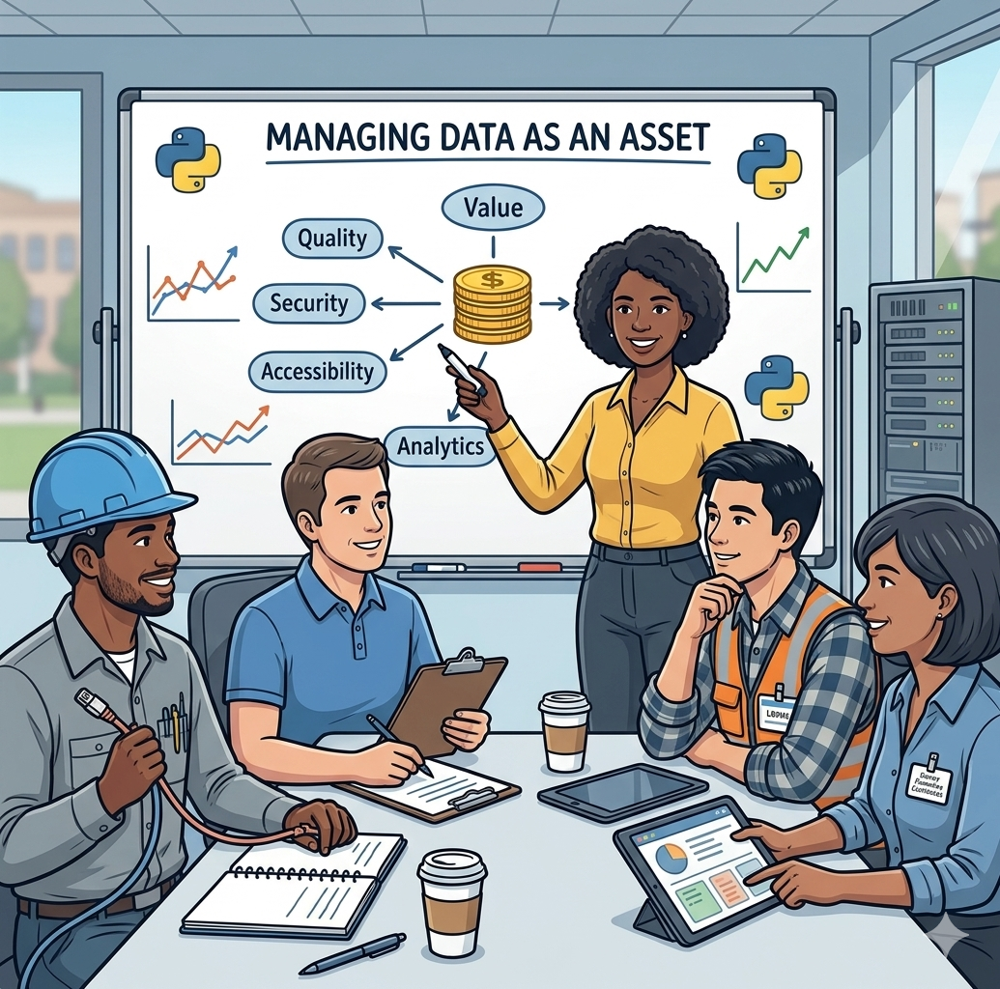
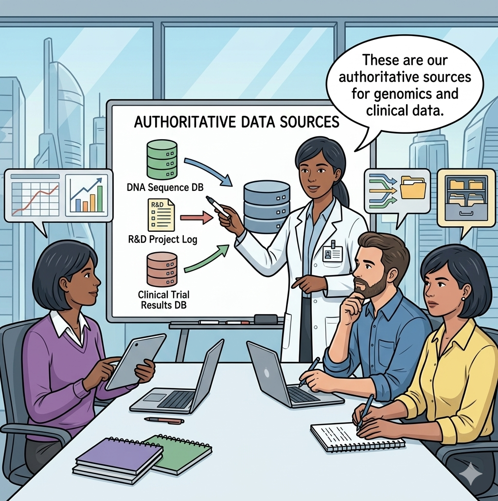
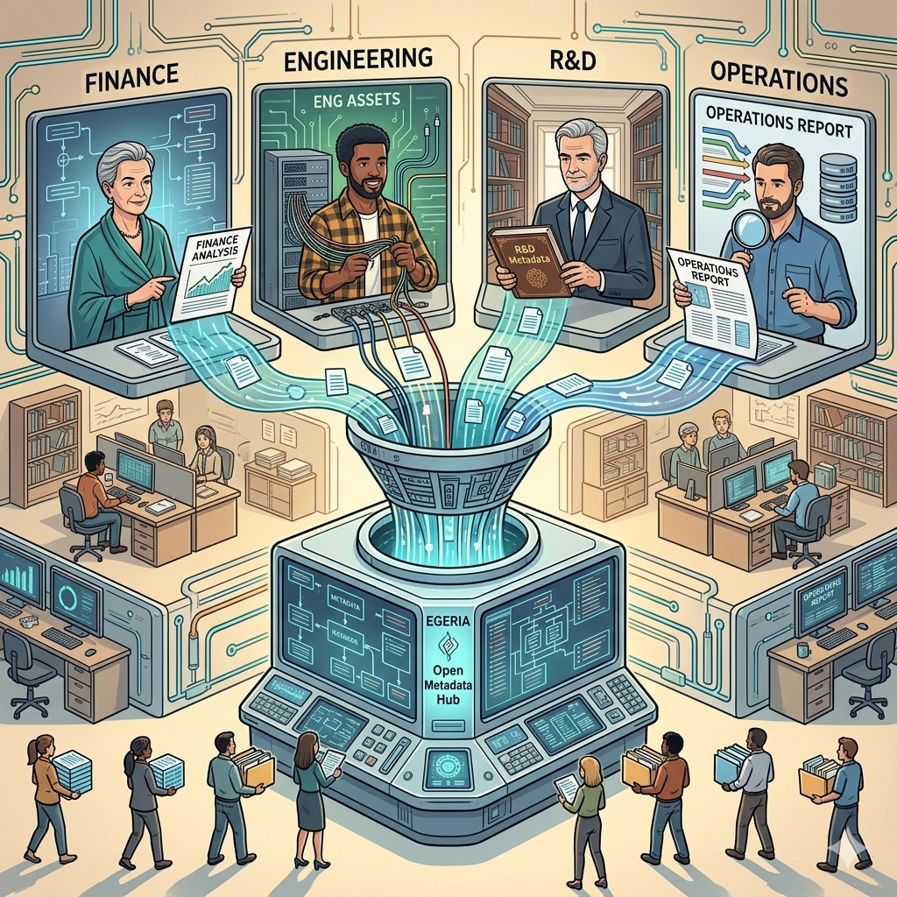

<!-- SPDX-License-Identifier: CC-BY-4.0 -->
<!-- Copyright Contributors to the ODPi Egeria project. -->

# Defining how to create data-enabled employees

Not all employees need to be expert in governance, security, regulations or data management.  

There is a foundation that all employees need to know, more detailed knowledge for those who have ownership or supervisory responsibility, with the deep expertise required for those with identified expert roles.

Therefore, as you design your training program, it is desirable to divide up the syllabus into these three areas: Foundational, Core and Advanced.
That way, the foundational training required for all employees can be delivered quickly, typically through departments and to new starters, with the more detailed training for core and advanced, targeted to smaller groups, at appropriate times for their projects.

In addition to training, to make permanent changes to the culture, leaders need to consider how individuals are motivated to "do the right thing".  This includes:

- job design - in terms of: *scope of responsibility/ownership/accountability*, *ease of collaboration with key colleagues* and *access to the right information for decision making*
- how people are measured
- the visible rewards and career advancement

## Training in Coco Pharmaceuticals

When the [governance leaders](/practices/coco-pharmaceuticals/scenarios/building-the-governance-team/overview) began to discuss staff training, they quickly agreed that it should be an interactive experience, with everyone given the opportunity to consider the issues, identify key asset, threats and positive actions as well as build a personal plan of action.

As such, each training course they identified included a basic set of training information followed by a set of questions that they were to work through, some as a team and others individually.  The aim was to make it personal and real to all who participated.  It also spread the start-up costs of creating the inventory of the companies assets and their role in the business.

For example, each team discussed cyber-security they were taught about data breaches, phishing attacks, and ransomware.  Then they were aske to identify shared passwords, systems that might be vulnerable, and other ways they could safe-guard their personal privacy and Coco Pharmaceuticals, operations and intellectual property.

> The finance team learning about data security

When it came to the training on data assets, the team spent time identifying their key data assets, how they could be improved, what would happen if they lost them, and coming up with reasonable classifications for them.

> The software development team learning about data assets

In particular, the teams were asked to separate out the valuable data assets from the authoritative sources.  This created some interesting discussions and led to a new way of thinking about the data landscape.

> The clinical trials team identifying key clinical sources

The results from the training sessions were collated into Egeria, mostly through [Dr Egeria](/user-interfaces/dr-egeria/overview) markwoen document processing with oversight from the governance leaders.

--8<-- "snippets/abbr.md"