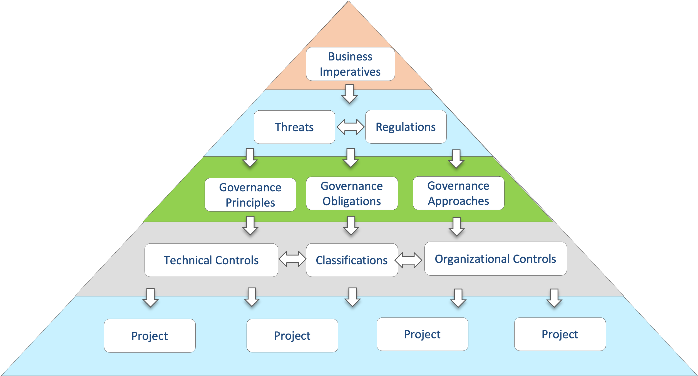

<!-- SPDX-License-Identifier: CC-BY-4.0 -->
<!-- Copyright Contributors to the ODPi Egeria project. -->

# Defining the need for multi-faceted governance

Part of Jules' vision for the organization is to link the different types of governance (data governance, security, IT infrastructure governance) together to create a coordinated program that can support the organization's goals and objectives.

> Jules defining the concept of multi-faceted governance

## Governance Domains

In Egeria, each type of governance is represented as a [governance domain](/concepts/governance-domain). Each domain has a leader, and often a community of people involved in that domain though a variety of capacities.  The community provides a cross-silo communication channel.  The description of the governance domain is maintained in linked [governance definitions](/concepts/governance-definition).

## Governance Definitions

The foundation of the governance definitions is defined in the governance drivers.  These are *business imperatives* that define the organization's goals and objectives, *regulations* and *threats*.  Their definition is a joint effort between the governance domain experts and the business leaders.  

The people responsible for each domain then define the governance policies and controls that they want to enforce in support of the governance drivers.  These new definitions are cross-linked together showing how the domains depend and support each other.

## Benefits and issues

There is a huge benefit in developing a multi-faceted governance program.  It allows the organization to focus on the most important aspects of the business.  The difficulty is that each governance domain is normally headed by a different business leader and uses different tools.  There is rarely any collaboration between them.

In Coco Pharmaceuticals, there has been little investment in governance in the past.  This is helpful to Jules because he will not need to fight against entrenched ways of working.  The leaders of Coco Pharmaceuticals are receptive to the need to invest in governance so Jules can set up the governance program in a multi-faceted way from the start.

In [Building the Governance Team](/practices/coco-pharmaceuticals/scenarios/building-the-governance-team/overview) we see the newly appointed leaders of the governance domains working on the common governance drivers that will define the focus of the governance program.

!!! info "Further information"

    * [Planning for a governance program](/guides/planning/governance-program/overview)
    * [Governance Definitions](/concepts/governance-definition)

--8<-- "snippets/abbr.md"