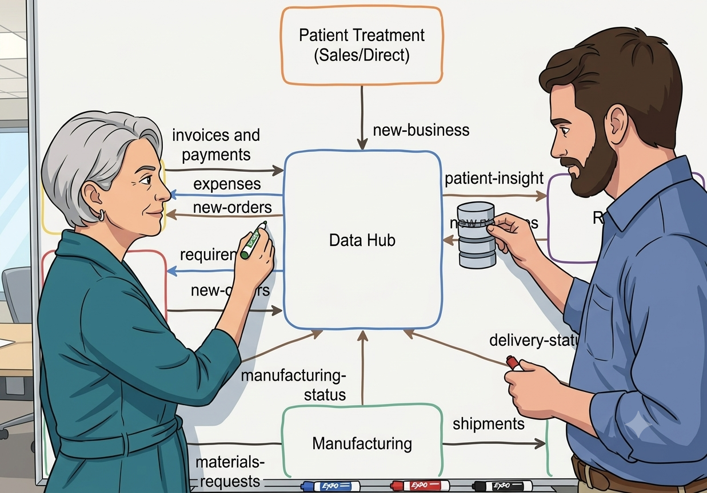
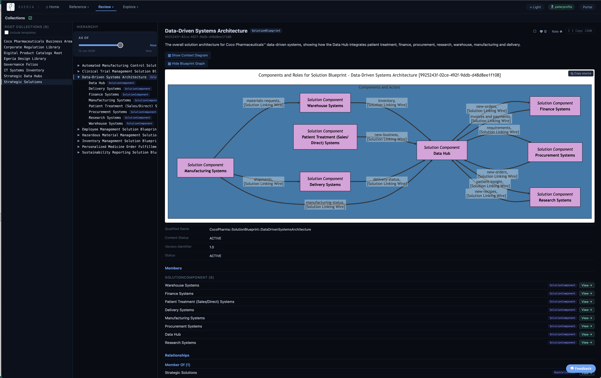
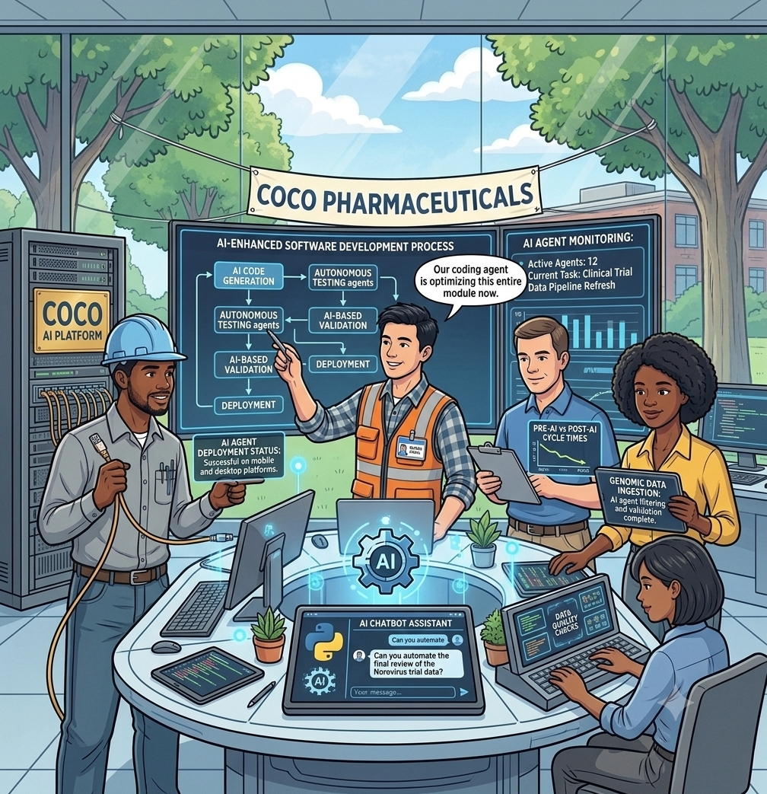
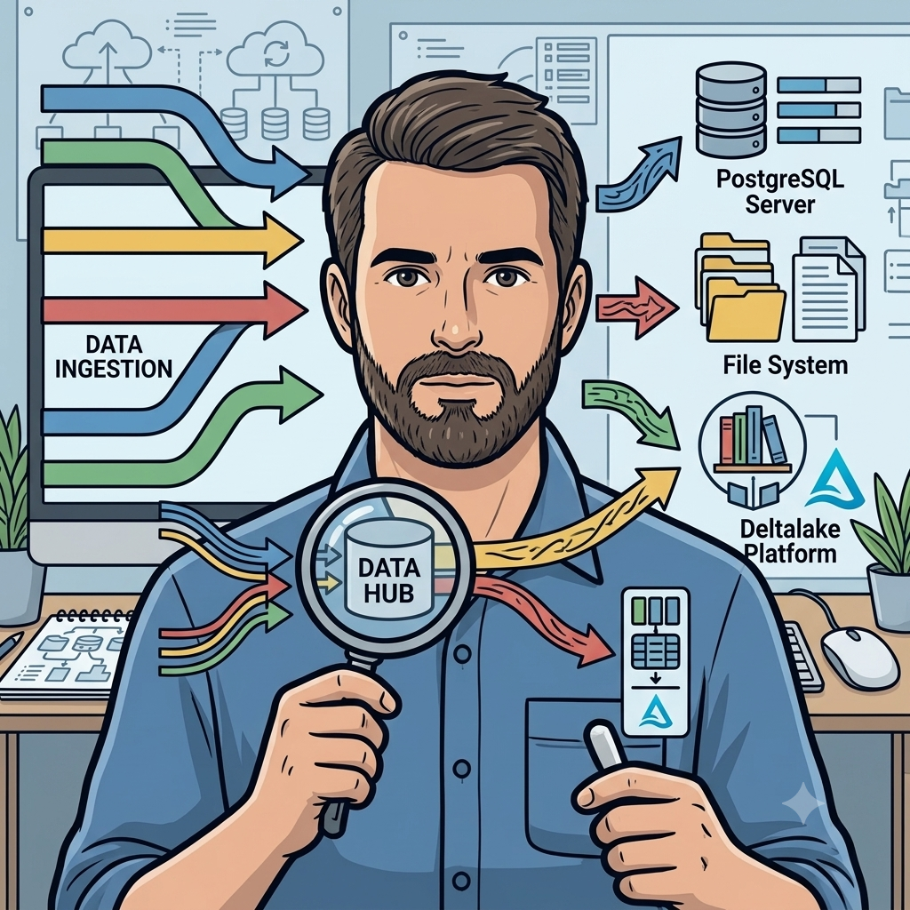

<!-- SPDX-License-Identifier: CC-BY-4.0 -->
<!-- Copyright Contributors to the ODPi Egeria project. -->

# Defining the new system architecture overview

[Jules Keeper](/practices/coco-pharmaceuticals/personas/jules-keeper) asked [Erin Overview](/practices/coco-pharmaceuticals/personas/erin-overview) and [Peter Profile](/practices/coco-pharmaceuticals/personas/peter-profile) to define an architecture that supports the exchange of data between the different parts of the business.  They are looking for a high-level view that their sponsors can understand.  They also need an approach that will allow them to start simple and then build up the scope of data as they gain experience.  

The sketch below shows what they came up with.

> Proposed data-driven systems architecture

It shows a data hub in the center with data flows to and from it into the different business units.  The data flows are shown as arrows, labelled with the type of data flowing.  Each business owner can therefore see the data their teams need to contribute and the data they will receive in return.

The implementation plan can be built up flow by flow, with the development team working with each business team in turn to extract information about the data they work with, its associated business rules and volumetrics.

## Defining the systems architecture blueprint

Erin creates a [solution blueprint](/concepts/solution-blueprint) called **Data-Driven Systems Architecture** for the new architecture using [Dr.Egeria](/user-interfaces/dr-egeria/overview) markdown commands.

The solution blueprint makes the architecture visible to a broader audience, and as implementation is linked to the solution components of the blueprint, they are able to follow the progress of the implementation.  Once operational, the solution blueprint becomes an aggregation point for statistics and other analytical results related to data sharing across the organization.  This helps the teams reliant on the data exchange to verify that all is working well.

??? info "Loading the solution blueprint"
    The Markdown file containing the solution blueprint is available in either the JupyterLab or Obsidian environment of [Quickstart](/egeria-workspaces/quick-start/overview) .  It is located in 'coco-workbooks/1. coco-data-hub/solution-design.md'.  [Link to the Markdown document on GitHub](https://github.com/odpi/egeria-workspaces/tree/master/coco-workbooks/1. coco-data-hub/solution-design.md).  Follow the instructions in the `README.md` file to load the solution blueprint into Egeria.

??? info "Viewing the solution blueprint"
    The solution blueprint can be viewed through [Egeria Explorer](/user-interfaces/egeria-explorer/overview) either through the **Solution Architect** card or **Collections** card and selecting **Strategic Solutions**.
    

## New AI practices

Building the data pipelines and data models for the data driven systems architecture is a large development project.  [Polly Tasker](/practices/coco-pharmaceuticals/personas/polly-tasker) has been reading about the benefits of using AI for data integration work.  This included:

* Using AI to understand the data
* Using AI to understand the business rules
* Using AI to understand the volumetrics
* Using AI to generate the data pipelines
* Using AI to generate the data models

Her team were excited to pursue this approach since integration work is time-consuming, tedious work and they are a tiny team to be attempting such a huge project.

They being by examining their current tools and practices.  This was a process of reinventing themselves and their ways of working.
Polly suggested they use one of the whiteboards to maintain a list of principles for their new processes.  She explained that principles are a good guide when exploring new territory.

Peter asked if they should be using AI for this process.  *"Of course, we will"*, replied Polly.  She planned to use AI to maintain the definitions of their process and projects in Egeria using Dr.Egeria commands.  However, AI cannot invent the requirements and desired outcomes - they had to do that for themselves.  In fact, much of their work going forward will involve precise specification of what needs to be built - leaving the AIs to generate/maintain the implementation.  AI could also be used to generate test code too, but it can make mistakes.  Ultimately, responsibility for the correct code remained with them.  

*"The AI did it wrong is no excuse!"*

*"Ah - isn't this our first principle?  That the IT project team retains ownership of the resulting software, and responsibility for its quality, evolvability and security?"* replied Peter.

Everyone agreed and it went on the board.  With the ice broken, they came up with this initial list of principles:

* The AI did it wrong is no excuse!  The IT project team retains ownership of the resulting software, and responsibility for its quality, evolvability and security.
* All software should be built with observability in mind.  This observability supports verification of progress and throughput; alerting when errors occur or something fails to happen (much harder!) and diagnosis of the cause of any issues.  It includes multiple perspectives - an engineer level view, a system level view and a business level view, and a business owner view.
* All software should be built with verification in mind.  This includes testability during development and first-failure data capture in operation.
* All software should be built with resilience in mind.  Resilience ensures these business-critical processes do not fail - or in extreme circumstances, degrade gracefully alerting the relevant people.

Callie also added an obligation to "use AI wisely".  It uses a lot of resources (energy, water) and so should not be used for routine, repeatable tasks, but instead to generate artifacts such as programs, data models, open metadata, and documentation that will efficiently support the business.

Polly suggested that they next walk through how a simple data pipeline and data model are created and how AI should change that process.  The aim is to determine their general approach and map out an initial development process flow.

This included:

* Extracting the specification of the source system's data feed.  Including its schema, valid values, and volumetrics (frequency, trigger, expected volumes, peak times etc).
* Extracting the schema of existing data stores (primarily Operational Data Stores (ODSs)) that will be included in the data hub.
* Designing any new data stores for the data hub.
* Extracting the specification of the target system's API and data store.  Including its schema, valid values, and volumetrics (frequency, trigger, expected volumes, peak times etc).
* Modelling mappings between source systems, data hub stores and target systems.
* Designing the data pipelines to move the data from the source systems to the data hub.
* Designing the data pipelines to move the data from the data store to the target systems.

They saw uses for AI in every stage.  The biggest *aha* realization was in the role of Egeria.  They all understood that it would be where all the data stores and pipelines would eventually be catalogued, linked to the business context in the form of [solution blueprints](/concepts/solution-blueprint) and [information supply chains](/concepts/informaiton-supply-chain), so that operational data could be organized and aggregated for business users.  What they began to appreciate was that by involving Egeria in all phases of the engineering work, the mapping of the business context to implementation evolved naturally, allowing testing and review of the resulting observability to be validated at each stage.  AI could be used in the development of this business context, making open metadata a key part of the development process.

With this in mind, they evolved their approach to AI-based data integration.

After the meeting, Polly entered the notes from the meeting into [Claude Code](claude.com/claude-code) and it produced a [Dr.Egeria](/user-interfaces/dr-egeria/overview) file that included the commands to create the governance program for their AI-based software development.  Claude event made some helpful suggestions on they types of metrics they could consider.

??? info "Loading the AI-based software development process"
  The Markdown file containing the AI-based software development process is available in either the JupyterLab or Obsidian environment of [Quickstart](/egeria-workspaces/quick-start/overview).
  It is located in 'coco-workbooks/1. coco-data-hub/solution-design.md'.  [Link to the Markdown document on GitHub](https://github.com/odpi/egeria-workspaces/tree/master/coco-workbooks/1. coco-data-hub/solution-design.md).  Follow the instructions in the `README.md` file to load the solution blueprint into Egeria.

??? info "Viewing the AI-based software development process"
  The governance definitions can be viewed through [Egeria Explorer](/user-interfaces/egeria-explorer/overview) either through the **Governance Definitions** card or **Collections** card and selecting **Folios** and then **Govrnance Folios** and then **Senior Software Manager — Governance Folio**.
  

## Building the Data Hub

One of the initial development tasks was to create the definitions for the data hub and the data stores the knew they would need.  This was considered a *No Regrets* activity and created the base definitions for the new integrations they will build.

??? info "Building the Data Hub"
   You can see/run the process of building the data hub in the JupyterHub of the [Quickstart environment](/egeria-workspaces/quick-start/overview).  It is found in the `coco-workbooks` under `1. coco-data-hub`.  The [README.md](https://github.com/odpi/egeria-workspaces/blob/master/coco-workbooks/1.%20coco-data-hub/README.md) provides more information how to run the notebook.  The notebooks is called [setting-up-the-data-hub.ipynb](https://github.com/odpi/egeria-workspaces/blob/main/coco-workbooks/1.%20coco-data-hub/2.%20setting-up-the-data-hub.ipynb).

<!-- ## Designing the Data Hub Stores -->

<!-- ## Implementing the Data Pipelines -->

--8<-- "snippets/abbr.md"