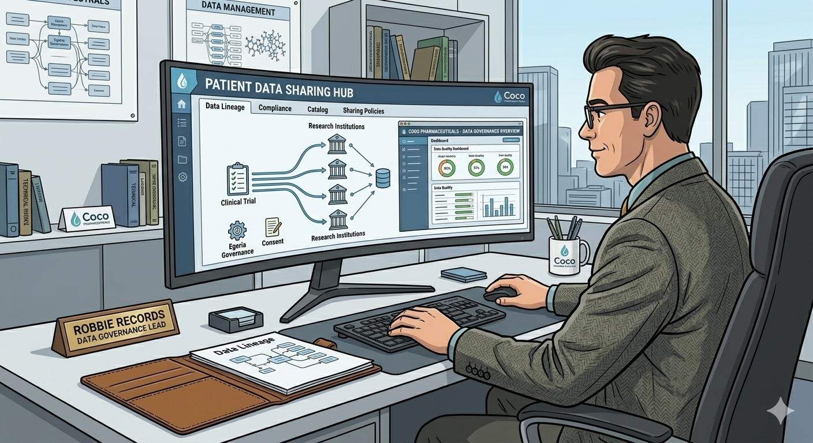

<!-- SPDX-License-Identifier: CC-BY-4.0 -->
<!-- Copyright Contributors to the Egeria project. -->

# Patient Data Sharing Hub

[Robbie Records](/practices/coco-pharmaceuticals/personas/robbie-records) has decided to take action.  He works for Hampton Hospital and is responsible for the centralized Patient Data Records.  He receives a lot of requests for patient data, beyond the normal day-to-day uses when treating patients.  These additional requests come from the medical staff working at the hospital as part of their research projects, as well as pharmaceutical companies that are working with the hospital on clinical trials.

He currently has to manage these requests by hand, which means he often takes at least a week to fulfill a request, and sometimes he has to refuse them when he is overwhelmed with other work.  He wants to automate the process so that he can focus on other tasks and improve the data sharing experience.  At the same time, the hospital has strict policies on patient confidentiality, security and privacy.  He needs to ensure that he is both implementing these policies AND can demonstrate to an auditor that all is working as expected.

## How is patient data managed?

The patient data that Robbie managed is largely in a number of PostgreSQL databases plus some media files.  There is a portal for the staff to view and update a particular patient's data.  When a patient is being treated, new data from the various medical systems and equipment is added to the patient's data.  This may arrive as files or as a stream of data that is fed into PostgreSQL.  The PostgreSQL server, file system and portal is managed by the hospital's IT department, so Robbie is not responsible for them.  As a results, they are backed up, upgraded and secure.

When Robbie is asked to share patient data with a third party, he creates a new database for their project and copies the data from the original database.  He maintains a set of documents in a directory (folder) on the filesystem - one for each project requesting data.  The documents describe the purpose of the project, how the data will be used and which database has the copy of the data that is shared.

To actually share the data, Robbie typically exports the data into CSV files that are then zipped up with a password and delivered to where the team can access it.  The password is generated by a secure password generator and is only shared with the team that requested the data.

When Robbie is working with a third party, such as a pharmaceutical company performing a clinical trial, there are often additional requirements, specified by the data sharing contract between the hospital and the pharmaceutical company.  Robbie can perform simple transformations using SQL commands, but needs to get help from the department that generated the data if data values are outside acceptable ranges.

## Robbie's vision

Robbie would like to create a patient data sharing hub that allows an in-house data requester to manage (create/view/amend) their data sharing request, including specifying the data they require and the purpose they will use it for.  They may also need to agree to certain conditions on how the data must be managed once they have their copy.

Robbie also wants to handle data sharing requests from third parties.  In this case, the third party will not have direct access to the patient data sharing hub, but Robbie should be able to manage their request and requirements, as well as keeping track of any data sent to them.

## Using Egeria

Robbie saw a presentation about the latest version of Egeria at a conference and decided to try it out. Egeria provides a robust platform for managing metadata and governance, which will be crucial for tracking and managing data sharing requests and ensuring compliance with regulations and contracts.

He downloads [egeria-workspaces](https://github.com/odpi/egeria-workspaces) from GitHub and [installs it](/egeria-workspaces/fresh-start/overview) on his local machine.  He then starts customizing it for the Patient Data Sharing Hub.

## Building a Data Dictionary for the Patient Data Sharing Hub

## Creating a data sharing request form

## Creating the solution blueprint

## Processing a data sharing request from a member of the hospital medical staff

## Processing a data sharing request from a third party

## The IT Team arrive ...

Once the Patient Data Sharing Hub is up and running, and Robbie is managing data sharing requests from medical staff and third parties, the hospital's IT team hear about it and visit Robbie to express their concerns at him running his own system.  They examine the setup and agree it is secure and he has covered the privacy and security requirements.  However, there are no backups and they wondered if Robbie was willing to manage all of the patching and upgrading of the system over time.  They offered to take over the maintenance and back up of the system. Robbie would retain admin access to allow him to make improvements.  The IT team would monitor the hub and ensure that it remained up-to-date and backed up.  This seemed a reasonable agreement to Robbie.   

## Conclusion

With the patient data sharing hub in place, Robbie can now manage his data sharing requests and ensure that they are compliant with regulations and contracts.

--8<-- "snippets/abbr.md"

