<!-- SPDX-License-Identifier: CC-BY-4.0 -->
<!-- Copyright Contributors to the Egeria project. -->

# New Sustainability Initiative

Climate change is upon us. Many public and private institutions recognize they have a role to play in reaching global sustainability goals to slow climate change, as well as mitigating and adapting to the various risks that climate change is driving.  There are also emerging [regulatory reporting requirements for sustainability](https://finance.ec.europa.eu/financial-markets/company-reporting-and-auditing/company-reporting/corporate-sustainability-reporting_en) to add a "stick" to the mix.

Making a systemic change in the way an organization does business is a major cross-cutting initiative with many complexities.  It is likely to affect all parts of the business and require upfront investment. On the other hand, if done well, it will provide opportunities for innovation, differentiation and cost-savings over time - as well as meet commitments to shareholders, partners and regulators.

**Choosing a starting point that is tangible, understandable and incrementally achievable is important. And good information is the heart of a successful change.** 

With this mission in mind, the Coco Pharmaceuticals' board decides to establish a sustainability program.

The foundation for sustainability reporting is accounting for carbon emissions (and their equivalence) by following protocols such as the [Greenhouse Gas (GHG) Protocol](https://ghgprotocol.org/). This can help all stakeholders establish:

* The organization's direct and indirect carbon emissions baseline
* Goals and targets to reduce these emissions
* Campaigns and projects to achieve these goals
* Progress monitoring and reporting
* Auditable results to publish to stakeholders - governmental, financial and market.

## Leadership

The board considered how to organize and execute the program. Through these discussions they realize that this program was not only important in itself, but would provide an opportunity for some promising, more junior staff to learn how to collaborate and lead across the business.

There were a few candidates put forward, but at the end of the discussions, all agreed that this would be an excellent experience for [Tom Tally](/practices/coco-pharmaceuticals/personas/tom-tally). As Tom already had dealings with both [sales and suppliers](/practices/coco-pharmaceuticals/scenarios/investigating-suspicious-activity/overview) this would expand her experience across the whole company. 

There were concerns, of course, that she was inexperienced - and so it was agreed that Tom should be paired with two experienced leaders to support her.  As a result, the following team was announced:

- [Tom Tally](/practices/coco-pharmaceuticals/personas/tom-tally) - team leader, Accounts Manager
- [Stew Faster](/practices/coco-pharmaceuticals/personas/stew-faster) - technical lead, Manufacturing Manager
- [Erin Overview](/practices/coco-pharmaceuticals/personas/erin-overview) - information lead, Information Architect

To provide overall guidance and oversight, it was agreed that a partnership between [Reggie Mint](/practices/coco-pharmaceuticals/personas/reggie-mint) and [Jules Keeper](/practices/coco-pharmaceuticals/personas/jules-keeper) would provide executive sponsorship.

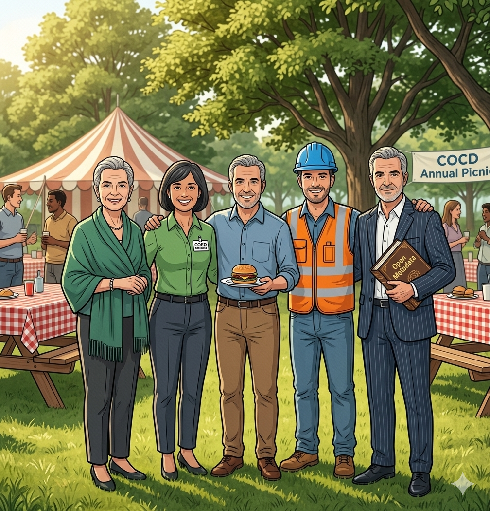
> The sustainability team from left to right: Erin, Tom, Reggie, Stew and Jules

## First steps

Reggie Mint and Jules Keeper call a meeting with the newly formed team of Tom, Stew and Erin. They explain the situation as related to them from the board meeting and lay out what the board wants them to achieve.  

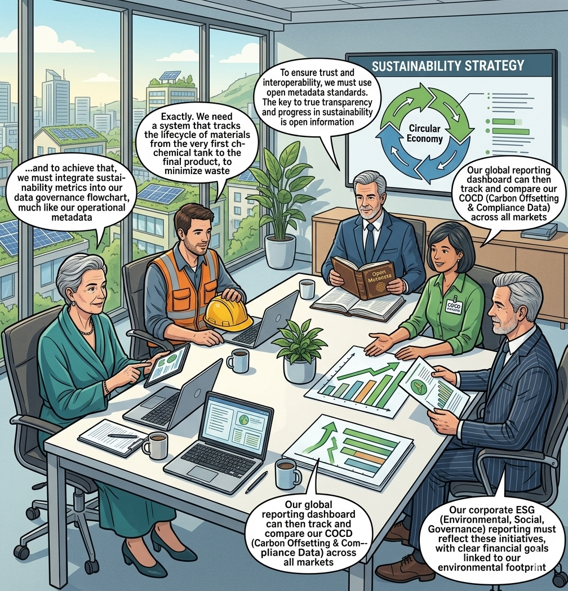

Reggie and Jules ask the team to put together an initial proposal for how to proceed - and to come back in a week to discuss. Tom, Stew and Erin nervously agree and depart to discuss over a working lunch.

## Scoping the Sustainability Program

Over lunch, they discuss next steps.  Tom offered to review the [Greenhouse Gas Protocol](https://ghgprotocol.org/) requirements to understand what types of data collection and reporting are required.

Stew suggests they have conference calls with a range of managers across the business to get their view on where the sustainability program should focus.

Erin offered to review how the data governance and security teams managed their cross-organizational responsibilities.

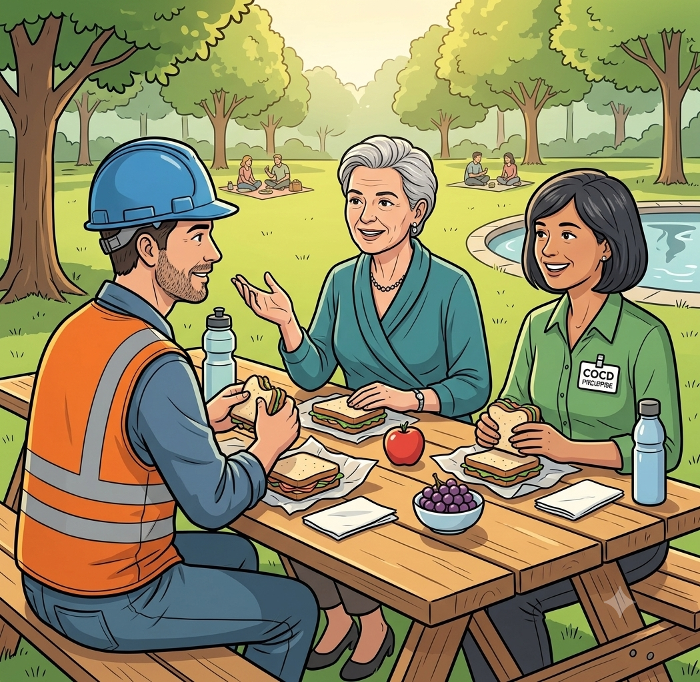

When they next meet, Erin shows them the list of governance domains operating in Coco Pharmaceuticals - including the new value added for their sustainability work.

???+ info "Governance Domain definition"
    The definition of the governance domains can be seen in [egeria-explorer](/user-interfaces/egeria-explorer/overview) under the **Valid Values** tile, look for the **domainIdentifier** valid value set.  Setting up a new domain is through the [Valid Metadata API](/services/omvs/valid-metadata/overview).

    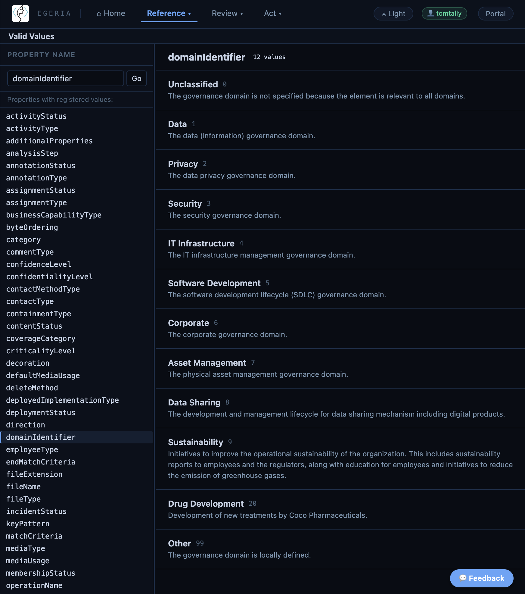

She also showed them the governance definitions that Jules and Reggie had created as a result of the board meeting.

There was a *business imperative* to protect Coco Pharmaceuticals from global instability, and linked to that was a *governance principle* to operate Coco Pharmaceuticals in an increasingly sustainable way.

Erin said they need to define how they want to structure the sustainability program.  She also showed Tom the types of approaches both the [Data Governance](/practices/coco-pharmaceuticals/scenarios/defining-the-data-governance-program/overview) and [Security](/practices/coco-pharmaceuticals/scenarios/defining-the-data-security-strategy/overview) teams have created.

???+ info "Governance Definitions"
    Governance drivers and principles are types of [governance definitions](/concepts/governance-definition). Governance definitions are used to record precise requirements, decisions, intents around governance to help people understand what is being asked of them, why, and how their activity will be measured.

    You can browse the governance definitions using [egeria-explorer](/user-interfaces/egeria-explorer/overview) under the **Governance Definitions** tile.  They are organized by type and can be filtered by  **domainIdentifier**.  Setting up a new governance definition is through the [Governance Officer API](/services/omvs/governance-officer/overview).

Tom offered to come up with an initial plan, and they would meet the next day to discuss it.

## Scoping the Sustainability Governance Program

Tom realised that the sustainability topic was huge, but if she was going to have an impact, she must keep it very focused.  She also needed to recruit people from across the organization since it needed a cultural change to keep the initiative vital over the longer term.  She liked the idea of a cross-company community to bring people together.  She also thought the sustainability reporting regulations would provide a concrete framework for gathering relevant data.

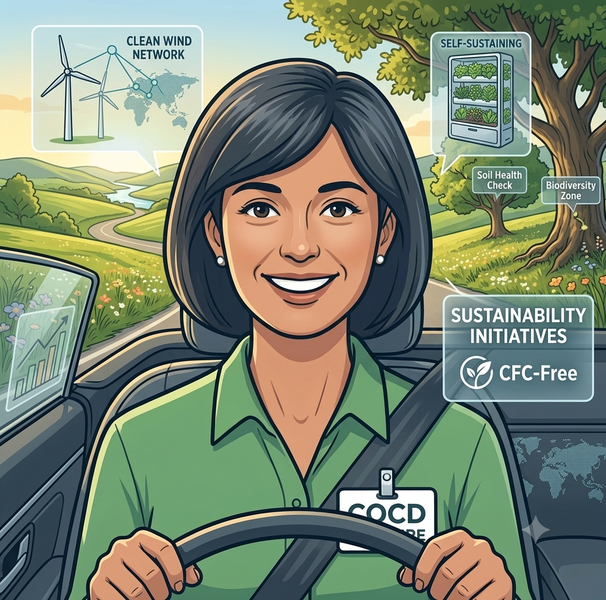

The next day, Erin and Stew help Tom structure the approach and create the governance definitions to show to Reggie and Jules.

There are three main parts to it:

* Build a sustainability community to education and inspire people across the company on their role in the company's sustainability imperative.
* Using existing data collected by the business, create a sustainability dashboard that can be used to show their current position.  Over time, it would allow them to track the progress of the initiative.
* Run an initiative to reduce the use of CFCs in refrigeration units.

Reggie and Jules agreed with the approach, and the team moved on to the implementation plan.

???+ info "Reviewing the Governance Definitions"

    You can browse the governance definitions using [egeria-explorer](/user-interfaces/egeria-explorer/overview) under the **Governance Definitions** tile.  Select the **Domain 9 - Sustainability** option from the domain drop-down to filter the definitions just for sustainability.Then select **Protecting Coco Pharmaceuticals from global instability**.  You can **Load Context Diagram** to see the governance approaches defined by the team and bleow the diagram are links to navidate to the governance principle of **Operate Coco Pharmaceuticals in an increasingly sustainable way** and then onto the governance appropaches.  Alternatively you can select them directly by opening up the left-hand tree view.

    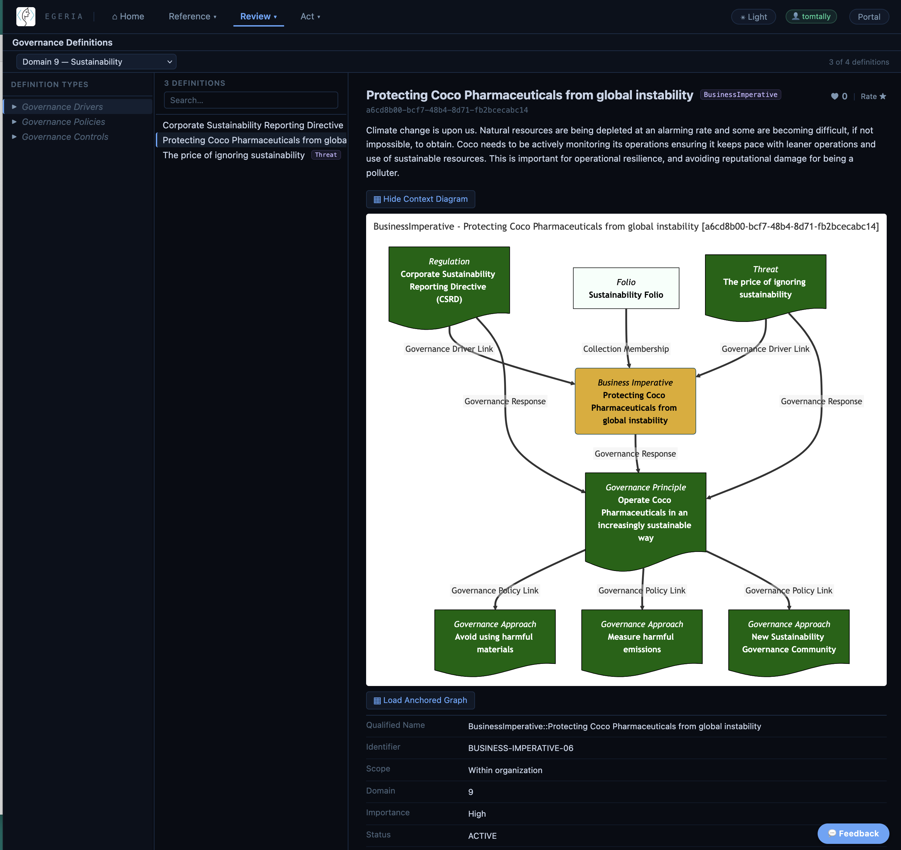

## Establishing the broader sustainability team

Tom takes [Faith Broker](/practices/coco-pharmaceuticals/personas/faith-broker) from Human Resources through the idea of the sustainability community.

For the membership, they agree that the community should be open to all employees, including contractors and interns who are interested.  However, there would be a core membership based on specific roles.  The people appointed to these roles are required to participate in the community.

The roles they agree are:

* Sustainability Leader - this is Tom as the leader of the initiative and community.
* Site and Facility Owner - for site/facility specific discussions.
* Sustainability Champion - one per business area in Coco Pharmaceuticals to drive initiatives specific to their the business area.
* Sustainability Technology Lead - this is the person responsible for the Sustainability reporting information supply chain.

When Tom takes Erin and Stew through the community structure, Erin shows them how a community and their roles are defined. 

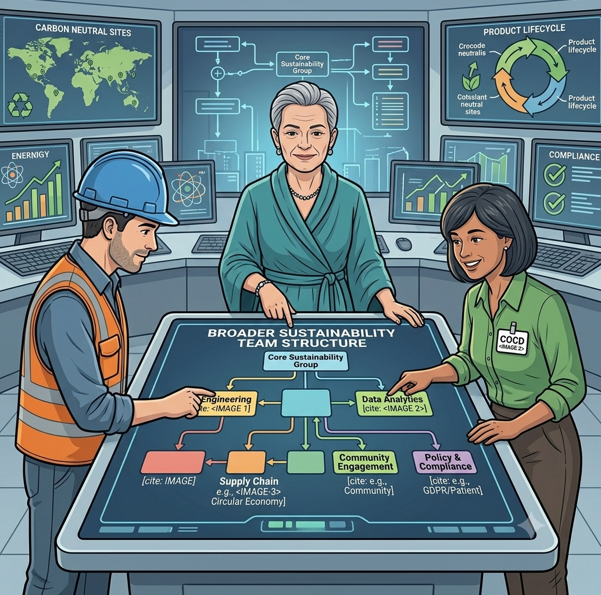

???+ info "Reviewing the Communities"
    You can browse the communities using [egeria-explorer](/user-interfaces/egeria-explorer/overview) under the **Communities** tile.

    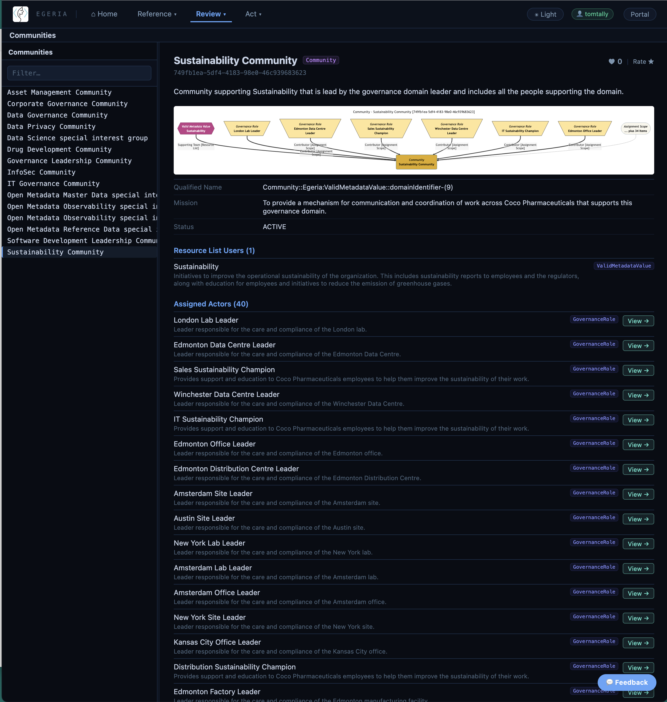

    Communities are managed through the [Community Matters API](/services/omvs/community-matters/overview).

## Mapping out the company

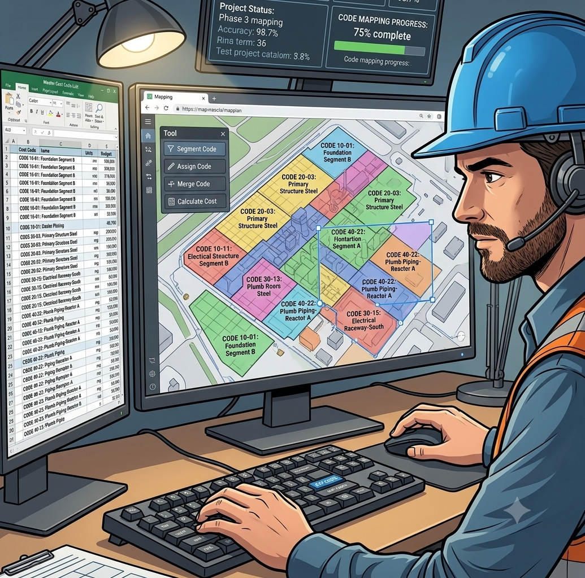

## Building the Sustainability Glossary

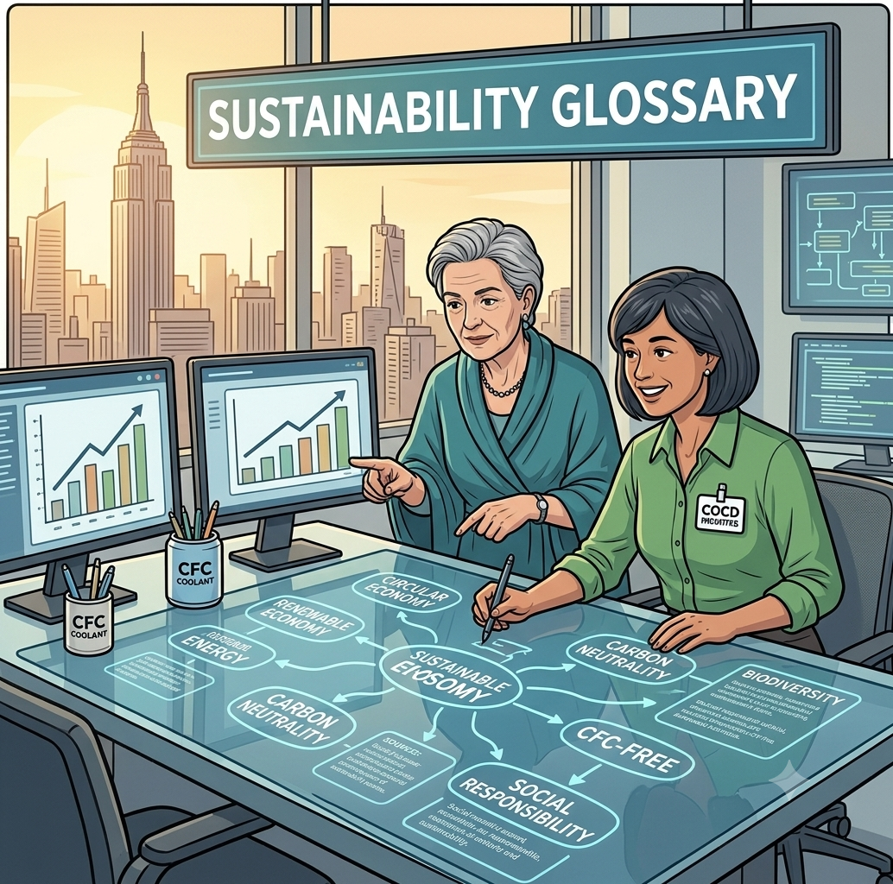

## Designing the Sustainability Supply Chain

The sustainability supply chain collects, processes and delivers the greenhouse gas emissions data to a dashboard that is used to track the progress of the initiative.

To build the supply chain the team first need understand the requirements. A good way to start is to work backwards from the results they are trying to produce. In this case, they are looking to produce a sustainability dashboard that documents Scope 1 and Scope 2 emissions across a number of dimensions.

This dashboard is for internal stakeholders within Coco Pharmaceuticals - it contains much more information than would typically be published to broader communities.

#### Inferred requirements

By understanding the dashboard they can better understand some key requirements for the supply chain that we need to design and implement:

* Collect data and calculate scope 1 and scope 2 emissions
* Collect information per site and operation
* Store the information over time to create yearly comparisons
* Aggregate data across time, site, scope, operations
* Accommodate change - new sites, changing operations, changing business structure, business expansion

#### Designing the supply chain

The inferred requirements are the beginning of the supply chain design process. As they continue to work backwards, the issues that they have to address include:

* How often does the dashboard need to be updated?
* How often do emissions calculations need to be run?
* How are we going to execute these calculations?
* Where is the data for these calculations coming from?
* How do we need to prepare this data for calculations to be performed?
* Who owns the source data that we need?

Working through these questions leads them to break the supply chain down into three logical stages:

* Collect data from source systems
* Refine and process this data to calculate emissions
* Store the results and aggregations for analysis and reporting

### What type of data is needed?

|                        Company Operations                         |                        Hazardous Materials                         |                Employee Travel                |
|:-----------------------------------------------------------------:|:------------------------------------------------------------------:|:---------------------------------------------:|
| 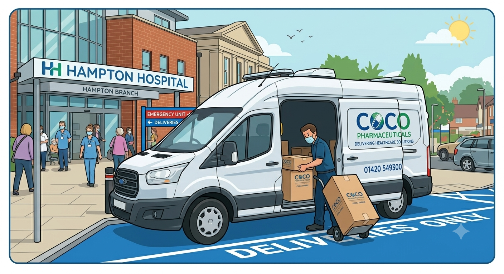 | 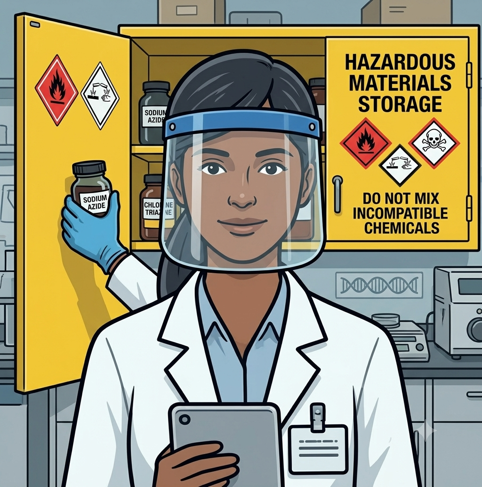 |  |

### Where will the data come from?

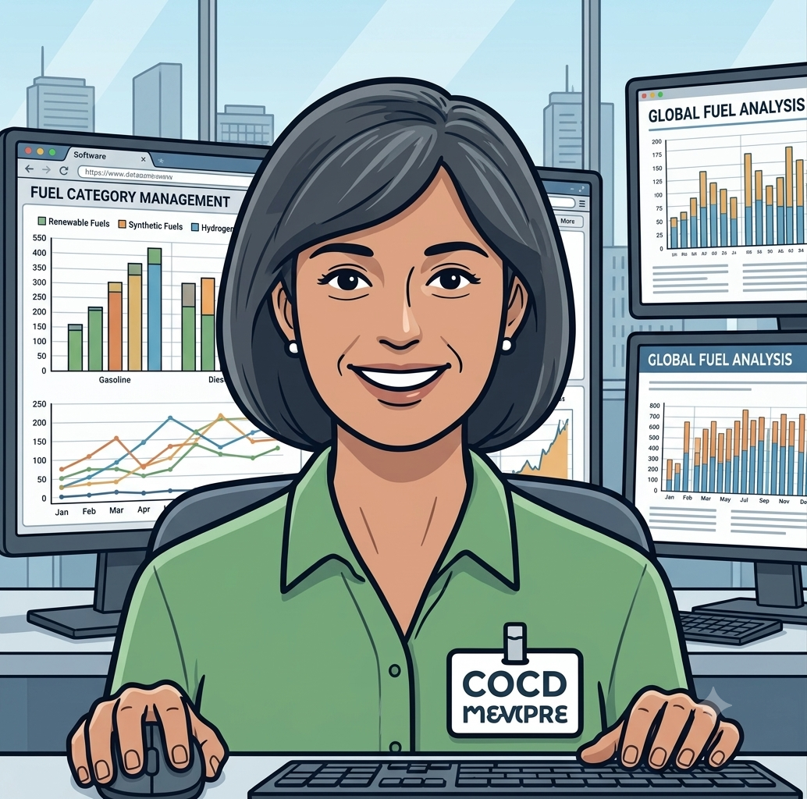

### Where will the data be stored?

They decide to build an Operational Data Store - this is a database that holds a copy of the data extracted from various systems and organized to support the calculations and reporting requirements.  This new database is given the name `coco-sus` and will become part of the [Coco Pharmaceuticals Data Hub](/practices/coco-pharmaceuticals/scenarios/defining-new-systems-architecture/overview).

### How will the data be processed?

### How will the data be visualized?

It is important for Coco Pharmaceuticals to gain a detailed understanding of how emissions are produced in order for realistic reduction targets to be set and improvement programs designed.

The team decided to have 4 main views of the data:

- Enterprise Level - company level totals
- By Scope - To gain a better understanding of how emissions are being produced and from where they need to be able to drill-in to the data to investigate further. The first step is to break the emissions down by scope:
- By Site - They also want to understand how each of the work locations contributes to the overall enterprise emissions. 
- By Operation - To understand why some sites produce more emissions than others, it is important to consider what kinds of business operations are taking place. 

### Putting it all together

Peter Profile and Bob Nitter work together on delivering the sustainability information supply chain.  Bob focuses on building the data pipelines that fill `coco_sus` and Peter focuses on building the dashboard. 

???+ info "Viewing Information Supply Chains and Lineage"

    You can see the sustainability information supply chain in "Information Supply Chains" tile of [Egeria Explorer](/user-interfaces/egeria-explorer/overview).  Search for "Sustainability".  If you are logged in as Tom, you can see the design view.  If you are logged in as Peter, you can also see the system implementation view.

    When the pipelines are running, they can be viewed in the [Lineage Explorer](/user-interfaces/lineage-explorer/overview).  Enter `coco` in the search box.

And this is the resulting dashboard:

=== "Sustainability Dashboard - Enterprise Level"

    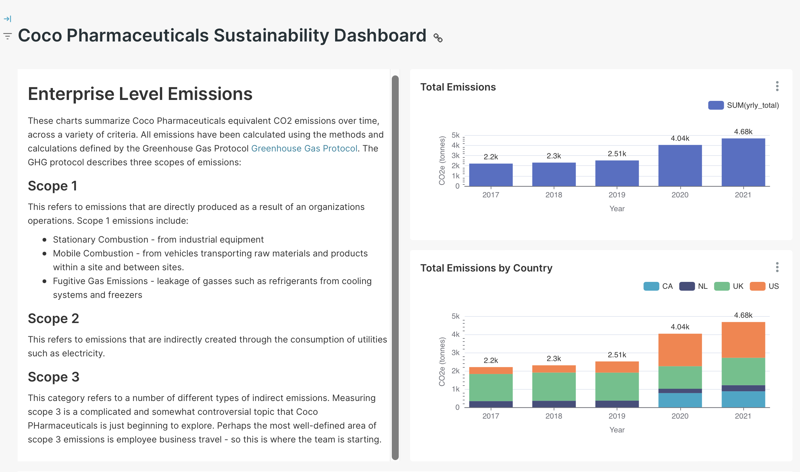

=== "Sustainability Dashboard - by Scope"

    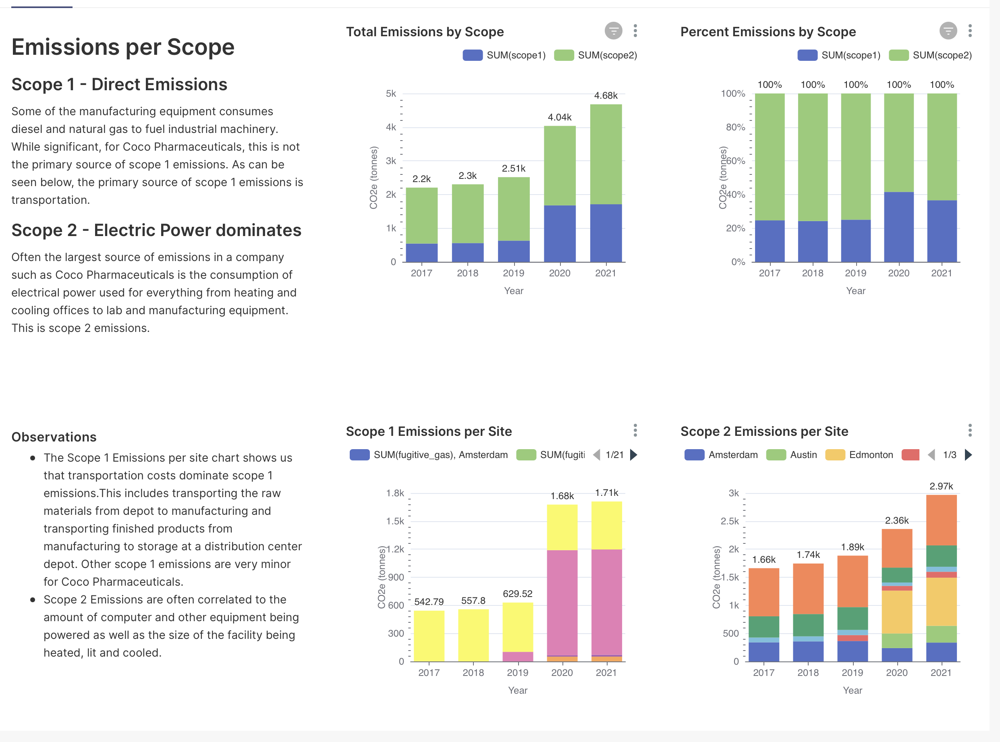

    This tells us that Scope 2 emissions from electric utilities are the primary contributors. We can also see that this starts to show how the different work locations (sites) contribute to the scope 1 and scope 2 totals.

=== "Sustainability Dashboard - by Site"

    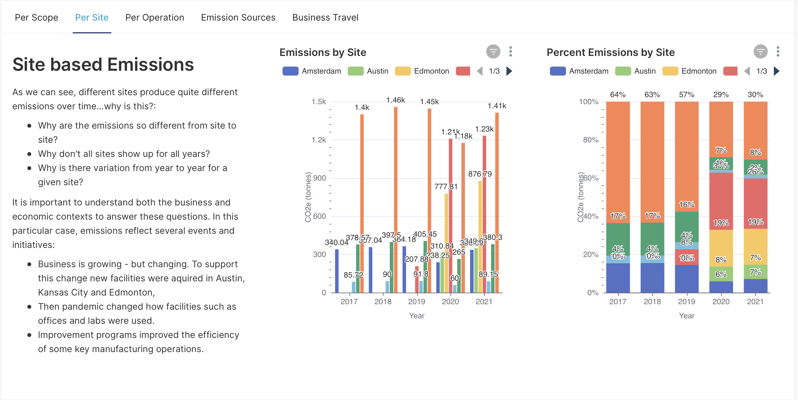

    These graphs shows the emissions for each site - note that the number of sites has increased over the years as the business continues to expand and change.

=== "Sustainability Dashboard - by Operation"

    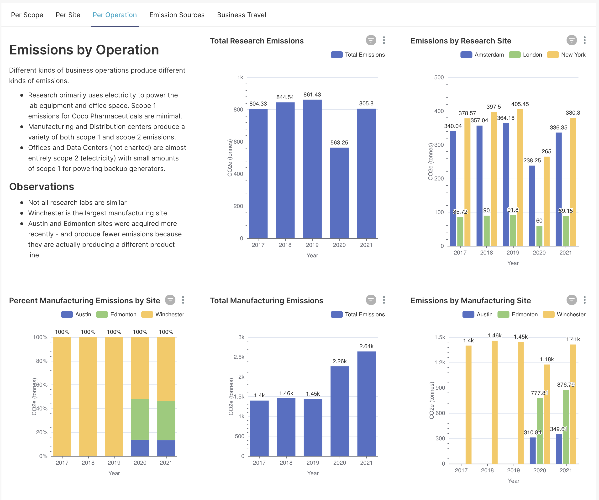

     From the graphs we can see that some sites have a combination of offices workers, research and a computer room while manufacturing and distribution happens elsewhere. Manufacturing produces much more scope 1 emissions than research does.

----
> Version 1 of the sustainability dashboard running in Apache Superset

## Launching the Sustainability Community

With the dashboard in place, Tom is ready to launch the sustainability community.  On their first call, they discuss the sustainability challenge, the roles in the community, and hence why then have been invited.  There was also discussion of how the community should work, and Tom shared the details of the sustainability dashboard.

She also had the pleasure of announcing their first initiative - the CFC-Free Initiative.

## The CFC-Free Initiative

In the first phase of the sustainability initiative, Tom is keen to run an initiative that makes a difference to sustainability.  [Zach Now](/practices/coco-pharmaceuticals/personas/zach-now), founder and leader of the New York Lab suggested they run a campaign to reduce the use of chlorofluorocarbons (CFCs) in refrigeration units throughout the company.  These are principally in the labs and manufacturing units. 

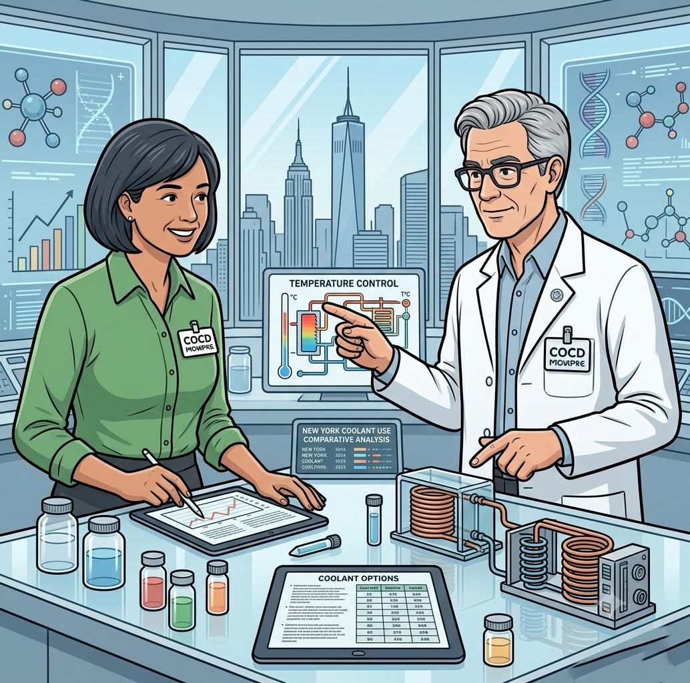
> Tom and Zach discussing the CFC-Free Initiative

The initiative will involve identifying and replacing CFC-containing units with more environmentally friendly alternatives.

### Capturing details of the CFCs in refrigeration units

Tom discovers that although the refrigeration units were catalogued in the various asset management systems across the company, details of the coolant installed was not captured.  Her plan is to use Egeria as the company asset register for equipment that is relevant to sustainability so that she can use governance controls such as [certification types](/types/4/0482-Certifications) and [exception types](/types/4/0455-Exception-Management) to keep track of progress. 

#### Is this the right solution?

Tom looks at the existing [open metadata types](/types) and cannot find a good place to store details of their refrigeration units.  She proposes to add a new RefrigerationUnit type to Egeria.  It would inherit from [Infrastructure](/types/0/001-Base-Model) and include a new attribute called *coolantType*. 

This type would be used to store details of the refrigeration units.  She takes her idea to Erin, who calls a meeting to discuss it.  There are two items on the agenda:

* Is Egeria the right place to store this information?  We could just use a database?
* If we do use Egeria, is this new type all that we need?

> Tom requesting permission to add the new open metadata type to Egeria

The decision to use Egeria for this data was easy.  Egeria supports the ongoing integration of the company's asset management systems, and providing a common language for describing assets across the company.  It then was well placed to support the governance of this equipment.

The proposed new type generated more discussion.  Erin had picked up on Tom's broader plan to bring details of other equipment relevant to sustainability.  She suggested that they should define a new type called Equipment, and then have RefrigerationUnit inherit from Equipment.
This means that they can have common management of all Equipment, beyond just refrigeration units.  

The others agreed and [Lemmie Stage](/practices/coco-pharmaceuticals/personas/lemmie-stage) was asked to add the new type to Egeria.

#### Adding a new open metadata type for refrigeration units

There are three steps to adding a new open metadata type:

* Create a new type definition in an [Open Metadata Archive](/concepts/open-metadata-archive).
* Add the new archive to the start-up list of archive files to load at [Metadata Access Store](/concepts/metadata-access-store) start-up.
* Restart the metadata access store to load the new archive.

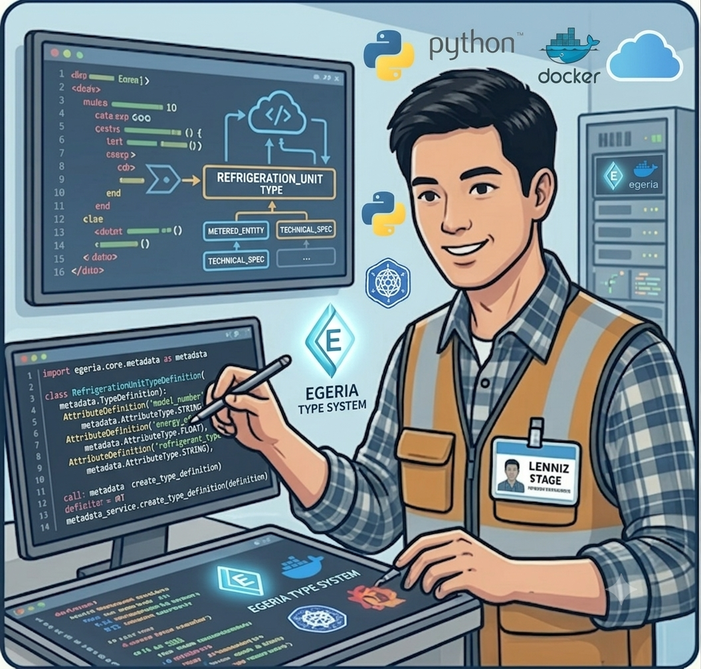

### Awarding the First CFC-Free certificate

Once the RefrigerationUnit was installed in Egeria, Tom was able to load the refrigeration unit data that she had collected from the different sites.   She showed the results to her boos, [Reggie Mint](/practices/coco-pharmaceuticals/personas/reggie-mint) to request budget to replace the CFC-containing units with CFC-free alternatives.  He agrees because it matches their strategy and the budget is approved.  

Then the race is on to acquire the CFC-free alternatives.  Which location will be the first to be CFC-Free?  Not surprisingly, the New York lab is the first, because [Zach Now](/practices/coco-pharmaceuticals/personas/zach-now), forewarned of the initiative, had gone ahead and ordered new units before Tom had the data into Egeria!  The other locations followed over the next few months allowing Tom to declare the company CFC-Free.

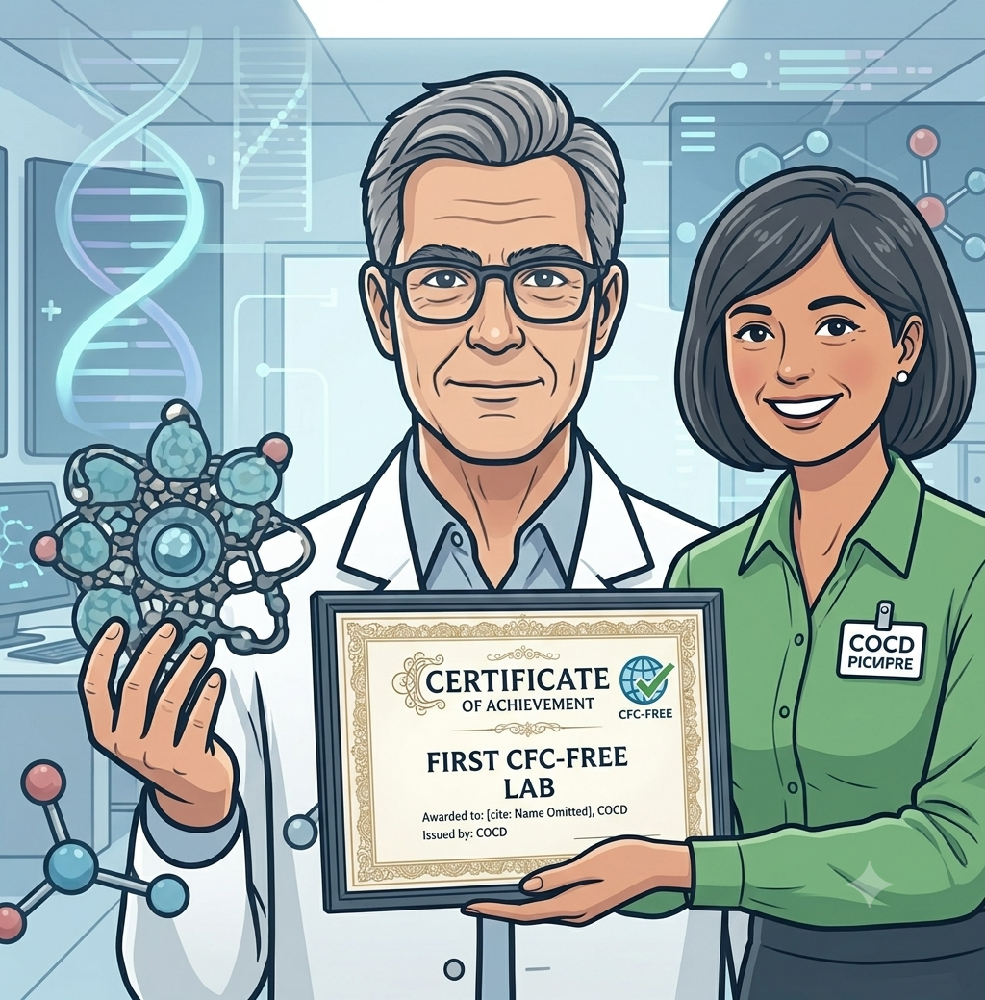

## In conclusion

Tom has presented the first findings of her sustainability program to the board.  The board could see she had made a solid start.  There was more to do, but she had created foundations that they can build on, both technically and culturally, and demonstrated improvements though a simple first initiative.

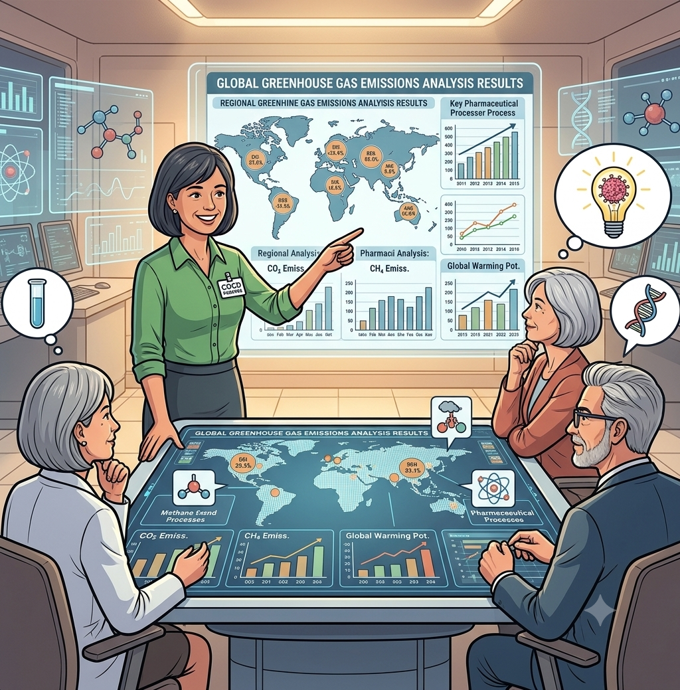

The board then asked her, "So what is next?"

Tom responds:

* We need to automate the capture of equipment data into Egeria.   [Reggie Mint](/practices/coco-pharmaceuticals/personas/reggie-mint), the head of Finance, was interested in how this could help his capital management since he had no global view of their equipment.  Stew see this as a way to get more budget to replace obsolete equipment that is costing too much to maintain, and is slowing down his manufacturing automation initiative.   The board agreeds to fund a feasibility study to understand what this would cost.  Jules suspected they should invest in a global asset management system integrated with Egeria, rather than build their own in Egeria. He volunteers [Erin Overview](/practices/coco-pharmaceuticals/personas/erin-overview) to lead the feasibility study.
* We should start looking at our scope 3 requirements, which means working with their suppliers to understand their emissions and how they can reduce them.  This also ties up with other efforts to tighten their supplier selection after their [fraud incident](/practices/coco-pharmaceuticals/scenarios/investigating-suspicious-activity/overview).

The story continues ...

--8<-- "snippets/abbr.md"