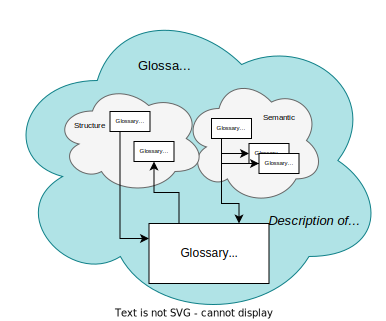
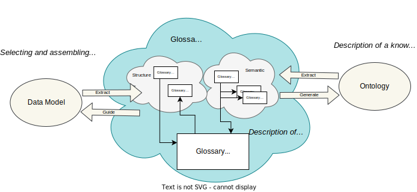
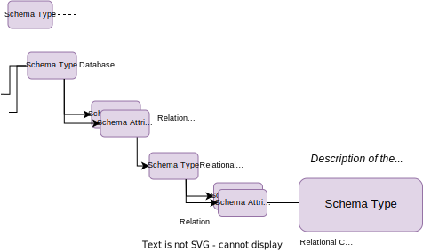
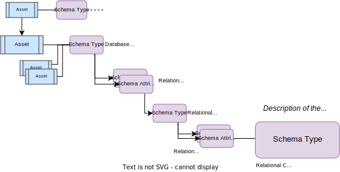
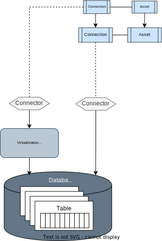

<!-- SPDX-License-Identifier: CC-BY-4.0 -->
<!-- Copyright Contributors to the ODPi Egeria project. -->

# Open metadata for common data definitions

Egeria provides a comprehensive set of [open metadata types](/types) for managing [common data definitions](/practices/common-data-definitions/overview).  These types provide a common language and format for exchanging these definitions between tools and metadata repositories.  Each tool/repository provides a mapping to the Egeria types and Egeria manages the exchange of metadata between these parties.

## The glossary

The glossary is at the heart of the common data definitions. Figure 1 shows that the glossary contains glossary terms.  Each glossary term describes a concept used by the business. It is also possible to link two glossary terms together with a relationship. The relationship may describe a semantic relationship or a structural one.

> Figure 1: Glossaries for describing concepts and the relationships between them

Semantic relationships include:

* *RelatedTerm* is a relationship used to say that the linked glossary term may also be of interest. It is like a "see also" link in a dictionary.
* *Synonym* is a relationship between glossary terms that have the same, or a very similar meaning.
* *Antonym* is a relationship between glossary terms that have the opposite (or near opposite) meaning.
* *PreferredTerm* is a relationship that indicates that one term should be used in place of the other term linked by the relationship.
* *ReplacementTerm* is a relationship that indicates that one term must be used instead of the other. This is stronger version of the PreferredTerm.
* *Translation* is a relationship that defines that the linked terms represent the same meaning but each are written in a different language. Hence, one is a translation of the other. The language of each term is defined in the Glossary that owns the term.
* *IsA* is a relationship that defines that the one term is a more generic term than the other term. For example, this relationship would be used to say that "Cat" IsA "Animal".

Structural relationships in the glossary are relationships that show how terms are typically used together. 

* *UsedInContext* links a term to another term that describes a context. This helps to distinguish between terms that have the same name but different meanings depending on the context.
* *HasA* is a term relationship between a term representing a SpineObject (see glossary term classifications below) and a term representing a SpineAttribute.
* *IsATypeOf* is a term relationship between two SpineObjects saying that one is the subtype (specialisation) of the other.
* *TypedBy* is a term relationship between a SpineAttribute and a SpineObject to say that the SpineAttribute is implemented using a type represented by the SpineObject

!!! education "Further information"
    * See [Anatomy of a glossary](/practices/common-data-definitions/anatomy-of-a-glossary) for more information about creating glossaries.
    * See [Area 3](/types/3) in the *Open Metadata Types* to understand how these concepts are represented on open metadata.

## Data classes

Data classes provide definitions of

 * Logical types
 * How to detect them in data
 * Preferred implementation types for different technologies

Data classes can be linked together in part-of and is-a hierarchies.  For example, Date, Social Security Number, Credit Card Number.

Each data class is linked glossary terms to show how data with that meaning should be represented. This helps to create a candidate list for glossary term assignment recommendations based on the data values stored if they can be matched to a data class.

> Figure 2: Data classes for describing the logical data types and implementation options

!!! education "Further information"
    * See [Model 0540](/types/5/0540-Data-Classes) in the *Open Metadata Types* to understand how data classes are represented on open metadata.

## Consuming the glossary in models

Models can be loaded in open metadata and the model elements linked to their corresponding glossary terms.

> Figure 3: Linking to models

The linked data classes provide details of language types to use when generating compliant artifacts from the models.

!!! education "Further information"
    * See [Model 0571](/types/5/0571-Concept-Models) in the *Open Metadata Types* to understand how concept models are represented on open metadata.
    * See [Model 0565](/types/5/0565-Design-Model-Elements) in the *Open Metadata Types* to understand how design models are represented on open metadata.

## Schemas

Schemas document the structure of data, whether it is stored or moving through APIs, events and data feeds. There is a *schema type* that describes a reusable schema. It may be a single primitive field, a set of values, an array of values, a map between two sets of values or a nested structure. The nested structure is the most common. In this case the schema type has a list of schema attributes that describe the fields in the structure.  Each of these attributes has its own schema type that may be primitive, array, set, map or structure in turn.

Figure 4 shows a simple structure schema.

> Figure 4: Schemas for documenting the structure of data

## Schemas and assets

An [asset](/concepts/asset) describes a valuable [resource](/concepts/resource) (typically digital).  Assets include databases, data files, documents, APIs, data feeds, and applications. Assets can be dependent on one another to fulfil their implementation. Since schema types describe the structure of data, they can be attached to assets to indicate that this asset's data is organized as described by the schema. A single schema type can be attached to multiple assets to show these assets all have data with the same structure (but not necessarily the same data values).

> Figure 5: Assets for documenting the organization's important data assets

!!! education "Further information"
    * See [Schemas](/concepts/schema) to understand how different types of schema are represented.
    * See [Model 0501](/types/5/0501-Schema-Elements) in the *Open Metadata Types* to understand how schemas are represented on open metadata.

## Connectors and connections

Assets are accessed through connectors.  A Connector is a client library that applications use to access the asset across the network.  Typically, there is a specialized connector for each type of Asset.  Sometimes there are multiple connectors to access a specific type of asset, each offering a different interface for  the application to use.

Instances of connectors are created using the *Connector Broker*.  The connector broker creates the connector instance using the information stored in a **Connection** object.  These can be created by the application or retrieved from the metadata repositories.

A connection object is stored in the metadata repository, it is typically linked to the asset that is accessed by the connector that the connection describes.

> Figure 6: Connection information needed to access the data held by an asset

!!! education "Further information"
* See [Connections](/concepts/connection) to understand how connectors are configured.
* See the [connector catalog](/connectors) to understand how connectors are used in Egeria.
* See [Model 0201](/types/2/0201/Connectors-and-Connections) in the *Open Metadata Types* to understand how connections are represented.

## Metadata discovery

An [open discovery service](/concepts/open-discovery-service) is a process that runs a pipeline of analytics to describe the data content of a resource. It uses statistical analysis, reference data and other techniques to determine the type and range of values stored, potentially what the data means and its level of quality. The result of the analysis is stored in metadata objects called annotations.

> Figure 7: Output from a metadata discovery service

!!! education "Further information"
    * See [Discovery and Stewardship](/features/discovery-and-stewardship/overview) to understand how metadata discovery works.
    * See [Area 6](/types/6) in the *Open Metadata Types* to understand how discovery metadata is represented.

## Bringing it all together

Figure 8 shows each of these pieces linking together. In a real-world environment, the aim is to automate as much of this linkage as possible. This is made considerably easier if the implementation landscape is reasonable consistent.  However, where the stored data values do not match the expected types defined in the schema, the metadata model reveals the inconsistencies and often requires human intervention to ensure the links are correct.

> Figure 8: Linking the metadata together

--8<-- "snippets/abbr.md"
