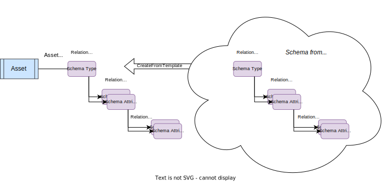
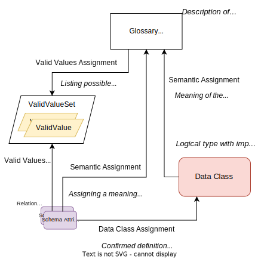

<!-- SPDX-License-Identifier: CC-BY-4.0 -->
<!-- Copyright Contributors to the ODPi Egeria project. -->

## The glossary

The glossary is at the heart of the common definitions. Figure 1 shows that the glossary contains glossary terms.  Each glossary term describes a concept used by the business. It is also possible to link two glossary terms together with a relationship. The relationship may describe a semantic relationship or a structural one.

> Figure 1: Glossaries for describing concepts and the relationships between them

Semantic relationships include:

* *RelatedTerm* is a relationship used to say that the linked glossary term may also be of interest. It is like a "see also" link in a dictionary.
* *Synonym* is a relationship between glossary terms that have the same, or a very similar meaning.
* *Antonym* is a relationship between glossary terms that have the opposite (or near opposite) meaning.
* *PreferredTerm* is a relationship that indicates that one term should be used in place of the other term linked by the relationship.
* *ReplacementTerm* is a relationship that indicates that one term must be used instead of the other. This is stronger version of the PreferredTerm.
* *Translation* is a relationship that defines that the linked terms represent the same meaning but each are written in a different language. Hence, one is a translation of the other. The language of each term is defined in the Glossary that owns the term.
* *IsA* is a relationship that defines that the one term is a more generic term than the other term. For example, this relationship would be used to say that "Cat" IsA "Animal".

Structural relationships in the glossary are relationships that show how terms are typically used together. 

* *UsedInContext* links a term to another term that describes a context. This helps to distinguish between terms that have the same name but different meanings depending on the context.
* *HasA* is a term relationship between a term representing a SpineObject (see glossary term classifications below) and a term representing a SpineAttribute.
* *IsATypeOf* is a term relationship between two SpineObjects saying that one is the subtype (specialisation) of the other.
* *TypedBy* is a term relationship between a SpineAttribute and a SpineObject to say that the SpineAttribute is implemented using a type represented by the SpineObject

!!! education "Further information"
    * See [Anatomy of a glossary](/practices/common-data-definitions/anatomy-of-a-glossary) for more information about creating glossaries.
    * See [Area 3](/types/3) in the *Open Metadata Types* to understand how these concepts are represented on open metadata.

## Data classes

A *data class* provides the specification of a data type that is important to the subject area.  *Date*, *Social Security Number* and *Credit Card Number* are examples of data classes.

The data class specification defines how to identify data fields of that type by inspecting the data values stored in them.  The specification is independent of a particular technology, which is why they are often described as *logical data types*.  The specification may include preferred implementation types for different technologies using *Implementation Snippets*.

Data classes are used during [metadata discovery](#metadata-discovery) to identify the types of data in the discovered data fields.  This is an important step in understanding the meaning and business value of the data fields.

Data classes can be linked together in part-of and is-a hierarchies to create a logical type system for a subject area. Each data class can be linked to a glossary term via an *ImplementedBy* relationship to identify the preferred data class to use when implementing a data field with meaning described in the glossary term.  A data class can be linked to glossary term that describes the meaning of the data class via a *SemanticAssignment* relationship.

> Figure 2: Data classes for describing the logical data types and implementation options

!!! education "Further information"
    * See [Model 0540](/types/5/0540-Data-Classes) in the *Open Metadata Types* to understand how data classes are represented on open metadata.
    * See [Model 0737](/types/7/0737-Solution-Implementation) in the *Open Metadata Types* to understand the *ImplementedBy* relationship.
    * See [Model 0370](/types/7/0340-Semantic-Assignment) in the *Open Metadata Types* to understand the *SemanticAssignment* relationship.
    * See [Model 0504](0504-Implementation-Snippets) in the *Open Metadata Types* to understand *ImplementationSnippets*.

## Consuming the glossary in design models

Design models (such as Concept models, E-R Models, UML models) and ontologies capture similar concepts to those described in the glossary.  It helps if their definitions are consistent.  When a new glossary is being built, existing models and ontologies can be used to seed the glossary.   The models/ontologies themselves can be loaded in open metadata and the model elements linked to their corresponding glossary terms.  Then new versions of the data models/ontologies can be generated from open metadata.

> Figure 3: Linking to models

Any linked data classes provide details of language types to use when generating compliant artifacts from the models.

!!! education "Further information"
    * See [Model 0571](/types/5/0571-Concept-Models) in the *Open Metadata Types* to understand how concept models are represented on open metadata.
    * See [Model 0565](/types/5/0565-Design-Model-Elements) in the *Open Metadata Types* to understand how design models are represented on open metadata.

## Schemas

Schemas document the structure of data, whether it is stored or moving through APIs, events and data feeds. There is a *schema type* that describes a reusable schema. It may be a single primitive field, a set of values, an array of values, a map between two sets of values or a nested structure. The nested structure is the most common. In this case the schema type has a list of schema attributes that describe the fields in the structure.  Each of these attributes has its own schema type located in its *TypeEmbeddedAttribute* classification.

Figure 4 shows a simple structure schema.

> Figure 4: Schemas for documenting the structure of data

!!! education "Further information"
     * See [Schemas](/concepts/schema) to understand how different types of schema are represented.
     * See [Model 0501](/types/5/0501-Schema-Elements) in the *Open Metadata Types* to see the formal definition of these types.
     * See [Model 0505](/types/5/0505-Schema-Attributes) in the *Open Metadata Types* to understand schema attributes and the *TypeEmbeddedAttribute* classification.

## Schemas and assets

An [asset](/concepts/asset) describes a valuable [resource](/concepts/resource) (typically digital).  Assets include databases, data files, documents, APIs, data feeds, and applications. Assets can be dependent on one another to fulfill their implementation. Since schema types describe the structure of data, they can be attached to assets using the *AssetSchemaType* relationship to indicate that this asset's data is organized as described by the schema.

> Figure 5: Schemas describe the structure of the data store in a digital resource (described by the asset in the catalog)

A schema is attached to only one asset since it is classified and linked to assuming that is describes the particular collection of data stored in the associated digital resource.  However, there is still a role for the common definitions to provide preferred schema structures for software developers, data engineers and data scientists to use when they create implementations for new digital resources.

When the asset is created, the schema definition in the subject area can be used as a template to define the schema for the asset (see figure 6). Then:

* The digital resource can be generated from the asset/schema.
* [Metadata discovery](#metadata-discovery) can be used to validate that the schema defined in the digital resource matches the schema associated with the asset.

> Figure 6: Using a schema from a subject are as a template for a new asset

There is also an opportunity to share schemas between assets using an *ExternalSchemaType*.  This option has the advantage that there only one copy of the schema.  However, it is only used when all classifications and relationships attached to the shared part of the schema apply to all the associated digital resources.

> Figure 7: Using an external schema type to share a common schema 

!!! education "Further information"
    * See [Model 0503](/types/5/0503-Asset-Schema) in the *Open Metadata Types* to understand the *AssetSchemaType* relationship.
    * See [Model 0501](/types/5/0501-Schema-Elements) in the *Open Metadata Types* to understand how schemas are represented on open metadata.
    * See [Model 0505](/types/5/0505-Schema-Attributes) in the *Open Metadata Types* to understand how schemas are represented on open metadata.

## Reference Value Assignments

> Figure 8: Tagging using valid values

## Schema Assignments

> Figure 9: Using assignment relationships to create a rich description of the data stored in a schema attribute (data field)

## Governance classifications

> Figure 10: Classifying glossary terms to identify the governance definitions that apply to all data values associated with the glossary term 

## Connectors and connections

The digital resources associated the assets in the catalog are accessed through connectors.  A Connector is a client library that applications use to access the data/function held by the digital resource.  Typically, there is a specialized connector for each type of Asset/technology.  

Sometimes there are multiple connectors to access a specific type of asset, each offering a different interface for  the application to use.

Instances of connectors are created using the *Connector Broker*.  The connector broker creates the connector instance using the information stored in a *Connection*.  These can be created by the application or retrieved from the metadata repositories.

A connection is stored in the metadata repository and linked to the appropriate asset for the digital resource.

> Figure 11: Connection information needed to access the data held by an asset

!!! education "Further information"
    * See [Connections](/concepts/connection) to understand how connectors are configured.
    * See the [connector catalog](/connectors) to understand how connectors are used in Egeria.
    * See [Model 0201](/types/2/0201/Connectors-and-Connections) in the *Open Metadata Types* to understand how connections are represented.

## Metadata discovery

An [open discovery service](/concepts/open-discovery-service) is a process that runs a pipeline of analytics to describe the data content of a resource. It uses statistical analysis, reference data and other techniques to determine the data class and range of values stored, potentially what the data means and its level of quality. The result of the analysis is stored in metadata objects called annotations.

> Figure 12: Output from a metadata discovery service

!!! education "Further information"
    * See [Discovery and Stewardship](/features/discovery-and-stewardship/overview) to understand how metadata discovery works.
    * See [Area 6](/types/6) in the *Open Metadata Types* to understand how discovery metadata is represented.

## Bringing it all together

Figure 13 summarizes how the common definitions create a rich picture around the resources used by your organization.  As they link to the technical metadata, they complement and reinforce the understanding of your data. In a real-world deployment, the aim is to automate as much of this linkage as possible. This is made considerably easier if the implementation landscape is reasonable consistent.  However, where the stored data values do not match the expected types defined in the schema, the metadata model reveals the inconsistencies and often requires human intervention to ensure the links are correct.

> Figure 13: Linking the metadata together

--8<-- "snippets/abbr.md"
