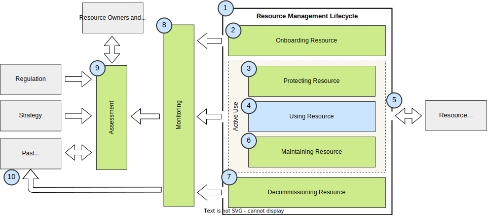
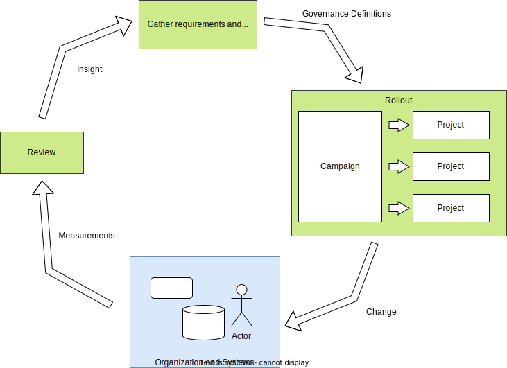

<!-- SPDX-License-Identifier: CC-BY-4.0 -->
<!-- Copyright Contributors to the ODPi Egeria project. -->

# Governance introduction

Governance enables all types of organizations (multi-nationals, small businesses, government services, non-profits ...) to operate effectively and ethically.

It delivers a management system that focuses on the culture of the organization and the way it develops, maintains and uses resources. Just as metadata is data about data, governance can be thought of as "meta-management" - it focuses on managing and improving the management of the organization.

Both efficient and ethical operations are of extreme importance to modern organizations because:

* Natural resources need to be used in an efficient and sustainable manner.
* Digital services operate at a scale beyond an individuals ability to understand, monitor and control.  The technology is moving rapidly and the complexity of modern systems means that the people operating them need specific automated help to ensure they are secure and operating correctly.
* Regulation is imposing exacting requirements on traceability of the organization's activity.
* Social changes are creating expectations that people are treated with respect and as individuals.  The organization must embrace the diversity of the people that interact with it, and treat them fairly.

Good governance creates transparency in an organization's operation and enables people to develop and be the best they can.

Although each organization is different, there are many common aspects to the way they work (largely because they are built and operated by people) that can act as the framework to this collection of guidance on developing a governance capability.

Consider figure 1:

> Figure 1: simple model of an organization

> 1. An organization is formed by stakeholders for a specific purpose.
> 2. The organization employs people and resources to deliver goods and/or services in line with its purpose.
> 3. Customers/consumers consume the goods and/or services and return some sort of reward plus feedback that reflects the value they have received.
> 4. The organization may work with other organizations (business partners) who supply goods and/or services in return for rewards and feedback.
> 5. Regulators define and enforce rules on how the organization should operate to protect the interests of a specific party (stakeholders, customers, business partners, society, individuals, ...).

This simple model highlights the key drivers of any type of organization.

Consider the organization's *stakeholders*.  For a commercial organization, they are the investors.  For a department within an organization, they could be the management committee that created the department.  For a charity, they are the founders of the organization.

Whoever the stakeholders are, they define a *purpose* for the organization (eg making a profit selling fish, supporting an organization's IT systems or feeding starving people after a disaster.) Obviously the purpose can evolve over time, but basically the organization is considered successful if it is meeting its purpose.

For the organization to get started, it needs *investment*.  This typically comes from the stakeholders.  They are therefore keen to see that they are getting good value for the investment they provide.  That is, they want to see that the organization is *cost-effective*.

The organization can spend the stakeholder's investment on:

* People to work on meeting the purpose (employees),
* Resources to support their work (see **Note**),
* Paying a business partner to perform some of the work that is needed.

>**Note**: The use of the term "resource" in this model is intended to cover a very broad definition. Examples of resources include buildings, computers, software packages, IT systems, processes, data stores,analytical models, digital locations, intellectual property.

An organization can generate income from providing goods and/or services in exchange for some sort of feedback and reward (payment). These goods and/or services typically involve the organization creating more resources using its employees, existing resources and business partners.

In most cases the recipient of the goods and/or services is the one providing the feedback and reward.  However, consider a charity. It delivers support to its target audience (consumers), and receives donations from other sources (customers). Also consider a service that is funded by advertising.  The customers are the advertisers rather than the consumers of the service.

Typically, the purpose of the organization includes an aspect of how well it supports its consumers and customers.  So the reward often provides the ability to hire more employees and create more resources.  The feedback helps them hone the goods and/or services that they offer.

The organization aims to operate in a sustainable manner, using the rewards it receives from is customers to pay for its operation and, potentially provide rewards to its stakeholders (assuming that is part of its purpose).

Finally the regulators protect the interests of particular groups that the organization's activities may impact.  An organization is often working with many types of regulators from the governments and tax authorities of the territories where they are operating, industry regulators ensuring fair competition, financial regulators protecting investors, privacy regulators and safety regulators protecting individuals, for example.

Governance has evolved as a series of practices and mechanisms within an organization to ensure successful and cost-effective operation that stakeholders and regulators can verify.

Figure 2 shows governance added to the simple organization model.

> Figure 2: simple model of an organization with governance

Governance covers both the employees and the organization's resources. Often the governance of different types of resources and employees is coordinated by different teams.  For example:

* Data resources are governed by the data governance team
* Financial resources are governed by the finance team
* Privacy is governed by the privacy team
* Security is governed by the security compliance team

However, their work is inter-related and [follows a common pattern](#governing-systems).

## Governance of data

Although Egeria supports all types of governance, it has a specific focus on data governance because (1) data is so critical to modern digital business and (2) data by its very nature needs special treatment.

Unlike a physical object, such as a chair or a building, data can be freely copied and combined in multiple ways.  It is fluid.  This is why water analogies, such as **data lake**, are popular when it comes to describing data management.

The fluidity of data creates 2 challenges:

* What are the dividing lines between different data resources?
* Who is responsible for the quality and protection of data when there are so many copies?

In addition, the original meaning of data is often lost. Data is created in a specific context(such as an application or from a specific sensor).  This context means there are certain assumptions made about the precision, quality, timeliness and completeness of the data.

As the data is copied and sent to different destinations, this context needs to be captured so it can be used to validate whether the data can be used in a new context.

Some standard data formats, such as JPG and MP3 files, include support for this context, which is called **metadata** (literally data about data). However, most data is in a format that does not include this metadata and it must be managed separately.

The next challenge is that people, in general, are sloppy about the precise meaning of the terminology they use and this lack of precision can translate to misunderstandings on what specific data values mean. Even within the same organization, a term may have multiple meanings, or their may be multiple terms for the same thing. In order to communicate the meaning of data from one context to another, these anomalies in the meaning of the terminology used to describe the data need to be reconciled.

Finally there remains a lot of uncertainty related to ownership of data.  Just because an organization holds data, it does not mean it has the right to  process it.  The data may be subject to copyright (such as the [Creative Commons licenses](https://creativecommons.org/licenses/), or a more specific type of data license (such as the [Community Data License Agreement (CDLA)](https://cdla.io/)), or may be personal data that is subject to specific data privacy regulations (such as the [General Data Protection Regulation (GDPR)](https://ec.europa.eu/commission/priorities/justice-and-fundamental-rights/data-protection/2018-reform-eu-data-protection-rules_en)).

This means that the organization needs to track the flow of data between data stores and applications to ensure that it is only used for approved purposes.  The organization needs to define the precise responsibilities of people that hold copies of data and the requirements that they must fulfil.

## Delivering governance through the governing systems

Organizations operate as a series of systems that are made up of people, the processes they follow and the technology that supports them.

These systems, and their component parts, are resources of the organization.

Governance teams focus on building the systems that provide a healthy culture and the resource management capability.  These systems are called the governing systems.  They support the business systems (that is, the governed systems).

> Figure 3: Systems of an organization

Ideally governance is embedded in the daily work of the organization, rewarding individuals who follow the practices it encourages.  When this is the case, individuals engaging with the organization use a blend of the business systems and the governing systems to perform their role(s).  They may not even be aware of the difference.

### Capabilities of the governing systems

The capabilities of the governing systems are typically focused on managing the organization's resources.

Figure 4 details the type of capabilities provided by the governing systems shown in green.  The business systems are shown in blue.

> Figure 4: Capabilities of the governing systems

> 1. For each type of resource that the organization plans to manage, the governing systems cover the onboarding of new resources, the protection and maintenance of resources during their active use and the decommissioning of obsolete resources.
> 2. Onboarding of resources includes the assessment of the resources to ensure it meets the needs of the organization, cataloging it and deploying it to where it is needed.   The process of cataloging the resources includes creating an accurate description, classifying it to ensure it is properly managed, adding it to the appropriate zones and assigning an owner to it so there is someone responsible for it.
> 3. Resources need to be protected from in proper use, damage (whether accidental or malicious) and theft.   For some resources, such as digital resources, this is an ongoing battle requiring a dedicated team to maintain a string defence.
> 4. The use of the resource occurs as the organization delivers its goods and/or services to its customers.  This is typically driven by the business systems, or the need to handle a new situation, or diagnose a problem.
> 5. The point at which a resource is located and used is called an access point.  This access point can involve combinations of the protecting, using and maintaining resource capabilities.
> 6. The maintenance of a resource involves regular checks that the resource is still fit-for-purpose and the management of any remediation (repairs) that need to be made to the resource.
> 7. Decommissioning focuses on the identification of obsolete resource, their safe disposal and update of the asset catalog.
> 8. Monitoring gathers measurements of how each capability is performing.
> 9. Assessment takes the current measurements from monitoring and matches them to a set of metrics (formula) and targets that the governance team is using to manage and improve the organization's governance activities.
> 10. The assessment metrics are driven by pertinent regulations and the organization's strategy.  The current measurements for the resources are assessed against their past performance so that the trajectory and direction of change can be determined.
> 11. The results of the assessment, along with the changes to the governance drivers, are used to drive change in operations of both the governing and governed systems are operating.

Underpinning the capabilities of the governing system is a knowledge base about the resources, their relationships and the activity related to their management. This knowledge base is called the asset catalog, and it is one of the functions provided by a metadata repository. 

## The governance program life-cycle

The governance program is managed in an iterative lifecycle.  It is initiated from inputs from stakeholders and regulations.  These are captured and organized using the governance definitions to translate goals into actions.  These actions are implemented as a series of projects that change/improve the operation of the organization.  Part of the change includes instrumentation that provides data to measure the value of the changes inline with the expectations set out in the governance definitions.

The review of the measurements (and changes in the governance drivers) influence the rollout campaign and the cycle continues.

> Figure 5: Life-cycle of the governance program

## Rolling out a governance program

Figure 4 is focused on the types of technology that are rolled out in support of a governance program and figure 5 implies that it is a mechanical process that systematically rolls out the changes.  It is important to remember, however, that technology is only a part of governance - it is critical to consider the people involved and the processes they use, since this will have as great an impact on your governance program as the technology you choose.

Different teams will have their own perspectives on what they need - often small changes to allow what they do today a little more efficiently.  Few people vote for radical change in their own work - but are happy for other teams to change.  Changing a team's operation, or event tools takes time, education and patience.

Locked into a team's operation are their own processes and methods.  They often collect useful information and provide points in the process where information is shared and decisions are made.  Connecting the governance program into these points and helping in the capture and availability of information to support these key decision points is often effective - as well as removing tedious tasks from people, particularly relating to rework to correct an error.  Most people want to look good to their boss,so enhancing their ability to impress, and deliver on the teams targets is critical.

This means that each project needs to ensure the people and teams get value from their participation in governance activities.  It must be more than additional checklists, forms to fill in and rules that seem to hinder innovation.

If significant change is needed in a team's operation, they need support, encouragement and training so they can see themselves successful in their new roles.  Without this they will block change.

Similarly, the measurements made by the organization as the teams transform their work should show the value they are delivering to the organization - to reinforce the positive messages and ensure the people who are changing are recognized and rewarded.

There are many books that cover how to effect change in an organization - it is not our focus here. Suffice it to say that governance programs aim to improve an organization's efficiency, effectiveness and sustainability.  To do this, change is inevitable, and a change management program is needed to drive that change.

!!! education "Further information"
    * [Governance maturity model](/practices/maturity-model/overview)

--8<-- "snippets/abbr.md"