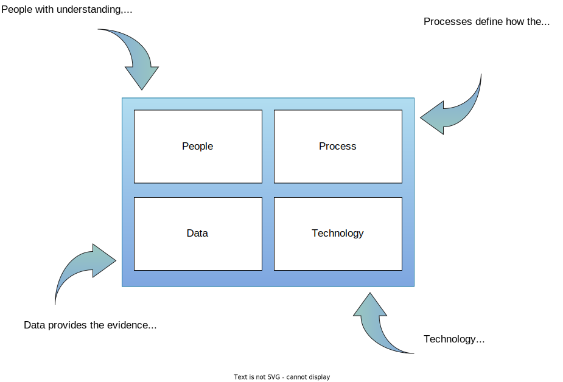

<!-- SPDX-License-Identifier: CC-BY-4.0 -->
<!-- Copyright Contributors to the ODPi Egeria project. -->

# Practices for successful metadata management and governance

There is a lot of interest in governance topics such as the fairness of AI; ownership of data; cross-organization and cross-border sharing of data; cyber-security and data privacy. This interest is driven by the increased use of digital services and personal data that spans multiple aspects of an individual's life.

Governments have responded with more exacting regulation that demands greater transparency in an organization's operation and provision for individual's rights relating to their data and their treatment by automated processes. The European Union's [General Data Protection Regulation (GDPR)](https://ec.europa.eu/commission/priorities/justice-and-fundamental-rights/data-protection/2018-reform-eu-data-protection-rules_en) is a well-known example.

Although seeming to fit into the purview of *data governance*, the impact of these regulations is much broader, covering the process for designing and building software, the secure operation of IT systems, data privacy as well as the traditional data management concerns.

Egeria is dedicated to helping organizations build out their broader governance capability around their digital services to meet these new challenges.  At its core is the [Egeria Open Metadata and Governance software](https://github.com/odpi/egeria) that provides the technology to support governance. Egeria's *practices* provides guidance to help you design an effective and holistic governance capability in your organization.

The practices consider (1) the people involved, (2) the data they need to make good decisions, (3) the processes they need to follow and (4) the technology that automates much of the routine work.

> Figure 1: The components of a governance program

The guidance is in two streams.  There is a theoretical set of guidance that covers various governance topics in general terms. Then there is a parallel set of material that chronicles a fictitious organization called [Coco Pharmaceuticals](/practices/coco-pharmaceuticals) as they create a governance capability that will support and drive their business transformation to delivering personalized medicine.

The two streams cross-reference each other and include links to software samples using the Egeria software.  

## Latest Published Material

Egeria is a rapidly evolving project and new material and software is being added frequently, so it is worthwhile checking on the latest material from time to time.  Below is some of the most recently created guidance.  

* [Governance Basics](/practices/governance-basics/overview) provides a simple definition for governance along with a description of its key capabilities and requirements and how they operate withing an organization.
* [Governance Maturity Model](/practices/maturity-model/overview) shows the technological development of the governance technology needed by an organization to broaden its use of data.
* [Common Data Definitions](/practices/common-data-definitions/overview) describes how to build a glossary of standard terms.
* [Data Quality](/practices/data-quality/overview) describes how to assess and improve data quality.
* [Metadata Discovery](/features/discovery-and-stewardship/overview) - automated metadata discovery and stewardship of results.
* [Data Specification](/features/data-specification/overview) - describing the data that you need for a project.
* [Governance Roles](/practices/roles/overview) describes the different roles that people perform in a governance program.
* [Digital Services](/practices/digital-services/overview) describes concept of a digital service and the lifecycle stages it goes through.

* [Coco Pharmaceuticals Personas and Scenarios](/practices/coco-pharmaceuticals) describes the personas and scenarios that are driving the work of the Egeria community.

--8<-- "snippets/abbr.md"