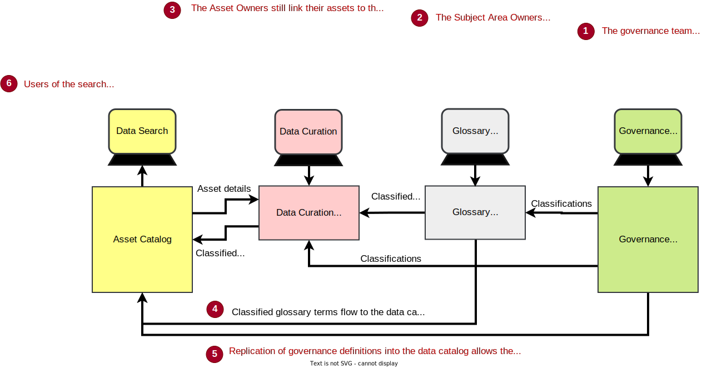

<!-- SPDX-License-Identifier: CC-BY-4.0 -->
<!-- Copyright Contributors to the ODPi Egeria project. -->

# Governance Maturity Model

The governance maturity model shown in Figure 1 was first published in 2018:

> REDP5486 The Journey Continues: from Data Lake to Data-Driven Organization
> [http://www.redbooks.ibm.com/abstracts/redp5486.html?Open](http://www.redbooks.ibm.com/abstracts/redp5486.html?Open)

> **Figure 1:** Governance Maturity Model

It shows five levels of maturity that build on one another until the organization is able to support a wide range of advanced data use along with appropriate self-service access to data for a majority of people in the organization. This is the capability that Forrester calls [Data Citizenship](https://www.forrester.com/webinar/Data+Governance+20+The+Journey+Toward+Data+Citizenship/-/E-WEB21683).

In general, organizations are not universally at one level of maturity. They adjust their investment to focus on the types of data that will bring the most value.  So their coverage looks more like figure 2.

> **Figure 2:** Staging maturity

The maturity levels are:

??? tip "Asset Awareness Maturity Level - where is the organization's resource and what are their properties?"
    ### Asset Awareness
    
    An organization has achieved *asset awareness* when it has a catalog of its [resources](/concepts/resource) that shows the properties of the resources, who owns them and their lineage (how they were created).  The catalog entry for a resource is called an [*asset*](/concepts/asset).
    
    These catalogs ideally need to cover all types of resources, from data stores, data feeds, APIs and the processes/applications that work with them.  In addition, the catalog can include information about the logical structure (schema) of the data, its format (for example, XML, JSON) the values stored and what the data elements within the asset mean to the organization.
    
    Figure 3 shows the different types of tools that can be used to build up the asset catalog and make it searchable through a user interface.
    
    
    > **Figure 3:** Capabilities needed to achieve Asset Awareness

??? tip "Governance Awareness Maturity Level - how should data be governed?"
    ### Governance Awareness
    
    Governance awareness is where the governance requirements are attached to the descriptions of the assets in the asset catalog. This means that someone wishing to use a resource can easily understand the governance requirements they must meet to use it responsibility.
    
    Most organizations use governance classifications.  These are labels that are attached to the asset descriptions within the catalog.
    
    The governance classifications each define a list of governance requirements for different situations. For example a governance classification could be "confidential". The governance program would then describe the governance requirements for confidential data when, for example:
     
     * it is shared with a colleague,
     * passed to an external person,
     * stored etc
    
    The governance program educates employees on the use and meaning of the governance classifications so they know how to manage any resource with that classification.
    
    Classifications can be added directly to an digital resource's asset, or the detailed element descriptions within the asset, or indirectly to the glossary terms that are linked to the asset/element descriptions.
    
    Figure 4 shows both options for adding classifications to the catalog. Classifying through the glossary terms creates greater consistency in the way that data is classified,but it does requirement that the attachment of glossary terms to the descriptions of assets/data elements is comprehensive.
    
    
    > **Figure 4:** Capabilities needed to achieve Governance Awareness

??? tip "Embedded Governance Maturity Level - how can governance be automated?"
    ### Embedded Governance
    
    With embedded governance, the technology that is managing data has the governance requirements directly encoded into its operations.  This can be done with code or configuration depending on the capability of the technology.
    
    Figure 5 shows the IT team implementing the governance requirements.  This needs to be repeated for all of the key infrastructure that is managing the assets.
    
    
    > **Figure 5:** Capabilities needed to achieve Emdedded Governance
    
??? tip "Business Driven Governance Maturity Level - how can the business leaders take ownership of data and governance?"
    ### Business Driven Governance
    
    Business driven governance is where the implementations of governance within the IT systems is driven by the governance classifications and other metadata settings.  As the asset owners change the classifications attached to the asset descriptions, then the runtime governance functions change their treatment of the assets.
    
    The big change that this brings is that the runtime governance functions need reliable and performant access to the metadata.  Typically this is provided by an operational metadata catalog that its tuned for the needs of the runtime governance components.
    
    In fact there may be many operational metadata catalogs, one in each subsystem that manages assets. Some technology may be so critical that is needs to keep its metadata in an inmemory cache that is regularly synchronized from the master data catalog.
    
    Figure 6 shows the business driven governance in operation.
    
    
    > **Figure 6:** Capabilities needed to achieve Business Driven Governance
    

??? tip "Data Citizenship Maturity Level - how can every employee, system and server get the data they need, every day?"
    ### Data Citizenship
    
    Data citizenship within an organization supports people who need access to data to be effective in their role. This data access needs to be embedded in the tools that they use and flexible enough to meet the changing challenges they face day to day.  Since the data landscape is also changing, the tools that these people use need to be integrated with the data catalog.
    
    This is shown in figure 7.
    
    
    > **Figure 7:** Capabilities needed to achieve Data Citizenship
    
    Achieving data citizenship creates huge value for an organization. At this point it can claim it is truely data driven and can confidently may use of advanced techniques such as natural language processing and artificial intelligence.  However there is a cost behind this benefit due to the metadata integration and synchronization required.

Opening the sections reveals more detail about each level. You will notice that the number of integrations between tools, engines and metadata repositories grows with each level of maturity. Egeria provides open standards and services to simplify this integration.

# Using Egeria to grow maturity

Egeria provides libraries and integration servers to simplify the integration of metadata repositories and governance functions.

It provides an extensible, open metadata type system that covers most if not all of the types of metadata that an organization needs to exchange, APIs and event formats to support the exchange of metadata along with embeddable libraries that support the underlying protocols.

Figure 1 shows an example of using the egeria technology (shown in bright blue) to integrate metadata repositories and governance functions.  Notice that the egeria libraries are embedded in many technologies, and there are also servers (called Open Metadata and Governance (OMAG) servers) that provide governance APIs to different types of tools.

> **Figure 3:** Using Egeria to grow governance maturity

--8<-- "snippets/abbr.md"
