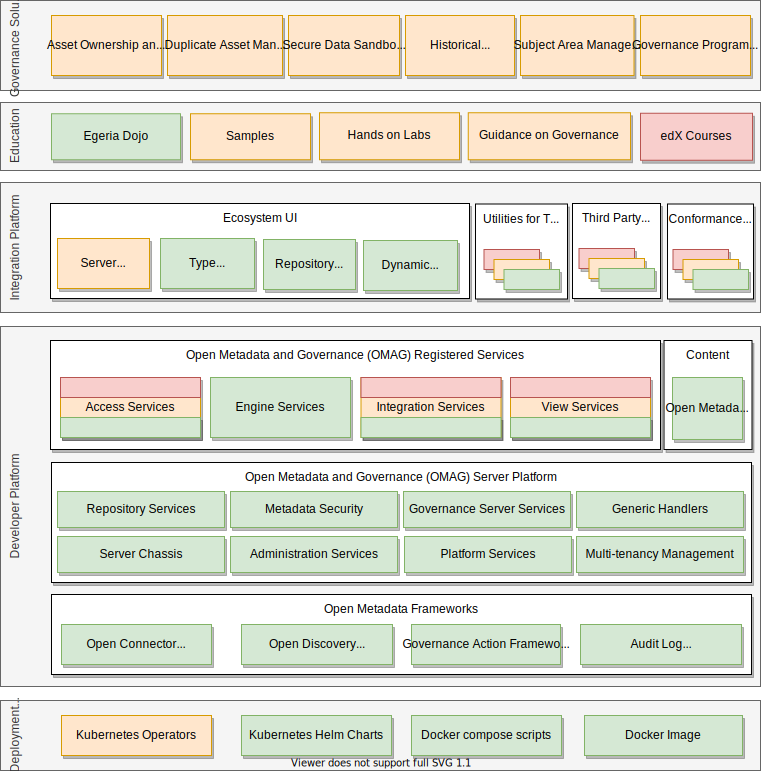

<!-- SPDX-License-Identifier: CC-BY-4.0 -->
<!-- Copyright Contributors to the Egeria project. -->

## Release 3.1 (September 2021)

!!! danger "Special note on Java support"

    Java 11 is now **required** to build and run Egeria.

??? info "Known issue: use chromium-based browser for UIs"

    It is recommended to use a chromium-based browser such as Google Chrome, Microsoft Edge or Apple Safari for the Egeria React UI. Some parts of the UI experience such as Dino currently experience problems with Firefox. See [odpi/egeria-react-ui#96 :material-dock-window:](https://github.com/odpi/egeria-react-ui/issues/96){ target=gh }.

???+ functional "Functional changes"
    ??? deprecated "docker-compose"

        The docker-compose environment for running our Coco Pharmaceuticals lab demo/tutorial is now deprecated. The configuration is still available, but will not be further developed or tested, and will be removed in a future release.

        Our [Kubernetes Helm charts :material-dock-window:](https://odpi.github.io/egeria-charts/site/index.html) are now recommended to quickly setup the same lab environment, and the documentation for these has been improved to cover a Kubernetes introduction, and example based on 'microk8s' which are suited to an end-user desktop environment (and can also be run in enterprise/cloud environments).

???+ types "Type changes: :material-plus-circle: added, :material-adjust: modified, :material-alert-circle: deprecated"
    ??? added "Data processing purposes"
        See new type descriptions in [model 0485](/types/4/0485-Data-Processing-Purposes).

    ??? added "Distinguishing between virtual machines, containers and bare metal hardware"
        There are now types for distinguishing between virtual machines and virtual containers as well as bare metal hardware. There are also new types for specific technologies such as `HadoopCluster`, `KubernetesCluster` and `DockerContainer` to provide concrete examples of different types of hosts using popular technologies.

    ??? added "Storage volumes"
        There are new types for defining a storage volume that has been attached to a host. See description in [model 0036](/types/0/0036-Storage).

    ??? added "ApplicationService"
        A new subtype of software server for reusable business functions (such as microservices) has been added called `ApplicationService`. See description in [model 0057](/types/0/0057-Software-Services).

    ??? modified "ServerEndpoint"
        The `ServerEndpoint` relationship can now connect to any `ITInfrastructure` elements, not just `SoftwareServers`. See description in [model 0040](/types/0/0040-Software-Servers).

    ??? modified "OperatingPlatform"
        The `OperatingPlatform` entity can now record the patch level of the operating system. There are also new types for describing the contents of an operating platform. See description in [model 0030](/types/0/0030-Hosts-and-Platforms).

    ??? deprecated "DeployedVirtualContainer"
        The `DeployedVirtualContainer` relationship has been deprecated in favor of a more generic `HostedHost` relationship. See description in [model 0035](/types/0/0035-Complex-Hosts/#hostedhost).

    ??? deprecated "BoundedSchemaType, BoundedSchemaElementType, ArraySchemaType, SetSchemaType"
        See description in [model 0507](/types/0507-External-Schema-Type).

???+ bugs "Bug fixes and other updates"
    For details, see the [commit history in GitHub :material-dock-window:](https://github.com/odpi/egeria/commits){ target=gh }.

??? status "Implementation status"
    

--8<-- "snippets/abbr.md"
