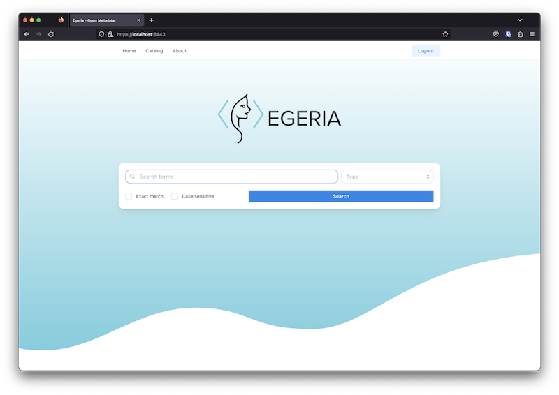

<!-- SPDX-License-Identifier: CC-BY-4.0 -->
<!-- Copyright Contributors to the Egeria project. -->

# April 2023

This is April's monthly report from the Egeria community.  This month we saw the long awaited 4.0 release of Egeria Core plus a new set of exciting new features.

## Egeria Version 4.0

The 4.0 release of Egeria Core is now available and the connectors for this level are in the process of being released.

This release was an important achievement for the Egeria community. It involved upgrades to our Java level, a moved to a gradle-only build, a later level of Spring, plus removal of deprecated function.  There were also changes to the repository connectors and integration connector interfaces that requires rework to these types of connectors.  The [release notes](/release-notes/previous/#release-40-march-2023){target=blank} provide detailed descriptions of these changes.

Release 4.0 also included a new feature for the integration daemon called [Integration Groups](#integration-groups){target=blank}.

## Integration Groups

The [Integration Daemon](/concepts/integration-daemon){target=blank} can now be dynamically configured while it is running through a new feature called [integration groups](/concepts/integration-group){target=blank}.  An integration group is a metadata entity that acts as an anchor for a list of integration connector definitions.  The integration daemon is configured with a list of integration groups to monitor.  At startup, it retrieves the integration group entities from its [metadata access server](/concepts/metadata-access-server){target=blank}, and any connected integration connector definitions and uses them to configure itself.  It continues to monitor the changes to the integration groups in the metadata access server, making adjustments to the connectors it is running as necessary.

## Integration Reports

When an [integration connector](/concepts/integration-connector){target=blank} is running, is [integration service](/services/omis){target=blank} is monitoring the changes that the connector is making to open metadata and publishing them in an [integration report](/concepts/integration-report){target=blank}.

## Connectors

The following connectors are now available for testing in `4.1-SNAPSHOT` and will be part of the 4.1 release.

### Secrets Store Connectors

The [Secrets Store Connector](/concepts/secrets-store-connector){target=blank} is a new type of connector that enables a connector to access its secrets (passwords, certificates, ...) from a secure location at runtime.  There is an implementation of this new type of connector that works with environment variables.  See the [connector catalog](/connectors/secrets/environment-variable-secrets-store-connector){target=blank} for more details.

### Apache Atlas Integration Connector

There is a new [Apache Atlas](/connectors/integration/apache-atlas-catalog-integration-connector){target=blank} integration connector that is able to publish active glossary terms to one or more glossaries in Apache Atlas.

### Server Metadata Security Connector

The [Server Metadata Security Connector](/concepts/server-metadata-security-connector){target=blank} has been extended with a new optional interface that allows the connector to control authorization requests to glossaries.  See the [Metadata Security](/features/metadata-security/overview){target=blank} feature for more details.

## View services

In this release we have added the following view services to aid organizations writing user interfaces (UIs):

* [Glossary Browser OMVS](#glossary-browser-omvs)
* [Glossary Manager OMVS](#glossary-manager-omvs)

These view services are supported by enhancements to the Asset Manager OMAS.

### Glossary Manager OMVS

Glossary Manager OMVS supports the development of glossaries using a controlled workflow process
[... more information](/services/omvs/glossary-manager/overview){target=blank}.

### Glossary Browser OMVS

Glossary Browser OMVS supports the searching and navigation through a published glossary plus the ability to add feedback (comments, likes and reviews) to its content [... more information](/services/omvs/glossary-browser/overview){target=blank}.

## New User Interface (UI)

The NEW Egeria UI has been shipped as part of the v4 release package. 

>We are working on updating the documentation and lab notebooks where UI is used. These updates and some additional usability improvements will go into the next Egeria release.

## Cloud-native workgroup

The cloud-native workgroup continues to make progress.  The focus is to create runtimes for Kubernetes that support a single server.  There is likely to be a specialized runtime for [each of the server types](/concepts/omag-server#types-of-omag-server){target=blank}.  When these server's run, their configuration is provided through the kubernetes infrastructure rather than a configuration store.

You can find the workgroup updates for Q2 on the [wiki page](https://wiki.lfaidata.foundation/display/EG/2023+2Q+update){target=blank}

## Changes to the open metadata labs

Two of our open metadata labs have had improvements made:

* *Automated Curation* includes integration connectors that are configured through [integration groups](#integration-groups).
* *Working with standard models* adds examples of creating new glossaries and terms within them, glossary security, various forms of versioning and version history, and the ability to query terms from a single glossary.

## Collaboration with Fybrik

Collaboration with [Fybric.io](https://fybrik.io/){target=blank} open source project on a new connector allowing the platform to plug in Egeria as Metadata repository.
Watch for changes on [egeria-connector](https://github.com/fybrik/egeria-connector){target=blank} github repository if you are interested in more details on this development.

## Face-to-face workshop Bucharest - 24th - 26th April

The face-to-face workshop in Bucharest saw important progress on cloud-native deployments and our User Interface consolidation.

### Day 1 Egeria workshop

***Morning session***

- Integration with third-party technologies
    - new Atlas integration connector
    - Secrets connector
- ING Data Lineage Import Preview (demo)

***Afternoon session***

- UI platforms consolidation: open discussion, agree on concrete design and work plan (as much as possible possible)
- Overview on the new Lineage Types: Solution Ports and Wires vs Information Supply Chains

### Day 2 Egeria workshop

***Morning session***

- Cloud native, an update on cloud native workgroup including discussions on the next steps.
- Addressing feedback from ING product team:
    - possibility for configuration improvement: add a new way to configure Egeria besides API calls; for example, have a config file for simple basic settings and use API calls for more complex settings.
    - develop and improve Egeria deployment using containers; right now, there are external dependencies which make container deployment in production not feasible.
    - add new connectors for graph db backends in the future besides JanusGraph and XTDB; right now, JanusGraph development is not very active and XTDB may not be production ready; a discussion about possible better alternatives may help.

***Afternoon session***

- Pipelines and Code quality checks
    - UI JavaScript/TypeScript (eslint)
    - Use of Sonatype Lift scans
    - Javadoc build warnings - what should we do, what are our standards?
- Release process activities
- Release 4 - follow-ups
    - deprecated function
    - XTDB connector
    - JDBC connector
    - egeria samples/dojo (ie egeria-samples-api ..., file repo connector @davidradl )
    - event schema, strimzi, lineage @juergenhemelt
    - How do we better minimize ongoing maintenance:
    - repo owner assignment/responsibilities
    - consolidation/refactoring/common build processes/automation

### Day 3 Egeria workshop

***Morning session***

- Project health, regular component owners and component status review
- UI platforms consolidation, open discussion - agree on concrete design and work plan (as much as possible possible)

***Afternoon session***

- Egeria UI topics
    - an update on the consolidated type script UI, including documentation, views and status for v4.
    - Independent module documentation using GitHub pages for each UI component (presented last time something in this direction, currently work in backlog for happi-graph)
    - video documentation on how to start things (UI)
    - demo server that should always be maintained, maybe ask on LFAI group for resources under DigitalOcean (they have sponsorship)
- Live coding session

## New documentation pages

Each month we will select one or more new pages that where added/updated in the last month to [https://egeria-project.org](https://egeria-project.org){target=blank} so you can keep up-to-date with how it is evolving.

- [Managing Referenceables](/types/0/0011-Managing-Referenceables/){target=blank}
- [Controlled glossary development](/types/3/0385-Controlled-Glossary-Development/){target=blank}

## Connecting with the project

!!! info "Connecting with the project"
    Go to our [community guide](/guides/community){target=blank} to find out how to find out more about the activities of the Egeria project. 

--8<-- "snippets/abbr.md"
