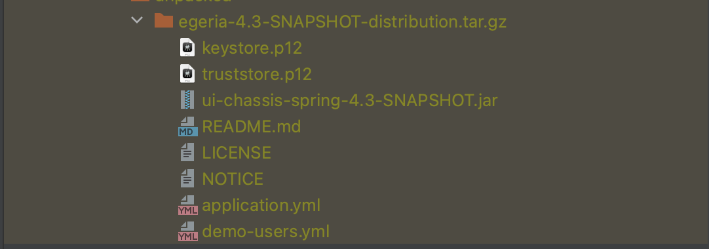
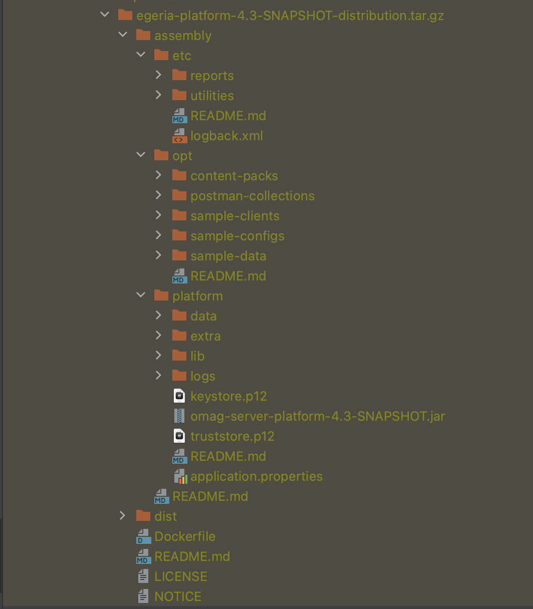

<!-- SPDX-License-Identifier: CC-BY-4.0 -->
<!-- Copyright Contributors to the Egeria project. -->

# August 2023

This is August's report from the Egeria community.  Since our [last newsletter](/release-notes/april-2023), our focus has been on improving Egeria's usability around:

* The steps to get Egeria up and running.
* Setting up different flavours of metadata repository, and their persistence stores.
* Writing integration connectors.

There have also been some important functional improvements including:

* Support for controlled glossary development (glossary workflows).
* An Apache Atlas integration connector.
* A specialized connector for managing secrets.
* A new runtime for cloud-native operation.

Finally, there have been improvements in runtime efficiency.

## New Egeria Releases

Since the last newsletter, there have been two releases of core Egeria (4.1 and 4.2) and the function for release 4.3 is present in the `main` branch.  The release notes detail the specific changes to the code.  The sections that follow put those changes in context.

* [Release notes for 4.1 (May 2023)](/release-notes/4-1)
* [Release notes for 4.2 (July 2023)](/release-notes/4-2)
* [Candidate release notes for 4.3 (expected September 2023)](/release-notes/4-3)

## Updates to the assemblies

When the gradle build runs in the core egeria git repository (egeria.git), it creates an assembly of the Egeria runtimes. This is located in the `build` directory under `open-metadata-distributions/open-metadata-assemblies`.

In release 4.2, this assembly was updated to create a new directory called `platform` which held the runtime and libraries for the OMAG Server Platform.  The name of the JAR file to start the platform in the `platform` directory is `omag-server-platform.jar`.  

The docker image for Egeria (and hence the helm charts) was updated so that it runs the platform from this new directory.

The platform runtime was originally located in a directory called `server` which caused confusion.  The content of the `server` directory was not changed at that time, so `server-chassis-spring.jar` was still present in the `server` directory, to allow time for teams to migrate their operational scripts.

However, in 4.3, the `server` directory now contains a new cloud native runtime for a single OMAG Server.  This is the structure you will see in 4.3.


The purpose of renaming and reorganizing this assembly is to ensure the naming of the jar files is consistent with the runtimes they represent. However, despite these improvement, there are more fundamental problems with the single assembly.  It suffered from conflicts of settings (mainly related to `application.properties`) between the different runtimes. The result was a complex and less than obvious organization of the files in order to remove the conflicts.

In 4.3 we are introducing two new assemblies that are each focused on a single runtime.  Their structure is simpler, making it more obvious which files/properties are controlling each runtime.  These assemblies are located under `open-metadata-distribution`.  Each assembly is created by its own module.

The `egeria-ui-application` module builds the an assembly for the Egeria UI Application.  This includes the certificates and property files used by this application. 



The OMAG Server Platform assembly is created by a module called `omag-server-platform`. It includes three main directories:

* `platform` - The platform runtime.
* `etc` - Utilities and reports.
* `opt` - Optional content including sample metadata (loadable as an Open Metadata Archive), sample data, sample applications that call the Egeria APIs and postman collections

The top level directory also includes a docker build configuration that packages files under the `platform` directory into a docker container and publishes it to your docker daemon.  Once egeria's grable build is complete, you can add and remove libraries and other content from the `platform` directory and then build your own customized docker container.

Each directory in the assembly includes a README.md file to explain its contents.



## Controlled glossary development (glossary workflows)

[Glossary terms](/practices/common-data-definitions/anatomy-of-a-glossary) provide important definitions within an organization's governance programs.  They help to clarify the terminology being used and identify where data with a certain meaning is located.  As a result, organizations often want to operate a collaborative process for updating their glossary terms.  Anticipating this, Egeria's original type system included the [ControlledGlossaryTerm](/types/3/0385-Controlled-Glossary-Development#controlledglossaryterm-entity) that had additional statuses beyond ACTIVE to support a complex development lifecycle.  In release 4.1 this was extended with [new types](/types/3/0385-Controlled-Glossary-Development) and [services](/services/omvs/glossary-manager/overview) to control the visibility of glossary terms as they are developed.

## Extended integration connector function (4.3)

[Integration connectors](/concepts/integration-connector) can now check to see if they are in the middle of refresh() processing.  This is valuable in multi-threaded operation, for example when processing events.  Typically many of the events that are generated while the connector is being called to `refresh()` are caused by the connector's activity.  There is a new method on the integration context called [`isRefreshInProgress()`](https://odpi.github.io/egeria/org/odpi/openmetadata/frameworks/integration/context/IntegrationContext.html).  It returns true if the connector is currently running its `refresh()` method.  An example of how to use this method is found in the [developer guide](/guides/developer/integration-connectors/overview/#registering-a-listener-with-open-metadata).


## Improved use of Apache Kafka (4.2)

Except when the `no-topics` option is specified, the configuration document helper methods add a connection for both the [InTopic](/concepts/in-topic) and the [OutTopic](/concepts/out-topic) to each Open Metadata Access Service (OMAS) configuration irrespective of whether the particular OMAS supports these topics.  This has no impact at runtime because the OMASs simply do not start topics they do not use.  However, from a set-up point of view, it is misleading - and can result in an organization thinking they need to set up (and may be pay for) topics that are not used.

This release adds knowledge of whether an OMAS supports the inTopic and/or OutTopic to the [AccessServiceDescroption](https://github.com/odpi/egeria/blob/main/open-metadata-implementation/admin-services/admin-services-api/src/main/java/org/odpi/openmetadata/adminservices/configuration/registration/AccessServiceDescription.java) class.  This information is used by the configuration helper methods when setting up the access service configuration.  For example, this is the list of topics for `cocoMDS1` at release 4.2:

 ```
 List of Topics used by cocoMDS1
   egeria.omag.server.cocoMDS1.omas.assetcatalog.outTopic
   egeria.omag.server.cocoMDS1.omas.assetconsumer.outTopic
   egeria.omag.server.cocoMDS1.omas.assetmanager.outTopic
   egeria.omag.server.cocoMDS1.omas.assetowner.outTopic
   egeria.omag.server.cocoMDS1.omas.communityprofile.outTopic
   egeria.omag.server.cocoMDS1.omas.dataengine.inTopic
   egeria.omag.server.cocoMDS1.omas.datamanager.outTopic
   egeria.omag.server.cocoMDS1.omas.digitalarchitecture.outTopic
   egeria.omag.server.cocoMDS1.omas.governanceengine.outTopic
   egeria.omag.server.cocoMDS1.omas.assetlineage.outTopic
 ```

Notice Data Engine OMAS supports an InTopic only.  All of the others support just an OutTopic.  Prior to this change, each OMAS had both an InTopic and an OutTopic configured.

## New and enhanced connectors

The following connectors are now available:

### Secrets Store Connectors (4.1)

The [Secrets Store Connector](/concepts/secrets-store-connector){target=blank} is a new type of connector that enables a connector to access its secrets (passwords, certificates, ...) from a secure location at runtime.  There is an implementation of this new type of connector that works with environment variables.  See the [connector catalog](/connectors/secrets/environment-variable-secrets-store-connector){target=blank} for more details.

### Apache Atlas Connectors (4.1+)

Release 4.1 added an [Apache Atlas](/connectors/integration/apache-atlas-catalog-integration-connector){target=blank} integration connector that is able to publish active glossary terms to one or more glossaries in Apache Atlas.  This has been enhanced in release 4.3 to catalog the assets and lineage from Apache Atlas.  Release 4.3 also extracted the java client from this connector and created a new [resource connector](/concepts/digital-resource-connector) for Apache Atlas.  The resulting [Apache Atlas REST Connector](/connectors/resource/apache-atlas-rest-connector) provides a Java API that calls the Apache Atlas REST API with no dependencies on Apache Atlas nor the Hadoop libraries it depends on.  This resource connector is used in the Apache Atlas Integration Connector and is intended for new connectors for Apache Atlas planned to be written for a future release.

### Server Metadata Security Connector (4.1)

The [Server Metadata Security Connector](/concepts/server-metadata-security-connector){target=blank} has been extended with a new optional interface that allows the connector to control authorization requests to glossaries.  See the [Metadata Security](/features/metadata-security/overview){target=blank} feature for more details.

## View services

View services are designed to provide REST APIs to UIs.  In release 4.1 we added the following view services to aid organizations writing user interfaces (UIs):

* [Glossary Browser OMVS](#glossary-browser-omvs)
* [Glossary Manager OMVS](#glossary-manager-omvs)

These view services are supported by enhancements to the [Asset Manager OMAS](/services/omas/asset-manager/overview){target=blank}.

In release 4.2 we added another view service called [My Profile OMVS](#my-profile-omvs).

### Glossary Manager OMVS

Glossary Manager OMVS supports the development of glossaries using a controlled workflow process
[... more information](/services/omvs/glossary-manager/overview){target=blank}.

### Glossary Browser OMVS

Glossary Browser OMVS supports the searching and navigation through a published glossary plus the ability to add feedback (comments, likes and reviews) to its content.
[... more information](/services/omvs/glossary-browser/overview){target=blank}.

### My Profile OMVS

My Profile OMVS returns information about the supplied user's profile.  It is intended to supply information about the logged-on user. In future, it will be enhanced with support for the user's roles and resources.  This can be used to link to other UI functions that are relevant to the user's roles.  My Profile OMVS is built on the [Community Profile OMAS](/services/omas/community-profile/overview){target=blank}.
[... more information](/services/omvs/my-profile/overview)

## Cloud-native workgroup

The cloud-native workgroup has created a new single server runtime for Kubernetes.  This will be shipped in release 4.3.

You can find the workgroup updates on the [wiki page](https://wiki.lfaidata.foundation/display/EG/2023+2Q+update){target=blank}

## New documentation pages

Each month we will select one or more new pages that where added/updated in the last month to [https://egeria-project.org](https://egeria-project.org){target=blank} so you can keep up-to-date with how it is evolving.

- [How to use Egeria's new UI](/user-interfaces/general/overview){target=blank}
- [Configuring the OMAG Server Platform](/guides/admin/configuring-the-omag-server-platform/){target=blank}


## Connecting with the project

!!! info "Connecting with the project"
    Go to our [community guide](/guides/community){target=blank} to find out how to find out more about the activities of the Egeria project. 

--8<-- "snippets/abbr.md"
